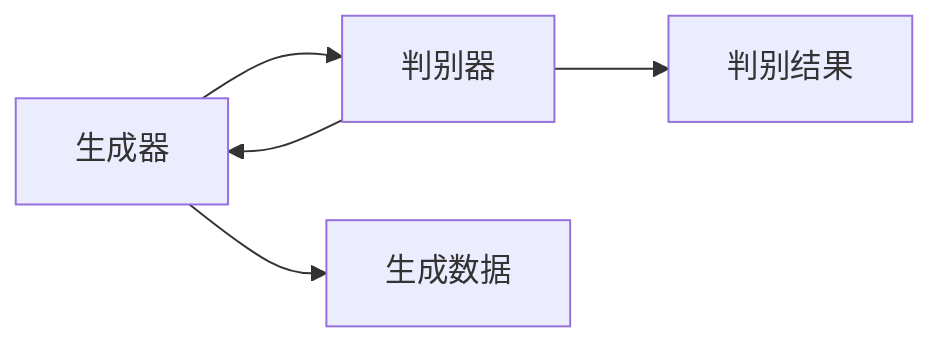
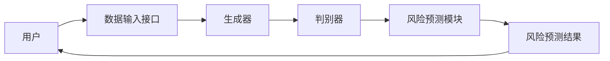

                 


# 《金融领域对抗学习在风险模型鲁棒性动态增强中的应用》

---

## 关键词：  
对抗学习、金融风险模型、鲁棒性增强、生成器、判别器、深度学习

---

## 摘要：  
本文探讨了对抗学习在金融风险模型中的应用，重点分析了如何通过生成器和判别器的对抗过程，动态增强风险模型的鲁棒性。文章从对抗学习的基本概念出发，结合金融领域的实际需求，详细阐述了对抗学习在风险预测、信用评估等场景中的应用优势，并通过数学推导和实际案例，展示了对抗学习如何帮助模型在复杂金融环境中实现更优的性能。文章还提出了基于对抗学习的金融风险模型架构设计，并给出了实现步骤和代码示例，为读者提供了从理论到实践的全面指导。

---

## 第一部分：对抗学习的基本概念与背景

### 第1章：对抗学习的基本概念与背景

#### 1.1 对抗学习的起源与发展

##### 1.1.1 对抗学习的起源  
对抗学习（Adversarial Learning）最早可以追溯到20世纪80年代，由Goodfellow等人提出的生成对抗网络（GAN，Generative Adversarial Networks）奠定了其理论基础。对抗学习的核心思想是通过两个模型（生成器和判别器）的对抗训练，实现数据生成或模型优化的目标。

##### 1.1.2 对抗学习的核心概念  
对抗学习是一种基于博弈论的机器学习方法，通过生成器和判别器的对抗过程，优化模型的性能。生成器的目标是生成与真实数据相似的样本，而判别器的目标是区分真实数据和生成数据。两者的对抗过程形成了一个“最小化-最大化”的游戏，最终达到某种平衡状态。

##### 1.1.3 对抗学习在金融领域的应用背景  
在金融领域，风险模型的鲁棒性和准确性是核心需求。然而，传统模型在面对复杂金融市场环境时，往往容易受到噪声、异常数据或对抗攻击的影响，导致预测结果不可靠。对抗学习通过模拟真实的市场环境，增强模型的鲁棒性，为金融风险建模提供了新的思路。

---

#### 1.2 对抗学习与传统机器学习的区别

##### 1.2.1 传统机器学习的特点  
传统机器学习算法（如线性回归、支持向量机等）依赖于明确的特征工程和数据分布假设，模型的泛化能力受限于训练数据的质量和多样性。此外，传统模型通常无法动态适应数据分布的变化，容易受到噪声或异常数据的影响。

##### 1.2.2 对抗学习的独特性  
对抗学习通过生成器和判别器的对抗过程，动态优化模型的性能。生成器不断生成更逼真的数据，判别器则不断学习如何区分真实数据和生成数据。这种动态对抗过程使得模型能够更好地适应复杂的数据分布，提高模型的鲁棒性和泛化能力。

##### 1.2.3 对抗学习的优势与局限性  
- **优势**：对抗学习能够生成多样化的数据，增强模型的泛化能力；动态适应数据分布变化，提高模型的鲁棒性。  
- **局限性**：对抗训练的收敛性问题，生成器和判别器的平衡难以掌握；对抗模型的训练过程可能较慢，需要大量的计算资源。

---

#### 1.3 金融领域中的对抗学习应用现状

##### 1.3.1 金融风险模型的基本概念  
金融风险模型用于预测市场波动、评估信用风险、识别异常交易等。传统的风险模型通常依赖于统计方法或浅层学习算法，难以捕捉复杂金融数据中的深层特征。

##### 1.3.2 对抗学习在风险模型中的应用案例  
- **风险预测**：通过对抗学习生成多样化的金融数据，增强模型的预测能力。  
- **信用评估**：利用生成器生成潜在的信用数据，训练判别器识别高风险客户。  
- **异常检测**：通过判别器识别异常交易模式，提高欺诈检测的准确率。

##### 1.3.3 当前研究的挑战与不足  
- 对抗训练的收敛性问题：生成器和判别器容易陷入局部最优。  
- 计算资源需求：对抗模型的训练需要大量计算资源。  
- 应用场景的局限性：对抗学习在金融领域的应用仍需进一步验证和优化。

---

### 第2章：对抗学习的核心概念与联系

#### 2.1 对抗学习的核心原理

##### 2.1.1 生成器与判别器的对抗过程  
生成器（Generator）负责生成数据，判别器（Discriminator）负责区分真实数据和生成数据。两者通过交替训练不断优化，生成器试图欺骗判别器，使其误判生成数据为真实数据，而判别器则试图准确区分真实数据和生成数据。

##### 2.1.2 最小化-最大化游戏的数学表达  
对抗学习的目标函数可以表示为一个最小化-最大化问题：  
生成器的目标是最小化判别器的损失函数，而判别器的目标是最大化其损失函数。  
$$ \min_{G} \max_{D} \mathbb{E}_{x \sim P_{\text{data}}}[\log D(x)] + \mathbb{E}_{z \sim P_{z}}[\log (1 - D(G(z)))] $$

##### 2.1.3 对抗训练的收敛性分析  
对抗训练的收敛性是一个复杂的问题，通常需要依赖生成器和判别器的交替优化。通过数学推导可以发现，对抗训练的目标是使生成器和判别器的损失函数达到某种平衡状态。

---

#### 2.2 对抗学习的核心概念对比

##### 2.2.1 生成器与判别器的属性对比（表格）

| 属性            | 生成器（Generator）         | 判别器（Discriminator）         |
|-----------------|-----------------------------|---------------------------------|
| 目标            | 生成与真实数据相似的样本    | 区分真实数据和生成数据         |
| 损失函数        | 最小化判别器的损失          | 最大化生成器的损失             |
| 输入            | 噪声向量或隐变量           | 真实数据或生成数据             |
| 输出            | 生成数据                   | 判别结果（真实或生成）         |

##### 2.2.2 对抗模型的实体关系图（Mermaid）  



---

#### 2.3 对抗学习在金融中的具体应用

##### 2.3.1 对抗学习在风险预测中的优势  
对抗学习能够生成多样化的金融数据，增强模型的泛化能力。通过生成器生成潜在的市场数据，判别器可以学习更复杂的市场规律，从而提高风险预测的准确性。

##### 2.3.2 对抗学习与动态增强的结合  
动态增强（Dynamic Augmentation）是一种通过对抗训练动态生成增强数据的技术。通过生成器生成多样化的增强数据，判别器可以更好地适应数据分布的变化，从而增强模型的鲁棒性。

---

## 第三部分：对抗学习的算法原理与数学模型

### 第3章：对抗学习的数学模型与算法原理

#### 3.1 对抗学习的数学模型

##### 3.1.1 生成器的损失函数  
生成器的目标是最小化判别器的损失函数，通常采用Wasserstein距离或KL散度作为损失函数。  
$$ L_G = \mathbb{E}_{z \sim P_{z}}[\log(1 - D(G(z)))] $$

##### 3.1.2 判别器的损失函数  
判别器的目标是最大化生成器的损失函数，通常采用交叉熵损失函数。  
$$ L_D = -\mathbb{E}_{x \sim P_{\text{data}}}[\log D(x)] - \mathbb{E}_{z \sim P_{z}}[\log(1 - D(G(z)))] $$

##### 3.1.3 对抗训练的联合优化目标  
对抗训练的目标是同时优化生成器和判别器的损失函数，达到某种平衡状态。  
$$ \min_{G} \max_{D} (L_D + L_G) $$

---

#### 3.2 对抗学习的算法流程

##### 3.2.1 生成器与判别器的交替训练  
对抗训练的流程通常包括以下步骤：  
1. 先优化生成器，固定生成器的参数，训练判别器。  
2. 再优化判别器，固定判别器的参数，训练生成器。  
3. 重复上述步骤，直到生成器和判别器的损失函数达到平衡。

##### 3.2.2 损失函数的梯度计算  
通过对生成器和判别器的损失函数求导，计算各自的梯度，并更新参数。  
$$ \nabla_G L_G, \nabla_D L_D $$

##### 3.2.3 对抗训练的收敛条件  
对抗训练的收敛性依赖于生成器和判别器的网络结构、优化算法以及训练数据的质量。通常采用Adam优化器，并设置适当的学习率和动量参数。

---

#### 3.3 对抗学习的数学推导与公式

##### 3.3.1 生成器的优化步骤  
生成器的损失函数为：  
$$ L_G = \mathbb{E}_{z \sim P_{z}}[\log(1 - D(G(z)))] $$  
对其求导并更新生成器参数：  
$$ G \leftarrow G - \epsilon \nabla_G L_G $$

##### 3.3.2 判别器的优化步骤  
判别器的损失函数为：  
$$ L_D = -\mathbb{E}_{x \sim P_{\text{data}}}[\log D(x)] - \mathbb{E}_{z \sim P_{z}}[\log(1 - D(G(z)))] $$  
对其求导并更新判别器参数：  
$$ D \leftarrow D - \epsilon \nabla_D L_D $$

##### 3.3.3 对抗训练的数学证明  
通过对生成器和判别器的交替优化，可以证明对抗训练的目标是使生成器和判别器的损失函数达到某种平衡状态，从而生成逼真的数据。

---

## 第四部分：系统分析与架构设计

### 第4章：系统分析与架构设计

#### 4.1 金融风险模型的系统架构

##### 4.1.1 系统功能模块划分  
- 生成器模块：负责生成潜在的金融数据。  
- 判别器模块：负责区分真实数据和生成数据。  
- 风险预测模块：基于生成数据进行风险预测。  

##### 4.1.2 系统功能流程图（Mermaid）  


##### 4.1.3 系统架构的可扩展性分析  
通过对系统功能模块的划分，可以发现系统具有良好的可扩展性。生成器和判别器的网络结构可以灵活调整，适应不同的金融应用场景。

---

#### 4.2 对抗学习在系统中的具体实现

##### 4.2.1 生成器与判别器的网络结构设计  
生成器和判别器通常采用深度神经网络结构，如卷积神经网络（CNN）或循环神经网络（RNN）。根据具体的金融数据类型（如时间序列数据），可以选择适合的网络结构。

##### 4.2.2 系统接口设计  
系统接口包括数据输入接口、模型训练接口和风险预测接口。数据输入接口负责接收金融数据，模型训练接口负责训练生成器和判别器，风险预测接口负责输出风险预测结果。

##### 4.2.3 系统交互流程图（Mermaid）  



---

## 第五部分：项目实战

### 第5章：项目实战

#### 5.1 环境安装与配置

##### 5.1.1 安装依赖库  
需要安装以下依赖库：  
- TensorFlow或PyTorch  
- Keras  
- Matplotlib  
- Scikit-learn  

##### 5.1.2 环境配置  
安装Python 3.6及以上版本，确保GPU支持。

---

#### 5.2 系统核心实现源代码

##### 5.2.1 生成器与判别器的代码实现  

```python
import tensorflow as tf
from tensorflow.keras.layers import Dense, Input
from tensorflow.keras.models import Model

def build_generator(input_dim, output_dim):
    input_layer = Input(shape=(input_dim,))
    dense_layer = Dense(64, activation='relu')(input_layer)
    output_layer = Dense(output_dim, activation='sigmoid')(dense_layer)
    model = Model(inputs=input_layer, outputs=output_layer)
    return model

def build_discriminator(input_dim):
    input_layer = Input(shape=(input_dim,))
    dense_layer = Dense(64, activation='relu')(input_layer)
    output_layer = Dense(1, activation='sigmoid')(dense_layer)
    model = Model(inputs=input_layer, outputs=output_layer)
    return model
```

##### 5.2.2 对抗训练的代码实现  

```python
def train_gan(generator, discriminator, input_dim, epochs=100):
    generator.compile(loss='binary_crossentropy', optimizer='adam')
    discriminator.compile(loss='binary_crossentropy', optimizer='adam')
    
    for epoch in range(epochs):
        # 训练判别器
        real_data = ...  # 真实数据
        fake_data = generator.predict(np.random.randn(batch_size, input_dim))
        d_loss_real = discriminator.train_on_batch(real_data, np.ones((batch_size, 1)))
        d_loss_fake = discriminator.train_on_batch(fake_data, np.zeros((batch_size, 1)))
        d_loss = 0.5 * (d_loss_real + d_loss_fake)
        
        # 训练生成器
        noise = np.random.randn(batch_size, input_dim)
        g_loss = generator.train_on_batch(noise, np.ones((batch_size, 1)))
        
        print(f"Epoch {epoch}, D loss: {d_loss}, G loss: {g_loss}")
```

##### 5.2.3 风险预测的代码实现  

```python
def risk_prediction(generator, discriminator, input_dim):
    # 生成潜在数据
    noise = np.random.randn(1000, input_dim)
    generated_data = generator.predict(noise)
    
    # 判别生成数据
    predicted_labels = discriminator.predict(generated_data)
    
    # 输出风险预测结果
    print(predicted_labels)
```

---

#### 5.3 代码应用解读与分析

##### 5.3.1 生成器的代码解读  
生成器的代码实现了一个简单的全连接神经网络，输入为随机噪声，输出为生成的数据。通过ReLU激活函数和sigmoid激活函数，生成器可以生成与真实数据相似的样本。

##### 5.3.2 判别器的代码解读  
判别器的代码实现了一个全连接神经网络，输入为数据样本，输出为判别结果。通过ReLU激活函数和sigmoid激活函数，判别器可以区分真实数据和生成数据。

##### 5.3.3 对抗训练的代码解读  
对抗训练的代码实现了一个交替优化的过程，首先训练判别器，然后训练生成器。通过不断交替优化，生成器和判别器的损失函数逐渐趋近于平衡状态。

---

#### 5.4 实际案例分析与详细讲解

##### 5.4.1 案例背景  
假设我们有一个金融时间序列数据集，包含股票价格、交易量等特征。我们需要通过对抗学习生成更多的训练数据，提高风险预测模型的准确性。

##### 5.4.2 数据预处理  
对原始数据进行归一化处理，确保生成器和判别器的输入数据格式一致。

##### 5.4.3 模型训练  
按照上述代码实现，训练生成器和判别器，生成更多的训练数据。

##### 5.4.4 模型评估  
通过混淆矩阵、精确率、召回率等指标，评估生成数据的质量和模型的性能。

---

#### 5.5 项目小结

##### 5.5.1 小结  
通过对抗学习，我们可以生成多样化的金融数据，增强风险模型的鲁棒性和准确性。对抗训练的过程虽然复杂，但通过代码实现可以轻松掌握其核心思想。

##### 5.5.2 注意事项  
- 对抗训练的收敛性问题需要特别注意，可能需要调整生成器和判别器的网络结构或优化参数。  
- 生成的数据质量直接影响模型的性能，需要通过实验验证生成数据的有效性。

##### 5.5.3 拓展阅读  
- 《Generative Adversarial Nets》（Goodfellow et al.）  
- 《Deep Learning》（Ian Goodfellow等）  
- 《金融风险管理》（John C. Hull）

---

## 第六部分：最佳实践与总结

### 第6章：最佳实践与总结

#### 6.1 小结  
本文详细探讨了对抗学习在金融风险模型中的应用，分析了对抗学习的基本概念、算法原理和系统架构，并通过实际案例展示了对抗学习的实现过程和应用效果。通过本文的学习，读者可以掌握对抗学习的核心思想，并将其应用于金融风险建模中。

#### 6.2 注意事项  
- 对抗学习的收敛性问题需要特别注意，可能需要调整生成器和判别器的网络结构或优化参数。  
- 生成的数据质量直接影响模型的性能，需要通过实验验证生成数据的有效性。  

#### 6.3 拓展阅读  
- 《Generative Adversarial Nets》（Goodfellow et al.）  
- 《Deep Learning》（Ian Goodfellow等）  
- 《金融风险管理》（John C. Hull）  

---

## 作者：AI天才研究院/AI Genius Institute & 禅与计算机程序设计艺术 /Zen And The Art of Computer Programming

---

**本文内容到此结束，感谢您的阅读！**

