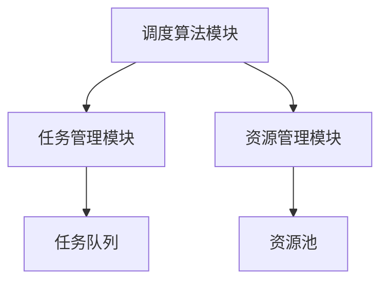
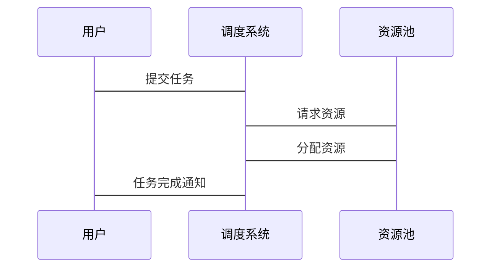

                 


# AI Agent的强化学习在智能调度中的应用

## 关键词：AI Agent, 强化学习, 智能调度, Q-learning, DQN, 算法实现

## 摘要：本文详细探讨了AI Agent在智能调度中的应用，特别是强化学习算法如Q-learning和DQN在调度问题中的具体应用。文章首先介绍了AI Agent和强化学习的基本概念，然后分析了强化学习算法在智能调度中的实现，包括数学模型、系统架构设计和项目实战。通过详细的技术分析和实际案例，本文展示了如何利用强化学习提升智能调度系统的效率和性能。

---

## 第1章 AI Agent与强化学习概述

### 1.1 AI Agent的基本概念

AI Agent是一种智能体，能够感知环境、自主决策并执行动作以实现目标。AI Agent具有以下特点：
- **自主性**：能够在没有外部干预的情况下自主运行。
- **反应性**：能够实时感知环境并做出反应。
- **目标导向**：所有行为都以实现特定目标为导向。
- **学习能力**：能够通过经验改进自身的决策能力。

AI Agent在智能调度中的应用非常广泛，例如在任务分配、资源调度、路径规划等领域。

### 1.2 强化学习的基本原理

强化学习是一种机器学习方法，通过智能体与环境的交互来学习最优策略。强化学习的核心概念包括：
- **状态（State）**：智能体所处的环境情况。
- **动作（Action）**：智能体采取的行为。
- **奖励（Reward）**：智能体行为后获得的反馈，用于指导学习。

强化学习的目标是通过不断试错，找到使累积奖励最大的策略。

### 1.3 强化学习在智能调度中的应用

智能调度的核心目标是高效分配资源、优化任务执行顺序，以最小化完成时间或最大化资源利用率。传统调度算法（如贪心算法）在处理复杂问题时表现有限，而强化学习能够通过不断学习优化调度策略。

---

## 第2章 强化学习算法在调度中的应用

### 2.1 Q-learning算法在调度中的应用

Q-learning是一种经典的强化学习算法，适用于离线环境下的调度问题。其基本流程如下：
1. 初始化Q表，所有状态-动作对的初始值为0。
2. 在每个时间步，智能体根据当前状态选择动作，并执行该动作。
3. 观察环境反馈的奖励，并更新Q表中的值。
4. 重复上述步骤，直到找到最优策略。

#### Q-learning算法在调度问题中的状态表示

调度问题的状态可以包括任务剩余时间、资源利用率等。例如，假设我们有3个任务，每个任务的剩余时间可以用一个向量表示。

#### Q-learning算法在调度问题中的动作选择

在每个状态下，智能体可以选择分配资源到不同的任务。例如，如果当前状态是任务A剩余时间10分钟，任务B剩余时间5分钟，智能体可以选择将资源分配给任务A或任务B。

### 2.2 DQN算法在调度中的应用

DQN（Deep Q-Network）是一种基于深度学习的强化学习算法，适用于复杂的调度问题。其基本原理是通过神经网络近似Q函数，从而实现端到端的学习。

#### DQN算法在调度问题中的网络结构设计

DQN的网络结构通常包括输入层、隐藏层和输出层。输入层接收状态信息，隐藏层进行特征提取，输出层输出每个动作的Q值。

#### DQN算法在调度问题中的训练流程

1. 初始化神经网络参数。
2. 与环境交互，收集状态-动作-奖励-状态（SARSA）数据。
3. 使用经验回放 replay 更新神经网络参数。
4. 重复上述步骤，直到收敛。

### 2.3 其他强化学习算法在调度中的应用

除了Q-learning和DQN，其他强化学习算法如A3C和PPO也在调度问题中得到了应用。这些算法在处理多智能体协作、复杂环境等方面表现优异。

---

## 第3章 智能调度的数学模型与算法原理

### 3.1 智能调度的数学建模

调度问题的数学建模是强化学习应用的基础。我们需要定义状态空间、动作空间和奖励函数。

#### 状态空间的定义

状态空间表示智能体所处的所有可能状态。例如，任务调度的状态可以包括任务的剩余时间、资源的可用性等。

#### 动作空间的定义

动作空间表示智能体在每个状态下可以执行的所有动作。例如，在任务调度中，智能体可以选择将资源分配给任务A、任务B或任务C。

#### 奖励函数的设计

奖励函数是智能体行为的反馈机制。设计奖励函数时需要考虑调度目标，例如最小化完成时间或最大化资源利用率。

### 3.2 强化学习算法的数学推导

#### Q-learning算法的数学公式

$$ Q(s, a) \leftarrow Q(s, a) + \alpha \left(r + \gamma \max_{a'} Q(s', a') - Q(s, a) \right) $$

其中，$\alpha$是学习率，$\gamma$是折扣因子。

#### DQN算法的数学公式

DQN通过神经网络近似Q函数，损失函数为：

$$ L = \mathbb{E}[(r + \gamma Q(s', \pi(s')) - Q(s, a))^2] $$

### 3.3 调度问题的数学优化

调度问题可以转化为优化问题。例如，最小化完成时间：

$$ \min \sum_{i=1}^{n} C_i $$

其中，$C_i$是任务i的完成时间。

---

## 第4章 系统分析与架构设计

### 4.1 调度系统的需求分析

智能调度系统需要满足以下需求：
- **功能性需求**：实现任务分配、资源调度等功能。
- **性能需求**：快速响应，高效调度。
- **可扩展性需求**：支持任务数量和类型的扩展。

### 4.2 调度系统的功能模块设计

调度系统主要包括以下功能模块：
- **任务管理模块**：负责任务的接收、分配和跟踪。
- **资源管理模块**：负责资源的分配和监控。
- **调度算法模块**：实现强化学习算法，进行调度决策。

### 4.3 调度系统的架构设计

以下是调度系统的架构图：



### 4.4 调度系统的接口设计

调度系统需要与外部系统进行交互，例如任务提交接口、资源监控接口等。

### 4.5 调度系统的交互流程

以下是调度系统的交互流程图：



---

## 第5章 项目实战

### 5.1 环境搭建

#### 安装依赖

```bash
pip install gym numpy tensorflow
```

### 5.2 核心代码实现

#### Q-learning算法实现

```python
import numpy as np

class QLearning:
    def __init__(self, state_space, action_space):
        self.state_space = state_space
        self.action_space = action_space
        self.q_table = np.zeros((state_space, action_space))
    
    def choose_action(self, state, epsilon):
        if np.random.random() < epsilon:
            return np.random.randint(self.action_space)
        else:
            return np.argmax(self.q_table[state])
    
    def learn(self, state, action, reward, next_state, alpha, gamma):
        self.q_table[state][action] += alpha * (reward + gamma * np.max(self.q_table[next_state]) - self.q_table[state][action])
```

#### DQN算法实现

```python
import tensorflow as tf

class DQN:
    def __init__(self, state_size, action_size):
        self.state_size = state_size
        self.action_size = action_size
        self.model = self.build_model()
    
    def build_model(self):
        model = tf.keras.Sequential([
            tf.keras.layers.Dense(32, activation='relu', input_shape=(self.state_size,)),
            tf.keras.layers.Dense(32, activation='relu'),
            tf.keras.layers.Dense(self.action_size, activation='linear')
        ])
        return model
    
    def get_action(self, state):
        state = tf.expand_dims(state, 0)
        prediction = self.model(state)
        return tf.argmax(prediction, axis=1).numpy()[0]
    
    def update_model(self, states, actions, rewards, next_states, alpha, gamma):
        states = tf.convert_to_tensor(states, dtype=tf.float32)
        next_states = tf.convert_to_tensor(next_states, dtype=tf.float32)
        actions = tf.convert_to_tensor(actions, dtype=tf.int32)
        rewards = tf.convert_to_tensor(rewards, dtype=tf.float32)
        
        next_q = self.model(next_states)
        target = rewards + gamma * tf.reduce_max(next_q, axis=1)
        
        q = self.model(states)
        q_index = tf.one_hot(actions, self.action_size)
        q_values = tf.reduce_sum(q * q_index, axis=1)
        
        loss = tf.reduce_mean(tf.square(target - q_values))
        loss_grads = tf.gradients(loss, self.model.trainable_variables)
        optimizer = tf.keras.optimizers.Adam(learning_rate=alpha)
        optimizer.apply_gradients(zip(loss_grads, self.model.trainable_variables))
```

### 5.3 实际案例分析

以任务调度为例，假设我们有3个任务，每个任务的处理时间不同。智能体的目标是通过合理分配资源，最小化总完成时间。

#### 5.3.1 Q-learning算法应用

```python
# 初始化Q表
q_learning = QLearning(3, 3)

# 训练过程
for episode in range(1000):
    state = 0
    epsilon = 0.1
    total_reward = 0
    done = False
    while not done:
        action = q_learning.choose_action(state, epsilon)
        next_state = action  # 简单示例，实际应根据环境反馈
        reward = 1 if action == 2 else 0  # 简单示例，实际应根据调度结果
        q_learning.learn(state, action, reward, next_state, alpha=0.1, gamma=0.9)
        state = next_state
        total_reward += reward
```

#### 5.3.2 DQN算法应用

```python
# 初始化DQN
dqn = DQN(3, 3)

# 训练过程
for episode in range(1000):
    state = np.random.rand(3)  # 简单示例，实际应根据环境状态
    action = dqn.get_action(state)
    next_state = action  # 简单示例，实际应根据环境反馈
    reward = 1 if action == 2 else 0  # 简单示例，实际应根据调度结果
    dqn.update_model([state], [action], [reward], [next_state], alpha=0.1, gamma=0.9)
```

### 5.4 项目小结

通过上述代码实现，我们可以看到Q-learning和DQN算法在智能调度中的具体应用。Q-learning适用于简单的调度问题，而DQN则更适合复杂的调度环境。在实际应用中，需要根据具体问题选择合适的算法，并进行参数调优。

---

## 第6章 最佳实践与小结

### 6.1 最佳实践 tips

- **算法选择**：根据问题复杂度选择合适的算法。
- **参数调优**：通过实验找到最佳的算法参数。
- **环境设计**：确保环境能够准确反映实际调度问题。

### 6.2 小结

本文详细探讨了AI Agent的强化学习在智能调度中的应用，重点介绍了Q-learning和DQN算法的实现及其在调度问题中的应用。通过实际案例分析，我们展示了如何利用强化学习提升智能调度系统的效率和性能。

### 6.3 注意事项

- **环境设计**：确保环境能够准确反映实际问题。
- **算法收敛性**：关注算法的收敛速度和稳定性。
- **可扩展性**：设计能够适应任务和资源数量变化的系统。

### 6.4 拓展阅读

- **强化学习经典论文**：如《Playing atari with deep reinforcement learning》。
- **调度问题相关文献**：如《Scheduling algorithms for modern systems》。

---

## 作者

作者：AI天才研究院/AI Genius Institute  
& 禅与计算机程序设计艺术/Zen And The Art of Computer Programming

