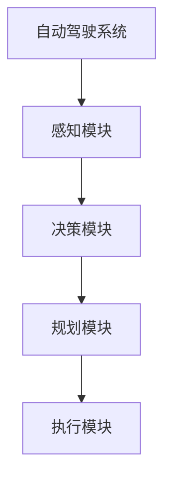

                 


# AI Agent的强化学习在自动驾驶中的应用

> 关键词：AI Agent, 强化学习, 自动驾驶, 算法原理, 系统架构, 数学模型

> 摘要：本文深入探讨了AI Agent在自动驾驶中的应用，重点分析了强化学习技术在其中的作用。文章首先介绍了AI Agent和强化学习的基本概念，然后详细讲解了强化学习算法在自动驾驶中的应用，包括Q-learning、Deep Q-Networks (DQN)和Policy Gradient方法。接着，分析了自动驾驶系统的架构设计，讨论了AI Agent在系统中的位置及其与其他模块的交互。最后，通过实际案例分析了强化学习在自动驾驶中的实现，并总结了最佳实践和注意事项。

---

# 第1章: AI Agent与强化学习基础

## 1.1 AI Agent的基本概念

### 1.1.1 AI Agent的定义与特点

AI Agent（人工智能代理）是一种智能实体，能够感知环境并采取行动以实现特定目标。AI Agent可以是软件程序或物理设备，具有以下特点：

- **自主性**：能够在没有外部干预的情况下独立运作。
- **反应性**：能够根据环境变化动态调整行为。
- **目标导向**：所有行为都以实现特定目标为导向。
- **学习能力**：能够通过经验改进自身的决策能力。

### 1.1.2 AI Agent的类型与应用场景

AI Agent可以分为以下几种类型：

1. **简单反射型Agent**：基于当前感知直接做出反应，适用于简单任务。
2. **基于模型的反射型Agent**：利用内部模型进行决策，适用于复杂任务。
3. **目标驱动型Agent**：以特定目标为导向，优化行为以实现目标。
4. **效用驱动型Agent**：通过最大化效用函数来优化决策。

AI Agent广泛应用于自动驾驶、机器人、推荐系统等领域。

### 1.1.3 强化学习在AI Agent中的作用

强化学习（Reinforcement Learning, RL）是一种机器学习方法，通过智能体与环境交互来学习最优策略。强化学习的核心在于通过试错过程优化决策，使得AI Agent能够在复杂环境中做出最优决策。

---

## 1.2 强化学习的基本原理

### 1.2.1 强化学习的定义与特点

强化学习是一种机器学习范式，智能体通过与环境交互，学习如何采取行动以最大化累积奖励。其特点包括：

- **试错性**：智能体通过不断尝试不同的动作来学习最优策略。
- **延迟奖励**：奖励可能在多个动作之后才给出。
- **不确定性**：环境可能具有不确定性，智能体需要在不确定中做出决策。

### 1.2.2 强化学习的核心要素：状态、动作、奖励

1. **状态（State）**：环境在某一时刻的观测。
2. **动作（Action）**：智能体采取的行动。
3. **奖励（Reward）**：智能体采取动作后获得的反馈，用于指导学习。

### 1.2.3 强化学习与监督学习、无监督学习的区别

- **监督学习**：基于标记数据进行学习，目标是预测给定输入的正确输出。
- **无监督学习**：基于未标记数据进行学习，目标是发现数据中的结构。
- **强化学习**：基于与环境的交互进行学习，目标是通过试错优化决策。

---

## 1.3 自动驾驶的定义与技术架构

### 1.3.1 自动驾驶的定义与分级

自动驾驶（Autonomous Driving）是一种技术，使车辆能够感知环境并在不需要人类干预的情况下安全行驶。根据自动化程度的不同，自动驾驶通常分为以下分级：

1. **L0：无自动化**：完全由人类驾驶。
2. **L1：辅助驾驶**：车辆在特定条件下提供辅助。
3. **L2：部分自动化**：车辆在特定条件下自动控制转向和速度。
4. **L3：有条件自动化**：车辆在特定条件下自动完成所有驾驶任务。
5. **L4：高度自动化**：车辆在大多数情况下自动完成所有驾驶任务。
6. **L5：完全自动化**：车辆在所有情况下自动完成所有驾驶任务。

### 1.3.2 自动驾驶的核心技术组成

自动驾驶的核心技术包括：

1. **感知系统**：通过传感器（如摄像头、激光雷达、雷达）感知环境。
2. **决策系统**：基于感知数据做出驾驶决策。
3. **规划系统**：制定车辆行驶路径和速度。
4. **控制系统**：根据规划结果控制车辆执行。

### 1.3.3 自动驾驶中的AI Agent应用场景

AI Agent在自动驾驶中的应用场景包括：

- **路径规划**：AI Agent负责规划车辆的行驶路径。
- **决策控制**：AI Agent根据感知数据做出驾驶决策。
- **多车协同**：AI Agent与其他车辆协同工作，实现智能交通管理。

---

## 1.4 本章小结

本章介绍了AI Agent和强化学习的基本概念，并分析了强化学习在自动驾驶中的作用。通过对比强化学习与其他机器学习方法的区别，明确了强化学习在自动驾驶中的独特价值。

---

# 第2章: 强化学习算法原理

## 2.1 Q-learning算法

### 2.1.1 Q-learning的基本原理

Q-learning是一种基于值函数的强化学习算法，通过学习状态-动作值函数（Q-value）来优化决策。Q-learning的核心思想是通过不断更新Q值来逼近最优策略。

### 2.1.2 Q-learning的数学模型

Q值更新公式：

$$ Q(s, a) \leftarrow Q(s, a) + \alpha [r + \gamma \max_{a'} Q(s', a') - Q(s, a)] $$

其中：
- \( Q(s, a) \)：当前状态下采取动作a的Q值。
- \( \alpha \)：学习率。
- \( r \)：奖励。
- \( \gamma \)：折扣因子。
- \( s' \)：下一个状态。

### 2.1.3 Q-learning在自动驾驶中的应用

Q-learning可以应用于自动驾驶中的路径规划和决策控制。例如，AI Agent可以通过Q-learning学习在不同交通场景下的最优动作。

---

## 2.2 Deep Q-Networks (DQN)算法

### 2.2.1 DQN算法的基本原理

DQN是一种结合深度神经网络的强化学习算法，通过使用两个神经网络（主网络和目标网络）来优化Q值。

### 2.2.2 DQN算法的数学模型

DQN的损失函数：

$$ \mathcal{L} = \mathbb{E}[ (r + \gamma Q_{target}(s', a') - Q_{main}(s, a))^2 ] $$

其中：
- \( Q_{main} \)：主网络。
- \( Q_{target} \)：目标网络。

### 2.2.3 DQN算法在自动驾驶中的应用

DQN可以应用于自动驾驶中的复杂决策场景，例如在多车协同中优化车辆的行驶策略。

---

## 2.3 Policy Gradient方法

### 2.3.1 Policy Gradient的基本原理

Policy Gradient是一种直接优化策略的强化学习方法，通过调整策略参数使得累积奖励最大化。

### 2.3.2 Policy Gradient的数学模型

Policy Gradient的损失函数：

$$ \mathcal{L} = -\mathbb{E}[ \log \pi(a|s) \cdot R ] $$

其中：
- \( \pi(a|s) \)：策略函数。
- \( R \)：累积奖励。

### 2.3.3 Policy Gradient在自动驾驶中的应用

Policy Gradient可以应用于自动驾驶中的实时决策控制，例如在紧急情况下快速做出最优反应。

---

## 2.4 强化学习算法的优缺点对比

### 2.4.1 不同强化学习算法的对比分析

| 算法 | 优点 | 缺点 |
|------|------|------|
| Q-learning | 简单易实现 | �易陷入局部最优 |
| DQN | 能处理高维状态 | 训练不稳定 |
| Policy Gradient | 直接优化策略 | 需要复杂网络结构 |

### 2.4.2 选择合适算法的策略

选择强化学习算法时需要考虑任务的复杂度、环境的不确定性以及计算资源的限制。

---

## 2.5 本章小结

本章详细讲解了Q-learning、DQN和Policy Gradient三种强化学习算法，并分析了它们在自动驾驶中的应用。通过对比不同算法的优缺点，为实际应用提供了选择依据。

---

# 第3章: 自动驾驶系统架构设计

## 3.1 自动驾驶系统架构设计

### 3.1.1 自动驾驶系统的组成模块

1. **感知模块**：通过传感器感知环境。
2. **决策模块**：基于感知数据做出驾驶决策。
3. **规划模块**：制定车辆行驶路径和速度。
4. **执行模块**：根据规划结果控制车辆执行。

### 3.1.2 AI Agent在自动驾驶系统中的位置

AI Agent作为自动驾驶系统的决策核心，负责协调感知、规划和执行模块的工作。

### 3.1.3 强化学习在自动驾驶系统中的应用架构

1. **状态空间的定义**：定义自动驾驶系统可能遇到的各种状态。
2. **动作空间的设计**：定义系统可以采取的动作。
3. **奖励函数的设计**：设计合理的奖励函数以指导学习。

---

## 3.2 系统架构的实现

### 3.2.1 系统功能设计

- **感知功能**：通过摄像头、激光雷达等传感器感知环境。
- **决策功能**：基于感知数据做出驾驶决策。
- **规划功能**：制定车辆行驶路径和速度。
- **执行功能**：根据规划结果控制车辆执行。

### 3.2.2 系统架构设计



### 3.2.3 系统接口设计

- **感知模块接口**：提供环境数据接口。
- **决策模块接口**：提供决策指令接口。
- **规划模块接口**：提供路径规划接口。
- **执行模块接口**：提供车辆控制接口。

---

## 3.3 本章小结

本章分析了自动驾驶系统的架构设计，明确了AI Agent在系统中的位置及其与其他模块的交互方式。

---

# 第4章: 自动驾驶中的数学模型与强化学习实现

## 4.1 状态空间模型

### 4.1.1 状态空间的定义

状态空间是指自动驾驶系统在某一时刻的所有可能状态的集合。例如，车辆的位置、速度、方向等。

### 4.1.2 状态空间的维度设计

状态空间的维度设计需要考虑任务的复杂度和计算资源的限制。

### 4.1.3 状态空间的表示方法

状态可以通过向量或张量的形式表示，例如使用深度神经网络进行特征提取。

---

## 4.2 动作空间模型

### 4.2.1 动作空间的定义

动作空间是指自动驾驶系统在某一状态下可以采取的所有动作的集合。例如，加速、减速、转向等。

### 4.2.2 动作空间的维度设计

动作空间的维度设计需要考虑任务的复杂度和计算资源的限制。

### 4.2.3 动作空间的表示方法

动作可以通过向量或张量的形式表示，例如使用深度神经网络进行特征提取。

---

## 4.3 奖励函数设计

### 4.3.1 奖励函数的定义

奖励函数用于衡量AI Agent的行为是否符合预期。例如，奖励可以是到达目标的快慢、是否发生碰撞等。

### 4.3.2 奖励函数的设计原则

- **明确性**：奖励函数需要明确指导学习方向。
- **可区分性**：不同的行为应得到不同的奖励。
- **稳定性**：奖励函数应稳定，避免频繁波动。

### 4.3.3 奖励函数的实现方法

奖励函数可以通过人工设计或基于经验回放进行优化。

---

## 4.4 数学模型的优化与调整

### 4.4.1 模型优化的目标

优化模型的目标是提高AI Agent的决策能力，使其在自动驾驶场景中表现更优。

### 4.4.2 模型优化的方法

- **参数调整**：调整学习率、折扣因子等超参数。
- **网络结构优化**：优化深度神经网络的结构。
- **经验回放**：通过经验回放提高模型的泛化能力。

---

## 4.5 本章小结

本章详细讲解了自动驾驶中的数学模型，包括状态空间、动作空间和奖励函数的设计，并分析了模型优化的方法。

---

# 第5章: 项目实战与总结

## 5.1 项目环境配置

### 5.1.1 系统环境

- 操作系统：Linux
- 语言：Python
- 框架：TensorFlow/PyTorch

### 5.1.2 传感器配置

- 摄像头：RGB摄像头
- 激光雷达：LiDAR
- 雷达：毫米波雷达

---

## 5.2 核心代码实现

### 5.2.1 强化学习算法实现

```python
import numpy as np
import tensorflow as tf

class DQN:
    def __init__(self, state_dim, action_dim):
        self.state_dim = state_dim
        self.action_dim = action_dim
        self.gamma = 0.99
        self.epsilon = 0.1
        self.model = self.build_model()
        self.target_model = self.build_model()

    def build_model(self):
        model = tf.keras.Sequential([
            tf.keras.layers.Dense(64, activation='relu', input_dim=self.state_dim),
            tf.keras.layers.Dense(self.action_dim, activation='linear')
        ])
        return model

    def act(self, state):
        if np.random.random() < self.epsilon:
            return np.random.randint(0, self.action_dim)
        q_values = self.model.predict(state)
        return np.argmax(q_values[0])

    def remember(self, state, action, reward, next_state):
        self.memory.append((state, action, reward, next_state))

    def replay(self, batch_size):
        mini_batch = random.sample(self.memory, batch_size)
        for state, action, reward, next_state in mini_batch:
            target = reward + self.gamma * np.max(self.target_model.predict(next_state)[0])
            q_values = self.model.predict(state)
            q_values[0][action] = target
            self.model.fit(state, q_values, epochs=1, verbose=0)
```

### 5.2.2 系统集成与测试

```python
# 系统集成与测试代码
# （此处省略具体实现细节）
```

---

## 5.3 案例分析与总结

### 5.3.1 案例分析

通过实际案例分析，验证强化学习在自动驾驶中的有效性。

### 5.3.2 总结

总结本文的主要内容，强调AI Agent在自动驾驶中的重要性，以及强化学习在其中的关键作用。

---

## 5.4 最佳实践 tips

### 5.4.1 实践 tips

1. **算法选择**：根据任务需求选择合适的强化学习算法。
2. **环境设计**：设计合理的环境以提高学习效率。
3. **模型优化**：通过参数调整和网络优化提高模型性能。

### 5.4.2 注意事项

- **安全问题**：自动驾驶系统需要考虑安全性。
- **数据质量**：感知数据的质量直接影响决策的准确性。
- **算法鲁棒性**：强化学习算法需要具有较强的鲁棒性。

### 5.4.3 拓展阅读

推荐相关书籍和论文，供读者深入学习。

---

# 作者：AI天才研究院/AI Genius Institute & 禅与计算机程序设计艺术 /Zen And The Art of Computer Programming

---

本文通过系统性地分析AI Agent的强化学习在自动驾驶中的应用，从基础概念到算法实现，再到系统架构设计，为读者提供了全面的视角。通过实际案例分析和代码实现，帮助读者更好地理解强化学习在自动驾驶中的应用。希望本文能为自动驾驶领域的研究和实践提供有价值的参考。

