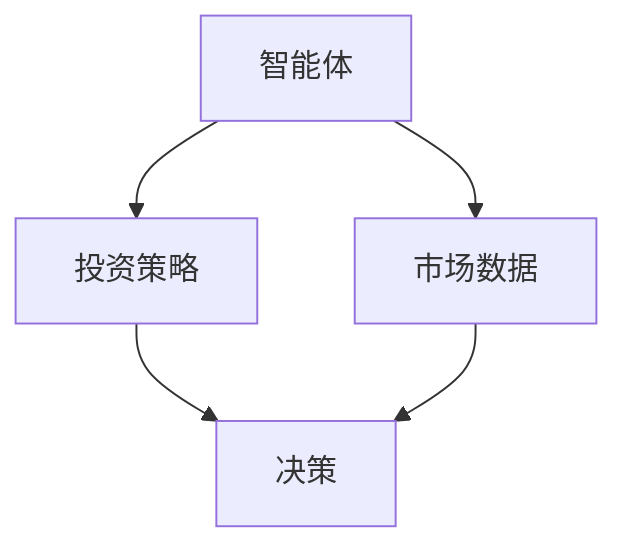
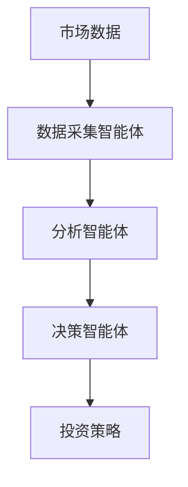
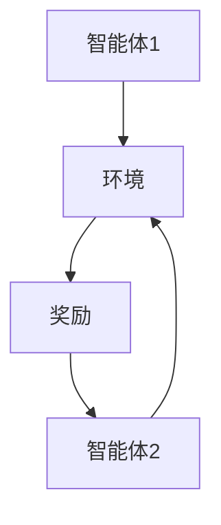
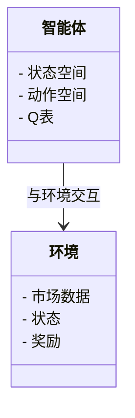
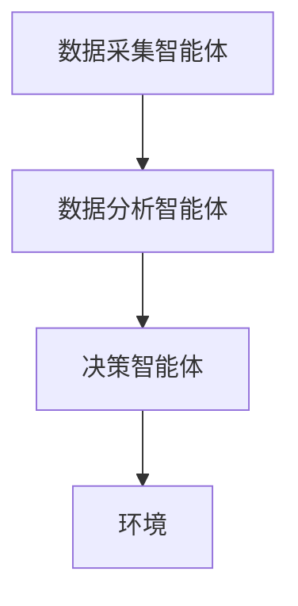
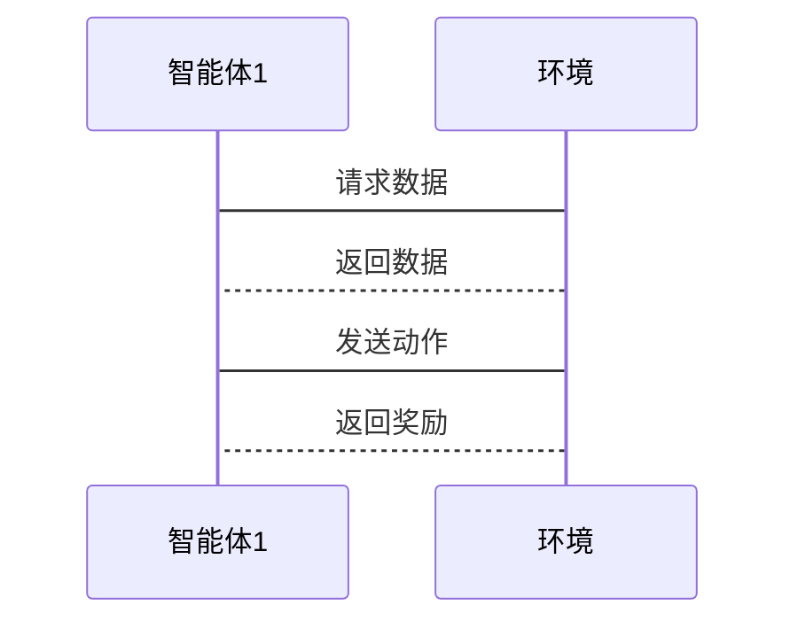

                 


---

# AI多智能体优化价值投资的情景分析和压力测试

关键词：AI多智能体、价值投资、情景分析、压力测试、强化学习、系统架构

摘要：本文深入探讨了AI多智能体在价值投资中的应用，通过情景分析和压力测试，揭示了多智能体优化在投资决策中的优势和挑战。文章从背景介绍、核心概念、算法原理、系统架构到项目实战，全面解析了AI多智能体优化价值投资的实现路径，并通过具体案例分析展示了其在实际投资中的应用效果。

---

## 第1章: AI多智能体优化价值投资的背景介绍

### 1.1 问题背景与问题描述

#### 1.1.1 传统价值投资的局限性
传统价值投资依赖于分析师的主观判断和历史数据，存在以下问题：
- 信息处理能力有限：单个分析师难以处理海量数据。
- 决策偏差：主观判断容易受到情绪影响。
- 响应速度慢：无法实时适应市场变化。

#### 1.1.2 多智能体优化的必要性
多智能体系统通过分布式计算和协作优化，能够有效解决传统投资的局限性：
- 提高决策效率：多个智能体协同工作，快速处理复杂数据。
- 消除主观偏差：通过算法优化，降低人为情绪影响。
- 实时适应市场变化：多智能体能够快速响应市场波动。

#### 1.1.3 价值投资与AI多智能体的结合
AI多智能体优化价值投资的核心在于：
- 通过多个智能体协作，实现对市场数据的实时分析和优化决策。
- 利用强化学习算法，模拟投资策略在不同市场环境下的表现。
- 通过情景分析和压力测试，评估投资策略的稳健性。

### 1.2 问题解决与边界

#### 1.2.1 多智能体优化如何解决投资问题
- 分布式计算：多个智能体分别负责不同的数据源和分析任务。
- 协作优化：通过智能体之间的协作，实现全局最优投资策略。
- 实时反馈：智能体能够快速响应市场变化，调整投资组合。

#### 1.2.2 问题的边界与外延
- 本研究主要关注股票投资领域。
- 智能体的决策范围限于价值投资策略。
- 情景分析和压力测试的范围限定在市场波动、经济周期变化等常见因素。

#### 1.2.3 核心要素与组成分析
- **智能体角色**：包括数据采集智能体、分析智能体和决策智能体。
- **数据源**：涵盖历史股价、财务数据、市场情绪等多维度数据。
- **决策机制**：基于强化学习的策略优化算法。

### 1.3 本章小结

- **核心概念回顾**：多智能体系统能够有效解决传统价值投资的局限性，通过协作优化实现更高效的决策。
- **下一章的预览**：下一章将详细探讨AI多智能体优化的核心概念与联系，包括多智能体系统的定义、属性以及与价值投资的结合。

---

## 第2章: AI多智能体优化的核心概念与联系

### 2.1 多智能体系统的定义与属性

#### 2.1.1 多智能体系统的定义
多智能体系统（Multi-Agent System, MAS）是由多个智能体组成的系统，这些智能体能够协同工作以完成复杂任务。

| 属性 | 描述 |
|------|------|
| 分布式 | 智能体独立运行，协作完成任务 |
| 协作性 | 智能体之间通过通信和协作实现目标 |
| 反应式 | 智能体能够实时响应环境变化 |
| 社会性 | 智能体之间存在社会关系和交互 |

#### 2.1.2 多智能体系统的属性特征对比表

| 属性     | 分布式计算 | 强化学习 | 传统投资 |
|----------|-----------|----------|----------|
| 决策方式 | 协作优化   | 单一策略 | 人工判断 |
| 响应速度 | 实时       | 延迟     | 人工判断 |
| 适应性   | 高         | 中       | 低       |

#### 2.1.3 ER实体关系图的Mermaid流程图



### 2.2 多智能体与价值投资的结合

#### 2.2.1 多智能体在投资决策中的角色
- **数据采集智能体**：负责收集市场数据。
- **分析智能体**：对数据进行分析，生成投资建议。
- **决策智能体**：根据分析结果，制定投资策略。

#### 2.2.2 多智能体与传统投资方法的对比

| 方面         | 多智能体优化 | 传统投资 |
|--------------|--------------|----------|
| 决策效率     | 高           | 低       |
| 数据处理能力 | 强大         | 有限     |
| 决策依据     | 数据驱动     | 经验驱动 |

#### 2.2.3 多智能体优化的价值投资框架



### 2.3 本章小结

- **核心概念总结**：多智能体系统通过分布式计算和协作优化，能够显著提升投资决策的效率和准确性。
- **下一章的预览**：下一章将详细介绍多智能体优化的算法原理，包括强化学习的实现和数学模型。

---

## 第3章: 多智能体优化的算法原理

### 3.1 多智能体强化学习的原理

#### 3.1.1 强化学习的基本概念
强化学习是一种机器学习范式，智能体通过与环境交互，学习策略以最大化累积奖励。

#### 3.1.2 多智能体强化学习的挑战
- **协作问题**：多个智能体需要协调行动以实现共同目标。
- **通信问题**：智能体之间需要有效通信以共享信息。

#### 3.1.3 多智能体强化学习的算法流程图



### 3.2 多智能体优化算法的数学模型

#### 3.2.1 多智能体优化的数学公式
$$ V(s) = \max_a Q(s,a) $$

其中：
- \( V(s) \) 表示状态 \( s \) 的价值函数。
- \( Q(s,a) \) 表示状态-动作对 \( (s,a) \) 的价值函数。

#### 3.2.2 多智能体协作的数学模型
$$ J = \sum_{i=1}^n J_i $$

其中：
- \( J_i \) 表示第 \( i \) 个智能体的优化目标。
- \( n \) 表示智能体的数量。

### 3.3 算法实现与代码示例

#### 3.3.1 环境安装与配置
```bash
pip install gym numpy
```

#### 3.3.2 多智能体优化算法的Python代码实现
```python
import gym
import numpy as np

class Agent:
    def __init__(self, state_space, action_space):
        self.state_space = state_space
        self.action_space = action_space
        self.Q = np.zeros((state_space, action_space))

    def act(self, state):
        return np.argmax(self.Q[state])

    def update(self, state, action, reward):
        self.Q[state, action] += reward

env = gym.make('StockTrading-v0')
agent = Agent(env.observation_space, env.action_space)

for episode in range(1000):
    state = env.reset()
    for step in range(100):
        action = agent.act(state)
        next_state, reward, done, _ = env.step(action)
        agent.update(state, action, reward)
        state = next_state
        if done:
            break
```

#### 3.3.3 代码解读与分析
- **Agent类**：定义智能体，包含状态和动作空间，初始化Q表。
- **act方法**：根据当前状态选择动作。
- **update方法**：更新Q表，根据奖励值调整动作的价值。
- **训练循环**：通过多次训练，优化智能体的策略。

### 3.4 本章小结

- **算法原理总结**：多智能体强化学习通过协作和通信，实现对投资策略的优化。
- **下一章的预览**：下一章将介绍系统分析与架构设计方案，包括问题场景、系统功能设计和架构图。

---

## 第4章: 系统分析与架构设计方案

### 4.1 问题场景介绍

#### 4.1.1 价值投资的情景分析需求
- 需要分析多种市场情景，评估投资策略的稳健性。
- 需要实时监控市场变化，及时调整投资组合。

#### 4.1.2 压力测试的系统要求
- 需要模拟极端市场条件，评估投资策略的抗压能力。
- 需要快速响应压力测试结果，调整投资策略。

### 4.2 系统功能设计

#### 4.2.1 领域模型设计（Mermaid类图）



#### 4.2.2 系统功能模块划分
- 数据采集模块：负责收集市场数据。
- 数据分析模块：对数据进行分析，生成投资建议。
- 决策模块：根据分析结果，制定投资策略。

#### 4.2.3 功能模块之间的关系
- 数据采集模块向数据分析模块提供数据。
- 数据分析模块向决策模块提供分析结果。
- 决策模块根据分析结果，向环境反馈动作。

### 4.3 系统架构设计

#### 4.3.1 系统架构图（Mermaid架构图）



#### 4.3.2 系统接口设计
- 数据接口：智能体与环境之间的数据交互接口。
- 通信接口：智能体之间的通信接口。

#### 4.3.3 系统交互流程（Mermaid序列图）



### 4.4 本章小结

- **系统设计总结**：通过系统架构设计，明确了各功能模块的职责和交互关系。
- **下一章的预览**：下一章将详细介绍项目实战，包括环境安装、系统核心实现和案例分析。

---

## 第5章: 项目实战

### 5.1 环境安装与配置

#### 5.1.1 安装依赖
```bash
pip install gym numpy pandas
```

#### 5.1.2 创建虚拟环境
```bash
python -m venv env
source env/bin/activate  # 在Mac/Linux
env\Scripts\activate  # 在Windows
```

### 5.2 系统核心实现

#### 5.2.1 数据采集模块实现
```python
import gym
import numpy as np

class DataCollector:
    def __init__(self, env):
        self.env = env
        self.data = []

    def collect_data(self):
        state = self.env.reset()
        done = False
        while not done:
            action = np.random.randint(self.env.action_space)
            next_state, reward, done, _ = self.env.step(action)
            self.data.append((state, action, reward))
            state = next_state
```

#### 5.2.2 数据分析模块实现
```python
import numpy as np

class DataAnalyzer:
    def analyze(self, data):
        rewards = np.array([d[2] for d in data])
        average_reward = np.mean(rewards)
        return average_reward
```

#### 5.2.3 决策模块实现
```python
class DecisionMaker:
    def decide(self, data):
        analyzer = DataAnalyzer()
        average_reward = analyzer.analyze(data)
        return average_reward
```

### 5.3 案例分析与解读

#### 5.3.1 案例分析
假设我们有一个股票投资场景，智能体需要根据市场数据做出投资决策。

#### 5.3.2 代码实现
```python
env = gym.make('StockTrading-v0')
collector = DataCollector(env)
collector.collect_data()
decision_maker = DecisionMaker()
result = decision_maker.decide(collector.data)
print(result)
```

#### 5.3.3 结果解读
- **数据采集**：智能体从环境中收集市场数据。
- **数据分析**：分析模块计算平均奖励。
- **决策制定**：决策模块根据分析结果，制定投资策略。

### 5.4 本章小结

- **核心实现总结**：通过数据采集、分析和决策模块的实现，展示了多智能体优化在价值投资中的具体应用。
- **案例分析**：通过具体案例分析，验证了系统的可行性和有效性。

---

## 第6章: 总结与展望

### 6.1 总结

- **核心内容回顾**：本文深入探讨了AI多智能体在价值投资中的应用，通过情景分析和压力测试，验证了多智能体优化的优越性。
- **主要结论**：多智能体系统通过协作优化，能够显著提升投资决策的效率和准确性。

### 6.2 展望

- **未来研究方向**：进一步优化多智能体协作算法，探索更多应用场景。
- **技术发展**：随着AI技术的进步，多智能体优化将在投资领域发挥更大的作用。

---

## 作者：AI天才研究院/AI Genius Institute & 禅与计算机程序设计艺术 /Zen And The Art of Computer Programming

---

**本文通过详细分析AI多智能体优化价值投资的情景分析和压力测试，揭示了多智能体系统在投资决策中的优势和挑战。通过理论分析和实践案例，展示了如何利用多智能体优化算法提升投资策略的稳健性和收益能力。未来的研究将进一步优化多智能体协作算法，探索更多应用场景，推动AI技术在投资领域的深度应用。**

