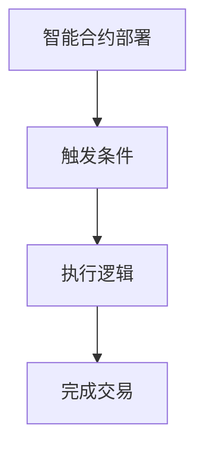
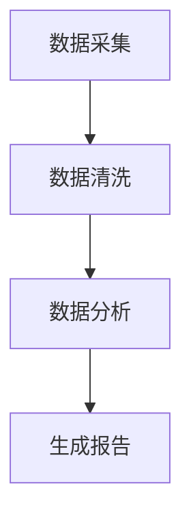
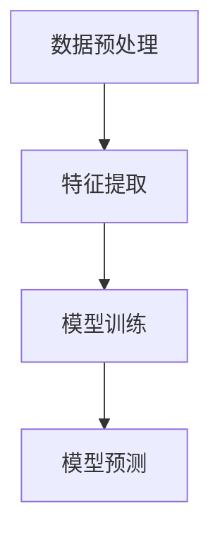
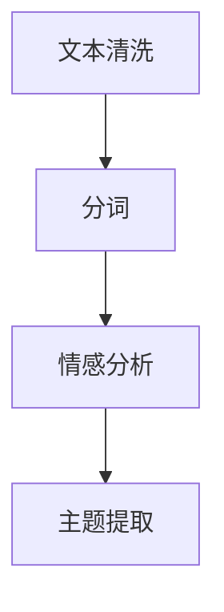
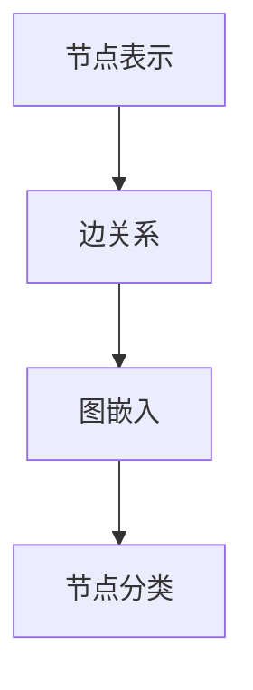
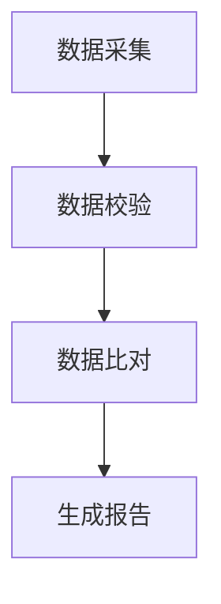
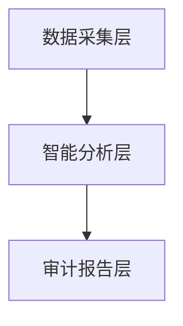
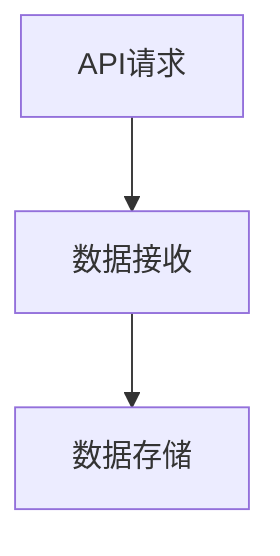
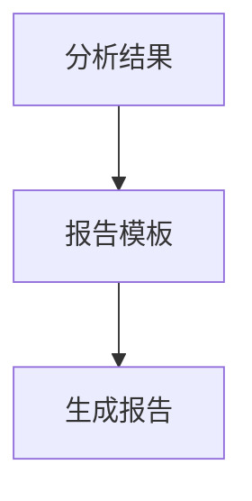
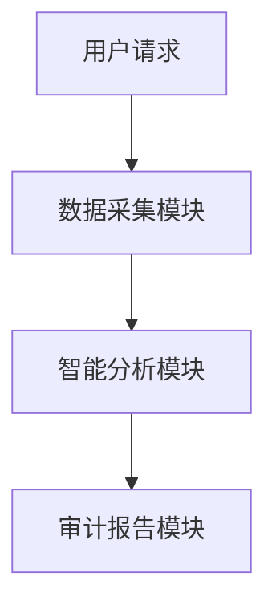

                 


# 企业AI Agent的区块链数据审计系统

> **关键词**：企业AI Agent，区块链数据审计，智能合约，数据完整性，分布式系统

> **摘要**：  
本文深入探讨了企业AI Agent在区块链数据审计系统中的应用，结合区块链技术的去中心化和不可篡改性，提出了基于AI的智能化数据审计方案。通过分析区块链数据审计的核心问题，构建了AI Agent驱动的审计系统架构，并详细阐述了其算法原理、系统设计和实际应用场景。本文旨在为企业提供一种高效、可靠的数据审计方法，助力企业数字化转型中的数据治理和合规性管理。

---

# 第一部分：企业AI Agent与区块链数据审计概述

## 第1章：企业AI Agent的定义与特点

### 1.1 企业AI Agent的基本概念
企业AI Agent（Artificial Intelligence Agent）是一种能够感知环境、执行任务并优化决策的智能实体。它通过机器学习、自然语言处理和自动化技术，帮助企业实现智能化的业务流程管理。

#### 1.1.1 AI Agent的核心特点
- **自主性**：能够在无需人工干预的情况下完成任务。
- **反应性**：能够实时感知环境变化并做出响应。
- **学习能力**：通过数据和经验不断优化决策模型。
- **协作性**：能够与其他系统、AI Agent或人类协同工作。

#### 1.1.2 企业AI Agent与传统IT系统的区别
| 特性 | 传统IT系统 | 企业AI Agent |
|------|------------|--------------|
| 决策能力 | 依赖预设规则 | 具备自主决策能力 |
| 数据处理 | 单向处理 | 支持双向互动和反馈 |
| 智能性 | 无学习能力 | 具备学习和优化能力 |

### 1.2 区块链技术与数据审计的结合
区块链技术以其去中心化、不可篡改和可追溯的特点，成为数据审计的理想选择。

#### 1.2.1 区块链技术的基本原理
区块链通过**分布式账本**和**共识机制**确保数据的完整性和一致性。每个区块包含交易数据和时间戳，区块之间通过哈希值链式连接，形成不可篡改的区块链。

#### 1.2.2 区块链在数据审计中的应用优势
- **数据不可篡改**：区块链上的数据一旦写入，无法被修改。
- **可追溯性**：通过区块链可以追踪数据的来源和流转过程。
- **透明性**：区块链数据对所有参与者透明，减少信任成本。

#### 1.2.3 区块链与数据审计的结合场景
- **金融审计**：验证交易记录的真实性。
- **供应链审计**：追踪产品溯源信息。
- **合规审计**：确保企业数据符合监管要求。

### 1.3 企业AI Agent在区块链数据审计中的作用
企业AI Agent通过智能化技术，显著提升了区块链数据审计的效率和准确性。

#### 1.3.1 AI Agent在数据审计中的智能化优势
- **自动化数据采集**：AI Agent可以自动从区块链节点采集数据。
- **智能分析**：通过机器学习模型，AI Agent能够识别异常数据和潜在风险。
- **自动生成审计报告**：AI Agent可以基于分析结果生成详细的审计报告。

#### 1.3.2 区块链技术对企业AI Agent的支持
- **数据可信性**：区块链确保了数据的完整性和真实性，为AI Agent提供了可靠的数据源。
- **去中心化架构**：区块链的分布式特性支持AI Agent在多节点环境下的协同工作。

#### 1.3.3 企业AI Agent与区块链数据审计的结合前景
随着企业数字化转型的推进，AI Agent与区块链技术的结合将成为数据治理的重要方向，为企业提供高效、智能的审计解决方案。

## 1.4 本章小结
本章介绍了企业AI Agent的基本概念和特点，分析了区块链技术在数据审计中的优势，并探讨了AI Agent在区块链数据审计中的作用。通过结合两者的特性，为企业智能化数据审计提供了理论基础。

---

# 第2章：区块链数据审计的核心概念与原理

## 2.1 区块链数据审计的基本概念
区块链数据审计是指通过对区块链上的数据进行采集、验证和分析，确保数据的完整性和合规性。

### 2.1.1 数据审计的核心要素
- **数据完整性**：确保数据未被篡改。
- **数据一致性**：确保数据在不同节点上一致。
- **数据合法性**：确保数据符合相关法律法规。

### 2.1.2 区块链数据审计的目标与范围
- **目标**：验证数据的真实性、准确性和合法性。
- **范围**：涵盖数据的生成、传输、存储和销毁全过程。

## 2.2 区块链数据审计的关键技术
### 2.2.1 智能合约
智能合约是区块链上的自动执行程序，用于验证和执行合同条款。

#### 智能合约的工作流程


#### 智能合约的优势
- **自动化**：智能合约可以自动执行预设的逻辑。
- **透明性**：合约代码对所有参与者公开透明。
- **不可篡改性**：智能合约一旦部署，无法被修改。

### 2.2.2 区块链的去中心化特性
去中心化确保了数据的分布存储和多方共识，避免了单点故障和数据篡改风险。

## 2.3 企业AI Agent在区块链数据审计中的核心功能
企业AI Agent通过智能化技术，提升了区块链数据审计的效率和准确性。

### 2.3.1 数据采集与分析
AI Agent可以从多个区块链节点采集数据，并通过机器学习模型进行分析。

#### 数据分析流程


### 2.3.2 数据验证与校验
AI Agent可以通过比对不同节点的数据，验证数据的一致性和完整性。

### 2.3.3 数据审计报告生成
AI Agent可以自动生成审计报告，并将结果反馈给企业管理系统。

## 2.4 本章小结
本章详细介绍了区块链数据审计的核心概念和关键技术，重点分析了企业AI Agent在数据采集、验证和报告生成中的作用，为企业构建智能化数据审计系统提供了技术基础。

---

# 第3章：企业AI Agent的数学模型与算法原理

## 3.1 数据审计的数学模型
### 3.1.1 数据完整性验证模型
数据完整性验证模型通过数学公式确保数据未被篡改。

#### 数据完整性验证公式
$$
H = \text{Hash}(D_1, D_2, \ldots, D_n)
$$
其中，$H$ 是数据块的哈希值，$D_i$ 是数据块中的具体数据。

### 3.1.2 数据一致性校验模型
数据一致性校验模型通过比较不同节点的数据哈希值，确保数据一致性。

#### 数据一致性校验公式
$$
H_1 = H_2 \Rightarrow \text{数据一致}
$$

## 3.2 AI Agent的核心算法
### 3.2.1 机器学习算法
机器学习算法用于识别数据中的异常值和潜在风险。

#### 机器学习算法流程


### 3.2.2 自然语言处理算法
自然语言处理算法用于分析非结构化数据，如文本和文档。

#### 自然语言处理流程


### 3.2.3 图神经网络算法
图神经网络算法用于分析复杂的关联关系，如供应链数据。

#### 图神经网络流程


## 3.3 区块链数据审计的算法实现
### 3.3.1 区块链数据验证算法
区块链数据验证算法通过对比不同节点的数据，确保数据一致性。

#### 区块链数据验证流程


### 3.3.2 区块链数据校验算法
区块链数据校验算法通过哈希值比对，验证数据的完整性。

#### 区块链数据校验公式
$$
H_1 = \text{Hash}(D_1), \quad H_2 = \text{Hash}(D_2) \\
\text{若} \quad H_1 \neq H_2 \quad \text{则数据被篡改}
$$`

## 3.4 本章小结
本章详细介绍了企业AI Agent在区块链数据审计中的数学模型和算法原理，重点分析了机器学习、自然语言处理和图神经网络等算法的实现和应用。

---

# 第4章：区块链数据审计系统的架构设计

## 4.1 系统架构概述
区块链数据审计系统由数据采集层、智能分析层和审计报告层组成。

### 4.1.1 系统整体架构


### 4.1.2 系统功能模块划分
- **数据采集模块**：负责从区块链节点采集数据。
- **智能分析模块**：通过AI算法对数据进行分析和验证。
- **审计报告模块**：生成并输出审计报告。

## 4.2 系统功能模块设计
### 4.2.1 数据采集模块
数据采集模块通过API接口从区块链节点获取数据。

#### 数据采集流程


### 4.2.2 智能分析模块
智能分析模块通过机器学习模型对数据进行分析和验证。

#### 智能分析流程


### 4.2.3 审计报告模块
审计报告模块根据分析结果生成详细的审计报告。

#### 审计报告生成流程


## 4.3 系统接口设计
### 4.3.1 数据采集接口
```python
def get_data(node_id):
    # 从指定节点获取数据
    return data
```

### 4.3.2 数据分析接口
```python
def analyze_data(data):
    # 对数据进行分析和验证
    return result
```

## 4.4 系统交互流程图


## 4.5 本章小结
本章详细设计了区块链数据审计系统的架构，包括功能模块划分、接口设计和交互流程，为企业构建智能化数据审计系统提供了参考。

---

# 第5章：项目实战——企业AI Agent的区块链数据审计系统实现

## 5.1 环境安装与配置
### 5.1.1 安装必要的软件和库
- **Python**：3.8及以上版本
- **区块链框架**：如Ethereum、Hyperledger Fabric
- **机器学习库**：如TensorFlow、Scikit-learn

### 5.1.2 安装依赖项
```bash
pip install numpy pandas scikit-learn tensorflow
```

## 5.2 系统核心实现源代码

### 5.2.1 数据采集模块
```python
import requests

def get_blockchain_data(node_url):
    try:
        response = requests.get(node_url)
        data = response.json()
        return data
    except Exception as e:
        print(f"数据获取失败：{e}")
        return None
```

### 5.2.2 智能分析模块
```python
from sklearn import model_selection, linear_model

def train_model(data):
    X = data.drop('label', axis=1)
    y = data['label']
    X_train, X_test, y_train, y_test = model_selection.train_test_split(X, y, test_size=0.2)
    model = linear_model.LogisticRegression()
    model.fit(X_train, y_train)
    return model
```

### 5.2.3 审计报告模块
```python
def generate_report(result):
    report = f"审计结果：{result}\n时间：{datetime.now()}"
    with open("audit_report.txt", "w") as f:
        f.write(report)
```

## 5.3 代码实现与应用解读
### 5.3.1 数据采集模块实现
- 从指定区块链节点获取数据，返回JSON格式的数据。
- 使用`requests`库发送HTTP请求。

### 5.3.2 智能分析模块实现
- 使用Scikit-learn训练逻辑回归模型，对数据进行分类和预测。
- 模型训练完成后，可用于识别异常数据。

### 5.3.3 审计报告模块实现
- 根据分析结果生成审计报告，并存储为文本文件。
- 报告内容包括审计结果和审计时间。

## 5.4 实际案例分析与详细讲解
### 5.4.1 案例背景
假设某企业需要对区块链上的交易数据进行审计，确保所有交易记录真实有效。

### 5.4.2 数据采集与分析
1. 从多个区块链节点采集交易数据。
2. 使用机器学习模型识别异常交易。
3. 生成审计报告，报告包括交易金额、时间戳和交易哈希值。

## 5.5 项目小结
本章通过实际案例详细讲解了企业AI Agent的区块链数据审计系统实现，包括环境配置、代码实现和案例分析，帮助读者理解如何将理论应用于实践。

---

# 第6章：总结、最佳实践与注意事项

## 6.1 总结
企业AI Agent与区块链技术的结合为企业数据审计提供了智能化、高效化的解决方案。通过AI Agent的智能化分析和区块链的不可篡改性，企业能够实现数据的全面审计和合规管理。

## 6.2 最佳实践
- **数据安全**：确保数据采集和传输过程中的安全性。
- **算法优化**：根据实际需求优化AI算法，提升审计效率。
- **系统可扩展性**：设计可扩展的系统架构，适应未来业务发展。

## 6.3 注意事项
- **数据隐私**：在数据审计过程中，需注意保护数据隐私。
- **系统稳定性**：确保系统在高负载下的稳定运行。
- **合规性**：遵守相关法律法规，确保审计过程的合法性。

## 6.4 拓展阅读
- 《区块链技术及应用》
- 《机器学习实战》
- 《智能合约与分布式系统》

---

# 作者：AI天才研究院/AI Genius Institute & 禅与计算机程序设计艺术 /Zen And The Art of Computer Programming

