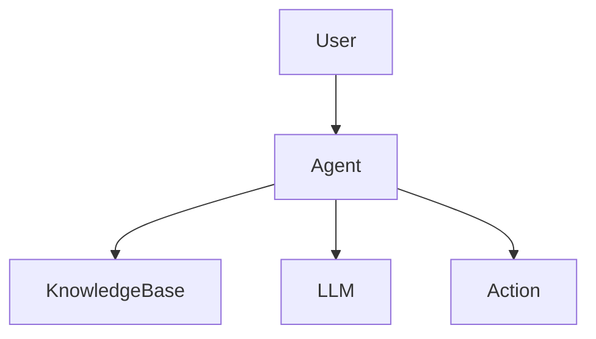
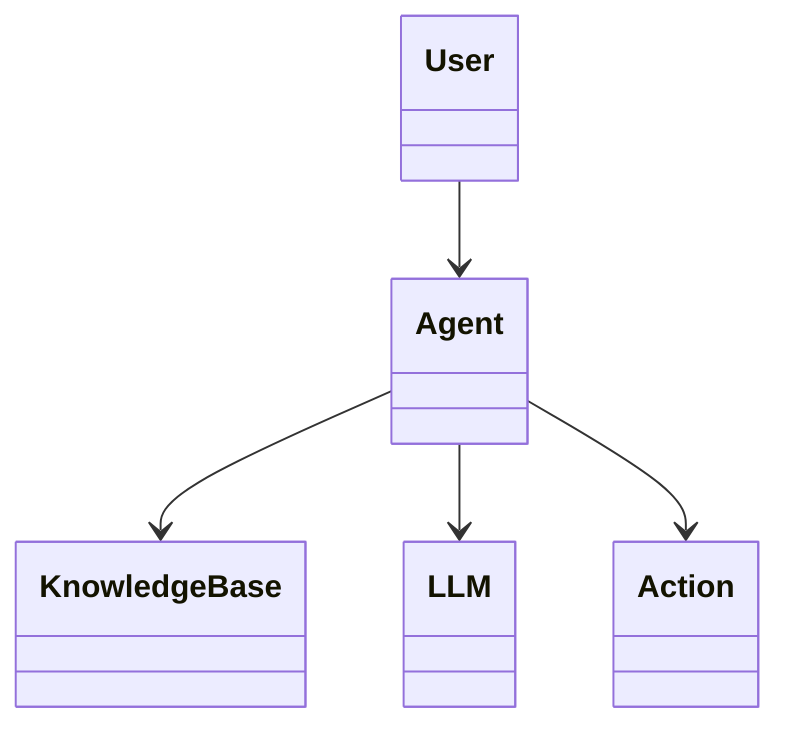
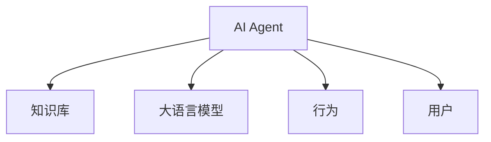

                 


# 企业级 AI Agent 开发：LLM 在商业场景中的落地

> 关键词：企业级 AI Agent, LLM, 人工智能, 商业场景, 技术落地

> 摘要：本文将详细探讨企业级 AI Agent 的开发过程，特别是如何将大语言模型（LLM）应用于商业场景。通过分析 LLM 的算法原理、系统架构设计以及实际项目案例，本文将为读者提供从理论到实践的全面指导，帮助企业在商业场景中成功落地 AI Agent 技术。

---

# 第一部分: 企业级 AI Agent 开发基础

# 第1章: 企业级 AI Agent 与 LLM 概述

## 1.1 AI Agent 的定义与核心概念

### 1.1.1 AI Agent 的定义
AI Agent（人工智能代理）是一种能够感知环境、理解用户需求，并通过决策和执行来实现特定目标的智能实体。它通常具备以下核心能力：
- **感知能力**：通过传感器或接口获取环境信息。
- **推理能力**：基于获取的信息进行逻辑推理。
- **决策能力**：根据推理结果做出决策。
- **执行能力**：通过执行动作实现目标。

### 1.1.2 AI Agent 的核心特点
- **自主性**：能够在没有人工干预的情况下自主运行。
- **反应性**：能够实时感知环境变化并做出响应。
- **目标导向性**：所有行为都围绕特定目标展开。
- **学习能力**：通过经验或数据优化自身的性能。

### 1.1.3 企业级 AI Agent 的应用场景
企业级 AI Agent 广泛应用于以下场景：
- **智能客服**：通过自然语言处理技术为用户提供即时服务。
- **智能推荐系统**：根据用户行为推荐个性化的产品或服务。
- **自动化流程处理**：替代人工完成重复性任务。
- **决策支持系统**：辅助企业高层做出更明智的决策。

## 1.2 LLM 的定义与技术特点

### 1.2.1 LLM 的定义
大语言模型（Large Language Model, LLM）是一种基于深度学习的自然语言处理模型，通常基于Transformer架构，具有大规模的参数量和丰富的上下文理解能力。其核心目标是通过大量数据训练，使得模型能够生成与人类语言高度相似的文本。

### 1.2.2 LLM 的技术特点
- **大规模训练数据**：通常使用互联网上的海量文本数据进行训练。
- **Transformer 架构**：采用自注意力机制，能够捕捉文本中的长距离依赖关系。
- **生成能力强**：能够生成高质量的文本，包括回答、摘要、翻译等。
- **可扩展性**：可以通过微调或提示工程技术适应不同领域的特定需求。

### 1.2.3 LLM 与传统 NLP 技术的区别
| 特性 | 传统 NLP 技术 | LLM 技术 |
|------|---------------|----------|
| 模型复杂度 | 较低，通常基于简单的RNN或CNN | 极高，基于Transformer架构，参数量巨大 |
| 上下游任务支持 | 较差，通常针对特定任务设计 | 极好，同一模型可以处理多种任务 |
| 训练数据 | 较小，通常局限于特定领域 | 极大，基于海量通用数据训练 |
| 计算资源需求 | 较低 | 极高，需要大量GPU资源 |

## 1.3 企业级 AI Agent 的发展背景

### 1.3.1 AI 技术的演进历程
AI 技术经历了多个阶段的发展：
1. **规则驱动阶段**：基于专家规则进行简单判断（20世纪80年代）。
2. **传统机器学习阶段**：使用SVM、随机森林等算法进行模式识别（20世纪90年代）。
3. **深度学习阶段**：基于神经网络的图像识别、语音识别等技术快速发展（21世纪初）。
4. **大语言模型阶段**：基于Transformer架构的LLM技术迅速崛起（2018年至今）。

### 1.3.2 LLM 在企业中的应用趋势
随着计算能力的提升和数据量的爆炸式增长，LLM 技术在企业中的应用呈现以下趋势：
- **从学术研究走向工业应用**：越来越多的企业开始尝试将LLM技术集成到现有系统中。
- **从单点应用走向全栈整合**：LLM不仅用于文本生成，还广泛应用于数据处理、决策支持等环节。
- **从通用模型走向领域定制**：通过微调和提示工程技术，使得LLM能够更好地适应特定行业需求。

### 1.3.3 企业级 AI Agent 的价值与意义
企业级 AI Agent 的价值主要体现在以下几个方面：
- **提高效率**：通过自动化处理大量重复性工作，显著提高企业运营效率。
- **降低成本**：减少人工干预，降低人力资源成本。
- **提升用户体验**：为用户提供更智能、更个性化的服务。
- **增强决策能力**：通过数据驱动的决策支持，帮助企业做出更明智的选择。

## 1.4 本章小结
本章主要介绍了企业级 AI Agent 和 LLM 的基本概念、技术特点及其在企业中的应用场景。通过对比传统NLP技术与LLM的差异，我们能够更好地理解LLM在AI Agent开发中的独特价值。

---

# 第2章: 企业级 AI Agent 的核心概念与联系

## 2.1 AI Agent 的核心概念

### 2.1.1 知识库的构建与管理
知识库是AI Agent 的“大脑”，存储着实现目标所需的所有知识和信息。知识库的构建通常包括以下几个步骤：
1. **数据收集**：从多种来源（如文档、数据库、网络爬取等）获取数据。
2. **数据预处理**：清洗、去重、标注等。
3. **知识抽取**：通过NLP技术提取结构化知识。
4. **知识存储**：将抽取的知识以某种数据结构（如图结构、向量数据库）存储。
5. **知识更新**：根据新数据不断更新知识库。

### 2.1.2 意图识别与对话理解
意图识别是通过分析用户的输入（如自然语言文本）来确定用户的意图。常用的技术包括：
- **基于规则的方法**：通过预定义的关键词或句式匹配用户的意图。
- **基于统计的方法**：使用机器学习模型（如SVM、随机森林）进行意图分类。
- **基于深度学习的方法**：使用CNN、RNN等模型进行意图识别。

对话理解则需要在意图识别的基础上，进一步分析对话的上下文关系，理解用户的真实需求。

### 2.1.3 行为决策与执行
行为决策是AI Agent 根据当前状态和目标，选择最优的行为策略。常用的技术包括：
- **基于规则的决策**：根据预定义的规则进行决策。
- **基于Q-Learning的决策**：通过强化学习不断优化决策策略。
- **基于专家系统的决策**：结合专家知识进行决策。

行为执行则是将决策结果转化为具体的操作，如调用API、发送消息等。

### 2.1.4 AI Agent 的知识图谱构建
知识图谱是AI Agent 的知识库的一种高级形式，通过图结构将实体及其关系表示出来。构建知识图谱的关键步骤包括：
1. **实体识别**：识别文本中的实体（如人名、地名、组织名等）。
2. **关系抽取**：识别实体之间的关系（如“是”、“属于”、“导致”等）。
3. **知识融合**：将多个来源的知识进行整合。
4. **知识存储**：将知识图谱存储为某种形式（如RDF、图数据库）。

### 2.1.5 知识图谱的查询与推理
知识图谱的查询通常使用SPARQL语言进行，而推理则可以通过规则推理或逻辑推理实现。例如，可以使用RDFox、Ubergraph等工具进行推理。

## 2.2 LLM 在 AI Agent 中的角色

### 2.2.1 LLM 作为知识库的问答系统
LLM 可以作为知识库的问答系统，通过自然语言理解技术，回答用户的问题。例如：
- **基于检索的问答系统**：根据用户的查询，在知识库中检索相关答案。
- **基于生成的问答系统**：根据用户的查询，生成新的回答。

### 2.2.2 LLM 作为对话生成器
LLM 可以生成自然流畅的对话内容，使得AI Agent 的对话更加逼真。例如：
- **对话生成模型**：基于Transformer的模型（如GPT）生成对话回复。
- **对话管理模型**：通过强化学习优化对话流程。

### 2.2.3 LLM 作为决策支持工具
LLM 可以分析大量的文本数据，为决策提供支持。例如：
- **文本摘要**：将长文本压缩成短摘要。
- **信息提取**：从文本中提取关键信息。
- **情感分析**：分析文本中的情感倾向。

## 2.3 AI Agent 的核心要素与 ER 实体关系图

### 2.3.1 AI Agent 的核心要素
- **用户（User）**：与AI Agent 进行交互的主体。
- **知识库（KnowledgeBase）**：AI Agent 的知识存储。
- **LLM（Large Language Model）**：AI Agent 的核心处理模块。
- **行为（Action）**：AI Agent 的具体操作。

### 2.3.2 实体关系图


## 2.4 本章小结
本章详细介绍了企业级 AI Agent 的核心概念，包括知识库的构建、意图识别、对话理解、行为决策等，并探讨了LLM在AI Agent 中的角色。通过实体关系图，我们能够清晰地理解AI Agent 的整体架构。

---

# 第3章: LLM 的算法原理与数学模型

## 3.1 LLM 的算法原理

### 3.1.1 Transformer 模型的结构
Transformer 模型由编码器和解码器两部分组成，编码器用于将输入序列编码为一个固定长度的向量，解码器用于将该向量解码为输出序列。其核心组件包括：
- **多头自注意力机制**：通过并行处理多个注意力头，捕捉序列中的不同关系。
- **前馈网络**：对每个位置的输入进行非线性变换。

### 3.1.2 注意力机制的原理
注意力机制的核心思想是：在处理每个位置时，赋予不同的权重，使得模型能够关注重要的位置。具体公式如下：
$$
\text{Attention}(Q, K, V) = \text{softmax}\left(\frac{QK^T}{\sqrt{d_k}}\right)V
$$
其中，$Q$ 是查询向量，$K$ 是键向量，$V$ 是值向量，$d_k$ 是键的维度。

### 3.1.3 梯度下降与优化算法
训练LLM时，通常使用交叉熵损失函数，并采用Adam优化器进行参数更新。具体步骤如下：
1. **前向传播**：将输入序列通过模型生成输出。
2. **计算损失**：使用交叉熵公式计算损失值。
$$
\text{损失函数} = -\sum_{i=1}^{n} \log P(y_i|x_{1..i})
$$
3. **反向传播**：通过链式法则计算梯度。
4. **参数更新**：使用Adam优化器更新参数。

## 3.2 LLM 的数学模型

### 3.2.1 概率分布与损失函数
LLM 的目标是通过训练数据优化参数，使得生成的文本的概率最大化。交叉熵损失函数是常用的优化目标：
$$
\text{损失函数} = -\sum_{i=1}^{n} \log P(y_i|x_{1..i})
$$

### 3.2.2 注意力机制的公式
注意力机制的计算公式如下：
$$
\text{Attention}(Q, K, V) = \text{softmax}\left(\frac{QK^T}{\sqrt{d_k}}\right)V
$$

### 3.2.3 解码器中的自注意力机制
解码器中的自注意力机制用于处理生成的序列，确保生成的文本符合语言习惯。具体公式如下：
$$
\text{Self-Attention}(x) = \text{softmax}\left(\frac{x x^T}{\sqrt{d_k}}\right)x
$$

## 3.3 LLM 的训练与推理流程

### 3.3.1 训练流程
1. **数据预处理**：将训练数据分成批次，每批次包含一定长度的序列。
2. **前向传播**：将输入序列通过编码器和解码器生成输出。
3. **计算损失**：使用交叉熵公式计算损失值。
4. **反向传播**：通过链式法则计算梯度。
5. **参数更新**：使用Adam优化器更新模型参数。

### 3.3.2 推理流程
1. **输入处理**：将用户输入的查询作为解码器的初始输入。
2. **生成文本**：通过解码器生成下一个词的概率分布。
3. **选择词**：根据概率分布选择生成词，继续生成后续词，直到达到预设长度或遇到终止符。

## 3.4 本章小结
本章详细介绍了LLM的算法原理和数学模型，包括Transformer的结构、注意力机制的公式、训练与推理的流程。通过这些内容，我们可以更好地理解LLM的内部工作机制。

---

# 第4章: 企业级 AI Agent 的系统分析与架构设计

## 4.1 系统分析

### 4.1.1 问题场景介绍
假设我们正在开发一个智能客服系统，用户通过自然语言输入问题，AI Agent 需要理解用户意图，并调用后端系统解决问题。系统需要支持多轮对话，能够处理复杂的问题，并且需要具备良好的容错能力。

### 4.1.2 项目目标与范围
项目目标是开发一个基于LLM的企业级AI Agent，实现智能问答、任务处理等功能。项目范围包括：
- **系统设计**：设计AI Agent 的功能模块和系统架构。
- **数据准备**：收集和整理训练数据。
- **模型训练**：训练LLM并进行微调。
- **系统集成**：将AI Agent 集成到企业现有系统中。

### 4.1.3 系统功能需求分析
系统需要实现以下功能：
- **用户交互**：支持多轮对话，理解用户的意图。
- **知识库查询**：能够从知识库中检索相关信息。
- **任务执行**：根据用户需求执行特定任务（如查询数据库、调用API等）。
- **反馈机制**：根据用户反馈优化对话流程。

## 4.2 系统架构设计

### 4.2.1 领域模型类图


### 4.2.2 系统架构图


### 4.2.3 接口设计
系统需要以下接口：
- **用户接口**：提供自然语言输入和输出的界面。
- **知识库接口**：提供知识查询和更新的API。
- **LLM接口**：提供模型调用的API。
- **行为接口**：提供任务执行的API。

### 4.2.4 交互设计
用户与AI Agent 的交互流程如下：
1. **用户输入**：用户通过文本或语音方式输入查询。
2. **意图识别**：AI Agent 识别用户的意图。
3. **知识检索**：AI Agent 从知识库中检索相关信息。
4. **生成回复**：LLM生成回复内容。
5. **行为执行**：根据需要执行具体任务。
6. **反馈收集**：收集用户反馈，优化对话流程。

## 4.3 本章小结
本章详细分析了企业级 AI Agent 的系统架构，包括领域模型类图、系统架构图、接口设计和交互设计。通过这些设计，我们可以清晰地理解AI Agent 的整体架构和各模块之间的关系。

---

# 第5章: 企业级 AI Agent 的项目实战

## 5.1 项目概述

### 5.1.1 项目背景
假设我们正在为一家电商平台开发一个智能客服系统，用户可以通过自然语言与AI Agent 进行交互，获取产品信息、订单查询等服务。

### 5.1.2 项目目标
开发一个基于LLM的智能客服系统，实现以下功能：
- **智能问答**：回答用户的产品咨询。
- **订单查询**：帮助用户查询订单状态。
- **退换货处理**：协助用户处理退换货问题。

## 5.2 项目实施

### 5.2.1 环境配置
1. **安装Python**：确保系统安装了Python 3.8或更高版本。
2. **安装依赖库**：安装必要的Python库，如`transformers`、`torch`、`flask`等。
3. **配置GPU支持**：如果需要使用GPU加速，确保安装了NVIDIA驱动和CUDA toolkit。

### 5.2.2 核心代码实现

#### 5.2.2.1 知识库的构建
```python
from typing import List, Dict
from transformers import AutoTokenizer, AutoModelForMaskedLM

class KnowledgeBase:
    def __init__(self):
        self.tokenizer = AutoTokenizer.from_pretrained('bert-base-chinese')
        self.model = AutoModelForMaskedLM.from_pretrained('bert-base-chinese')

    def store(self, text: str) -> None:
        # 实现知识存储逻辑
        pass

    def retrieve(self, query: str) -> List[str]:
        # 实现知识检索逻辑
        return []
```

#### 5.2.2.2 LLM 的集成
```python
from transformers import AutoTokenizer, AutoModelForCausalLM

class LLM:
    def __init__(self):
        self.tokenizer = AutoTokenizer.from_pretrained('gpt2')
        self.model = AutoModelForCausalLM.from_pretrained('gpt2')

    def generate(self, prompt: str, max_length: int = 50) -> str:
        inputs = self.tokenizer(prompt, return_tensors='pt')
        outputs = self.model.generate(inputs.input_ids, max_length=max_length)
        return self.tokenizer.decode(outputs[0], skip_special_tokens=True)
```

#### 5.2.2.3 AI Agent 的实现
```python
from typing import Dict, Any
from knowledge_base import KnowledgeBase
from llm import LLM

class Agent:
    def __init__(self):
        self.llm = LLM()
        self.knowledge_base = KnowledgeBase()

    def process_query(self, query: str) -> str:
        # 简单实现：直接调用LLM生成回复
        response = self.llm.generate(query)
        return response

    def process_complex_query(self, query: str, history: Dict[str, Any]) -> str:
        # 复杂实现：结合知识库和LLM生成回复
        knowledge = self.knowledge_base.retrieve(query)
        response = self.llm.generate(knowledge + query)
        return response
```

### 5.2.3 项目实现流程
1. **环境配置**：安装必要的库和工具。
2. **知识库构建**：收集和整理相关知识，构建领域知识图谱。
3. **LLM集成**：选择合适的LLM模型，并将其集成到系统中。
4. **系统集成**：将AI Agent 集成到企业现有系统中。
5. **测试与优化**：进行系统测试，收集用户反馈，优化系统性能。

## 5.3 项目总结与优化建议

### 5.3.1 项目总结
通过本项目，我们成功开发了一个基于LLM的企业级AI Agent，实现了智能问答、订单查询等功能。系统具备良好的扩展性和可维护性，能够满足企业的实际需求。

### 5.3.2 优化建议
1. **模型优化**：尝试使用更先进的LLM模型（如GPT-3、PaLM）进行优化。
2. **知识库优化**：引入外部知识库（如维基百科、行业数据）丰富知识库内容。
3. **对话优化**：引入对话管理技术（如DQN、PGI）优化对话流程。
4. **系统扩展**：尝试将AI Agent 应用于更多场景（如销售推荐、客户支持）。

## 5.4 本章小结
本章通过一个具体的项目案例，详细介绍了企业级 AI Agent 的开发过程，包括环境配置、核心代码实现、项目测试与优化等内容。通过本章的学习，读者能够更好地理解如何将LLM技术应用于实际商业场景。

---

# 第6章: 总结与展望

## 6.1 总结
本文详细探讨了企业级 AI Agent 的开发过程，特别是LLM在商业场景中的应用。通过分析LLM的算法原理、系统架构设计以及实际项目案例，我们能够清晰地理解如何将AI Agent 技术成功应用于企业中。

## 6.2 展望
随着AI技术的不断进步，企业级 AI Agent 的应用前景将更加广阔。未来，我们可以期待以下发展：
- **更强大的LLM模型**：随着模型规模的增大，LLM的生成能力和理解能力将得到进一步提升。
- **更智能的对话系统**：通过引入更先进的对话管理技术，使得AI Agent 的对话能力更加接近人类。
- **更广泛的应用场景**：LLM技术将被应用于更多的商业场景，为企业创造更大的价值。

---

# 作者：AI天才研究院/AI Genius Institute & 禅与计算机程序设计艺术 /Zen And The Art of Computer Programming

