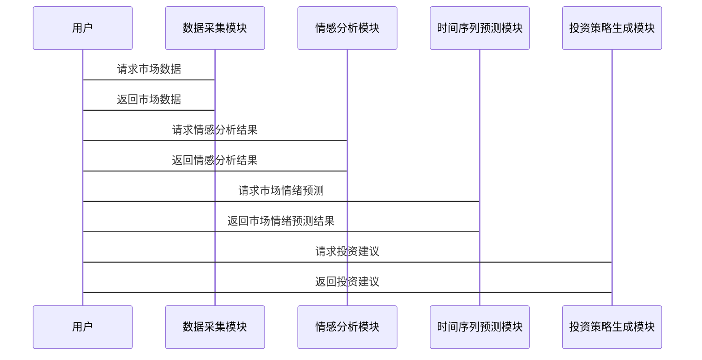

                 


# 利用AI构建自适应型市场情绪指标：把握投资时机

## 关键词：人工智能、市场情绪指标、投资时机、自适应型、自然语言处理、情感分析、时间序列分析

## 摘要：  
在金融投资领域，市场情绪是影响资产价格波动的重要因素。本文将探讨如何利用人工智能技术构建自适应型市场情绪指标，以帮助投资者更好地把握投资时机。文章从市场情绪指标的基本概念出发，结合自然语言处理和情感分析等AI技术，详细讲解自适应型市场情绪指标的算法实现、系统架构设计以及实际应用场景。通过案例分析，展示自适应型市场情绪指标在实际投资中的优势和效果。最终，本文将为投资者提供一种基于AI的创新工具，帮助其在复杂多变的市场环境中做出更明智的投资决策。

---

# 第1章: 市场情绪指标与投资时机

## 1.1 市场情绪指标的定义与作用

### 1.1.1 什么是市场情绪指标
市场情绪指标是衡量市场参与者情绪状态的量化工具，通常基于新闻、社交媒体、市场交易数据等信息进行计算。它反映了投资者对市场的乐观或悲观程度，是预测资产价格波动的重要参考。

### 1.1.2 市场情绪指标在投资中的作用
市场情绪指标可以帮助投资者识别市场的超买或超卖状态，预测市场的短期波动，并在市场情绪过度乐观或悲观时提示潜在的投资机会。

### 1.1.3 自适应型市场情绪指标的提出
传统市场情绪指标往往基于固定的模型和参数，难以适应市场的动态变化。自适应型市场情绪指标通过引入AI技术，能够实时调整模型参数，更好地捕捉市场的实时情绪变化。

---

## 1.2 投资时机的选择与市场情绪的关系

### 1.2.1 市场情绪与资产价格波动的关系
市场情绪是资产价格波动的重要驱动因素。当市场情绪乐观时，资产价格上涨；当市场情绪悲观时，资产价格下跌。通过分析市场情绪的变化，投资者可以更好地把握投资时机。

### 1.2.2 投资者行为对市场情绪的影响
投资者的行为会反过来影响市场情绪。例如，大量的买入行为会导致市场情绪上升，而大量的卖出行为则会导致市场情绪下降。

### 1.2.3 自适应型市场情绪指标的优势
自适应型市场情绪指标能够根据市场的实时变化动态调整，避免了传统指标的僵化问题，从而更准确地反映市场的实际情绪状态。

---

## 1.3 AI技术在金融投资中的应用前景

### 1.3.1 AI在金融数据分析中的应用
AI技术可以用于金融数据的清洗、特征提取和预测分析。例如，通过自然语言处理技术分析新闻和社交媒体数据，提取市场情绪信息。

### 1.3.2 AI在市场情绪分析中的潜力
AI技术，尤其是自然语言处理和情感分析技术，为市场情绪分析提供了新的工具和方法。通过分析大量的文本数据，可以更准确地捕捉市场的实时情绪。

### 1.3.3 自适应型市场情绪指标的AI实现路径
通过结合自然语言处理、情感分析和时间序列分析等技术，AI可以构建自适应型市场情绪指标，帮助投资者实时掌握市场的动态变化。

---

## 1.4 本章小结

本章介绍了市场情绪指标的基本概念和作用，探讨了投资时机与市场情绪的关系，并分析了AI技术在金融投资中的应用前景。自适应型市场情绪指标的提出为投资者提供了更灵活和精准的工具，帮助其在复杂多变的市场环境中做出更明智的投资决策。

---

# 第2章: 自适应型市场情绪指标的核心概念

## 2.1 自适应型市场情绪指标的定义与特征

### 2.1.1 自适应型市场的定义
自适应型市场是指能够根据市场环境的变化自动调整其行为和策略的市场。自适应型市场情绪指标是这一理念在市场情绪分析中的具体体现。

### 2.1.2 市场情绪指标的自适应性特征
自适应型市场情绪指标具有以下特征：
1. **实时性**：能够实时捕捉市场的最新情绪变化。
2. **动态调整**：根据市场的实时数据动态调整模型参数。
3. **智能化**：结合AI技术，能够自动学习和优化。

### 2.1.3 自适应型市场情绪指标的核心要素
1. 数据源：新闻、社交媒体、市场交易数据等。
2. 情感分析模型：用于分析数据中的情绪信息。
3. 时间序列分析模型：用于预测市场情绪的变化趋势。

---

## 2.2 自适应型市场情绪指标与传统市场情绪指标的对比

### 2.2.1 传统市场情绪指标的局限性
传统市场情绪指标通常基于固定的模型和参数，难以适应市场的动态变化。例如，传统指标可能无法及时捕捉突发事件对市场情绪的影响。

### 2.2.2 自适应型市场情绪指标的创新点
自适应型市场情绪指标通过引入AI技术，能够实时调整模型参数，动态捕捉市场的最新情绪变化。

### 2.2.3 自适应型指标在实际投资中的优势
自适应型市场情绪指标能够更准确地反映市场的实际情绪状态，帮助投资者做出更及时和精准的投资决策。

---

## 2.3 自适应型市场情绪指标的数学模型与公式

### 2.3.1 市场情绪指标的数学表达式
$$ S(t) = f_{\text{适应}}(D(t), S(t-1)) $$

其中，$S(t)$ 表示第 $t$ 时刻的市场情绪指标，$D(t)$ 表示第 $t$ 时刻的市场数据，$S(t-1)$ 表示第 $t-1$ 时刻的市场情绪指标。

### 2.3.2 自适应函数的具体实现
自适应函数可以根据市场的实时数据动态调整模型参数，例如：
$$ f_{\text{适应}}(D(t), S(t-1)) = \alpha D(t) + (1-\alpha) S(t-1) $$

其中，$\alpha$ 是自适应参数，可以根据市场波动性动态调整。

---

## 2.4 本章小结

本章详细介绍了自适应型市场情绪指标的定义、特征和核心要素，并与传统市场情绪指标进行了对比分析。通过数学公式和模型的展示，进一步明确了自适应型市场情绪指标的优势和实现路径。

---

# 第3章: AI技术基础与市场情绪分析

## 3.1 自然语言处理（NLP）在市场情绪分析中的应用

### 3.1.1 NLP的基本概念与技术
自然语言处理（NLP）是研究如何让计算机理解和生成人类语言的技术。常用的NLP技术包括分词、句法分析、情感分析等。

### 3.1.2 NLP在新闻、社交媒体数据中的应用
通过NLP技术，可以对新闻和社交媒体中的文本进行情感分析，提取市场情绪信息。

### 3.1.3 基于NLP的市场情绪分析流程
1. 数据清洗：去除噪音数据，提取有用信息。
2. 文本分词：将文本分割成词语或短语。
3. 情感分析：对文本进行情感分类，提取情绪特征。
4. 情绪聚合：将多个文本的情绪结果聚合，得到整体市场情绪指标。

---

## 3.2 情感分析算法与市场情绪预测

### 3.2.1 情感分析的基本原理
情感分析是通过计算机技术对文本进行情感分类的过程。常用的算法包括基于词袋模型的分类算法和深度学习模型（如LSTM、Transformer等）。

### 3.2.2 基于深度学习的情感分析模型
深度学习模型，如BERT和GPT，可以通过预训练的方式捕捉文本中的情感信息，提高情感分析的准确率。

### 3.2.3 情感分析结果对市场情绪的影响
通过分析新闻和社交媒体中的情感倾向，可以预测市场的短期情绪变化，帮助投资者做出更及时的投资决策。

---

## 3.3 时间序列分析与市场情绪预测

### 3.3.1 时间序列分析的基本概念
时间序列分析是研究数据随时间变化的规律，常用于预测未来的趋势和波动。

### 3.3.2 基于AI的时间序列预测模型
基于AI的时间序列预测模型，如LSTM和ARIMA，可以通过历史数据预测未来的市场情绪变化。

### 3.3.3 时间序列分析在市场情绪预测中的应用
通过结合情感分析和时间序列分析，可以更准确地预测市场的短期情绪变化，帮助投资者把握投资时机。

---

## 3.4 本章小结

本章介绍了自然语言处理和情感分析技术在市场情绪分析中的应用，并探讨了时间序列分析在市场情绪预测中的作用。通过结合AI技术，可以更准确地捕捉市场的实时情绪变化，为投资者提供更有力的决策支持。

---

# 第4章: 自适应型市场情绪指标的算法实现

## 4.1 数据预处理与特征提取

### 4.1.1 数据清洗
1. 去除无效数据（如重复数据、空值）。
2. 处理噪音数据（如特殊符号、停用词）。

### 4.1.2 文本分词
使用分词工具（如jieba）对文本进行分词，提取关键词。

### 4.1.3 情感分析特征提取
通过情感分析模型提取文本中的情感特征，如情感倾向（正面、负面、中性）和情感强度。

---

## 4.2 情感分析模型的训练与优化

### 4.2.1 情感分析模型的训练
1. 使用训练数据对情感分析模型进行训练。
2. 采用交叉验证技术优化模型参数。

### 4.2.2 模型的调优
1. 调整模型的超参数（如学习率、批量大小）。
2. 使用网格搜索或随机搜索技术寻找最优参数。

---

## 4.3 时间序列分析模型的实现

### 4.3.1 历史数据的获取与处理
1. 获取历史市场数据（如股票价格、交易量）。
2. 对数据进行标准化处理。

### 4.3.2 时间序列预测模型的构建
1. 使用LSTM或ARIMA模型构建时间序列预测模型。
2. 对模型进行训练和验证。

---

## 4.4 指标聚合与自适应调整

### 4.4.1 情绪指标的聚合
将不同数据源（如新闻、社交媒体）的情感分析结果进行聚合，得到整体市场情绪指标。

### 4.4.2 自适应参数的调整
根据市场的实时波动性动态调整模型参数，例如：
$$ \alpha(t) = \alpha_{\text{初始}} + \beta \times \text{波动性}(t) $$

---

## 4.5 本章小结

本章详细介绍了自适应型市场情绪指标的算法实现过程，包括数据预处理、特征提取、模型训练与优化以及指标聚合与自适应调整。通过这些步骤，可以构建一个动态调整的市场情绪指标，帮助投资者更好地把握投资时机。

---

# 第5章: 自适应型市场情绪指标的系统架构设计

## 5.1 系统功能设计

### 5.1.1 数据采集模块
1. 从新闻网站、社交媒体等数据源获取市场相关文本数据。
2. 从金融数据平台获取历史市场数据。

### 5.1.2 情感分析模块
1. 对采集到的文本数据进行情感分析，提取情感特征。
2. 输出情感分析结果（如情感倾向、情感强度）。

### 5.1.3 时间序列预测模块
1. 基于历史市场数据和情感分析结果，预测未来的市场情绪变化。
2. 输出市场情绪预测结果。

### 5.1.4 投资策略生成模块
1. 根据市场情绪预测结果生成投资策略（如买入、卖出、持有）。
2. 输出投资建议。

---

## 5.2 系统架构设计

### 5.2.1 系统架构图


### 5.2.2 系统交互流程图


---

## 5.3 系统接口设计

### 5.3.1 数据接口
1. 数据采集模块提供API接口，供其他模块调用。
2. 数据存储模块提供数据查询接口，供其他模块访问。

### 5.3.2 模型接口
1. 情感分析模块提供情感分析接口，供投资策略生成模块调用。
2. 时间序列预测模块提供市场情绪预测接口，供投资策略生成模块调用。

---

## 5.4 本章小结

本章详细介绍了自适应型市场情绪指标的系统架构设计，包括系统功能设计、系统架构图和系统交互流程图。通过模块化设计，可以实现系统的高效运行和功能扩展。

---

# 第6章: 自适应型市场情绪指标的项目实战

## 6.1 环境安装与配置

### 6.1.1 系统环境要求
1. 操作系统：Windows、Linux或MacOS。
2. Python版本：Python 3.6以上。
3. 硬件要求：建议配置8GB以上内存，支持多线程处理。

### 6.1.2 依赖库的安装
1. 使用pip安装必要的依赖库：
   ```
   pip install numpy pandas scikit-learn tensorflow keras jieba
   ```

---

## 6.2 系统核心实现

### 6.2.1 数据采集模块的实现
```python
import requests
from bs4 import BeautifulSoup

def fetch_news_data(url):
    response = requests.get(url)
    soup = BeautifulSoup(response.text, 'html.parser')
    news_list = []
    for news in soup.find_all('div', class_='news-item'):
        title = news.find('h2').text
        content = news.find('p').text
        news_list.append({'title': title, 'content': content})
    return news_list
```

### 6.2.2 情感分析模块的实现
```python
from sklearn.feature_extraction.text import TfidfVectorizer
from sklearn.svm import SVC

def text_to_vector(text):
    vectorizer = TfidfVectorizer()
    return vectorizer.fit_transform([text])

def train_emotion_classifier(X, y):
    clf = SVC()
    clf.fit(X, y)
    return clf

# 示例训练数据
texts = ["股票大涨，市场乐观", "市场下跌，投资者恐慌"]
y = [1, 0]
X = [text_to_vector(text)[0] for text in texts]
clf = train_emotion_classifier(X, y)
```

### 6.2.3 时间序列预测模块的实现
```python
from keras.models import Sequential
from keras.layers import LSTM, Dense

def build_model(input_shape):
    model = Sequential()
    model.add(LSTM(64, input_shape=input_shape))
    model.add(Dense(1))
    model.compile(loss='mean_squared_error', optimizer='adam')
    return model

# 示例训练数据
X_train = ... # shape (samples, timesteps, features)
y_train = ... # shape (samples,)
model = build_model((timesteps, features))
model.fit(X_train, y_train, epochs=10, batch_size=32)
```

---

## 6.3 案例分析与实战

### 6.3.1 数据采集与处理
1. 从新闻网站和社交媒体获取市场相关文本数据。
2. 对文本数据进行清洗和分词，提取关键词。

### 6.3.2 情感分析与预测
1. 使用情感分析模型对文本数据进行情感分类，提取情感特征。
2. 基于情感特征和历史市场数据，预测未来的市场情绪变化。

### 6.3.3 投资策略生成
1. 根据市场情绪预测结果，生成相应的投资策略（如买入、卖出、持有）。
2. 输出投资建议，帮助投资者做出决策。

---

## 6.4 本章小结

本章通过实际项目案例展示了自适应型市场情绪指标的实现过程，包括环境配置、核心模块的实现以及案例分析。通过实战，读者可以更好地理解理论知识，并掌握实际操作技能。

---

# 第7章: 总结与展望

## 7.1 总结

自适应型市场情绪指标通过结合AI技术，能够实时捕捉市场的动态变化，帮助投资者更好地把握投资时机。本文详细介绍了市场情绪指标的基本概念、AI技术的基础、自适应型市场情绪指标的算法实现以及系统架构设计，并通过实际案例展示了其在投资决策中的应用。

---

## 7.2 未来展望

随着AI技术的不断发展，自适应型市场情绪指标将更加智能化和精准化。未来的研究方向包括：
1. **更复杂的模型**：如使用Transformer模型进行情感分析，提高模型的准确率。
2. **多模态数据融合**：结合文本、图像等多种数据源，进一步提高市场情绪分析的准确性。
3. **实时性优化**：通过分布式计算和流数据处理技术，进一步提高系统的实时性。

---

## 7.3 投资建议

投资者在使用自适应型市场情绪指标时，应结合市场的实际情况和自身的投资目标，合理调整投资策略。同时，投资者也应关注市场的其他因素（如宏观经济指标、政策变化等），以做出更全面的投资决策。

---

## 7.4 本章小结

本章总结了全文的主要内容，并对未来的研究方向和投资策略提出了展望。自适应型市场情绪指标作为一种创新的工具，将在未来的金融投资中发挥越来越重要的作用。

---

## 作者：AI天才研究院 & 禅与计算机程序设计艺术

---

**总结：** 本文通过详细分析自适应型市场情绪指标的理论基础、算法实现和实际应用，为投资者提供了一种基于AI的创新工具，帮助其在复杂多变的市场环境中做出更明智的投资决策。

