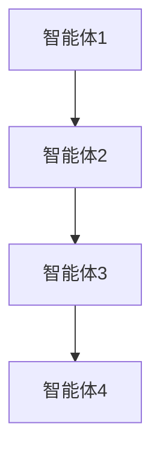
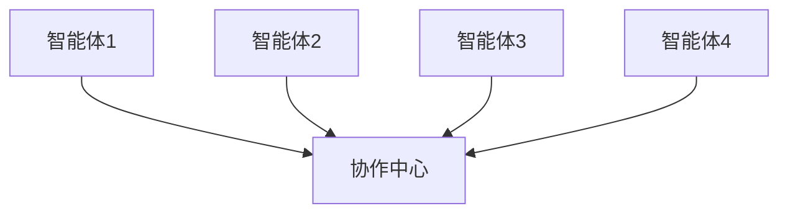
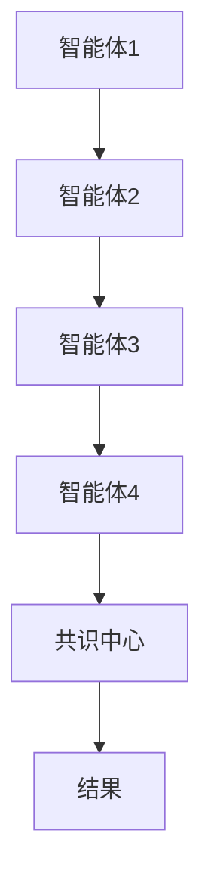
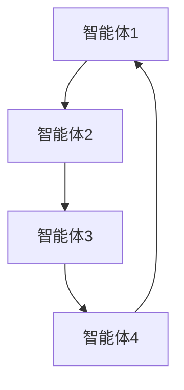
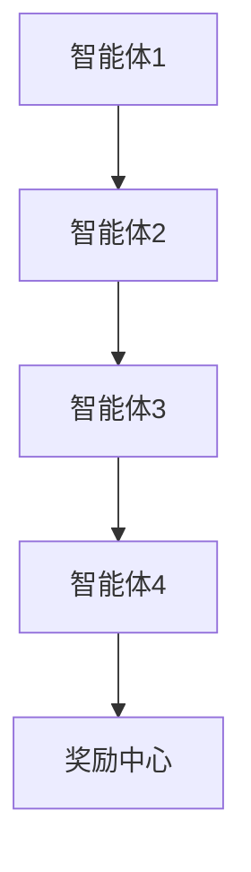
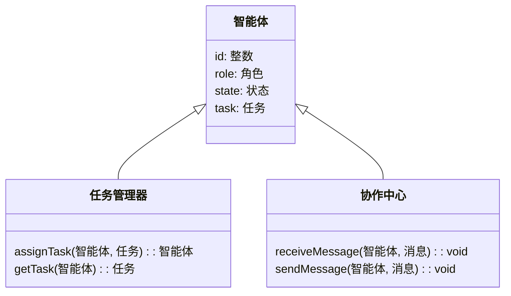
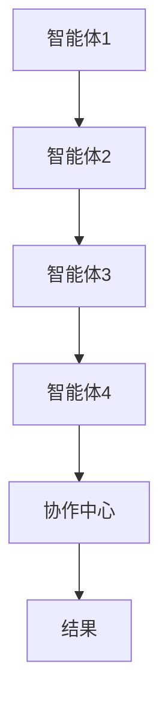
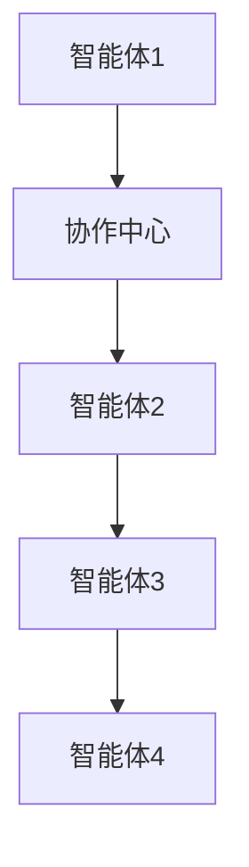
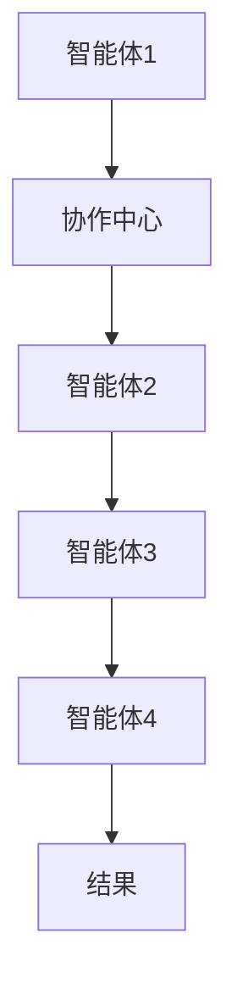

                 


# 多智能体协作评估全球宏观风险

> **关键词**：多智能体协作，全球宏观风险，人工智能，风险评估，分布式智能

> **摘要**：本文探讨了多智能体协作技术在评估全球宏观风险中的应用。通过分析多智能体协作的定义、原理及算法实现，结合实际案例，展示了如何利用分布式智能技术应对复杂的全球性风险评估挑战。

---

## 第一部分: 多智能体协作与全球宏观风险评估概述

### 第1章: 多智能体协作与全球宏观风险评估的背景

#### 1.1 多智能体协作的定义与特点

**1.1.1 多智能体协作的定义**  
多智能体协作（Multi-Agent Collaboration, MAC）是指多个智能体（Agent）通过共享信息、协同决策和联合行动，共同完成特定任务的过程。每个智能体具备自主性、反应性和社会性，能够独立执行任务并与其他智能体进行交互。

**1.1.2 多智能体协作的核心特点**  
- **分布式智能**：智能体之间通过分布式计算和信息共享，避免单点故障。  
- **自主性**：每个智能体都能独立决策，无需中央控制。  
- **协作性**：智能体之间通过通信和协调，共同完成复杂任务。  
- **动态性**：能够适应环境变化和任务需求的动态调整。  

**1.1.3 多智能体协作与传统单智能体方法的区别**  
传统的单智能体方法依赖于中心化的决策系统，而多智能体协作通过分布式计算和协同决策，提高了系统的鲁棒性和适应性。在面对复杂的全球宏观风险评估时，多智能体协作能够更好地处理信息不对称和任务分散的问题。

#### 1.2 全球宏观风险评估的定义与挑战

**1.2.1 宏观风险的定义**  
宏观风险是指可能对整个经济系统或社会造成重大影响的不确定性事件，如经济衰退、金融危机、自然灾害等。  

**1.2.2 全球宏观风险评估的复杂性**  
- **数据多样性**：涉及经济指标、政策变化、市场情绪等多方面数据。  
- **事件关联性**：风险事件之间可能相互关联，形成连锁反应。  
- **信息不完全**：风险评估依赖于实时数据和模型的准确性，存在信息不对称问题。  

**1.2.3 多智能体协作在宏观风险评估中的作用**  
多智能体协作能够通过分布式数据处理和协同分析，实时捕捉全球宏观风险的变化趋势，提高风险评估的准确性和及时性。

#### 1.3 多智能体协作在宏观风险评估中的应用前景

**1.3.1 多智能体协作的优势**  
- **高效性**：通过并行计算和分布式处理，提升数据处理效率。  
- **鲁棒性**：多个智能体协同工作，降低单点故障风险。  
- **灵活性**：能够快速适应环境变化和任务需求的调整。  

**1.3.2 全球宏观风险评估的潜在应用场景**  
- **金融风险管理**：实时监测金融市场波动，评估系统性风险。  
- **宏观经济预测**：基于多源数据预测经济走势，辅助政策制定。  
- **危机响应**：在突发事件中快速协调资源，制定应对策略。  

**1.3.3 技术挑战与未来发展方向**  
- **技术挑战**：包括通信延迟、数据隐私、算法复杂性等问题。  
- **未来发展方向**：研究更高效的协作算法、增强数据隐私保护、提升系统的实时性和准确性。  

---

## 第2章: 多智能体协作的核心概念与联系

### 2.1 多智能体协作的原理

#### 2.1.1 分布式智能的基本原理  
分布式智能通过多个智能体的协同工作，实现对复杂任务的分解和处理。每个智能体负责特定子任务，通过通信和协调完成整体目标。

#### 2.1.2 多智能体协作的通信机制  
通信机制是多智能体协作的核心，包括消息传递、状态共享和共识机制。智能体之间通过通信协议交换信息，确保协作的高效性和准确性。

#### 2.1.3 协作任务的分解与分配  
协作任务需要分解为多个子任务，每个子任务由特定智能体负责。任务分配需要考虑智能体的能力、资源和目标的一致性。

### 2.2 实体关系与协作网络

#### 2.2.1 多智能体协作的ER实体关系图  
以下是多智能体协作的ER实体关系图，展示了智能体、任务和协作关系之间的关联。

```mermaid
er
actor(Agent)
actor(Task)
actor(Collaboration)
relationship(Assigned_to, Agent, Task)
relationship(Collaborates_with, Agent, Collaboration)
```

#### 2.2.2 协作网络的构建与优化  
协作网络的构建需要考虑智能体之间的通信成本、信息共享的效率和任务分配的公平性。通过优化协作网络的拓扑结构，可以提升系统的整体性能。

#### 2.2.3 实体间的关系与权重分析  
智能体之间的关系可以用权重表示，权重越高表示协作关系越紧密。通过分析实体间的权重分布，可以优化协作网络的结构和功能。

### 2.3 多智能体协作的核心要素对比

#### 2.3.1 不同协作机制的对比分析  
以下是不同协作机制的对比分析表：

| **协作机制** | **特点** | **优点** | **缺点** |
|--------------|----------|----------|----------|
| 基于角色的协作 | 任务分解明确，角色固定 | 责任分明，协作高效 | 灵活性较低 |
| 基于任务的协作 | 任务动态分配，角色灵活 | 灵活性高，适应性强 | 协调成本较高 |
| 基于博弈论的协作 | 智能体之间通过博弈决策 | 解决冲突，优化资源分配 | 计算复杂度高 |

#### 2.3.2 各种协作策略的优缺点  
通过对比不同协作策略的优缺点，可以选择最适合特定应用场景的协作方法。例如，在金融风险管理中，基于博弈论的协作策略可以有效应对市场的不确定性。

---

## 第3章: 多智能体协作的算法原理

### 3.1 协作任务分配算法

#### 3.1.1 基于角色分配的任务分配算法  
任务分配算法需要考虑智能体的角色、能力和资源。以下是基于角色分配的数学模型：

$$ R_i = \arg\max_{j} \sum_{k=1}^{n} w_{jk} $$

其中，$R_i$ 表示第i个智能体的角色，$w_{jk}$ 表示第j个角色的权重。

#### 3.1.2 基于资源分配的任务分配算法  
资源分配算法需要平衡智能体之间的资源使用。以下是基于资源分配的数学模型：

$$ x_i = \sum_{j=1}^{m} a_{ij}x_j $$

其中，$x_i$ 表示第i个智能体分配的资源，$a_{ij}$ 表示第i个智能体分配给第j个任务的资源比例。

#### 3.1.3 基于博弈论的协作任务分配  
博弈论协作任务分配通过智能体之间的博弈来优化资源分配。以下是博弈论模型的数学表达：

$$ V = \max_{\theta} \min_{\phi} J(\theta, \phi) $$

其中，$V$ 表示系统的目标函数，$\theta$ 和 $\phi$ 分别表示两个智能体的策略，$J(\theta, \phi)$ 表示联合目标函数。

### 3.2 协作通信机制

#### 3.2.1 基于消息传递的协作通信  
消息传递机制通过智能体之间的信息交换实现协作。以下是消息传递的流程图：



#### 3.2.2 基于状态共享的协作通信  
状态共享机制通过实时更新智能体的状态信息，实现协作。以下是状态共享的流程图：



#### 3.2.3 基于共识机制的协作通信  
共识机制通过智能体之间的协商达成一致。以下是基于共识机制的流程图：



### 3.3 协作决策算法

#### 3.3.1 基于分布式决策的协作算法  
分布式决策算法通过智能体之间的独立决策实现协作。以下是分布式决策的流程图：


#### 3.3.2 基于群体智能的协作决策  
群体智能算法通过模拟生物群体的行为实现协作。以下是群体智能的流程图：



#### 3.3.3 基于强化学习的协作决策  
强化学习算法通过智能体的试错学习实现协作。以下是强化学习的流程图：



---

## 第4章: 多智能体协作的数学模型与公式

### 4.1 协作任务分配的数学模型

#### 4.1.1 基于角色分配的数学模型  
$$ R_i = \arg\max_{j} \sum_{k=1}^{n} w_{jk} $$

其中，$R_i$ 表示第i个智能体的角色，$w_{jk}$ 表示第j个角色的权重。

#### 4.1.2 基于资源分配的数学模型  
$$ x_i = \sum_{j=1}^{m} a_{ij}x_j $$

其中，$x_i$ 表示第i个智能体分配的资源，$a_{ij}$ 表示第i个智能体分配给第j个任务的资源比例。

#### 4.1.3 基于博弈论的数学模型  
$$ V = \max_{\theta} \min_{\phi} J(\theta, \phi) $$

其中，$V$ 表示系统的目标函数，$\theta$ 和 $\phi$ 分别表示两个智能体的策略，$J(\theta, \phi)$ 表示联合目标函数。

### 4.2 协作通信机制的数学模型

#### 4.2.1 基于消息传递的数学模型  
$$ p(y|x) = \prod_{i=1}^{n} p(y_i|x_i) $$

其中，$p(y|x)$ 表示在给定输入$x$的情况下，输出$y$的概率分布。

#### 4.2.2 基于状态共享的数学模型  
$$ s_i = \sum_{j=1}^{m} \alpha_{ij} s_j $$

其中，$s_i$ 表示第i个智能体的状态，$\alpha_{ij}$ 表示第i个智能体从第j个智能体获取的状态权重。

#### 4.2.3 基于共识机制的数学模型  
$$ C = \arg\min_{c} \sum_{i=1}^{n} (c - c_i)^2 $$

其中，$C$ 表示共识结果，$c_i$ 表示第i个智能体的初始状态。

---

## 第5章: 系统分析与架构设计方案

### 5.1 问题场景介绍

在全球宏观风险评估中，多智能体协作系统需要实时监测和分析来自不同领域的数据，包括经济指标、政策变化、市场情绪等。系统的目的是通过多智能体协作，提供准确的风险评估结果，帮助决策者制定有效的应对策略。

### 5.2 项目介绍

本项目旨在开发一个多智能体协作系统，用于评估全球宏观风险。系统包括多个智能体，每个智能体负责特定任务，如数据采集、分析和决策。通过协作，系统能够实时更新风险评估结果，并提供相应的预警和建议。

### 5.3 系统功能设计

以下是系统功能设计的类图：



### 5.4 系统架构设计

以下是系统架构设计的流程图：



### 5.5 系统接口设计

系统接口设计包括智能体之间的通信接口和协作中心的管理接口。以下是接口设计的流程图：



### 5.6 系统交互设计

系统交互设计展示了智能体与协作中心之间的协作流程。以下是交互设计的流程图：



---

## 第6章: 项目实战

### 6.1 环境安装

为了运行本项目，需要安装以下环境：

- Python 3.8 或更高版本
- 安装多智能体协作框架（如基于Python的Multi-Agent Framework）
- 安装必要的Python库（如numpy、pandas、matplotlib）

### 6.2 系统核心实现源代码

以下是系统核心实现的源代码：

```python
class Agent:
    def __init__(self, id, role):
        self.id = id
        self.role = role
        self.state = None
        self.task = None

    def receive_message(self, message):
        # 处理接收到的消息
        pass

    def send_message(self, message, recipient):
        # 发送消息给接收者
        pass

class CollaborationCenter:
    def __init__(self):
        self.agents = []
        self.tasks = []

    def assign_task(self, agent, task):
        # 分配任务给智能体
        pass

    def get_task(self, agent):
        # 获取智能体的任务
        pass

    def send_message(self, sender, message):
        # 发送消息给协作中心
        pass

    def receive_message(self, sender, message):
        # 接收协作中心的消息
        pass
```

### 6.3 代码应用解读与分析

上述代码定义了一个基本的多智能体协作系统，包括智能体和协作中心两个主要部分。智能体具备接收和发送消息的能力，协作中心负责任务分配和消息管理。

### 6.4 实际案例分析

以金融风险管理为例，智能体1负责收集市场数据，智能体2负责分析数据，智能体3负责制定风险评估报告，智能体4负责发出预警信号。通过协作，系统能够实时更新风险评估结果，并提供相应的预警和建议。

### 6.5 项目小结

通过本项目的实施，我们可以看到多智能体协作在全局宏观风险评估中的巨大潜力。通过合理设计协作机制和算法，可以显著提高风险评估的准确性和效率。

---

## 第7章: 最佳实践、小结与注意事项

### 7.1 最佳实践 tips

- **任务分配**：根据智能体的能力和资源合理分配任务。  
- **通信机制**：选择高效的通信机制，确保信息传递的实时性和准确性。  
- **协作算法**：根据具体场景选择合适的协作算法，优化系统性能。  

### 7.2 小结

通过本文的探讨，我们了解了多智能体协作在全局宏观风险评估中的重要作用。通过合理设计协作机制和算法，可以显著提高风险评估的准确性和效率。

### 7.3 注意事项

- **数据隐私**：确保数据的隐私和安全，遵守相关法律法规。  
- **系统稳定性**：设计高效的协作机制，确保系统的稳定性和可靠性。  
- **实时性**：在设计协作算法时，考虑系统的实时性要求，优化算法的运行效率。

---

## 第8章: 拓展阅读与进一步思考

### 8.1 拓展阅读

- **推荐书籍**：《Multi-Agent Systems: Algorithmic, Complexity, and Synthesis》  
- **推荐论文**：《A survey on multi-agent systems and their applications》  

### 8.2 进一步思考

未来的研究方向可以包括：

- **协作算法的优化**：研究更高效的协作算法，提高系统的运行效率。  
- **数据隐私保护**：探索更安全的数据共享机制，保护智能体之间的数据隐私。  
- **动态环境适应**：研究多智能体协作系统在动态环境中的适应性，提高系统的灵活性和鲁棒性。

---

**作者：AI天才研究院/AI Genius Institute & 禅与计算机程序设计艺术 /Zen And The Art of Computer Programming**

