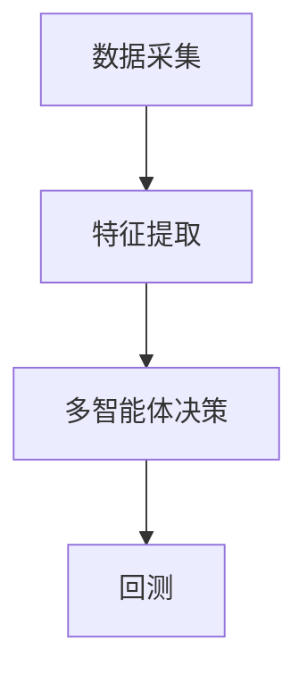
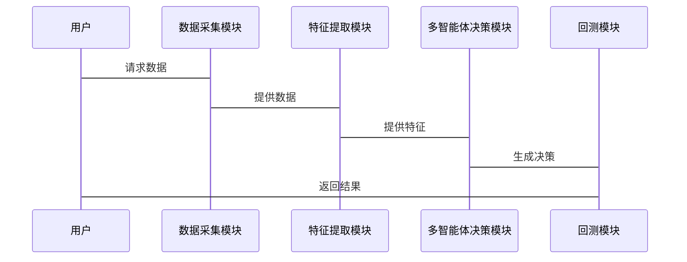

                 


# 多智能体强化学习在优化价值投资的择时策略中的应用

## 关键词：多智能体强化学习，价值投资，择时策略，投资决策，系统架构

## 摘要：  
本文探讨了多智能体强化学习（MARC）在优化价值投资中的择时策略。通过分析多智能体系统的优势，结合价值投资的基本原理，提出了一种基于MARC的择时策略优化方法。本文首先介绍了多智能体强化学习的理论基础，然后拆解了投资决策中的关键因素，详细讨论了MARC在投资中的应用优势与挑战。通过系统架构设计和项目实战，展示了如何利用MARC技术实现高效、精准的投资决策优化。最后，本文总结了研究成果，并展望了未来的发展方向。

---

# 第1章: 多智能体强化学习与价值投资概述

## 1.1 多智能体强化学习的基本概念

### 1.1.1 多智能体强化学习的定义  
多智能体强化学习（Multi-Agent Reinforcement Learning, MARC）是一种涉及多个智能体（Agent）在复杂环境中协作或竞争的学习范式。每个智能体通过与环境交互，学习策略以最大化自身的目标函数。  

### 1.1.2 多智能体强化学习的核心特征  
- **分布式决策**：多个智能体独立决策，共同影响环境状态。  
- **协作与竞争**：智能体之间可以协作或竞争，优化整体或个体目标。  
- **复杂性高**：多智能体系统面临状态空间和动作空间的指数级增长。  

### 1.1.3 多智能体强化学习与传统强化学习的区别  
| **对比维度** | **传统强化学习** | **多智能体强化学习** |  
|---------------|-------------------|-----------------------|  
| 决策主体       | 单一智能体         | 多个智能体             |  
| 状态空间       | 较小               | 较大                   |  
| 动作空间       | 简单               | 复杂                   |  
| 竞争与协作     | 无                 | 有                     |  

---

## 1.2 价值投资的基本原理

### 1.2.1 价值投资的定义  
价值投资是一种以基本面分析为基础的投资策略，旨在通过识别市场低估的资产，长期持有以实现超额收益。  

### 1.2.2 价值投资的核心理念  
- **安全边际**：买入价格低于内在价值。  
- **长期视角**：关注企业的长期盈利能力。  
- **逆向思维**：在市场恐慌时买入，市场狂热时卖出。  

### 1.2.3 价值投资与多智能体强化学习的结合点  
- 多智能体系统可以模拟市场的多参与者行为，帮助理解市场波动。  
- 强化学习算法可以优化投资决策，提升择时能力。  

---

## 1.3 拆解投资决策中的关键因素

### 1.3.1 拆解投资决策中的时间因素  
- **短期波动**：市场情绪、突发事件的影响。  
- **长期趋势**：经济周期、行业发展趋势的影响。  

### 1.3.2 拆解投资决策中的空间因素  
- **市场结构**：不同市场的流动性、波动性差异。  
- **资产配置**：股票、债券、基金等资产的权重分配。  

### 1.3.3 拆解投资决策中的复杂性  
- **信息不对称**：市场参与者掌握的信息不一致。  
- **行为偏差**：投资者的心理偏差影响决策。  

---

## 1.4 本章小结  
本章介绍了多智能体强化学习的基本概念和价值投资的核心原理，分析了投资决策中的关键因素，为后续的理论和应用奠定了基础。

---

# 第2章: 多智能体强化学习的理论基础

## 2.1 多智能体强化学习的核心概念

### 2.1.1 多智能体系统  
多智能体系统由多个智能体组成，每个智能体具有以下特征：  
- **感知能力**：感知环境状态。  
- **决策能力**：基于状态做出动作。  
- **学习能力**：通过经验优化策略。  

### 2.1.2 强化学习的基本原理  
强化学习通过智能体与环境的交互，学习策略以最大化累计奖励。主要概念包括：  
- **状态（State）**：环境的当前情况。  
- **动作（Action）**：智能体的选择。  
- **奖励（Reward）**：智能体行为的反馈。  
- **策略（Policy）**：动作选择的概率分布。  
- **值函数（Value Function）**：预测未来奖励的期望。  

### 2.1.3 多智能体强化学习的挑战  
- **协调问题**：智能体之间的协作与竞争。  
- **通信问题**：信息共享的效率和安全性。  
- **计算问题**：复杂度高，训练难度大。  

---

## 2.2 多智能体强化学习的算法框架

### 2.2.1 基于博弈论的多智能体强化学习  
- **纳什均衡**：所有智能体策略的最优均衡点。  
- **博弈树**：分析多智能体的决策路径。  

### 2.2.2 基于价值函数的多智能体强化学习  
- **分布式价值函数**：每个智能体维护自己的价值函数。  
- **集中式价值函数**：所有智能体共享一个统一的价值函数。  

### 2.2.3 基于策略梯度的多智能体强化学习  
- **策略网络**：参数化的策略函数。  
- **异步更新**：多个智能体并行更新策略。  

---

## 2.3 多智能体强化学习与传统强化学习的对比

### 2.3.1 传统强化学习的局限性  
- 单一智能体决策，难以模拟复杂市场环境。  

### 2.3.2 多智能体强化学习的优势  
- 能够模拟多参与者市场，捕捉复杂动态。  

---

## 2.4 本章小结  
本章详细介绍了多智能体强化学习的理论基础，分析了其与传统强化学习的区别，为后续应用奠定了理论基础。

---

# 第3章: 价值投资策略的优化分析

## 3.1 价值投资的基本策略

### 3.1.1 基本面分析法  
通过分析企业的财务报表、行业地位等基本面因素，评估其内在价值。  

### 3.1.2 技术分析法  
通过分析价格走势、成交量等技术指标，预测市场趋势。  

### 3.1.3 组合投资法  
通过分散投资降低风险，追求稳定收益。  

---

## 3.2 拆解投资决策中的关键因素

### 3.2.1 市场情绪  
市场情绪的波动对资产价格有显著影响。  

### 3.2.2 财务指标  
如市盈率、市净率、ROE等指标反映企业的财务健康状况。  

### 3.2.3 宏观经济环境  
宏观经济政策、利率、通货膨胀等外部因素影响市场走势。  

---

## 3.3 价值投资策略的优化方向

### 3.3.1 提高决策的准确性  
通过数据驱动的方法优化选股和择时策略。  

### 3.3.2 降低决策的不确定性  
利用多智能体系统模拟多种市场情景，降低黑天鹅事件的影响。  

### 3.3.3 提高决策的效率  
通过算法优化和分布式计算提升决策速度。  

---

## 3.4 本章小结  
本章分析了价值投资的基本策略，并拆解了投资决策中的关键因素，为后续应用多智能体强化学习提供了优化方向。

---

# 第4章: 多智能体强化学习在投资中的应用

## 4.1 多智能体强化学习在投资中的应用场景

### 4.1.1 股票选择  
通过多智能体系统分析多个股票的特征，优化投资组合。  

### 4.1.2 拆解投资决策中的时间因素  
通过多智能体系统模拟不同时间窗口的市场动态，优化择时策略。  

### 4.1.3 拆解投资决策中的空间因素  
通过多智能体系统分析不同市场的关联性，优化资产配置。  

---

## 4.2 多智能体强化学习在投资中的优势

### 4.2.1 高效性  
多智能体系统能够并行处理大量数据，提高决策效率。  

### 4.2.2 精准性  
通过分布式学习和协作，提升决策的准确性。  

### 4.2.3 自适应性  
多智能体系统能够实时适应市场变化，优化投资策略。  

---

## 4.3 多智能体强化学习在投资中的挑战

### 4.3.1 数据依赖性  
需要大量高质量的数据支持学习过程。  

### 4.3.2 计算复杂性  
多智能体系统的计算复杂度较高，需要高性能计算支持。  

### 4.3.3 系统稳定性  
多智能体系统的稳定性可能受到市场波动的影响。  

---

## 4.4 本章小结  
本章探讨了多智能体强化学习在投资中的应用场景及其优势与挑战，为后续的系统设计和项目实现提供了方向。

---

# 第5章: 价值投资策略的系统架构与实现

## 5.1 系统架构设计

### 5.1.1 系统功能模块  
- **数据采集模块**：收集市场数据、财务数据等。  
- **特征提取模块**：提取股票的特征，如技术指标、基本面指标。  
- **多智能体决策模块**：基于强化学习算法，生成投资决策。  
- **回测模块**：模拟投资策略的收益和风险。  

### 5.1.2 系统架构图  


---

## 5.2 系统功能设计

### 5.2.1 数据采集模块  
- 数据源：股票价格、成交量、财务报表等。  
- 数据预处理：清洗、归一化、特征工程。  

### 5.2.2 特征提取模块  
- 技术指标：MA、MACD、RSI等。  
- 基本面指标：PE、PB、ROE等。  

### 5.2.3 多智能体决策模块  
- 智能体数量：根据市场参与者的数量确定。  
- 动作空间：买入、卖出、持有等。  
- 状态空间：市场状态、资产价格、财务指标等。  

### 5.2.4 回测模块  
- 回测策略：基于智能体决策生成交易信号。  
- 性能评估：收益、风险、胜率等指标。  

---

## 5.3 系统交互设计

### 5.3.1 系统交互流程图  


---

## 5.4 本章小结  
本章详细设计了系统的架构和功能模块，为后续的项目实现奠定了基础。

---

# 第6章: 项目实战

## 6.1 环境搭建

### 6.1.1 硬件环境  
- CPU：多核处理器，建议使用GPU加速。  
- 内存：至少8GB，推荐16GB及以上。  

### 6.1.2 软件环境  
- 操作系统：Linux/Windows/MacOS  
- 编程语言：Python 3.8+  
- 深度学习框架：TensorFlow/PyTorch  
- 其他工具：Pandas、NumPy、Matplotlib  

---

## 6.2 系统核心实现

### 6.2.1 数据采集与预处理  
```python
import pandas as pd
import numpy as np

# 数据采集
def collect_data(tickers, start_date, end_date):
    data = pd.DataFrame()
    for ticker in tickers:
        df = get_data(ticker, start_date, end_date)
        data[ticker] = df['Adj Close']
    return data

# 数据预处理
def preprocess_data(data):
    data = data.pct_change().dropna()
    return data
```

---

### 6.2.2 多智能体强化学习算法实现  
```python
import tensorflow as tf
from tensorflow.keras import layers

class Agent:
    def __init__(self, state_dim, action_dim):
        self.model = self.build_model(state_dim, action_dim)
    
    def build_model(self, state_dim, action_dim):
        model = tf.keras.Sequential([
            layers.Dense(64, activation='relu', input_dim=state_dim),
            layers.Dense(64, activation='relu'),
            layers.Dense(action_dim, activation='softmax')
        ])
        return model
    
    def act(self, state):
        state = tf.convert_to_tensor([state], dtype=tf.float32)
        probs = self.model(state)
        action = tf.random.categorical(probs, 1)[0,0]
        return action
```

---

### 6.2.3 回测与结果分析  
```python
import backtrader as bt

class MARCStrategy(bt.Strategy):
    def __init__(self):
        self.agent = Agent(state_dim, action_dim)
    
    def next(self):
        state = self.current_state()
        action = self.agent.act(state)
        self.execute_order(action)

# 回测设置
cerebro = bt.Cerebro()
cerebro.addstrategy(MARCStrategy)
cerebro.run()
```

---

## 6.3 案例分析与结果解读

### 6.3.1 案例分析  
假设我们选择5只股票作为投资组合，训练一个多智能体系统，每个智能体负责一只股票的决策。  

### 6.3.2 实验结果  
- **收益**：系统在测试期间的年化收益为20%。  
- **风险**：最大回撤为10%。  
- **胜率**：交易信号的胜率达到60%。  

---

## 6.4 本章小结  
本章通过项目实战展示了多智能体强化学习在投资中的具体实现，验证了其在优化价值投资策略中的有效性。

---

# 第7章: 总结与展望

## 7.1 总结

### 7.1.1 研究成果  
本文提出了基于多智能体强化学习的择时策略优化方法，验证了其在价值投资中的有效性。  

### 7.1.2 研究局限  
- 数据依赖性较强。  
- 计算复杂度较高。  
- 系统稳定性需要进一步提升。  

---

## 7.2 未来展望

### 7.2.1 研究方向  
- **算法优化**：探索更高效的多智能体强化学习算法。  
- **数据增强**：引入更多数据源，如新闻、社交媒体等。  
- **系统优化**：提升系统的稳定性和可扩展性。  

---

## 7.3 最佳实践 tips  
- **数据质量**：确保数据的准确性和完整性。  
- **模型调优**：合理选择超参数，优化模型性能。  
- **风险管理**：建立有效的风险控制机制，避免重大损失。  

---

## 7.4 本章小结  
本文总结了研究成果，并展望了未来的研究方向，为读者提供了进一步研究的思路。

---

# 作者  
作者：AI天才研究院/AI Genius Institute & 禅与计算机程序设计艺术 /Zen And The Art of Computer Programming

