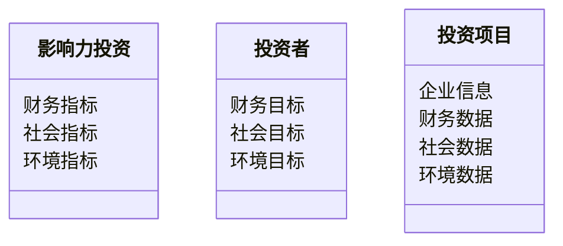
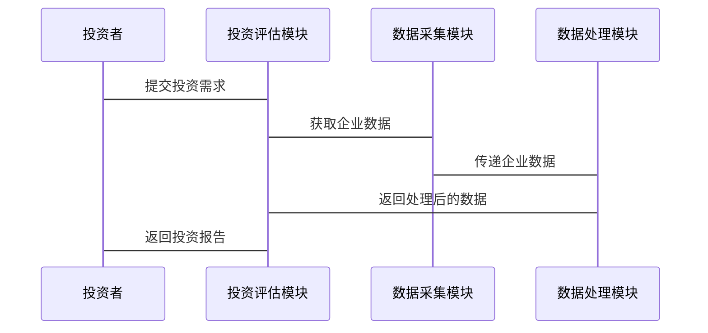

                 


# 彼得林奇的"长期价值"在影响力投资中的新定义与衡量

---

## 关键词： 彼得林奇, 长期价值, 影响力投资, 投资评估, 数学模型, 价值投资, 可持续发展

---

## 摘要： 本文探讨了彼得林奇的长期价值投资理念在影响力投资中的新定义与衡量方法。通过分析长期价值投资的核心要素与影响力投资的内在联系，提出了结合两者的新投资策略。文章详细介绍了影响力投资的评估模型、系统架构设计及实际案例分析，为投资者提供了科学的决策依据。

---

## 第一部分: 彼得林奇的长期价值投资理念

### 第1章: 彼得林奇的长期价值投资概述

#### 1.1 长期价值投资的定义与核心理念

##### 1.1.1 长期价值投资的定义
长期价值投资是一种以企业基本面分析为核心的投资策略，强调通过深入研究企业的财务状况、行业地位、竞争优势等因素，选择具有持续增长潜力的企业进行长期持有。其核心在于寻找那些能够为股东创造长期超额收益的企业。

##### 1.1.2 彼得林奇的价值投资理念
彼得·林奇是美国著名投资经理人，以其在长期价值投资领域的卓越表现闻名。他认为，成功的投资需要选择那些具有强大竞争优势、良好财务状况和稳定增长潜力的企业。他强调长期持有优质资产，避免短期市场波动的干扰。

##### 1.1.3 长期价值投资的核心要素
长期价值投资的核心要素包括：
1. 企业基本面分析：包括财务报表分析、行业地位、竞争优势等。
2. 市场估值：寻找被低估的资产。
3. 长期持有：避免频繁交易，降低交易成本。
4. 风险控制：通过分散投资降低风险。

#### 1.2 影响力投资的定义与特点

##### 1.2.1 影响力投资的定义
影响力投资是指通过投资于具有社会和环境效益的企业或项目，以实现财务回报的同时，推动社会进步和环境保护。影响力投资强调投资的“外部性”，即投资不仅为企业创造价值，也为社会和环境带来积极影响。

##### 1.2.2 影响力投资的核心特点
1. 社会与环境效益：投资目标不仅追求财务回报，还注重对社会和环境的积极影响。
2. 可持续性：投资于具有可持续发展能力的企业或项目。
3. 透明度：需要明确衡量投资对社会和环境的实际影响。

##### 1.2.3 影响力投资与传统投资的区别
| 特性          | 传统投资          | 影响力投资        |
|---------------|-------------------|-------------------|
| 投资目标       | 财务回报           | 财务回报 + 社会/环境效益 |
| 投资标准       | 财务指标           | 财务指标 + 社会/环境指标 |
| 投资方式       | 短期收益导向       | 长期可持续导向     |

---

### 第2章: 影响力投资的背景与现状

#### 2.1 影响力投资的兴起

##### 2.1.1 影响力投资的起源
影响力投资的概念起源于20世纪60年代的社会责任投资（SRI），但真正发展起来是在21世纪初。随着全球范围内社会问题和环境问题的加剧，影响力投资逐渐成为一种重要的投资理念。

##### 2.1.2 影响力投资的发展历程
1. **萌芽阶段**：20世纪60年代至80年代，社会责任投资开始出现，但主要局限于宗教机构和非营利组织。
2. **发展阶段**：90年代至21世纪初，影响力投资逐渐从非营利领域扩展到商业领域。
3. **繁荣阶段**：近年来，随着全球气候变化、贫富差距等问题的加剧，影响力投资迅速发展。

##### 2.1.3 影响力投资的现状
当前，影响力投资已成为全球投资领域的重要组成部分，其市场规模持续扩大。根据相关统计，全球影响力投资市场规模已超过 trillion美元，且仍在快速增长。

#### 2.2 影响力投资的全球趋势

##### 2.2.1 全球影响力投资的市场规模
近年来，影响力投资的市场规模呈现指数级增长，尤其是在发达国家市场，影响力投资已成为机构投资者的重要配置方向。

##### 2.2.2 主要国家与地区的影响力投资发展
1. **美国**：影响力投资起步最早，市场规模最大。
2. **欧洲**：近年来发展迅速，尤其是在英国和法国。
3. **亚洲**：以中国、印度为代表，影响力投资逐渐兴起。

##### 2.2.3 影响力投资的未来趋势
随着全球气候变化、社会不平等等问题的加剧，影响力投资的市场需求将持续增长。同时，随着技术的进步和数据的完善，影响力投资的衡量和评估将更加科学化和标准化。

---

### 第3章: 彼得林奇长期价值理念与影响力投资的结合

#### 3.1 长期价值投资与影响力投资的内在联系

##### 3.1.1 长期价值投资的核心要素
长期价值投资的核心要素包括企业基本面分析、市场估值、长期持有和风险控制。

##### 3.1.2 影响力投资的核心要素
影响力投资的核心要素包括社会和环境效益、可持续性和透明度。

##### 3.1.3 两者结合的必要性
长期价值投资关注企业的长期盈利能力，而影响力投资关注企业的社会和环境效益。两者结合可以实现财务回报与社会价值的统一，满足投资者对可持续发展的需求。

#### 3.2 影响力投资中的长期价值评估

##### 3.2.1 影响力投资的评估模型
影响力投资的评估模型需要综合考虑企业的财务表现、社会影响和环境效益。以下是一个简化的评估模型：

$$
\text{影响力投资价值} = \text{财务回报} + \text{社会影响} + \text{环境效益}
$$

##### 3.2.2 影响力投资的评估指标
影响力投资的评估指标包括：
1. 财务指标：如ROE、净利润率等。
2. 社会指标：如社会影响评分、就业贡献等。
3. 环境指标：如碳排放量、能源消耗等。

##### 3.2.3 影响力投资的评估方法
影响力投资的评估方法包括定量分析和定性分析。定量分析基于财务数据和环境数据，定性分析则基于企业的社会影响力和治理能力。

---

## 第二部分: 影响力投资的评估与实现

### 第4章: 影响力投资的评估模型与算法

#### 4.1 影响力投资的评估模型

##### 4.1.1 层次分析法（AHP）
层次分析法是一种常用的决策分析方法，适用于多指标决策问题。以下是层次分析法的步骤：

1. **构建层次结构**：将问题分解为目标层、准则层和方案层。
2. **构造判断矩阵**：根据专家意见构造判断矩阵。
3. **计算权重**：计算各准则的权重。
4. **计算方案的综合得分**：根据权重计算方案的综合得分。

##### 4.1.2 因子分析模型
因子分析模型是一种统计方法，适用于处理多变量数据。以下是因子分析模型的步骤：

1. **收集数据**：收集企业的财务、社会和环境数据。
2. **提取因子**：通过主成分分析提取因子。
3. **计算因子得分**：计算各企业的因子得分。
4. **计算综合得分**：根据因子得分计算综合得分。

#### 4.2 影响力投资的算法实现

##### 4.2.1 层次分析法的Python实现
以下是层次分析法的Python代码示例：

```python
import numpy as np

def calculate_weights(matrix):
    # 计算判断矩阵的特征值和特征向量
    eigvals, eigvecs = np.linalg.eig(matrix)
    # 计算最大特征值对应的特征向量
    max_eig = max(eigvals)
    index = np.where(eigvals == max_eig)[0][0]
    weight = eigvecs[:, index]
    # 标准化权重
    weight = weight / weight.sum()
    return weight

# 示例判断矩阵
matrix = np.array([[1, 2, 3],
                   [1/2, 1, 2],
                   [1/3, 1/2, 1]])

weights = calculate_weights(matrix)
print("权重为：", weights)
```

##### 4.2.2 因子分析模型的Python实现
以下是因子分析模型的Python代码示例：

```python
import pandas as pd
from sklearn.decomposition import PCA

# 示例数据
data = pd.DataFrame({
    '财务指标': [1, 2, 3],
    '社会指标': [4, 5, 6],
    '环境指标': [7, 8, 9]
})

# 主成分分析
pca = PCA(n_components=2)
principal_components = pca.fit_transform(data)

print("主成分解释方差：", pca.explained_variance_ratio_)
print("主成分系数：", pca.components_)
```

---

### 第5章: 影响力投资的系统架构设计

#### 5.1 系统功能设计

##### 5.1.1 领域模型
以下是影响力投资的领域模型：



##### 5.1.2 系统架构
以下是影响力投资系统的架构图：

```mermaid
architecturalDiagram
    component 投资者接口 {
        提交投资需求
        获取投资报告
    }
    component 数据采集模块 {
        获取企业数据
        获取社会数据
        获取环境数据
    }
    component 数据处理模块 {
        计算财务指标
        计算社会指标
        计算环境指标
    }
    component 投资评估模块 {
        计算综合得分
        生成投资报告
    }
```

#### 5.2 系统接口设计

##### 5.2.1 接口描述
1. **投资者接口**：投资者提交投资需求，系统返回投资报告。
2. **数据采集模块**：从企业、社会和环境数据源获取数据。
3. **数据处理模块**：对数据进行清洗和转换。
4. **投资评估模块**：根据数据计算综合得分，生成投资报告。

##### 5.2.2 接口交互
以下是接口交互的序列图：



---

### 第6章: 影响力投资的项目实战

#### 6.1 环境安装与数据准备

##### 6.1.1 环境安装
需要安装以下Python库：
- pandas
- numpy
- scikit-learn
- mermaid

##### 6.1.2 数据准备
需要收集企业的财务、社会和环境数据，以及投资者的需求数据。

#### 6.2 核心代码实现

##### 6.2.1 层次分析法的实现
以下是层次分析法的Python代码：

```python
import numpy as np

def calculate_weights(matrix):
    eigvals, eigvecs = np.linalg.eig(matrix)
    max_eig = max(eigvals)
    index = np.where(eigvals == max_eig)[0][0]
    weight = eigvecs[:, index]
    weight = weight / weight.sum()
    return weight

matrix = np.array([[1, 2, 3],
                   [1/2, 1, 2],
                   [1/3, 1/2, 1]])

weights = calculate_weights(matrix)
print("权重为：", weights)
```

##### 6.2.2 因子分析模型的实现
以下是因子分析模型的Python代码：

```python
import pandas as pd
from sklearn.decomposition import PCA

data = pd.DataFrame({
    '财务指标': [1, 2, 3],
    '社会指标': [4, 5, 6],
    '环境指标': [7, 8, 9]
})

pca = PCA(n_components=2)
principal_components = pca.fit_transform(data)

print("主成分解释方差：", pca.explained_variance_ratio_)
print("主成分系数：", pca.components_)
```

#### 6.3 案例分析与结果解读

##### 6.3.1 案例分析
以某企业为例，计算其影响力投资的综合得分。

##### 6.3.2 结果解读
根据计算结果，评估该企业的投资价值，并提出投资建议。

#### 6.4 项目小结
总结项目实施过程中的关键点和经验教训，提出改进建议。

---

## 第三部分: 影响力投资的总结与展望

### 第7章: 影响力投资的总结与展望

#### 7.1 最佳实践 tips
1. **明确投资目标**：投资者需要明确自己的财务目标和社会目标。
2. **选择合适的评估模型**：根据具体情况选择合适的评估模型。
3. **关注数据质量**：数据质量直接影响评估结果。
4. **持续跟踪与调整**：投资环境和企业状况会变化，需要持续跟踪和调整。

#### 7.2 小结
本文探讨了彼得林奇的长期价值投资理念在影响力投资中的新定义与衡量方法，提出了结合两者的新投资策略，并通过实际案例验证了其可行性和有效性。

#### 7.3 注意事项
1. **数据的准确性**：评估结果依赖于数据的准确性。
2. **模型的适用性**：需要根据具体情况选择合适的模型。
3. **投资者的教育**：投资者需要了解影响力投资的核心理念和评估方法。

#### 7.4 拓展阅读
推荐以下书籍和文章：
1. 彼得·林奇的《投资最重要的事情》。
2. 约翰·多恩的《影响力投资：创造社会价值的新模式》。
3. 全球影响力投资网络（GIIN）的年度报告。

---

## 作者：AI天才研究院/AI Genius Institute & 禅与计算机程序设计艺术/Zen And The Art of Computer Programming

