                 


# 第一部分: 价值投资的起源与核心理念

# 第1章: 价值投资的起源与核心理念

## 1.1 价值投资的起源
### 1.1.1 投资学的起源与发展
投资学作为一门学科，起源于对金融市场的研究。从古典经济学到现代经济学，投资学经历了从简单到复杂的演变。早期的投资理论主要关注市场的波动性和价格的短期变化，但随着市场的复杂化，投资者开始寻求更系统化的方法来评估资产的价值。本节将从投资学的基本概念入手，介绍其发展历程，并为后续的讨论奠定基础。

**关键词：**
- 投资学
- 资产评估
- 市场波动

**公式：**
$$ \text{资产价值} = \text{未来现金流的现值} $$

**图表：**
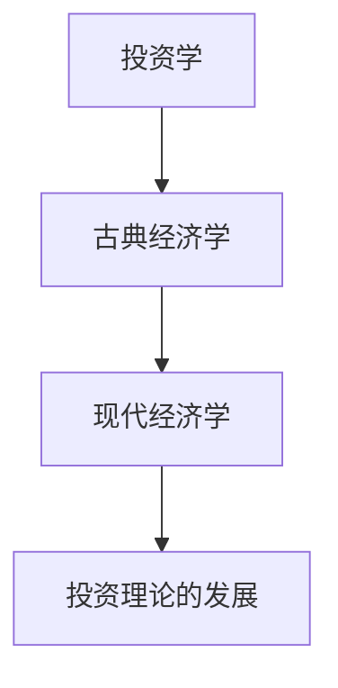

### 1.1.2 格雷厄姆与价值投资的诞生
本杰明·格雷厄姆（Benjamin Graham）是20世纪初著名的投资家和学者，他被誉为“价值投资之父”。格雷厄姆的投资理念源于他对市场波动性和投资者心理的研究。他在1934年出版的《证券分析》一书中首次系统地提出了价值投资的概念，强调从基本面分析的角度评估资产的真实价值，而不是被市场情绪左右。本节将详细介绍格雷厄姆的生平及其对价值投资的贡献。

**关键词：**
- 本杰明·格雷厄姆
- 价值投资
- 资产评估

**公式：**
$$ \text{内在价值} = \sum_{t=1}^{n} \frac{\text{现金流}}{(1 + r)^t} $$

**图表：**
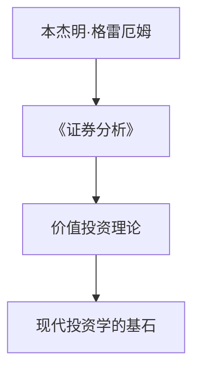

### 1.1.3 价值投资的核心概念与特征
价值投资的核心理念是寻找市场价格低于其内在价值的资产。这种投资策略强调长期性、安全性和防御性，与短期交易和投机行为形成鲜明对比。本节将详细阐述价值投资的核心概念，包括安全边际、内在价值和防御性投资策略。

**关键词：**
- 内在价值
- 安全边际
- 防御性投资

**公式：**
$$ \text{安全边际} = \text{内在价值} - \text{市场价格} $$

**图表：**
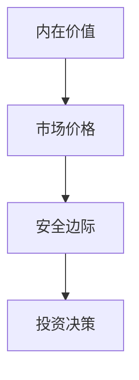

## 1.2 价值投资与其他投资理念的区别
### 1.2.1 短期交易与长期投资的对比
短期交易强调市场波动和价格变化，而价值投资注重资产的长期价值。本节将对比这两种投资策略的优缺点，分析它们在不同市场环境下的表现。

**关键词：**
- 短期交易
- 长期投资
- 市场波动

**公式：**
$$ \text{短期收益} = \text{价格变化} $$

**图表：**
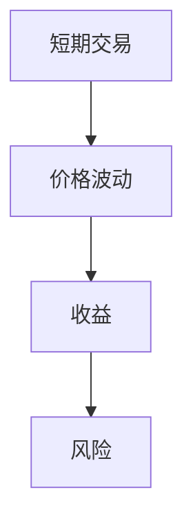

### 1.2.2 技术分析与基本面分析的差异
技术分析主要依赖价格和成交量数据，而基本面分析关注企业的财务状况和行业前景。价值投资属于基本面分析的一种，强调内在价值的评估。

**关键词：**
- 技术分析
- 基本面分析
- 内在价值

**公式：**
$$ \text{技术指标} = \text{价格和成交量数据} $$

**图表：**
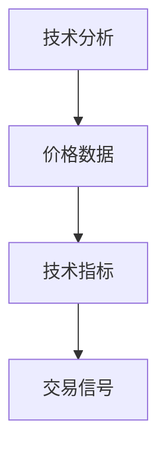

### 1.2.3 价值投资与成长投资的分界
价值投资寻找被低估的资产，而成长投资关注高增长的公司。两者的区别在于对风险和收益的权衡。

**关键词：**
- 价值投资
- 成长投资
- 风险收益

**公式：**
$$ \text{价值投资} = \text{低估资产} $$
$$ \text{成长投资} = \text{高增长公司} $$

**图表：**
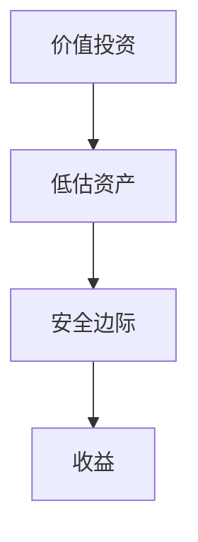

## 1.3 价值投资的基本原则
### 1.3.1 投资的第一性原理
价值投资的第一性原理是从资产的内在价值出发，忽略短期市场波动。本节将详细阐述这一原则，并通过实例说明其应用。

**关键词：**
- 第一性原理
- 内在价值
- 投资决策

**公式：**
$$ \text{内在价值} = \text{未来现金流的现值} $$

**图表：**
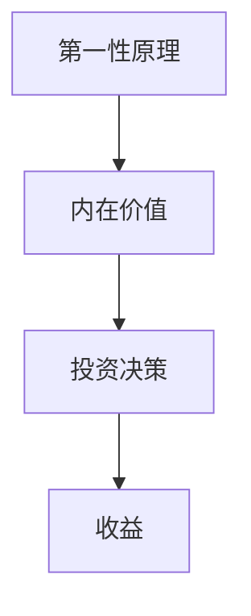

### 1.3.2 安全边际的概念与应用
安全边际是价值投资的核心概念之一，指市场价格与内在价值之间的差距。本节将详细解释安全边际的计算方法及其在投资决策中的应用。

**关键词：**
- 安全边际
- 内在价值
- 市场价格

**公式：**
$$ \text{安全边际} = \text{内在价值} - \text{市场价格} $$

**图表：**


### 1.3.3 风险控制的核心地位
价值投资强调风险控制，通过分散投资和长期持有来降低风险。本节将讨论风险控制的核心原则及其在投资组合中的应用。

**关键词：**
- 风险控制
- 分散投资
- 长期持有

**公式：**
$$ \text{风险} = \text{投资组合的波动性} $$

**图表：**
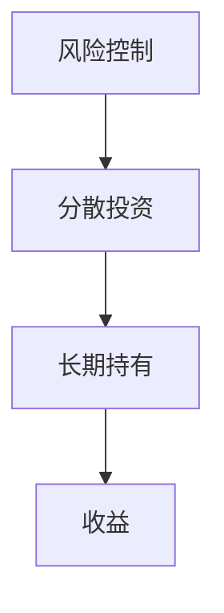

## 1.4 本章小结
本章从价值投资的起源和发展入手，详细介绍了其核心理念和基本原则，包括安全边际、内在价值和风险控制等关键概念。通过对比其他投资理念，进一步明确了价值投资的独特性和优势。接下来的章节将深入探讨格雷厄姆的投资哲学及其在现代投资中的应用。

---

# 第二部分: 格雷厄姆的投资哲学

# 第2章: 格雷厄姆的投资哲学

## 2.1 格雷厄姆的生平简介
### 2.1.1 格雷厄姆的早年经历
本杰明·格雷厄姆出生于1897年，早年在纽约证券交易所工作，积累了丰富的市场经验。他在职业生涯中撰写了多部经典著作，包括《证券分析》和《聪明的投资者》。

**关键词：**
- 本杰明·格雷厄姆
- 生平简介
- 经验与成就

**图表：**
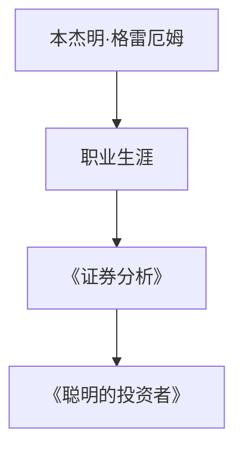

### 2.1.2 职业生涯与学术贡献
格雷厄姆的职业生涯不仅限于投资实务，他还致力于学术研究，培养了众多投资领域的杰出人才。他的教学和著述为现代投资学奠定了基础。

**关键词：**
- 职业生涯
- 学术贡献
- 投资实务

### 2.1.3 对投资界的深远影响
格雷厄姆的价值投资理论对后世影响深远，包括沃伦·巴菲特等著名投资者都深受其影响。本节将探讨格雷厄姆理论的传承与发展。

**关键词：**
- 投资理论
- 传承与发展
- 巴菲特

**图表：**
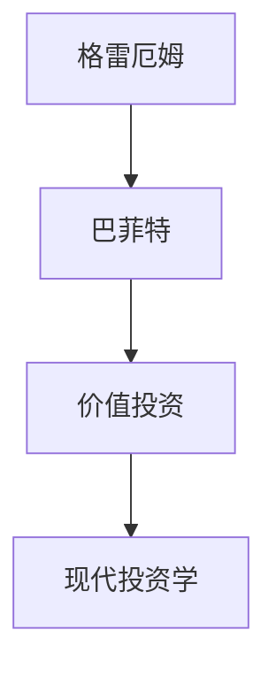

## 2.2 格雷厄姆的投资策略
### 2.2.1 质价分析法的核心思想
格雷厄姆提出的质价分析法（Quality over Price）强调从资产的质量出发，而不是单纯关注价格。本节将详细阐述这种方法的核心思想及其在实际中的应用。

**关键词：**
- 质价分析法
- 资产质量
- 投资策略

**公式：**
$$ \text{质价比} = \frac{\text{内在价值}}{\text{市场价格}} $$

**图表：**
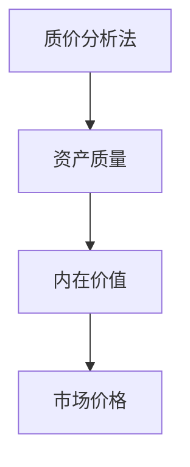

### 2.2.2 安全边际的数学模型
安全边际是格雷厄姆理论中的关键概念，其数学模型为：
$$ \text{安全边际} = \text{内在价值} - \text{市场价格} $$

**关键词：**
- 安全边际
- 数学模型
- 投资决策

**公式：**
$$ \text{安全边际} = \text{内在价值} - \text{市场价格} $$

**图表：**


### 2.2.3 防御性投资的策略框架
格雷厄姆倡导防御性投资策略，强调通过分散投资和长期持有来降低风险。本节将详细讨论这一策略的框架及其优势。

**关键词：**
- 防御性投资
- 分散投资
- 长期持有

**公式：**
$$ \text{分散投资} = \sum_{i=1}^{n} \text{资产}_i $$

**图表：**
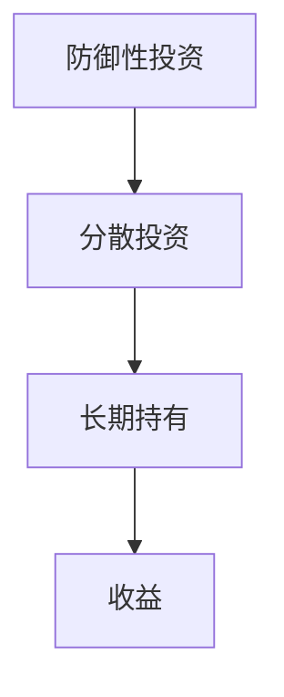

## 2.3 格雷厄姆的价值评估体系
### 2.3.1 内在价值的计算方法
内在价值是资产在未来现金流的现值，其计算公式为：
$$ \text{内在价值} = \sum_{t=1}^{n} \frac{\text{现金流}_t}{(1 + r)^t} $$

**关键词：**
- 内在价值
- 现金流
- 现值计算

**公式：**
$$ \text{内在价值} = \sum_{t=1}^{n} \frac{\text{现金流}_t}{(1 + r)^t} $$

**图表：**
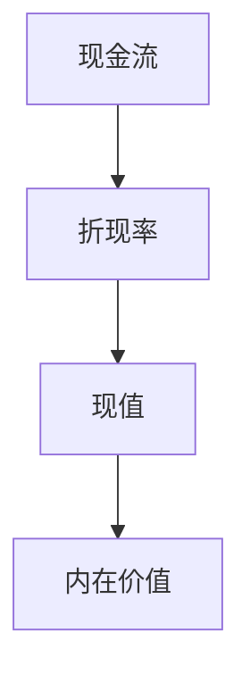

### 2.3.2 股票估值的公式与模型
股票估值是内在价值计算的重要部分，其公式与模型包括现金流折现法、市盈率法等。

**关键词：**
- 股票估值
- 现金流折现法
- 市盈率法

**公式：**
$$ \text{股票估值} = \text{内在价值} = \sum_{t=1}^{n} \frac{\text{现金流}_t}{(1 + r)^t} $$

**图表：**
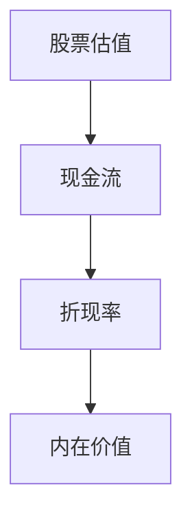

### 2.3.3 市场价格与内在价值的动态关系
市场价格与内在价值之间存在动态关系，市场波动会影响二者的差异。安全边际即为这种差异的度量。

**关键词：**
- 市场价格
- 内在价值
- 动态关系

**公式：**
$$ \text{安全边际} = \text{内在价值} - \text{市场价格} $$

**图表：**


## 2.4 本章小结
本章深入探讨了格雷厄姆的投资哲学，包括其生平、投资策略和价值评估体系。通过质价分析法和安全边际模型，进一步明确了价值投资的核心思想。接下来的章节将详细分析价值投资的分析方法及其在现代投资中的应用。

---

# 第三部分: 价值投资的分析方法

# 第3章: 价值投资的分析方法

## 3.1 基本面分析的核心要素
### 3.1.1 财务报表分析的关键指标
财务报表分析是基本面分析的重要部分，包括利润表、资产负债表和现金流量表。关键指标包括净利润、营业收入、资产负债率等。

**关键词：**
- 财务报表
- 财务指标
- 基本面分析

**公式：**
$$ \text{净利润率} = \frac{\text{净利润}}{\text{营业收入}} $$

**图表：**
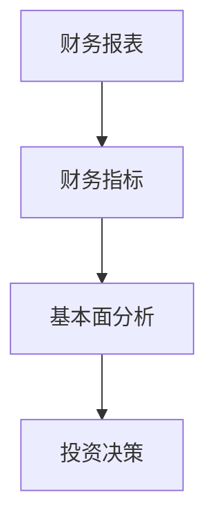

### 3.1.2 行业分析与竞争优势评估
行业分析包括行业增长、竞争格局等，竞争优势评估包括成本优势、技术优势等。

**关键词：**
- 行业分析
- 竞争优势
- 市场地位

**图表：**
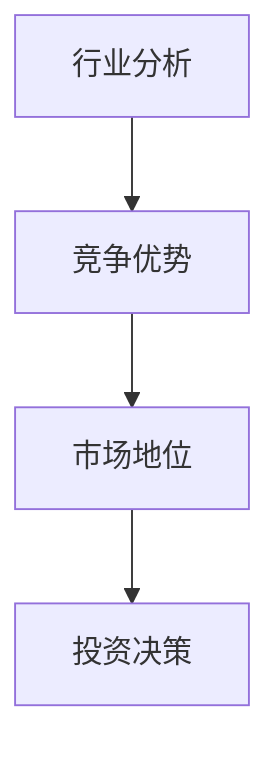

### 3.1.3 管理层能力的判断标准
管理层能力包括决策能力、执行能力和道德水平等。

**关键词：**
- 管理层能力
- 决策能力
- 执行能力

**图表：**
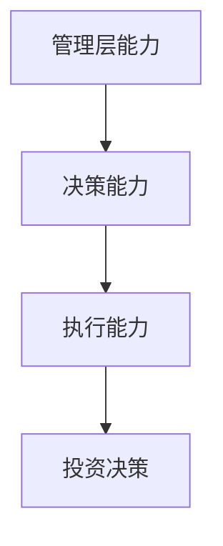

## 3.2 内在价值评估的数学模型
### 3.2.1 现金流折现法的公式推导
现金流折现法的公式为：
$$ V = \sum_{t=1}^{n} \frac{CF_t}{(1 + r)^t} $$

**关键词：**
- 现金流折现法
- 内在价值
- 数学模型

**公式：**
$$ V = \sum_{t=1}^{n} \frac{CF_t}{(1 + r)^t} $$

**图表：**
```mermaid
graph TD
    A[现金流] --> B[折现率]
    B --> C[现值]
    C --> D[内在价值]
```

### 3.2.2 市盈率与市净率的对比分析
市盈率（P/E）和市净率（P/B）是常用的估值指标，本节将对比分析它们的优缺点。

**关键词：**
- 市盈率
- 市净率
- 估值指标

**公式：**
$$ \text{市盈率} = \frac{\text{股价}}{\text{每股收益}} $$
$$ \text{市净率} = \frac{\text{股价}}{\text{每股净资产}} $$

**图表：**
```mermaid
graph TD
    A[市盈率] --> B[市净率]
    B --> C[对比分析]
    C --> D[投资决策]
```

### 3.2.3 股息率与投资回报的关联性
股息率是衡量投资回报的重要指标，其与内在价值的关系需要深入分析。

**关键词：**
- 股息率
- 投资回报
- 内在价值

**公式：**
$$ \text{股息率} = \frac{\text{股息}}{\text{股价}} $$

**图表：**
```mermaid
graph TD
    A[股息率] --> B[投资回报]
    B --> C[内在价值]
    C --> D[投资决策]
```

## 3.3 安全边际的计算与应用
### 3.3.1 安全边际的定义与公式
安全边际的定义为：
$$ \text{安全边际} = \text{内在价值} - \text{市场价格} $$

**关键词：**
- 安全边际
- 内在价值
- 市场价格

**公式：**
$$ \text{安全边际} = \text{内在价值} - \text{市场价格} $$

**图表：**
```mermaid
graph TD
    A[内在价值] --> B[市场价格]
    B --> C[安全边际]
    C --> D[投资决策]
```

### 3.3.2 安全边际在投资决策中的作用
安全边际是投资决策的重要依据，其大小决定了投资的风险和收益。

**关键词：**
- 安全边际
- 投资决策
- 风险收益

**图表：**
```mermaid
graph TD
    A[安全边际] --> B[投资决策]
    B --> C[风险]
    C --> D[收益]
```

### 3.3.3 安全边际的动态调整方法
随着市场环境的变化，安全边际需要动态调整。本节将介绍几种常见的调整方法及其优缺点。

**关键词：**
- 动态调整
- 安全边际
- 市场环境

**图表：**
```mermaid
graph TD
    A[市场环境] --> B[安全边际]
    B --> C[动态调整]
    C --> D[投资决策]
```

## 3.4 本章小结
本章详细探讨了价值投资的分析方法，包括基本面分析的核心要素、内在价值评估的数学模型以及安全边际的计算与应用。通过这些方法，投资者可以更准确地评估资产的内在价值，从而做出明智的投资决策。

---

# 第四部分: 价值投资的实践策略

# 第4章: 价值投资的实践策略

## 4.1 投资心态与心理控制
### 4.1.1 投资心态的核心要素
投资心态包括耐心、纪律性和情绪控制等。

**关键词：**
- 投资心态
- 心理控制
- 长期投资

**图表：**
```mermaid
graph TD
    A[投资心态] --> B[耐心]
    B --> C[纪律性]
    C --> D[情绪控制]
```

### 4.1.2 避免情绪化决策的方法
情绪化决策是投资中的常见问题，本节将介绍几种避免情绪化决策的方法，包括制定投资计划、定期复盘等。

**关键词：**
- 情绪化决策
- 投资计划
- 定期复盘

**图表：**
```mermaid
graph TD
    A[情绪化决策] --> B[制定计划]
    B --> C[定期复盘]
    C --> D[避免情绪化]
```

### 4.1.3 纪律性在投资中的重要性
纪律性是投资成功的关键，包括严格执行投资计划和避免过度交易。

**关键词：**
- 纪律性
- 投资计划
- 严格执行

**图表：**
```mermaid
graph TD
    A[纪律性] --> B[投资计划]
    B --> C[严格执行]
    C --> D[投资成功]
```

## 4.2 投资组合管理与风险管理
### 4.2.1 投资组合管理的核心原则
投资组合管理包括资产配置、风险分散和定期调整等。

**关键词：**
- 投资组合管理
- 资产配置
- 风险分散

**公式：**
$$ \text{投资组合} = \sum_{i=1}^{n} \text{资产}_i $$

**图表：**
```mermaid
graph TD
    A[投资组合管理] --> B[资产配置]
    B --> C[风险分散]
    C --> D[定期调整]
```

### 4.2.2 风险管理的具体方法
风险管理包括设定止损点、分散投资和定期评估等。

**关键词：**
- 风险管理
- 止损点
- 分散投资

**公式：**
$$ \text{止损点} = \text{投资成本} \times (1 - \text{止损比例}) $$`

**图表：**
```mermaid
graph TD
    A[风险管理] --> B[设定止损点]
    B --> C[分散投资]
    C --> D[定期评估]
```

### 4.2.3 投资组合的动态调整策略
随着市场环境的变化，投资组合需要动态调整，以保持其安全性和收益性。

**关键词：**
- 动态调整
- 投资组合
- 市场环境

**图表：**
```mermaid
graph TD
    A[市场环境] --> B[投资组合]
    B --> C[动态调整]
    C --> D[收益]
```

## 4.3 价值投资的长期实践
### 4.3.1 长期投资的核心理念
长期投资强调持有优质资产，避免短期波动的影响。

**关键词：**
- 长期投资
- 优质资产
- 短期波动

**图表：**
```mermaid
graph TD
    A[长期投资] --> B[优质资产]
    B --> C[短期波动]
    C --> D[长期收益]
```

### 4.3.2 如何选择优质资产
选择优质资产需要从基本面、行业地位和管理层能力等方面进行综合评估。

**关键词：**
- 优质资产
- 基本面分析
- 行业地位

**图表：**
```mermaid
graph TD
    A[优质资产] --> B[基本面分析]
    B --> C[行业地位]
    C --> D[管理层能力]
```

### 4.3.3 长期投资中的风险控制
长期投资中的风险控制包括分散投资和定期评估等。

**关键词：**
- 风险控制
- 分散投资
- 定期评估

**图表：**
```mermaid
graph TD
    A[风险控制] --> B[分散投资]
    B --> C[定期评估]
    C --> D[长期收益]
```

## 4.4 本章小结
本章从投资心态和心理控制出发，探讨了价值投资的实践策略，包括投资组合管理、风险管理以及长期投资的核心理念。通过这些策略，投资者可以更好地应对市场波动，实现长期稳定的收益。

---

# 第五部分: 价值投资的现代发展

# 第5章: 价值投资的现代发展

## 5.1 现代价值投资的演变
### 5.1.1 现代价值投资的核心变化
现代价值投资在格雷厄姆的基础上，结合新的市场环境和技术手段，发展出新的策略和方法。

**关键词：**
- 现代价值投资
- 核心变化
- 新策略和方法

**图表：**
```mermaid
graph TD
    A[现代价值投资] --> B[核心变化]
    B --> C[新策略]
    C --> D[新方法]
```

### 5.1.2 从格雷厄姆到巴菲特
沃伦·巴菲特是格雷厄姆的得意门生，他将价值投资的理念发扬光大，发展出自己的投资体系。

**关键词：**
- 沃伦·巴菲特
- 价值投资
- 投资体系

**图表：**
```mermaid
graph TD
    A[格雷厄姆] --> B[巴菲特]
    B --> C[价值投资]
    C --> D[现代发展]
```

## 5.2 现代价值投资的应用
### 5.2.1 现代市场环境下的价值投资
现代市场环境更加复杂，投资者需要结合新的工具和技术进行分析。

**关键词：**
- 现代市场环境
- 价值投资
- 新工具和技术

**图表：**
```mermaid
graph TD
    A[现代市场环境] --> B[价值投资]
    B --> C[新工具]
    C --> D[新技术]
```

### 5.2.2 技术分析与价值投资的结合
技术分析与价值投资的结合可以提供更全面的投资视角。

**关键词：**
- 技术分析
- 价值投资
- 结合

**图表：**
```mermaid
graph TD
    A[技术分析] --> B[价值投资]
    B --> C[结合]
    C --> D[全面视角]
```

## 5.3 价值投资的未来展望
### 5.3.1 数字化与智能化对价值投资的影响
随着数字化和智能化的发展，价值投资将更加依赖数据分析和人工智能技术。

**关键词：**
- 数字化
- 智能化
- 价值投资

**图表：**
```mermaid
graph TD
    A[数字化] --> B[智能化]
    B --> C[价值投资]
    C --> D[未来展望]
```

### 5.3.2 未来价值投资的趋势
未来价值投资将更加注重全球化和多元化，投资者需要适应新的市场环境和挑战。

**关键词：**
- 全球化
- 多元化
- 未来趋势

**图表：**
```mermaid
graph TD
    A[全球化] --> B[多元化]
    B --> C[未来趋势]
    C --> D[价值投资]
```

## 5.4 本章小结
本章探讨了价值投资的现代发展，包括其演变、应用和未来展望。通过结合现代技术和市场环境，价值投资将继续在投资领域中发挥重要作用。

---

# 第六部分: 价值投资的系统架构

# 第6章: 价值投资的系统架构

## 6.1 系统架构的核心要素
### 6.1.1 系统架构的定义
系统架构是价值投资的框架结构，包括数据获取、分析处理和决策执行等模块。

**关键词：**
- 系统架构
- 核心要素
- 模块划分

**图表：**
```mermaid
graph TD
    A[系统架构] --> B[数据获取]
    B --> C[分析处理]
    C --> D[决策执行]
```

### 6.1.2 核心模块的功能描述
核心模块包括数据获取、分析处理和决策执行，每个模块都有其独特的功能和作用。

**关键词：**
- 核心模块
- 功能描述
- 模块划分

**图表：**
```mermaid
graph TD
    A[数据获取] --> B[分析处理]
    B --> C[决策执行]
    C --> D[系统架构]
```

## 6.2 数据获取与处理
### 6.2.1 数据获取的渠道
数据获取的渠道包括市场数据、财务报表和行业报告等。

**关键词：**
- 数据获取
- 渠道
- 数据来源

**图表：**
```mermaid
graph TD
    A[市场数据] --> B[财务报表]
    B --> C[行业报告]
    C --> D[数据处理]
```

### 6.2.2 数据预处理的方法
数据预处理包括清洗、转换和标准化等步骤。

**关键词：**
- 数据预处理
- 清洗
- 转换

**图表：**
```mermaid
graph TD
    A[数据清洗] --> B[数据转换]
    B --> C[数据标准化]
    C --> D[数据处理]
```

## 6.3 分析处理与决策
### 6.3.1 分析模型的选择
分析模型包括现金流折现法、市盈率法和市净率法等。

**关键词：**
- 分析模型
- 选择
- 应用

**图表：**
```mermaid
graph TD
    A[现金流折现法] --> B[市盈率法]
    B --> C[市净率法]
    C --> D[分析模型]
```

### 6.3.2 决策规则的制定
决策规则包括安全边际的设定、投资组合的调整等。

**关键词：**
- 决策规则
- 制定
- 应用

**图表：**
```mermaid
graph TD
    A[安全边际] --> B[投资组合]
    B --> C[调整规则]
    C --> D[决策规则]
```

## 6.4 系统架构的实现
### 6.4.1 系统架构的实现步骤
系统架构的实现步骤包括需求分析、模块设计、代码实现和测试优化。

**关键词：**
- 系统架构
- 实现步骤
- 模块设计

**图表：**
```mermaid
graph TD
    A[需求分析] --> B[模块设计]
    B --> C[代码实现]
    C --> D[测试优化]
```

### 6.4.2 系统架构的优化
系统架构的优化包括性能优化、功能扩展和用户体验提升等。

**关键词：**
- 系统架构
- 优化
- 性能提升

**图表：**
```mermaid
graph TD
    A[性能优化] --> B[功能扩展]
    B --> C[用户体验]
    C --> D[系统架构]
```

## 6.5 本章小结
本章从系统架构的角度，详细探讨了价值投资的实现过程，包括数据获取、分析处理和决策执行等模块。通过系统的实现和优化，投资者可以更高效地进行价值投资。

---

# 第七部分: 价值投资的未来展望

# 第7章: 价值投资的未来展望

## 7.1 价值投资的全球化趋势
### 7.1.1 全球化对价值投资的影响
全球化使得价值投资可以扩展到全球市场，投资者可以寻找更多的投资机会。

**关键词：**
- 全球化
- 价值投资
- 投资机会

**图表：**
```mermaid
graph TD
    A[全球化] --> B[价值投资]
    B --> C[投资机会]
    C --> D[全球市场]
```

### 7.1.2 价值投资在新兴市场的应用
新兴市场具有较大的增长潜力，价值投资在这些市场中具有广阔的应用前景。

**关键词：**
- 新兴市场
- 价值投资
- 应用前景

**图表：**
```mermaid
graph TD
    A[新兴市场] --> B[价值投资]
    B --> C[应用前景]
    C --> D[增长潜力]
```

## 7.2 数字化与智能化的融合
### 7.2.1 数字化对价值投资的影响
数字化技术如大数据和人工智能正在改变价值投资的方式，提供更高效和精准的分析工具。

**关键词：**
- 数字化
- 价值投资
- 大数据

**图表：**
```mermaid
graph TD
    A[数字化] --> B[大数据]
    B --> C[人工智能]
    C --> D[价值投资]
```

### 7.2.2 智能化在价值投资中的应用
智能化技术如机器学习和自然语言处理正在被应用于价值投资的分析和决策过程中。

**关键词：**
- 智能化
- 机器学习
- 自然语言处理

**图表：**
```mermaid
graph TD
    A[机器学习] --> B[自然语言处理]
    B --> C[智能化]
    C --> D[价值投资]
```

## 7.3 价值投资的未来挑战
### 7.3.1 价值投资的挑战
未来价值投资将面临更多的挑战，包括市场波动、技术变革和全球经济环境的变化。

**关键词：**
- 价值投资
- 挑战
- 市场波动

**图表：**
```mermaid
graph TD
    A[市场波动] --> B[技术变革]
    B --> C[全球经济]
    C --> D[价值投资]
```

### 7.3.2 应对挑战的策略
应对挑战的策略包括持续学习、技术创新和风险管理等。

**关键词：**
- 应对挑战
- 策略
- 持续学习

**图表：**
```mermaid
graph TD
    A[持续学习] --> B[技术创新]
    B --> C[风险管理]
    C --> D[应对挑战]
```

## 7.4 本章小结
本章探讨了价值投资的未来展望，包括全球化趋势、数字化与智能化的融合以及未来挑战。通过适应新的市场环境和技术变革，价值投资将继续在投资领域中发挥重要作用。

---

# 结语

## 作者：AI天才研究院/AI Genius Institute & 禅与计算机程序设计艺术 /Zen And The Art of Computer Programming

价值投资作为一种长期有效的投资策略，其核心理念和方法在格雷厄姆的理论中得到了系统的阐述。通过本章的探讨，我们不仅了解了价值投资的起源和发展，还掌握了其在现代投资中的应用。未来，随着市场的变化和技术的进步，价值投资将继续演变，为投资者提供更多的机会和挑战。

