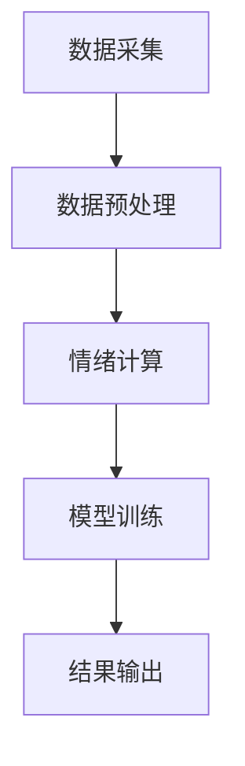
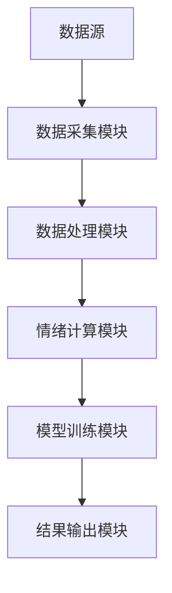
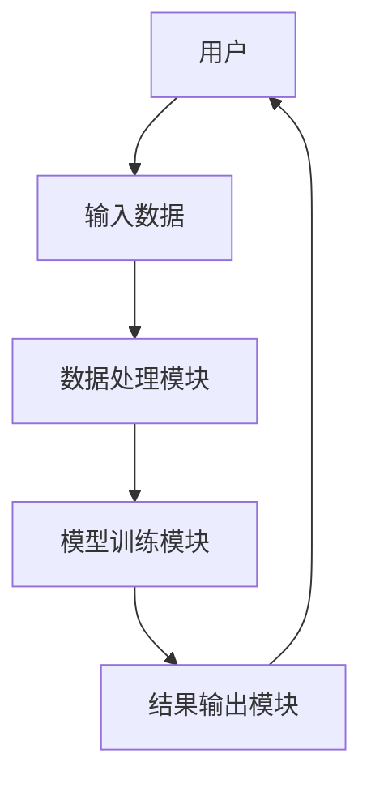

                 


```markdown
# 特价股票投资中的情绪因子分析与应用

> 关键词：特价股票，情绪因子，投资分析，行为金融学，算法分析

> 摘要：本文深入探讨了情绪因子在特价股票投资中的应用，结合行为金融学理论，分析了投资者情绪对股价波动的影响，并通过算法模型展示了情绪因子的量化方法与实际应用案例。文章内容涵盖情绪因子的定义、量化方法、算法原理、系统架构设计以及项目实战，帮助投资者更好地理解和应用情绪因子进行投资决策。

---

## 第一部分: 情绪因子与特价股票投资概述

### 第1章: 情绪因子与特价股票投资概述

#### 1.1 情绪因子的定义与特征
- **情绪因子的定义**：情绪因子是指投资者在市场中的情绪波动对股票价格的影响，通常表现为贪婪和恐惧两种情绪。
- **情绪因子的特征**：包括短期性、波动性、传染性、群体性等。
- **情绪因子与股价的关系**：情绪因子能够影响投资者的决策，从而间接影响股票价格的波动。

#### 1.2 特价股票的定义与特点
- **特价股票的定义**：指价格低于市场平均水平的股票，通常具有较高的市盈率或市净率。
- **特价股票的市场特征**：包括低估值、高波动性、高风险等。
- **特价股票的投资机会与风险**：低价股票可能蕴含较高的投资机会，但也伴随着较高的风险。

#### 1.3 情绪因子在特价股票投资中的作用
- **情绪因子对投资者决策的影响**：情绪因子能够影响投资者的买卖决策，从而影响股票价格。
- **情绪因子对股价波动的预测能力**：通过分析情绪因子，可以预测股票价格的短期波动。
- **情绪因子在特价股票投资中的应用前景**：情绪因子分析为投资者提供了新的投资工具和策略。

#### 1.4 情绪因子分析的必要性与方法
- **情绪因子分析的必要性**：情绪因子分析能够帮助投资者更好地理解市场波动，提高投资决策的准确性。
- **情绪因子分析的主要方法**：包括文本挖掘、情感分析、数据挖掘等。
- **情绪因子分析的工具与技术**：包括自然语言处理技术、机器学习算法等。

### 第2章: 情绪因子的核心概念与理论基础

#### 2.1 情绪因子的理论基础
- **行为金融学与情绪因子**：行为金融学研究表明，投资者情绪是影响市场波动的重要因素。
- **投资者心理与情绪因子的关系**：投资者情绪通过影响决策行为，进而影响市场。
- **情绪因子与市场异象**：情绪因子能够解释市场中的异象，如动量效应和反转效应。

#### 2.2 情绪因子的分类与属性
- **情绪因子的分类**：包括贪婪情绪、恐惧情绪、乐观情绪、悲观情绪等。
- **不同情绪因子的特征对比**：通过表格和对比分析，展示不同情绪因子的特征。
- **情绪因子的量化方法**：包括情绪指数、情绪强度等。

#### 2.3 情绪因子与其他投资因子的关系
- **情绪因子与价值因子**：情绪因子能够影响价值因子的计算和应用。
- **情绪因子与动量因子**：情绪因子与动量因子存在一定的相关性，但两者的作用机制不同。
- **情绪因子与市场因子**：情绪因子能够影响市场因子，如市场波动率等。

#### 2.4 情绪因子的数学模型与公式
- **情绪因子的数学表达式**：通过公式展示情绪因子的计算方法。
- **情绪因子的计算公式**：详细解释情绪因子的具体计算步骤。
- **情绪因子的权重分配模型**：展示情绪因子在投资组合中的权重分配方法。

### 第3章: 情绪因子分析的算法原理

#### 3.1 情绪因子分析的主要算法
- **文本挖掘与情感分析**：通过自然语言处理技术分析新闻、评论等文本数据，提取情绪信息。
- **基于社交媒体的情绪指标计算**：利用社交媒体数据，计算市场情绪指标。
- **基于市场数据的情绪因子提取**：通过分析市场数据，提取情绪因子。

#### 3.2 情绪因子分析的流程图


#### 3.3 情绪因子分析的算法实现
- **Python代码示例**：
```python
import nltk
from nltk.sentiment import SentimentIntensityAnalyzer

sia = SentimentIntensityAnalyzer()
text = "The stock market is bullish today."
scores = sia.polarity_scores(text)
print(scores)
```

#### 3.4 情绪因子分析的数学模型
- **情绪强度计算公式**：
  $$
  \text{情绪强度} = \frac{\text{积极情绪得分} - \text{消极情绪得分}}{\text{总情绪得分}}
  $$

#### 3.5 情绪因子分析的优缺点
- **优点**：能够捕捉市场情绪波动，提高投资决策的准确性。
- **缺点**：情绪因子具有一定的局限性，需要结合其他因子进行综合分析。

---

## 第二部分: 情绪因子分析的系统架构与应用

### 第4章: 情绪因子分析的系统架构设计

#### 4.1 系统功能设计
- **数据采集模块**：采集市场数据、新闻数据、社交媒体数据等。
- **数据处理模块**：对数据进行清洗、转换、标准化处理。
- **情绪计算模块**：通过算法计算情绪因子。
- **模型训练模块**：利用机器学习算法训练情绪因子分析模型。
- **结果输出模块**：输出情绪因子分析结果。

#### 4.2 系统架构图


#### 4.3 系统接口设计
- **数据接口**：提供数据输入接口，接收市场数据、新闻数据等。
- **模型接口**：提供模型调用接口，输出情绪因子分析结果。
- **用户接口**：提供用户交互界面，展示分析结果。

#### 4.4 系统交互流程图


### 第5章: 情绪因子分析的项目实战

#### 5.1 项目背景与目标
- **项目背景**：利用情绪因子分析，帮助投资者进行特价股票投资决策。
- **项目目标**：开发一个基于情绪因子分析的特价股票投资系统。

#### 5.2 项目实施步骤
- **环境安装**：安装必要的开发工具和库，如Python、Pandas、Scikit-learn等。
- **数据采集**：采集市场数据、新闻数据、社交媒体数据等。
- **特征提取**：提取情绪因子相关特征。
- **模型训练**：训练情绪因子分析模型。
- **策略生成**：根据模型结果生成投资策略。

#### 5.3 项目代码实现
- **数据采集代码示例**：
```python
import pandas as pd
import requests

url = "https://api.example.com/stock_data"
response = requests.get(url)
data = response.json()
df = pd.DataFrame(data)
```

- **模型训练代码示例**：
```python
from sklearn.ensemble import RandomForestClassifier
from sklearn.model_selection import train_test_split

X = df.drop('target', axis=1)
y = df['target']
X_train, X_test, y_train, y_test = train_test_split(X, y, test_size=0.2)
model = RandomForestClassifier().fit(X_train, y_train)
```

#### 5.4 实际案例分析
- **案例背景**：假设市场出现恐慌情绪，投资者大量抛售股票。
- **情绪因子分析结果**：情绪强度为-0.8，表明市场情绪为极度悲观。
- **投资策略生成**：根据情绪因子分析结果，投资者可以选择买入策略。

#### 5.5 项目小结
- **项目成果**：成功开发了一个基于情绪因子分析的特价股票投资系统。
- **项目经验**：情绪因子分析能够有效捕捉市场情绪波动，提高投资决策的准确性。

---

## 第三部分: 情绪因子分析的最佳实践

### 第6章: 情绪因子分析的最佳实践

#### 6.1 小结
- **核心内容回顾**：情绪因子分析在特价股票投资中的应用。
- **关键点总结**：情绪因子分析需要结合其他因子进行综合分析。

#### 6.2 注意事项
- **数据质量**：确保数据的准确性和完整性。
- **模型选择**：根据实际情况选择合适的模型和算法。
- **风险控制**：在实际投资中，注意风险控制。

#### 6.3 拓展阅读
- **推荐书籍**：《行为金融学》、《情绪化决策》等。
- **推荐论文**：相关领域的学术论文。

---

## 作者信息

作者：AI天才研究院/AI Genius Institute & 禅与计算机程序设计艺术 /Zen And The Art of Computer Programming

---

以上是文章的详细大纲，具体内容需要根据以上结构逐步展开，并详细描述每部分的内容，确保逻辑清晰、结构紧凑、简单易懂。
</think>

### 第二部分: 情绪因子分析的系统架构与应用

#### 第4章: 情绪因子分析的系统架构设计

##### 4.1 系统功能设计

###### 4.1.1 数据采集模块
- 数据源包括市场数据、新闻数据、社交媒体数据等。
- 通过API接口或其他数据源获取实时或历史数据。

###### 4.1.2 数据处理模块
- 数据清洗：处理缺失值、异常值等。
- 数据转换：将数据转换为适合分析的格式。
- 数据标准化：对数据进行标准化处理，确保不同数据源的兼容性。

###### 4.1.3 情绪计算模块
- 使用自然语言处理技术对文本数据进行情感分析。
- 计算情绪指数，如积极情绪指数和消极情绪指数。

###### 4.1.4 模型训练模块
- 选择合适的机器学习算法，如随机森林、支持向量机等。
- 训练情绪因子分析模型，生成情绪因子。

###### 4.1.5 结果输出模块
- 输出情绪因子分析结果，包括情绪强度、情绪类型等。
- 提供可视化界面，帮助用户更好地理解和应用结果。

##### 4.2 系统架构图


##### 4.3 系统接口设计

###### 4.3.1 数据接口
- 输入接口：接收市场数据、新闻数据、社交媒体数据等。
- 输出接口：提供处理后的数据，供其他模块使用。

###### 4.3.2 模型接口
- 输入接口：接收处理后的数据，供模型训练模块使用。
- 输出接口：输出情绪因子分析结果，供用户或其他模块使用。

###### 4.3.3 用户接口
- 输入接口：接收用户的输入，如查询、参数设置等。
- 输出接口：展示分析结果，提供交互界面。

##### 4.4 系统交互流程图


#### 第5章: 情绪因子分析的项目实战

##### 5.1 项目背景与目标

###### 5.1.1 项目背景
- 当前市场环境中，投资者情绪对股价波动的影响日益显著。
- 通过情绪因子分析，可以帮助投资者更好地捕捉市场情绪变化，制定科学的投资策略。

###### 5.1.2 项目目标
- 开发一个基于情绪因子分析的特价股票投资系统。
- 提供情绪因子分析工具，辅助投资者进行投资决策。

##### 5.2 项目实施步骤

###### 5.2.1 环境安装
- 安装必要的开发工具和库：
  - Python
  - Pandas
  - NumPy
  - Scikit-learn
  - NLTK
  - Requests

###### 5.2.2 数据采集
- 通过API接口获取市场数据、新闻数据、社交媒体数据等。
- 数据采集示例：
  ```python
  import requests

  url = "https://api.example.com/stock_data"
  response = requests.get(url)
  data = response.json()
  df = pd.DataFrame(data)
  ```

###### 5.2.3 特征提取
- 提取情绪相关特征，如情感极性、情感强度等。
- 使用自然语言处理技术对文本数据进行情感分析。

###### 5.2.4 模型训练
- 选择合适的算法，如随机森林、支持向量机等。
- 训练情绪因子分析模型，生成情绪因子。
- 模型训练示例：
  ```python
  from sklearn.ensemble import RandomForestClassifier
  from sklearn.model_selection import train_test_split

  X = df.drop('target', axis=1)
  y = df['target']
  X_train, X_test, y_train, y_test = train_test_split(X, y, test_size=0.2)
  model = RandomForestClassifier().fit(X_train, y_train)
  ```

###### 5.2.5 策略生成
- 根据情绪因子分析结果，生成投资策略。
- 示例策略：
  - 当情绪强度为正且高于阈值时，买入股票。
  - 当情绪强度为负且低于阈值时，卖出股票。

##### 5.3 实际案例分析

###### 5.3.1 案例背景
- 假设市场出现恐慌情绪，投资者大量抛售股票。
- 社交媒体上负面情绪指数显著上升。

###### 5.3.2 情绪因子分析结果
- 情绪强度：-0.8
- 情绪类型：悲观情绪

###### 5.3.3 投资策略生成
- 根据分析结果，投资者可以选择买入策略，等待市场情绪恢复。

##### 5.4 项目小结

###### 5.4.1 项目成果
- 成功开发了一个基于情绪因子分析的特价股票投资系统。
- 提供了情绪因子分析工具，辅助投资者进行投资决策。

###### 5.4.2 项目经验
- 情绪因子分析能够有效捕捉市场情绪波动，提高投资决策的准确性。
- 在实际应用中，需要结合其他因子进行综合分析，以提高模型的准确性和稳定性。

---

## 第三部分: 情绪因子分析的最佳实践

### 第6章: 情绪因子分析的最佳实践

#### 6.1 小结

##### 6.1.1 核心内容回顾
- 情绪因子分析在特价股票投资中的应用。
- 情绪因子分析能够捕捉市场情绪波动，提高投资决策的准确性。

##### 6.1.2 关键点总结
- 情绪因子分析需要结合其他因子进行综合分析。
- 在实际应用中，需要注意数据质量、模型选择和风险控制。

#### 6.2 注意事项

##### 6.2.1 数据质量
- 确保数据的准确性和完整性，避免因数据问题影响分析结果。

##### 6.2.2 模型选择
- 根据实际情况选择合适的模型和算法，避免盲目使用复杂模型。

##### 6.2.3 风险控制
- 在实际投资中，注意风险控制，避免因情绪因子分析结果而过度投资。

#### 6.3 拓展阅读

##### 6.3.1 推荐书籍
- 《行为金融学》：了解投资者行为对市场的影响。
- 《情绪化决策》：深入探讨情绪在决策中的作用。

##### 6.3.2 推荐论文
- 相关领域的学术论文，提供更深入的理论支持和实证研究。

---

## 作者信息

作者：AI天才研究院/AI Genius Institute & 禅与计算机程序设计艺术 /Zen And The Art of Computer Programming

---

以上是《特价股票投资中的情绪因子分析与应用》的完整目录和详细内容结构。具体内容需要根据以上大纲逐步展开，并详细描述每部分的内容，确保逻辑清晰、结构紧凑、简单易懂。
```

