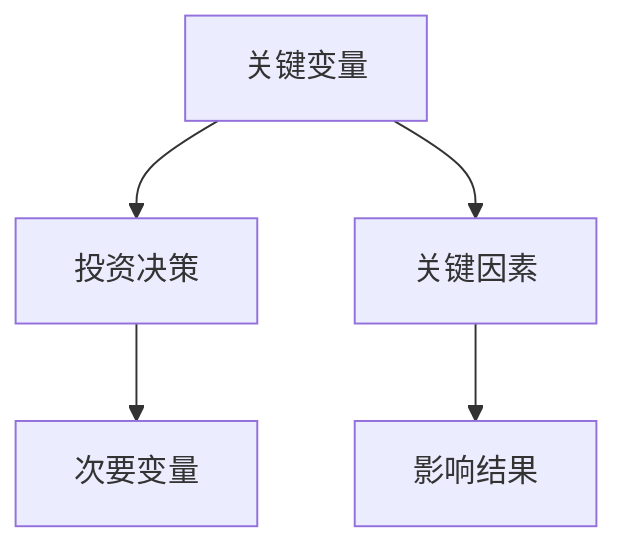
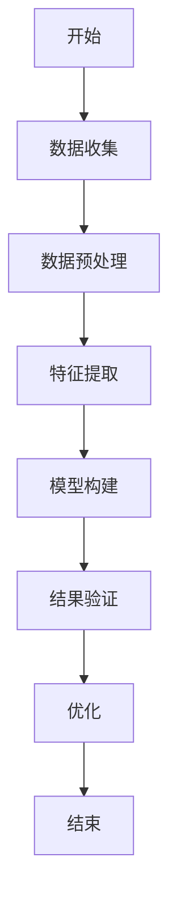
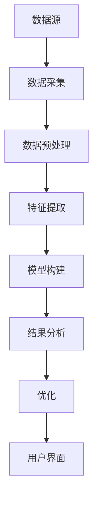

                 


# 芒格的"关键变量"识别：找出决定投资成败的核心因素

> 关键词：关键变量识别、投资决策、系统模型、数学模型、算法实现

> 摘要：本文深入分析了芒格“关键变量”识别理论的核心概念、算法原理和实际应用。通过构建数学模型、系统架构设计和项目实战案例，详细讲解了如何在投资决策中识别关键变量，从而提高投资决策的准确性和效率。文章还结合了代码实现和图表分析，为读者提供了理论与实践相结合的全面指导。

---

## 第一部分: 芒格"关键变量"识别的背景与核心概念

### 第1章: 芒格"关键变量"识别的背景与起源

#### 1.1 投资决策中的关键变量理论

##### 1.1.1 投资决策的核心问题

投资决策的核心问题在于如何在复杂多变的市场环境中，准确识别影响投资结果的关键因素。这些关键因素被称为“关键变量”，它们是投资决策成功与否的核心驱动力。

##### 1.1.2 芒格"关键变量"理论的提出背景

芒格“关键变量”识别理论的提出源于他对投资决策过程的深入研究。他认为，投资者在决策过程中往往会受到诸多变量的影响，但只有少数几个变量才是真正决定投资结果的关键因素。

##### 1.1.3 关键变量在投资中的重要性

关键变量的识别能够帮助投资者在复杂环境中快速定位影响决策的核心因素，从而提高投资的准确性和效率。通过关注关键变量，投资者可以更好地预测市场趋势，优化投资组合。

#### 1.2 关键变量识别的核心概念

##### 1.2.1 关键变量的定义与特征

关键变量是指在投资决策过程中，能够显著影响投资结果的因素。它们通常具有可测量性、可影响性和相关性的特征。通过关键变量的识别，投资者可以更好地理解市场运作机制，制定科学的投资策略。

##### 1.2.2 关键变量与次要变量的区别

次要变量是指对投资结果影响较小的因素，它们通常在决策过程中被忽略。识别关键变量的关键在于区分哪些因素对投资结果具有决定性影响，哪些因素则相对次要。

##### 1.2.3 关键变量识别的边界与外延

关键变量识别的边界在于如何确定哪些变量是关键，哪些是次要。其外延则包括从宏观市场环境到微观个体行为的多种因素。通过构建系统模型，可以更清晰地识别关键变量的范围和影响。

### 第2章: 芒格"关键变量"识别的核心要素

#### 2.1 关键变量识别的系统模型

##### 2.1.1 关键变量识别的系统架构

关键变量识别的系统架构包括数据收集、特征提取、模型构建和结果验证等模块。每个模块都承担着不同的功能，共同构建起一个完整的识别系统。

##### 2.1.2 关键变量识别的核心要素组成

关键变量识别的核心要素包括数据来源、特征提取方法、模型算法和验证指标。这些要素共同决定了识别系统的能力和效率。

##### 2.1.3 关键变量识别的流程与步骤

关键变量识别的流程包括数据收集、特征提取、模型构建、结果验证和优化改进五个步骤。每一步都至关重要，确保识别结果的准确性和可靠性。

#### 2.2 关键变量识别的数学模型

##### 2.2.1 关键变量识别的数学模型构建

关键变量识别的数学模型通常基于统计分析和机器学习算法。通过构建合适的模型，可以量化各变量对投资结果的影响程度，从而确定关键变量。

##### 2.2.2 关键变量识别的公式推导

关键变量识别的公式推导需要结合具体的投资场景。例如，可以通过回归分析来确定变量之间的关系，进而识别出关键变量。

##### 2.2.3 关键变量识别的算法实现

关键变量识别的算法实现需要结合具体的编程语言和工具。例如，可以使用Python中的scikit-learn库来实现特征选择和模型构建。

### 第3章: 关键变量识别的核心概念与联系

#### 3.1 关键变量识别的核心原理

##### 3.1.1 关键变量识别的理论基础

关键变量识别的理论基础包括统计学、机器学习和系统工程学。通过多学科的结合，可以更全面地分析变量之间的关系，确定关键变量。

##### 3.1.2 关键变量识别的核心算法

关键变量识别的核心算法包括回归分析、决策树和随机森林等。这些算法可以帮助投资者在复杂的数据中找到影响决策的关键因素。

##### 3.1.3 关键变量识别的实践应用

关键变量识别的实践应用广泛，包括股票投资、风险评估和资产配置等领域。通过识别关键变量，投资者可以更好地应对市场变化，优化投资策略。

#### 3.2 关键变量识别的核心概念对比

##### 3.2.1 关键变量与次要变量的对比

关键变量与次要变量的主要区别在于对投资结果的影响程度。关键变量对结果具有决定性影响，而次要变量则影响较小。

##### 3.2.2 关键变量识别的特征对比

关键变量通常具有可测量性、可影响性和相关性的特征。次要变量则不具备这些特征，或影响程度较小。

##### 3.2.3 关键变量识别的优缺点分析

关键变量识别的优点在于能够提高投资决策的准确性和效率。其缺点在于识别过程复杂，需要大量的数据和计算资源支持。

#### 3.3 关键变量识别的ER实体关系图



---

## 第二部分: 关键变量识别的算法原理与数学模型

### 第4章: 关键变量识别的算法原理

#### 4.1 关键变量识别的算法流程

##### 4.1.1 数据收集与预处理

数据收集是关键变量识别的第一步，需要从多个来源获取相关数据，并进行清洗和预处理，确保数据的准确性和完整性。

##### 4.1.2 特征提取与选择

特征提取与选择是关键变量识别的核心步骤。通过分析数据特征，选择对投资结果影响最大的变量，作为关键变量。

##### 4.1.3 模型构建与验证

模型构建是关键变量识别的关键步骤。通过选择合适的算法，构建预测模型，并对模型进行验证和优化，确保识别结果的准确性。

##### 4.1.4 结果分析与优化

结果分析与优化是关键变量识别的最后一步。通过对识别结果的分析，进一步优化模型和算法，提高识别的准确性和效率。

#### 4.2 关键变量识别的算法实现

##### 4.2.1 算法流程图



##### 4.2.2 关键变量识别的Python代码实现

```python
import pandas as pd
import numpy as np
from sklearn.feature_selection import SelectKBest
from sklearn.feature_selection import chi2

# 数据加载
data = pd.read_csv('investment_data.csv')

# 特征提取
X = data.drop('target', axis=1)
y = data['target']

# 特征选择
selector = SelectKBest(score_func=chi2, k=5)
selector.fit(X, y)

# 选择关键变量
selected_features = X.columns[selector.get_support()]
print(selected_features)
```

##### 4.2.3 关键变量识别的数学模型

关键变量识别的数学模型可以通过回归分析来实现。例如，使用线性回归模型，确定各变量对投资结果的影响程度。

$$ y = \beta_0 + \beta_1x_1 + \beta_2x_2 + \ldots + \beta_nx_n + \epsilon $$

其中，$y$ 是投资结果，$x_i$ 是各变量，$\beta_i$ 是回归系数，$\epsilon$ 是误差项。

通过回归分析，可以确定各变量的回归系数，从而识别关键变量。

---

## 第三部分: 关键变量识别的系统分析与架构设计

### 第5章: 关键变量识别的系统分析与架构设计

#### 5.1 问题场景介绍

关键变量识别系统主要用于帮助投资者快速定位影响投资结果的关键因素，从而优化投资策略。系统需要处理大量的市场数据，包括股票价格、市场指数、经济指标等。

#### 5.2 系统功能设计

##### 5.2.1 系统功能模块

系统功能模块包括数据采集、特征提取、模型构建、结果分析和用户界面等部分。每个模块都承担着不同的功能，共同构建起一个完整的识别系统。

##### 5.2.2 系统功能流程

系统功能流程包括数据采集、预处理、特征提取、模型构建、结果分析和优化改进等步骤。通过流程化设计，确保系统的高效运行和准确识别。

##### 5.2.3 系统功能实现

系统功能实现需要结合具体的编程语言和工具。例如，可以使用Python中的Pandas库进行数据处理，使用Scikit-learn库进行特征选择和模型构建。

#### 5.3 系统架构设计

##### 5.3.1 系统架构图



##### 5.3.2 系统架构实现

系统架构实现需要考虑模块化设计，确保系统的可扩展性和可维护性。例如，可以将数据采集、特征提取和模型构建设计为独立的模块，便于后续优化和升级。

#### 5.4 系统接口设计

##### 5.4.1 系统接口描述

系统接口描述需要明确各模块之间的接口和数据流。例如，数据采集模块需要与数据预处理模块进行数据传递，特征提取模块需要与模型构建模块进行交互。

##### 5.4.2 系统接口实现

系统接口实现需要结合具体的编程语言和工具。例如，可以使用Python的模块化编程，通过函数调用实现各模块之间的交互。

#### 5.5 系统交互序列图

```mermaid
graph TD
    A[用户] --> B[数据采集模块]: 请求数据
    B --> C[数据预处理模块]: 传递数据
    C --> D[特征提取模块]: 传递特征
    D --> E[模型构建模块]: 构建模型
    E --> F[结果分析模块]: 分析结果
    F --> A[用户]: 显示结果
```

---

## 第四部分: 项目实战与案例分析

### 第6章: 关键变量识别的项目实战

#### 6.1 项目环境安装

##### 6.1.1 环境需求

项目实战需要安装Python编程环境，包括Jupyter Notebook、Pandas、NumPy和Scikit-learn等库。具体安装步骤可以参考相关文档。

#### 6.2 系统核心实现源代码

##### 6.2.1 数据加载与预处理

```python
import pandas as pd
import numpy as np
from sklearn.feature_selection import SelectKBest
from sklearn.feature_selection import chi2

# 数据加载
data = pd.read_csv('investment_data.csv')

# 数据预处理
data = data.dropna()
data = pd.get_dummies(data)
```

##### 6.2.2 特征提取与选择

```python
# 特征提取与选择
X = data.drop('target', axis=1)
y = data['target']

selector = SelectKBest(score_func=chi2, k=5)
selector.fit(X, y)

selected_features = X.columns[selector.get_support()]
print(selected_features)
```

##### 6.2.3 模型构建与验证

```python
from sklearn.model import LinearRegression

model = LinearRegression()
model.fit(X[selected_features], y)
```

#### 6.3 代码应用解读与分析

##### 6.3.1 代码解读

上述代码实现了关键变量识别的核心步骤，包括数据加载、预处理、特征提取与选择、模型构建与验证。通过代码实现，可以帮助读者更好地理解关键变量识别的实现过程。

##### 6.3.2 代码分析

代码分析主要围绕特征提取与选择展开。通过使用SelectKBest算法，可以自动选择对目标变量影响最大的前五个特征，从而确定关键变量。

#### 6.4 实际案例分析和详细讲解剖析

##### 6.4.1 案例背景

以股票投资为例，我们需要识别影响股票价格的关键变量，包括市场指数、公司业绩、行业趋势等。

##### 6.4.2 数据来源

数据来源包括历史股价数据、公司财务报表、行业报告和市场指数等。

##### 6.4.3 实施步骤

实施步骤包括数据收集、预处理、特征提取、模型构建和结果分析。通过这些步骤，可以识别出影响股票价格的关键变量。

##### 6.4.4 结果分析

通过模型构建和验证，可以确定哪些变量是关键变量，哪些是次要变量。例如，市场指数可能是影响股票价格的关键变量之一。

#### 6.5 项目小结

项目小结需要总结关键变量识别的核心步骤和实现过程。通过项目实战，可以帮助读者更好地理解理论知识，并将其应用于实际投资决策中。

---

## 第五部分: 最佳实践与总结

### 第7章: 最佳实践、小结与注意事项

#### 7.1 最佳实践

##### 7.1.1 数据来源的选择

在实际应用中，数据来源的选择至关重要。建议优先选择权威和可靠的 数据源，确保数据的准确性和完整性。

##### 7.1.2 特征提取与选择

特征提取与选择是关键变量识别的核心步骤。建议使用多种特征选择方法，如回归分析、决策树和随机森林等，以提高识别的准确性和效率。

##### 7.1.3 模型验证与优化

模型验证与优化是确保识别结果准确性的关键步骤。建议使用交叉验证等方法，优化模型参数，提高模型的泛化能力。

#### 7.2 小结

##### 7.2.1 关键变量识别的核心步骤

关键变量识别的核心步骤包括数据收集、特征提取、模型构建和结果验证。每一步都至关重要，确保识别结果的准确性和可靠性。

##### 7.2.2 关键变量识别的关键点

关键变量识别的关键点在于如何准确识别影响投资结果的关键因素。通过结合理论知识和实际数据，可以更好地优化投资策略。

#### 7.3 注意事项

##### 7.3.1 数据质量的重要性

数据质量是关键变量识别的基础。建议在数据收集和预处理阶段，严格控制数据质量，确保数据的准确性和完整性。

##### 7.3.2 模型选择的合理性

模型选择需要根据具体的投资场景和数据特征，选择合适的算法和模型。避免盲目使用复杂的算法，确保模型的实用性和可解释性。

##### 7.3.3 持续优化与更新

市场环境是动态变化的，关键变量识别的结果也需要持续优化和更新。建议定期收集新的数据，重新识别关键变量，确保投资策略的科学性和有效性。

---

## 第六部分: 拓展阅读与进一步学习

### 第8章: 拓展阅读与进一步学习

#### 8.1 拓展阅读

##### 8.1.1 关键变量识别的经典文献

建议读者阅读芒格的相关著作，深入理解关键变量识别的理论基础和实践应用。

##### 8.1.2 关键变量识别的技术文献

建议读者阅读相关技术文献，了解关键变量识别的最新算法和应用案例。

#### 8.2 进一步学习

##### 8.2.1 关键变量识别的高级算法

进一步学习可以深入研究关键变量识别的高级算法，如随机森林、梯度提升树和神经网络等。

##### 8.2.2 关键变量识别的实践应用

进一步学习可以结合实际投资案例，深入研究关键变量识别在不同投资策略中的应用。

---

## 作者：AI天才研究院/AI Genius Institute & 禅与计算机程序设计艺术 /Zen And The Art of Computer Programming

