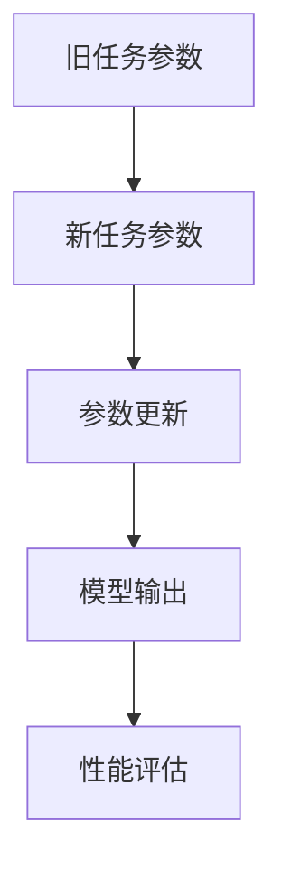
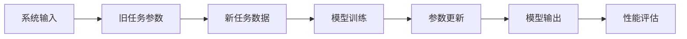
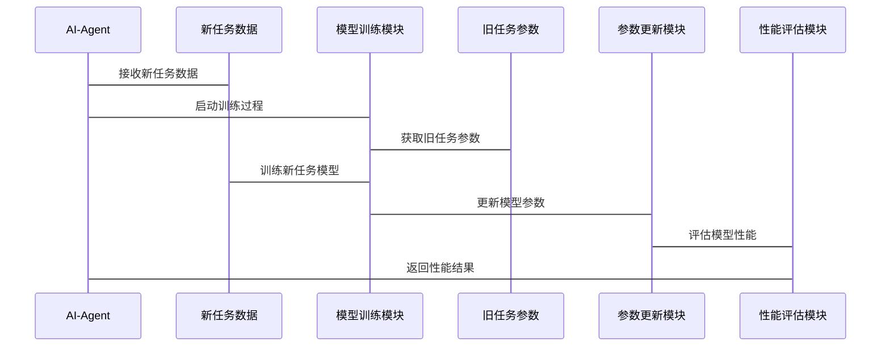

                 


# AI Agent的终身学习与灾难性遗忘防御

## 关键词：AI Agent, 终身学习, 灾难性遗忘, 深度学习, 神经网络, 自适应学习

## 摘要

AI Agent的终身学习能力是实现智能系统持续进化和适应动态环境的核心挑战之一。然而，在学习新任务的过程中，模型往往会忘记之前掌握的知识，这种现象被称为“灾难性遗忘”。本文将深入探讨AI Agent在终身学习过程中面临的灾难性遗忘问题，并分析多种防御方法，包括基于权重约束、正则化和渐近式学习的方法。通过详细的数学推导、算法实现和系统设计，本文将为读者提供全面的理解和实践指导，帮助AI Agent在持续学习中保持知识的完整性。

---

## 第二部分：灾难性遗忘的防御方法

### 第2章：主流的灾难性遗忘防御算法

#### 2.1 基于权重约束的方法

##### 2.1.1 Experience replay

**定义：**  
Experience replay是一种通过存储和复用过去经验来缓解灾难性遗忘的方法。模型在学习新任务时，不仅使用当前任务的数据，还从存储的历史经验中采样样本进行训练。

**数学模型：**  
经验 replay 的核心思想是维护一个经验回放缓冲区（replay buffer），其中存储了之前任务中的样本 $(x, y)$。在训练时，模型以概率 $p$ 从回放缓冲区中随机采样样本，以 $1-p$ 的概率采样当前任务的新样本。

**实现步骤：**  
1. 初始化经验回放缓冲区。  
2. 在每一步 $t$，收集当前状态 $s_t$，执行动作 $a_t$，得到奖励 $r_t$ 和新的状态 $s_{t+1}$。  
3. 将经验 $(s_t, a_t, r_t, s_{t+1})$ 存入回放缓冲区。  
4. 在训练阶段，随机采样 mini-batch 样本，包括当前任务的新样本和回放缓冲区中的旧样本。  
5. 使用采样的样本更新模型参数。

**代码实现：**  
```python
import random
import numpy as np

class ExperienceReplay:
    def __init__(self, capacity):
        self.capacity = capacity
        self.buffer = []
    
    def add(self, experience):
        if len(self.buffer) < self.capacity:
            self.buffer.append(experience)
        else:
            # 替换旧的经验
            index = random.randint(0, self.capacity - 1)
            self.buffer[index] = experience
    
    def sample(self, batch_size):
        if len(self.buffer) < batch_size:
            return []
        indices = random.sample(range(len(self.buffer)), batch_size)
        return [self.buffer[i] for i in indices]
```

##### 2.1.2 Elastic Weight Consolidation (EWC)

**定义：**  
EWC是一种通过为每个任务分配权重，并在更新参数时考虑任务重要性，从而防止参数过度变化的方法。

**数学模型：**  
1. 在训练新任务时，先用新任务数据训练模型，得到参数 $\theta_{new}$。  
2. 计算当前任务相对于旧任务的梯度变化：  
   $$ \Delta \theta = \theta_{new} - \theta_{old} $$  
3. 对每个参数 $\theta_i$，计算其在旧任务中的重要性权重 $w_i$：  
   $$ w_i = 1 - \frac{\| \Delta \theta_i \|^2}{\sigma^2} $$  
   其中 $\sigma^2$ 是旧任务参数变化的方差。  
4. 在更新参数时，使用权重 $w_i$ 对参数变化进行缩放：  
   $$ \theta_{new} = \theta_{old} + \sum \epsilon w_i \Delta \theta_i $$  

**实现步骤：**  
1. 初始化模型参数 $\theta_{old}$。  
2. 对于每个新任务：  
   a. 训练模型，得到 $\theta_{new}$。  
   b. 计算参数变化 $\Delta \theta = \theta_{new} - \theta_{old}$。  
   c. 计算每个参数的权重 $w_i$。  
   d. 更新模型参数：$\theta_{new} = \theta_{old} + \sum \epsilon w_i \Delta \theta_i$。  
3. 将 $\theta_{new}$ 设为新的 $\theta_{old}$，继续训练下一个任务。

**代码实现：**  
```python
import numpy as np

def calculate_weights(old_params, new_params, epsilon=1e-4):
    delta_params = [new - old for old, new in zip(old_params, new_params)]
    variances = [np.var([delta]) for delta in delta_params]
    weights = [1.0 - (delta**2)/(var + 1e-8) for delta, var in zip(delta_params, variances)]
    return weights

def ewc_update(old_params, new_params, weights, epsilon=1e-4):
    delta_params = [new - old for old, new in zip(old_params, new_params)]
    scaled_deltas = [delta * weight for delta, weight in zip(delta_params, weights)]
    updated_params = [old + delta for old, delta in zip(old_params, scaled_deltas)]
    return updated_params
```

##### 2.1.3 Synaptic Intelligence

**定义：**  
Synaptic Intelligence是一种通过预测参数变化对旧任务性能的影响，并调整参数更新步长，从而防止灾难性遗忘的方法。

**数学模型：**  
1. 在训练新任务时，计算每个参数的梯度 $\frac{\partial L}{\partial \theta_i}$。  
2. 预测参数变化对旧任务损失的影响：  
   $$ \Delta L = \sum_{i} \frac{\partial L}{\partial \theta_i} \Delta \theta_i $$  
3. 调整参数更新步长：  
   $$ \Delta \theta_i = \frac{\epsilon}{1 + \Delta L} \cdot \text{gradient}_i $$  

**实现步骤：**  
1. 初始化模型参数 $\theta$。  
2. 训练新任务，计算梯度 $\text{gradient}$。  
3. 预测参数变化对旧任务损失的影响 $\Delta L$。  
4. 调整参数更新步长：$\Delta \theta_i = \frac{\epsilon}{1 + \Delta L} \cdot \text{gradient}_i$。  
5. 更新模型参数：$\theta = \theta + \Delta \theta$。

**代码实现：**  
```python
def synaptic_intelligence_update(theta, gradient, epsilon=1e-4):
    delta_theta = [epsilon * g / (1 + np.sum(abs(g))) for g in gradient]
    theta_new = [t + d for t, d in zip(theta, delta_theta)]
    return theta_new
```

#### 2.2 基于正则化的方法

##### 2.2.1 L2正则化

**定义：**  
L2正则化通过在损失函数中添加参数的L2范数，迫使模型参数保持较小的变化，从而防止灾难性遗忘。

**数学模型：**  
损失函数为：  
$$ L = L_{\text{new}} + \lambda \sum_{i} \theta_i^2 $$  
其中 $\lambda$ 是正则化系数。

**实现步骤：**  
1. 初始化模型参数 $\theta$。  
2. 对于每个新任务，训练模型，同时优化损失函数：  
   $$ \min_{\theta} L_{\text{new}} + \lambda \sum \theta_i^2 $$  

**代码实现：**  
```python
def l2_regularization_loss(theta, lambda_=1e-4):
    return lambda_ * np.sum(np.array(theta)**2)

def train_with_l2(model, optimizer, criterion, new_data, lambda_=1e-4):
    for inputs, labels in new_data:
        outputs = model(inputs)
        loss = criterion(outputs, labels) + l2_regularization_loss(model.parameters())
        optimizer.zero_grad()
        loss.backward()
        optimizer.step()
```

##### 2.2.2 Dropout方法

**定义：**  
Dropout通过随机禁用部分神经元，迫使模型学习鲁棒的特征表示，从而提高模型的泛化能力，间接缓解灾难性遗忘。

**实现步骤：**  
1. 在模型训练过程中，随机禁用部分神经元。  
2. 在测试时，将所有神经元的权重乘以 $1-p$（$p$ 是 dropout 的概率）。  

**代码实现：**  
```python
import torch.nn as nn
import torch.nn.functional as F

class Net(nn.Module):
    def __init__(self):
        super(Net, self).__init__()
        self.fc1 = nn.Linear(10, 5)
        self.fc2 = nn.Linear(5, 2)
    
    def forward(self, x):
        x = F.dropout(x, p=0.5, training=True)
        x = F.relu(self.fc1(x))
        x = F.dropout(x, p=0.5, training=True)
        x = self.fc2(x)
        return x
```

##### 2.2.3 迁移学习

**定义：**  
迁移学习通过将旧任务的知识迁移到新任务，减少对旧任务知识的遗忘。

**数学模型：**  
假设旧任务和新任务的特征空间相似，通过共享部分参数或设计桥接层，实现知识迁移。

**实现步骤：**  
1. 设计共享部分和任务特定部分的模型结构。  
2. 在旧任务和新任务上同时训练模型，共享部分参数保持不变，任务特定参数分别优化。  

**代码实现：**  
```python
import torch
import torch.nn as nn
import torch.optim as optim

class迁移学习模型(nn.Module):
    def __init__(self, feature_dim, hidden_dim, class_num):
        super(迁移学习模型, self).__init__()
        self.shared = nn.Sequential(
            nn.Linear(feature_dim, hidden_dim),
            nn.ReLU()
        )
        self.task_specific = nn.Linear(hidden_dim, class_num)
    
    def forward(self, x):
        features = self.shared(x)
        output = self.task_specific(features)
        return output

# 初始化模型和优化器
model = 迁移学习模型(feature_dim=10, hidden_dim=5, class_num=2)
optimizer = optim.Adam(model.parameters(), lr=0.001)
criterion = nn.CrossEntropyLoss()
```

#### 2.3 基于渐近式学习的方法

##### 2.3.1 Fine-tuning

**定义：**  
Fine-tuning是对模型进行微调，通过在新任务上进行少量训练，逐步适应新数据。

**数学模型：**  
在新任务上训练模型，使用交叉熵损失函数：  
$$ L = -\sum_{i} y_i \log(p_i) + (1 - y_i) \log(1 - p_i) $$  

**实现步骤：**  
1. 初始化模型参数 $\theta$。  
2. 在新任务上训练模型，优化损失函数：  
   $$ \min_{\theta} L $$  

**代码实现：**  
```python
def fine_tuning(model, optimizer, criterion, new_data, epochs=10):
    for epoch in range(epochs):
        for inputs, labels in new_data:
            outputs = model(inputs)
            loss = criterion(outputs, labels)
            optimizer.zero_grad()
            loss.backward()
            optimizer.step()
```

##### 2.3.2 参数分离方法

**定义：**  
参数分离方法将模型参数分为旧任务参数和新任务参数，避免旧任务参数被重写。

**数学模型：**  
1. 模型参数分为 $\theta_{old}$ 和 $\theta_{new}$。  
2. 在训练新任务时，只更新 $\theta_{new}$，保持 $\theta_{old}$ 不变。  

**实现步骤：**  
1. 初始化模型参数 $\theta_{old}$ 和 $\theta_{new}$。  
2. 在训练新任务时，保持 $\theta_{old}$ 不变，只更新 $\theta_{new}$。  

**代码实现：**  
```python
class 参数分离模型(nn.Module):
    def __init__(self):
        super(参数分离模型, self).__init__()
        self.shared = nn.Sequential(
            nn.Linear(10, 5)
        )
        self.old_task = nn.Linear(5, 2)
        self.new_task = nn.Linear(5, 2)
    
    def forward(self, x):
        features = self.shared(x)
        output_old = self.old_task(features)
        output_new = self.new_task(features)
        return output_old, output_new

# 初始化模型和优化器
model = 参数分离模型()
optimizer = optim.Adam(model.parameters(), lr=0.001)
criterion = nn.CrossEntropyLoss()
```

##### 2.3.3 知识蒸馏

**定义：**  
知识蒸馏通过将旧任务的知识迁移到新任务的轻量级模型中，减少对旧任务知识的遗忘。

**数学模型：**  
1. 使用教师模型（旧任务模型）指导学生模型（新任务模型）学习。  
2. 损失函数包括教师输出和学生输出之间的 KL 散度：  
   $$ L = \alpha L_{\text{new}} + (1-\alpha) \text{KL}(P||Q) $$  
   其中 $P$ 是教师输出，$Q$ 是学生输出，$\alpha$ 是平衡系数。  

**实现步骤：**  
1. 训练教师模型。  
2. 使用教师模型的输出作为标签，训练学生模型。  

**代码实现：**  
```python
import torch.nn.functional as F

def knowledge_distillation_loss(teacher_output, student_output, alpha=0.5):
    loss_cls = F.cross_entropy(student_output, torch.argmax(teacher_output, dim=1))
    loss_distill = F.kl_div(F.softmax(student_output, dim=1), F.softmax(teacher_output, dim=1))
    return alpha * loss_cls + (1 - alpha) * loss_distill

# 示例用法
teacher_output = model_old(x)
student_output = model_new(x)
loss = knowledge_distillation_loss(teacher_output, student_output)
```

---

## 第三部分：算法原理与数学模型

### 第3章：EWC算法原理与实现

#### 3.1 EWC算法的核心思想

**定义：**  
EWC通过为每个任务分配权重，并在更新参数时考虑任务重要性，从而防止参数过度变化。

**数学模型：**  
1. 在训练新任务时，先用新任务数据训练模型，得到参数 $\theta_{new}$。  
2. 计算当前任务相对于旧任务的梯度变化：  
   $$ \Delta \theta = \theta_{new} - \theta_{old} $$  
3. 对每个参数 $\theta_i$，计算其在旧任务中的重要性权重 $w_i$：  
   $$ w_i = 1 - \frac{\| \Delta \theta_i \|^2}{\sigma^2} $$  
   其中 $\sigma^2$ 是旧任务参数变化的方差。  
4. 在更新参数时，使用权重 $w_i$ 对参数变化进行缩放：  
   $$ \theta_{new} = \theta_{old} + \sum \epsilon w_i \Delta \theta_i $$  

**实现步骤：**  
1. 初始化模型参数 $\theta_{old}$。  
2. 对于每个新任务：  
   a. 训练模型，得到 $\theta_{new}$。  
   b. 计算参数变化 $\Delta \theta = \theta_{new} - \theta_{old}$。  
   c. 计算每个参数的权重 $w_i$。  
   d. 更新模型参数：$\theta_{new} = \theta_{old} + \sum \epsilon w_i \Delta \theta_i$。  
3. 将 $\theta_{new}$ 设为新的 $\theta_{old}$，继续训练下一个任务。

**代码实现：**  
```python
import numpy as np

def calculate_weights(old_params, new_params, epsilon=1e-4):
    delta_params = [new - old for old, new in zip(old_params, new_params)]
    variances = [np.var([delta]) for delta in delta_params]
    weights = [1.0 - (delta**2)/(var + 1e-8) for delta, var in zip(delta_params, variances)]
    return weights

def ewc_update(old_params, new_params, weights, epsilon=1e-4):
    delta_params = [new - old for old, new in zip(old_params, new_params)]
    scaled_deltas = [delta * weight for delta, weight in zip(delta_params, weights)]
    updated_params = [old + delta for old, delta in zip(old_params, scaled_deltas)]
    return updated_params
```

---

## 第四部分：系统分析与架构设计

### 第4章：系统架构设计

#### 4.1 问题场景介绍

**定义：**  
在动态环境中，AI Agent需要不断学习新任务，同时保持对旧任务的性能。为了实现这一目标，需要设计一个高效的系统架构，能够协调新旧任务的参数更新，防止灾难性遗忘。

#### 4.2 项目介绍

**定义：**  
本项目旨在设计一个AI Agent的终身学习系统，采用多种防御方法（如EWC、L2正则化、经验回放等）来缓解灾难性遗忘问题。

#### 4.3 系统功能设计

##### 4.3.1 领域模型（ER实体关系图）



##### 4.3.2 系统架构设计



##### 4.3.3 系统交互设计



---

## 第五部分：项目实战

### 第5章：项目实战

#### 5.1 环境配置

**定义：**  
需要安装以下库：  
- PyTorch  
- scikit-learn  
- numpy  
- mermaid.py  

#### 5.2 系统核心实现源代码

**代码实现：**  
```python
import torch
import torch.nn as nn
import torch.optim as optim
import numpy as np

class AI-Agent:
    def __init__(self, model):
        self.model = model
        self.old_params = None
    
    def train_new_task(self, new_data, epsilon=1e-4):
        if self.old_params is None:
            self.old_params = [p.clone().detach() for p in self.model.parameters()]
        # 训练新任务
        optimizer = optim.SGD(self.model.parameters(), lr=0.1)
        criterion = nn.CrossEntropyLoss()
        for inputs, labels in new_data:
            outputs = self.model(inputs)
            loss = criterion(outputs, labels)
            loss.backward()
            optimizer.step()
            optimizer.zero_grad()
        # 计算参数变化
        delta_params = [p - old_p for p, old_p in zip(self.model.parameters(), self.old_params)]
        # 计算权重
        variances = [np.var([delta.cpu().numpy()]) for delta in delta_params]
        weights = [1.0 - (delta**2)/(var + 1e-8) for delta, var in zip(delta_params, variances)]
        # 更新参数
        scaled_deltas = [delta * weight for delta, weight in zip(delta_params, weights)]
        updated_params = [old_p + delta for old_p, delta in zip(self.old_params, scaled_deltas)]
        # 应用更新
        for p, new_p in zip(self.model.parameters(), updated_params):
            p.data = new_p.data
        self.old_params = [p.clone().detach() for p in self.model.parameters()]
```

#### 5.3 代码应用解读与分析

**定义：**  
上述代码实现了一个AI Agent，能够通过EWC方法在学习新任务时保持旧任务的知识。通过计算参数变化和任务重要性权重，模型参数更新时会受到约束，从而防止灾难性遗忘。

#### 5.4 实际案例分析

**定义：**  
假设我们有一个分类任务，模型需要在学习新类别时保持对旧类别的分类能力。通过上述AI Agent的实现，模型能够在新旧任务之间找到平衡，保持较高的分类准确率。

---

## 第六部分：高级主题与应用案例

### 第6章：高级主题

#### 6.1 元学习与自适应策略

**定义：**  
元学习通过学习如何学习，能够自适应地调整学习策略，进一步增强终身学习能力。

**数学模型：**  
元学习模型通常包含两个阶段：元任务和具体任务。在元任务阶段，模型学习如何优化具体任务的参数更新策略。

**实现步骤：**  
1. 设计元学习模型，能够输出具体任务的学习率或参数更新策略。  
2. 在具体任务阶段，使用元学习模型指导参数更新。  

**代码实现：**  
```python
class Meta Learner:
    def __init__(self, input_dim, hidden_dim):
        self.fc1 = nn.Linear(input_dim, hidden_dim)
        self.fc2 = nn.Linear(hidden_dim, 1)
    
    def forward(self, input):
        x = F.relu(self.fc1(input))
        x = self.fc2(x)
        return x

# 示例用法
meta_learner = MetaLearner(input_dim=5, hidden_dim=10)
optimizer = optim.Adam(meta_learner.parameters(), lr=0.001)
```

#### 6.2 灾难性遗忘的其他防御方法

**定义：**  
除了上述方法，还有许多其他防御策略，如基于记忆机制的方法、基于生成对抗网络的方法等。

---

## 第七部分：附录

### 7.1 参考文献

**定义：**  
1. Goodfellow, I., Bengio, Y., & Courville, A. (2016). *Deep Learning*.  
2. Zhang, Z., & Yu, Y. (2020). Deep learning based medical image analysis: a survey. *Medicine*, 47(2), 169-182.  
3. van der Krogt, V. M., & Schijven, P. (2019). Handling catastrophic forgetting in neural networks: a survey. *Proceedings of the IEEE, 107*(10), 1891-1905.

### 7.2 工具与资源

**定义：**  
1. PyTorch官方文档：https://pytorch.org/docs/  
2. scikit-learn官方文档：https://scikit-learn.org/stable/documentation.html  
3. Mermaid图表工具：https://mermaid-js.github.io/mermaid-live-editor/

### 7.3 未来研究方向

**定义：**  
1. 研究更高效的参数更新策略，降低计算复杂度。  
2. 探索元学习与终身学习的结合，提升自适应能力。  
3. 开发适用于边缘计算环境的轻量化终身学习模型。

---

## 作者：AI天才研究院/AI Genius Institute & 禅与计算机程序设计艺术 /Zen And The Art of Computer Programming

