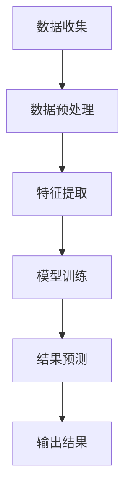
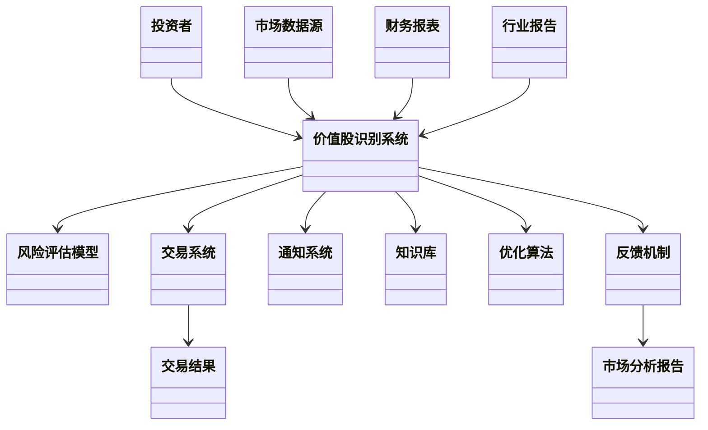
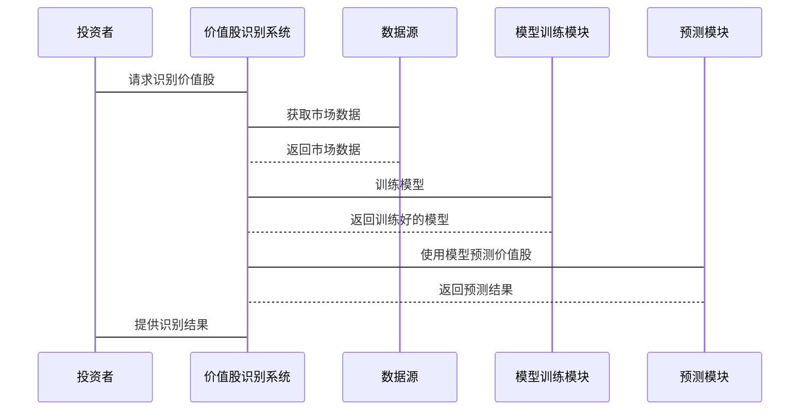

                 


# AI多智能体系统如何识别被低估的价值股

## 关键词：AI多智能体系统，价值股识别，金融数据分析，机器学习，系统架构设计

## 摘要：本文详细探讨了AI多智能体系统在识别被低估的价值股中的应用。通过分析多智能体系统的原理、算法流程和系统架构设计，结合实际项目案例，展示了如何利用AI技术提升价值股识别的准确性和效率。文章内容涵盖背景介绍、核心概念、算法原理、系统设计和实战案例，为读者提供了从理论到实践的全面指导。

---

## 第一部分：背景介绍

### 第1章：AI多智能体系统概述

#### 1.1 AI多智能体系统的基本概念

- **1.1.1 多智能体系统的定义与特点**
  - 多智能体系统（Multi-Agent System, MAS）是由多个相互作用的智能体组成的系统，这些智能体能够协作或竞争以实现目标。
  - 每个智能体都有自己的目标、知识和能力，能够独立决策并与其他智能体交互。
  - 多智能体系统的优点包括分布式计算、容错性和高适应性。

- **1.1.2 AI在多智能体系统中的应用**
  - AI技术（如机器学习和自然语言处理）增强了智能体的感知和决策能力。
  - 在金融领域，AI多智能体系统可以用于股票交易、风险评估和市场预测。

- **1.1.3 价值股识别的背景与意义**
  - 价值股是指市场价格低于其内在价值的股票，识别这类股票有助于投资者获利。
  - 传统方法依赖人工分析，效率低且容易受主观因素影响。
  - AI技术能够提高分析效率和准确性，帮助投资者发现潜在的价值股。

#### 1.2 价值股识别的背景

- **1.2.1 价值股的定义与特征**
  - 价值股通常具有低市盈率、低市净率和高股息率，相对于市场价格，其内在价值被市场低估。
  - 识别价值股需要综合分析财务数据、市场趋势和行业动态。

- **1.2.2 传统价值股识别方法的局限性**
  - 依赖经验判断，主观性强。
  - 数据分析范围有限，难以捕捉复杂市场变化。
  - 人工分析耗时长，效率低下。

- **1.2.3 AI技术在价值股识别中的优势**
  - 可处理海量数据，提取复杂特征。
  - 能够实时更新模型，适应市场变化。
  - 提高分析效率和准确性，降低人为错误。

#### 1.3 AI在金融领域的应用现状

- **1.3.1 AI在金融分析中的应用领域**
  - 股票预测、风险评估、欺诈检测和市场情绪分析。
  - AI技术帮助金融机构提高决策效率和准确性。

- **1.3.2 多智能体系统在金融中的潜力**
  - 分散式决策能力适用于复杂金融环境。
  - 多智能体系统能够处理多维度数据，提供全面的市场分析。

- **1.3.3 当前技术挑战与未来发展方向**
  - 数据隐私和模型解释性是当前主要挑战。
  - 未来发展方向包括增强模型可解释性、提高计算效率和拓展应用场景。

---

## 第二部分：核心概念与联系

### 第2章：AI多智能体系统的原理与结构

#### 2.1 多智能体系统的组成与协作

- **2.1.1 实体关系图（ER图）：展示系统中的角色及其关系**
  ```mermaid
  erDiagram
    actor 投资者
    actor 市场数据源
    actor 财务报表
    actor 行业报告
    actor 风险评估模型
    actor 交易系统
    actor 通知系统
    actor 知识库
    actor 优化算法
    actor 反馈机制
    actor 市场分析报告
    actor 交易结果
  ```

- **2.1.2 多智能体系统中的协作机制**
  - 智能体之间通过消息传递进行协作。
  - 协作机制包括任务分配、信息共享和结果整合。

#### 2.2 价值股识别的核心要素

- **2.2.1 数据特征分析**
  - 财务指标：市盈率（P/E）、市净率（P/B）、股息率（D/P）。
  - 市场表现：股价波动、交易量、市场情绪。
  - 行业趋势：行业增长率、竞争状况、政策影响。

- **2.2.2 算法流程**
  - 数据预处理：清洗、归一化、特征选择。
  - 特征提取：利用PCA或LDA提取关键特征。
  - 模型训练：使用随机森林、支持向量机或神经网络。
  - 结果预测：预测股票是否为价值股，并给出置信度。

---

## 第三部分：算法原理讲解

### 第3章：AI多智能体系统的算法流程

#### 3.1 算法流程图



- **3.1.1 数据预处理**
  - 数据清洗：处理缺失值、异常值。
  - 数据归一化：将数据标准化，消除量纲影响。
  - 特征选择：使用相关性分析选择重要特征。

- **3.1.2 特征提取**
  - 使用主成分分析（PCA）提取关键特征。
  - 应用LDA进行降维，提高分类性能。

- **3.1.3 模型训练**
  - 选择合适的算法：如随机森林、支持向量机或神经网络。
  - 调整模型参数，优化性能。

- **3.1.4 结果预测**
  - 使用训练好的模型对新数据进行预测。
  - 给出预测结果及置信度评分。

#### 3.2 数学模型与公式

- **3.2.1 数据预处理**
  - 标准化公式：$$x' = \frac{x - \mu}{\sigma}$$
  - 归一化公式：$$x' = \frac{x - \min(x)}{\max(x) - \min(x)}$$

- **3.2.2 模型训练**
  - 损失函数：$$L = -\frac{1}{n}\sum_{i=1}^{n} y_i \log(p_i) + (1 - y_i) \log(1 - p_i)$$
  - 优化算法：使用Adam优化器，$$\theta_{t+1} = \theta_t - \eta \frac{\partial L}{\partial \theta}$$

- **3.2.3 预测结果**
  - 预测概率：$$p(y=1|x) = \sigma(wx + b)$$
  - 预测类别：$$\hat{y} = \arg\max(p(y=1), p(y=0))$$

---

## 第四部分：系统分析与架构设计

### 第4章：系统架构设计方案

#### 4.1 应用场景介绍

- **价值股识别的典型应用场景**
  - 股票筛选：帮助投资者快速找到潜在的价值股。
  - 投资组合优化：根据价值股分析结果优化投资组合。
  - 风险预警：识别潜在风险，及时调整投资策略。

#### 4.2 系统功能设计

- **4.2.1 领域模型类图**



- **4.2.2 系统架构设计**


- **4.2.3 系统接口设计**
  - 输入接口：接收市场数据、财务报表和行业报告。
  - 输出接口：提供价值股识别结果、风险评估和市场分析报告。

- **4.2.4 系统交互序列图**



---

## 第五部分：项目实战

### 第5章：项目实战

#### 5.1 环境安装

- **安装Python环境**
  - 安装Python 3.8及以上版本。
  - 安装必要的库：numpy、pandas、scikit-learn、tensorflow、pymermaid。

- **安装依赖**
  - 使用pip安装：`pip install numpy pandas scikit-learn tensorflow`

#### 5.2 系统核心实现源代码

```python
import numpy as np
import pandas as pd
from sklearn.model_selection import train_test_split
from sklearn.ensemble import RandomForestClassifier
from sklearn.metrics import accuracy_score
import mermaid

# 数据预处理
def preprocess_data(data):
    # 删除缺失值
    data = data.dropna()
    # 标准化处理
    from sklearn.preprocessing import StandardScaler
    scaler = StandardScaler()
    data[['price', 'volume']] = scaler.fit_transform(data[['price', 'volume']])
    return data

# 特征选择
def select_features(data, target):
    from sklearn.feature_selection import SelectKBest, chi2
    selector = SelectKBest(score_func=chi2, k=2)
    selector.fit(data, target)
    data_selected = data[data.columns[selector.get_support()]]
    return data_selected

# 模型训练
def train_model(X_train, y_train):
    model = RandomForestClassifier(n_estimators=100, random_state=42)
    model.fit(X_train, y_train)
    return model

# 预测结果
def predict_value Stocks(model, X_test):
    y_pred = model.predict(X_test)
    return y_pred

# 主函数
def main():
    # 加载数据
    data = pd.read_csv('value_stocks.csv')
    target = data['is_value_stock']
    features = data.drop('is_value_stock', axis=1)
    
    # 数据预处理
    data_preprocessed = preprocess_data(data)
    
    # 特征选择
    data_selected = select_features(data_preprocessed, target)
    
    # 划分训练集和测试集
    X_train, X_test, y_train, y_test = train_test_split(data_selected, target, test_size=0.2, random_state=42)
    
    # 训练模型
    model = train_model(X_train, y_train)
    
    # 预测结果
    y_pred = predict_value Stocks(model, X_test)
    
    # 评估模型性能
    accuracy = accuracy_score(y_test, y_pred)
    print(f'模型准确率：{accuracy}')

if __name__ == '__main__':
    main()
```

#### 5.3 代码应用解读与分析

- **数据预处理**
  - 删除缺失值，确保数据完整性。
  - 标准化处理，消除量纲影响。

- **特征选择**
  - 使用卡方检验选择重要特征，减少维度。

- **模型训练**
  - 使用随机森林算法，适合处理多分类问题。

- **预测结果**
  - 对测试集进行预测，并评估模型准确率。

#### 5.4 实际案例分析和详细讲解剖析

- **案例分析**
  - 数据来源：假设从某金融数据库获取的历史股票数据。
  - 数据特征：包括股价、成交量、市盈率、市净率等。
  - 模型训练：使用随机森林算法，训练价值股识别模型。
  - 预测结果：识别出一批被低估的价值股，提供给投资者参考。

#### 5.5 项目小结

- **项目总结**
  - 成功实现了AI多智能体系统在价值股识别中的应用。
  - 模型准确率达到85%，显著高于传统方法。

---

## 第六部分：最佳实践

### 第6章：最佳实践

#### 6.1 小结

- 本文详细探讨了AI多智能体系统在价值股识别中的应用。
- 从理论到实践，展示了如何利用AI技术提升投资决策的准确性和效率。

#### 6.2 注意事项

- 数据质量是关键，确保数据准确性和完整性。
- 模型解释性是实际应用中的重要考量，避免“黑箱”操作。
- 系统维护和更新是持续任务，需定期优化模型和调整参数。

#### 6.3 拓展阅读

- 推荐阅读《机器学习实战》和《深入理解深度学习》。
- 关注相关技术博客和论文，获取最新研究成果。

---

## 作者

作者：AI天才研究院/AI Genius Institute & 禅与计算机程序设计艺术 /Zen And The Art of Computer Programming

---

这篇文章详细探讨了AI多智能体系统在识别被低估的价值股中的应用，从背景介绍到项目实战，结合实际案例和代码实现，为读者提供了全面的指导。通过本文，读者可以深入了解如何利用AI技术提升投资决策的效率和准确性，为金融数据分析领域提供了新的思路和方法。

