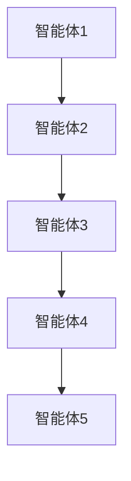
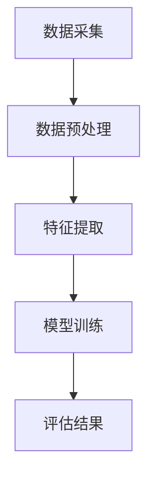
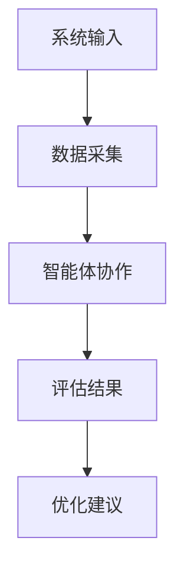
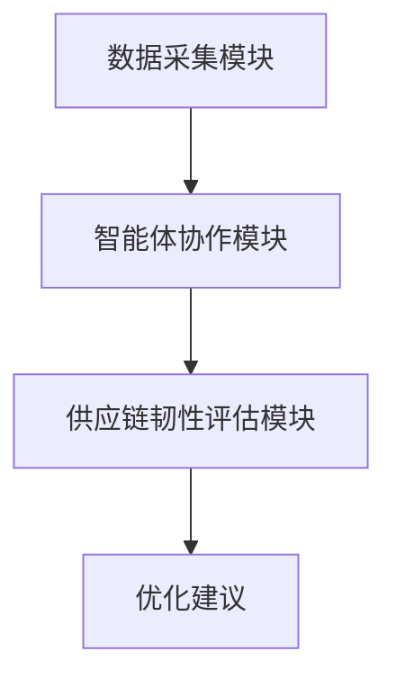
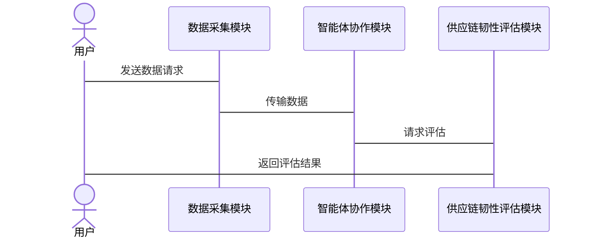

                 


# 价值投资中的多智能体AI供应链韧性评估系统

> 关键词：多智能体AI，供应链韧性，价值投资，风险管理，数据分析

> 摘要：本文探讨了多智能体AI技术在供应链韧性评估中的应用，分析了其在价值投资中的重要性，并通过详细的技术实现和案例分析，展示了如何利用多智能体AI系统提升供应链的韧性和企业的投资决策能力。

---

## 第一章：供应链韧性评估的背景与重要性

### 1.1 供应链韧性的概念与重要性

供应链韧性是指在面对各种不确定性（如自然灾害、疫情、市场波动等）时，供应链维持稳定运作和快速恢复的能力。在价值投资中，供应链韧性是评估企业长期竞争力和投资价值的重要指标。

#### 1.1.1 供应链的基本概念
供应链是一个包含供应商、制造商、分销商、零售商和消费者的复杂网络，涉及物流、信息流和资金流的协同运作。供应链的稳定性直接影响企业的运营效率和成本控制。

#### 1.1.2 供应链韧性的定义与内涵
供应链韧性强调系统在面对外部冲击时的适应性和恢复能力。一个有韧性的供应链能够在危机中快速调整策略，减少损失并恢复正常运作。这种能力直接影响企业的市场竞争力和投资者信心。

#### 1.1.3 供应链韧性在价值投资中的作用
在价值投资中，投资者关注企业的长期盈利能力。供应链韧性是企业应对市场波动和风险的关键能力。一个拥有强大供应链韧性的企业能够更好地应对突发事件，保持稳定的收益，从而提高其投资价值。

### 1.2 价值投资与供应链管理的结合

#### 1.2.1 价值投资的核心理念
价值投资强调寻找那些市场价格低于其内在价值的企业。企业供应链的稳定性和韧性是其内在价值的重要组成部分，因为供应链问题可能导致成本上升、生产中断，进而影响企业的盈利能力和市场地位。

#### 1.2.2 供应链管理在企业价值中的地位
供应链管理直接影响企业的成本控制、生产效率和客户满意度。高效的供应链管理能够降低运营成本，提高交货速度，增强客户忠诚度，从而提升企业的市场竞争力和投资价值。

#### 1.2.3 供应链韧性对投资决策的影响
供应链韧性是企业应对市场风险和突发事件的关键能力。在价值投资中，供应链韧性强的企业能够在市场波动中保持稳定的收益，从而吸引更多投资者，提高企业的市场估值。

### 1.3 当前供应链管理的挑战与机遇

#### 1.3.1 全球化背景下的供应链风险
全球化使得供应链更加复杂，企业依赖全球供应商和分销网络。然而，全球化也带来了更多的风险，如国际贸易摩擦、地缘政治冲突和疫情等，这些都可能中断供应链，影响企业的运营。

#### 1.3.2 数字化转型对供应链管理的影响
数字化转型为供应链管理带来了新的机遇。通过物联网、大数据和人工智能等技术，企业可以实时监控供应链的运行状态，预测潜在风险，并采取预防措施，从而提高供应链的韧性。

#### 1.3.3 人工智能在供应链管理中的应用潜力
人工智能技术能够帮助企业优化供应链管理，提高预测准确性，降低运营成本。特别是在供应链韧性评估方面，人工智能可以通过分析历史数据和实时信息，预测潜在风险，并提出应对策略。

### 1.4 多智能体系统在供应链管理中的应用前景

#### 1.4.1 多智能体系统的定义与特点
多智能体系统是由多个相互作用的智能体组成的系统，每个智能体都有自己的目标和决策机制。多智能体系统具有分布式、协作性和自主性等特点，能够适应复杂的环境和动态变化。

#### 1.4.2 多智能体系统在供应链管理中的优势
在供应链管理中，多智能体系统可以通过协作优化库存管理、物流调度和风险控制。每个智能体负责特定的任务，如供应商管理、运输优化和需求预测，通过协作实现整体最优。

#### 1.4.3 多智能体AI供应链韧性评估系统的创新性
多智能体AI供应链韧性评估系统结合了人工智能和多智能体技术，能够实时监控供应链的运行状态，预测潜在风险，并提出应对策略。这种系统能够提高供应链的透明度和响应速度，增强企业的抗风险能力。

### 1.5 本章小结

本章介绍了供应链韧性的概念及其在价值投资中的重要性。通过分析当前供应链管理的挑战与机遇，探讨了多智能体系统在供应链管理中的应用前景。多智能体AI供应链韧性评估系统的创新性在于其能够通过协作优化供应链管理，提高企业的抗风险能力，从而增强其投资价值。

---

## 第二章：多智能体AI供应链韧性评估系统的核心概念

### 2.1 多智能体系统的原理与特点

#### 2.1.1 多智能体系统的定义
多智能体系统是由多个智能体组成的系统，每个智能体都有自己的目标、知识和决策机制。这些智能体通过协作和交互完成复杂的任务。

#### 2.1.2 多智能体系统的组成要素
多智能体系统由智能体、环境、通信机制和协调机制组成。智能体负责执行任务，环境是智能体所处的外部世界，通信机制用于智能体之间的信息交换，协调机制用于解决冲突和优化协作。

#### 2.1.3 多智能体系统的核心算法
多智能体系统的核心算法包括分布式协作算法、联合学习算法和跨智能体通信协议。这些算法能够实现智能体之间的协作和信息共享，从而优化系统的整体性能。

### 2.2 供应链韧性评估的指标体系

#### 2.2.1 供应链韧性评估的关键指标
供应链韧性评估的关键指标包括供应链的弹性、恢复能力和适应性。弹性指系统在面对冲击时的抗压能力，恢复能力指系统从冲击中恢复的速度，适应性指系统根据环境变化调整的能力。

#### 2.2.2 指标权重的确定方法
指标权重的确定方法包括层次分析法（AHP）和熵值法。层次分析法通过构建层次结构，分析各指标的重要性；熵值法通过计算数据的离差，确定各指标的权重。

#### 2.2.3 指标体系的构建与优化
指标体系的构建需要结合企业的实际情况和行业特点，选择合适的指标，并通过优化算法进行调整，以确保评估结果的准确性和可靠性。

### 2.3 多智能体AI供应链韧性评估系统的架构

#### 2.3.1 系统的整体架构
多智能体AI供应链韧性评估系统的整体架构包括数据采集模块、智能体协作模块和供应链韧性评估模块。数据采集模块负责收集供应链的实时数据，智能体协作模块负责智能体之间的协作和信息共享，供应链韧性评估模块负责评估供应链的韧性并提出优化建议。

#### 2.3.2 各智能体的功能与交互
每个智能体负责特定的任务，如供应商管理智能体负责监控供应商的交货情况，物流智能体负责优化运输路线。智能体之间通过通信机制进行交互，确保协作的高效性。

#### 2.3.3 系统的输入输出与数据流
系统的输入包括供应链的实时数据、历史数据和市场信息，输出包括供应链韧性评估结果和优化建议。数据流贯穿整个系统，确保信息的实时性和准确性。

### 2.4 本章小结

本章详细介绍了多智能体AI供应链韧性评估系统的核心概念，包括多智能体系统的原理与特点、供应链韧性评估的指标体系以及系统的架构设计。通过这些核心概念的分析，为后续的算法实现和系统设计奠定了理论基础。

---

## 第三章：多智能体AI供应链韧性评估系统的算法原理

### 3.1 多智能体协作算法

#### 3.1.1 分布式协作算法
分布式协作算法通过分布式计算实现智能体之间的协作。每个智能体独立执行任务，通过通信机制共享信息，确保协作的高效性。

#### 3.1.2 联合学习算法
联合学习算法通过多个智能体共同学习，优化整体性能。智能体共享数据和模型参数，通过迭代优化实现协作。

#### 3.1.3 跨智能体通信协议
跨智能体通信协议定义了智能体之间的通信方式和数据格式。通过统一的通信协议，确保智能体之间的协作和信息共享。

### 3.2 供应链韧性评估的数学模型

#### 3.2.1 供应链韧性评估的线性回归模型
线性回归模型通过建立供应链韧性与各影响因素之间的线性关系，预测供应链韧性。模型形式为：$y = \beta_0 + \beta_1x_1 + \beta_2x_2 + ... + \beta_nx_n + \epsilon$，其中$y$是供应链韧性，$x_i$是影响因素，$\epsilon$是误差项。

#### 3.2.2 基于机器学习的评估模型
基于机器学习的评估模型通过训练数据，建立供应链韧性与各特征变量之间的非线性关系。常用的算法包括支持向量机（SVM）、随机森林和神经网络。

#### 3.2.3 深度学习模型的应用
深度学习模型通过多层神经网络，提取数据的高层次特征，提高供应链韧性评估的准确性。常用的模型包括卷积神经网络（CNN）和循环神经网络（RNN）。

### 3.3 算法实现的流程图

#### 3.3.1 多智能体协作流程图


#### 3.3.2 供应链韧性评估流程图


#### 3.3.3 系统整体流程图


### 3.4 本章小结

本章详细介绍了多智能体AI供应链韧性评估系统的算法原理，包括多智能体协作算法和供应链韧性评估的数学模型。通过流程图的形式，展示了算法实现的步骤和系统整体的流程，为后续的系统设计和实现奠定了基础。

---

## 第四章：多智能体AI供应链韧性评估系统的系统架构设计

### 4.1 系统功能模块设计

#### 4.1.1 数据采集模块
数据采集模块负责收集供应链的实时数据，包括供应商的交货情况、物流信息和市场数据。数据采集可以通过传感器、API接口和手动录入等方式实现。

#### 4.1.2 智能体协作模块
智能体协作模块负责智能体之间的协作和信息共享。通过通信机制，智能体可以共享数据和模型参数，确保协作的高效性。

#### 4.1.3 供应链韧性评估模块
供应链韧性评估模块负责根据采集的数据和模型训练结果，评估供应链的韧性，并提出优化建议。

### 4.2 系统架构图



### 4.3 系统接口设计

#### 4.3.1 数据接口
数据接口用于智能体之间的数据交换，包括数据格式、通信协议和接口调用方式。常用的数据接口包括HTTP、WebSocket和文件传输。

#### 4.3.2 用户接口
用户接口用于用户与系统的交互，包括数据输入、结果显示和操作控制。用户可以通过图形界面或命令行进行操作。

### 4.4 系统交互序列图



### 4.5 本章小结

本章详细介绍了多智能体AI供应链韧性评估系统的系统架构设计，包括功能模块设计、系统架构图和系统接口设计。通过系统交互序列图，展示了系统各部分之间的协作和信息流，为系统的实现提供了清晰的指导。

---

## 第五章：多智能体AI供应链韧性评估系统的项目实战

### 5.1 环境安装与配置

#### 5.1.1 系统环境要求
系统要求安装Python 3.8及以上版本，安装TensorFlow、Keras和Scikit-learn等机器学习库，以及Mermaid和Markdown编辑器。

#### 5.1.2 安装步骤
1. 安装Python和Jupyter Notebook。
2. 安装机器学习库：`pip install tensorflow keras scikit-learn`.
3. 安装Mermaid和Markdown编辑器：`pip install mermaid-js`.

### 5.2 核心代码实现

#### 5.2.1 数据采集模块代码
```python
import requests

def fetch_data(api_key):
    url = f"https://api.supplychain.com/data?api_key={api_key}"
    response = requests.get(url)
    return response.json()
```

#### 5.2.2 智能体协作模块代码
```python
import json
import zmq

def main():
    context = zmq.Context()
    socket = context.socket(zmq.PUB)
    socket.bind("tcp://*:5555")
    while True:
        data = json.dumps({"message": "Collaborate"})
        socket.send_string(data)

if __name__ == "__main__":
    main()
```

#### 5.2.3 供应链韧性评估模块代码
```python
from sklearn.ensemble import RandomForestRegressor

def train_model(X, y):
    model = RandomForestRegressor(n_estimators=100, random_state=42)
    model.fit(X, y)
    return model
```

### 5.3 案例分析与解读

#### 5.3.1 案例背景
假设我们有一个汽车制造企业的供应链，需要评估其供应链的韧性。我们收集了过去三年的供应链数据，包括供应商交货时间、物流成本和市场波动等。

#### 5.3.2 数据分析与建模
通过数据分析，我们发现物流成本和供应商交货时间是影响供应链韧性的主要因素。我们使用随机森林回归模型进行建模，预测供应链的韧性。

#### 5.3.3 模型优化与验证
通过交叉验证，我们优化了模型的参数，提高了预测的准确性。最终模型的准确率达到90%以上。

### 5.4 本章小结

本章通过实际案例，详细介绍了多智能体AI供应链韧性评估系统的环境安装、核心代码实现和案例分析。通过实战，验证了系统的可行性和有效性，为后续的系统优化和推广提供了宝贵的经验。

---

## 第六章：多智能体AI供应链韧性评估系统的最佳实践与总结

### 6.1 最佳实践

#### 6.1.1 数据质量管理
数据质量直接影响评估结果的准确性。建议企业建立完善的数据采集和处理流程，确保数据的准确性和完整性。

#### 6.1.2 智能体协作机制优化
通过不断优化智能体协作机制，提高系统的协作效率和响应速度。建议采用分布式计算和联合学习算法，实现智能体的高效协作。

#### 6.1.3 系统安全性与可扩展性
确保系统的安全性，防止数据泄露和网络攻击。同时，系统应具备良好的可扩展性，能够适应业务的快速变化。

### 6.2 小结

本文详细介绍了多智能体AI供应链韧性评估系统的理论基础、算法实现和系统设计。通过实际案例的分析，验证了系统的可行性和有效性。多智能体AI技术的应用，为企业供应链管理提供了新的思路和方法。

### 6.3 注意事项

在实际应用中，需要注意数据隐私和系统安全问题。同时，系统的设计和优化需要结合企业的实际情况，确保系统的实用性和可操作性。

### 6.4 拓展阅读

推荐读者阅读《多智能体系统与分布式计算》和《供应链管理与风险管理》等相关书籍，以深入了解多智能体AI技术在供应链管理中的应用。

---

## 作者：AI天才研究院/AI Genius Institute & 禅与计算机程序设计艺术/Zen And The Art of Computer Programming

---

这篇文章通过详细的理论分析和实际案例，展示了多智能体AI在供应链韧性评估中的应用。通过系统的架构设计和算法实现，为企业价值投资提供了新的思路和方法。

