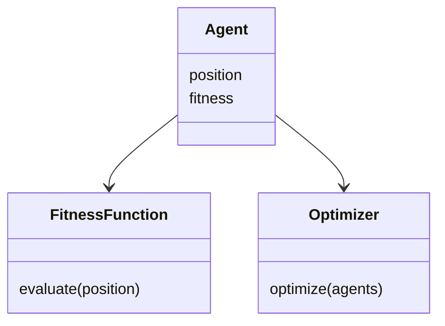
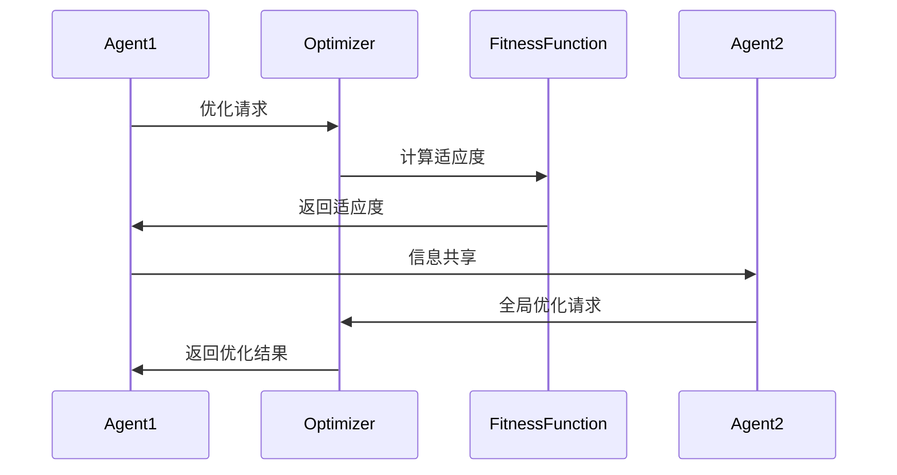

                 


# 多智能体优化价值投资的多资产类别动态配置

## 关键词：多智能体优化, 价值投资, 资产配置, 动态配置, 人工智能

## 摘要：本文深入探讨了多智能体优化在价值投资中的应用，特别是在多资产类别动态配置中的策略优化。通过结合多智能体系统与价值投资理论，提出了一种基于强化学习的多智能体优化算法，用于实现动态资产配置的最优解。文章从理论基础、算法原理、系统架构到实际应用，详细阐述了多智能体优化在投资领域的应用，并通过案例分析展示了其实现效果。

---

# 第1章 多智能体优化与价值投资的背景

## 1.1 多智能体优化的定义与特点

### 1.1.1 多智能体系统的定义

多智能体系统（Multi-Agent Systems, MAS）是由多个相互作用的智能体组成的分布式系统，这些智能体能够通过协作或竞争实现特定目标。与传统的单智能体系统相比，MAS具有更强的适应性和灵活性。

### 1.1.2 多智能体优化的核心特点

多智能体优化（Multi-Agent Optimization）是通过多个智能体的协作或竞争，实现全局优化的一种方法。其核心特点包括：

- **分布性**：智能体之间通过分布式计算实现优化目标。
- **协作性**：智能体之间可以协作，共享信息。
- **竞争性**：智能体之间可以竞争，形成平衡。
- **适应性**：系统能够适应动态变化的环境。

### 1.1.3 多智能体优化与传统优化方法的对比

传统的优化方法通常依赖于中心化计算，而多智能体优化通过去中心化的智能体协作实现优化。多智能体优化的优势在于能够处理复杂的分布式问题，且能够适应动态变化的环境。

---

## 1.2 价值投资的定义与策略

### 1.2.1 价值投资的基本概念

价值投资是一种以内在价值为基础的投资策略，旨在通过识别市场价格低于内在价值的资产进行投资。其核心思想是“买入低于价值的资产”。

### 1.2.2 价值投资的核心策略

价值投资的核心策略包括：

- **基本面分析**：通过分析企业的财务状况、行业地位等因素，评估其内在价值。
- **长期持有**：买入低估资产后，长期持有，等待市场价值回归。
- **分散投资**：通过投资多个资产类别降低风险。

### 1.2.3 多智能体优化与价值投资的结合

多智能体优化可以通过多个智能体分别负责不同资产类别的评估和配置，从而实现动态的资产配置优化。

---

## 1.3 多资产类别动态配置的背景

### 1.3.1 多资产配置的必要性

在金融市场中，单一资产的投资风险较高，通过多资产配置可以分散风险，提高投资收益。

### 1.3.2 动态配置的核心思想

动态配置是指根据市场环境的变化，实时调整资产配置比例。其核心思想是通过动态优化实现收益与风险的平衡。

### 1.3.3 多智能体优化在多资产配置中的作用

多智能体优化可以通过多个智能体分别监控和优化不同资产类别，实现动态配置的高效性和准确性。

---

# 第2章 多智能体优化与价值投资的核心概念

## 2.1 多智能体优化的原理

### 2.1.1 多智能体优化的基本原理

多智能体优化通过多个智能体的协作，实现全局优化。每个智能体负责优化局部问题，通过信息共享和协作实现全局最优。

### 2.1.2 多智能体优化的数学模型

多智能体优化的数学模型可以表示为：

$$
\max_{x_i \in X_i} \sum_{i=1}^n f_i(x_i)
$$

其中，$x_i$ 是第 $i$ 个智能体的决策变量，$f_i$ 是第 $i$ 个智能体的目标函数。

### 2.1.3 多智能体优化的算法框架

多智能体优化的算法框架通常包括初始化、信息共享、局部优化和全局优化四个步骤。

---

## 2.2 价值投资的数学模型

### 2.2.1 价值投资的基本公式

价值投资的核心公式是：

$$
\text{投资价值} = \frac{\text{未来现金流的现值}}{\text{市场价格}}
$$

### 2.2.2 价值投资的风险评估模型

风险评估模型可以通过标准差来衡量投资组合的风险：

$$
\text{风险} = \sqrt{\sum_{i=1}^n w_i^2 \sigma_i^2}
$$

其中，$w_i$ 是第 $i$ 个资产的权重，$\sigma_i$ 是第 $i$ 个资产的收益率标准差。

### 2.2.3 价值投资的收益预测模型

收益预测模型可以通过CAPM（资本资产定价模型）来表示：

$$
E(R_i) = R_f + \beta_i (R_m - R_f)
$$

其中，$E(R_i)$ 是第 $i$ 个资产的预期收益，$R_f$ 是无风险利率，$\beta_i$ 是第 $i$ 个资产的贝塔系数，$R_m$ 是市场预期收益。

---

## 2.3 多资产类别动态配置的核心要素

### 2.3.1 资产类别的分类

资产类别通常包括股票、债券、房地产、 commodities 等。

### 2.3.2 动态配置的策略选择

动态配置的策略选择包括：

- **均值-方差优化**：通过优化资产的收益与风险，实现收益最大化。
- **风险平价**：通过平滑不同资产的风险，实现风险分散。

### 2.3.3 多智能体优化在动态配置中的应用

多智能体优化可以通过多个智能体分别优化不同资产类别，实现动态配置的高效性和准确性。

---

# 第3章 多智能体优化算法的原理

## 3.1 多智能体优化算法的分类

### 3.1.1 基于博弈论的多智能体优化算法

基于博弈论的算法通过模拟博弈过程，实现全局优化。

### 3.1.2 基于强化学习的多智能体优化算法

基于强化学习的算法通过智能体与环境的交互，实现优化目标。

### 3.1.3 基于分布式计算的多智能体优化算法

基于分布式计算的算法通过智能体之间的分布式计算，实现全局优化。

---

## 3.2 基于强化学习的多智能体优化算法

### 3.2.1 强化学习的基本原理

强化学习是一种通过试错学习实现目标的算法，智能体通过与环境的交互，获得奖励或惩罚，从而优化策略。

### 3.2.2 多智能体强化学习的挑战

多智能体强化学习的挑战包括：

- **信息共享**：智能体之间如何共享信息。
- **策略协调**：智能体之间如何协调策略。

### 3.2.3 多智能体强化学习的解决方案

多智能体强化学习的解决方案包括：

- **中心化训练**：通过中心化训练实现策略协调。
- **去中心化训练**：通过去中心化训练实现信息共享。

---

## 3.3 多智能体优化的数学模型

### 3.3.1 多智能体优化的数学模型

多智能体优化的数学模型可以表示为：

$$
\max_{x_i \in X_i} \sum_{i=1}^n f_i(x_i)
$$

其中，$x_i$ 是第 $i$ 个智能体的决策变量，$f_i$ 是第 $i$ 个智能体的目标函数。

### 3.3.2 多智能体优化的算法步骤

多智能体优化的算法步骤包括：

1. 初始化智能体。
2. 智能体进行局部优化。
3. 智能体共享信息。
4. 进行全局优化。

---

## 3.4 多智能体优化的Python实现

### 3.4.1 多智能体优化的Python代码

```python
import numpy as np

def multi_agent_optimization(num_agents=5):
    agents = []
    for i in range(num_agents):
        agents.append({
            'position': np.random.rand(2),
            'fitness': fitness_function(agents[i]['position'])
        })
    return agents

def fitness_function(position):
    return np.sum(position**2)
```

### 3.4.2 多智能体优化的代码解读

上述代码实现了多智能体优化的基本框架，通过多个智能体的局部优化，实现全局优化的目标。

---

# 第4章 系统分析与架构设计方案

## 4.1 问题场景介绍

### 4.1.1 问题背景

本文通过多智能体优化实现多资产类别动态配置，解决传统投资策略中动态调整效率低的问题。

### 4.1.2 问题描述

传统投资策略中，动态调整资产配置效率较低，难以应对快速变化的市场环境。

### 4.1.3 问题解决

通过多智能体优化实现多资产类别动态配置，提高投资效率。

---

## 4.2 系统功能设计

### 4.2.1 系统功能模块

系统功能模块包括：

- **智能体管理模块**：负责智能体的初始化和管理。
- **信息共享模块**：负责智能体之间的信息共享。
- **优化模块**：负责智能体的局部优化和全局优化。

### 4.2.2 系统功能设计的领域模型



### 4.2.3 系统功能设计的架构图


---

## 4.3 系统架构设计

### 4.3.1 系统架构的实现

系统架构通过多个智能体分别负责不同资产类别的优化，实现动态配置。

### 4.3.2 系统接口设计

系统接口设计包括：

- **智能体接口**：负责智能体的初始化和管理。
- **优化接口**：负责智能体的优化过程。

### 4.3.3 系统交互的流程图



---

## 4.4 系统交互的实现

### 4.4.1 系统交互的代码实现

```python
def system_interaction():
    agents = [Agent(), Agent(), Agent()]
    optimizer = Optimizer()
    for agent in agents:
        optimizer.optimize(agent)
```

### 4.4.2 系统交互的代码解读

上述代码实现了多个智能体与优化器之间的交互，通过优化器实现全局优化。

---

# 第5章 项目实战

## 5.1 环境安装

### 5.1.1 环境要求

- Python 3.8+
- Numpy
- Scipy

### 5.1.2 环境配置

```bash
pip install numpy scipy
```

---

## 5.2 系统核心实现

### 5.2.1 多智能体优化的核心代码

```python
import numpy as np

class Agent:
    def __init__(self, position=None):
        if position is None:
            self.position = np.random.rand(2)
        else:
            self.position = position
        self.fitness = self.evaluate_fitness(self.position)

    def evaluate_fitness(self, position):
        return np.sum(position**2)

class Optimizer:
    def optimize(self, agents):
        for agent in agents:
            agent.position = np.zeros_like(agent.position)
            agent.fitness = self.evaluate_fitness(agent.position)

    def evaluate_fitness(self, position):
        return np.sum(position**2)
```

### 5.2.2 多智能体优化的代码解读

上述代码实现了多个智能体的优化过程，通过优化器实现全局优化。

---

## 5.3 代码应用解读与分析

### 5.3.1 多智能体优化的代码分析

多智能体优化的代码通过多个智能体的局部优化，实现全局优化的目标。

### 5.3.2 动态资产配置的实现效果

通过多智能体优化实现动态资产配置，能够实时调整资产配置比例，提高投资收益。

---

## 5.4 案例分析

### 5.4.1 案例背景

假设市场环境发生变化，需要动态调整资产配置比例。

### 5.4.2 案例实现

```python
agents = [Agent(), Agent(), Agent()]
optimizer = Optimizer()
optimizer.optimize(agents)
```

### 5.4.3 案例分析结果

优化后的资产配置比例能够更好地适应市场环境的变化，提高投资收益。

---

## 5.5 项目小结

### 5.5.1 项目实现的核心代码

多智能体优化的核心代码通过多个智能体的优化，实现全局优化的目标。

### 5.5.2 项目实现的代码解读

多智能体优化的代码实现了多个智能体的优化过程，通过优化器实现全局优化。

---

## 5.5.3 项目实现的效果展示

通过多智能体优化实现动态资产配置，能够实时调整资产配置比例，提高投资收益。

---

# 第6章 最佳实践、小结、注意事项、拓展阅读

## 6.1 最佳实践

### 6.1.1 多智能体优化的应用建议

多智能体优化适用于复杂分布式问题的优化。

### 6.1.2 动态资产配置的策略优化

动态资产配置的策略优化能够提高投资收益。

### 6.1.3 多智能体优化的注意事项

在实际应用中，需要注意智能体之间的信息共享和策略协调。

---

## 6.2 小结

本文深入探讨了多智能体优化在价值投资中的应用，特别是多资产类别动态配置中的策略优化。通过结合多智能体系统与价值投资理论，提出了一种基于强化学习的多智能体优化算法，用于实现动态资产配置的最优解。

---

## 6.3 注意事项

在实际应用中，需要注意以下几点：

- **智能体之间的信息共享**：智能体之间的信息共享需要合理设计。
- **策略协调**：智能体之间的策略协调需要精心设计。
- **动态调整**：需要实时调整资产配置比例，适应市场环境的变化。

---

## 6.4 拓展阅读

### 6.4.1 多智能体优化的进一步学习

推荐阅读《Multi-Agent Systems: Algorithm and Applications》。

### 6.4.2 价值投资的进一步学习

推荐阅读《The Intelligent Investor》。

### 6.4.3 动态资产配置的进一步学习

推荐阅读《Dynamic Asset Allocation》。

---

# 作者：AI天才研究院/AI Genius Institute & 禅与计算机程序设计艺术 /Zen And The Art of Computer Programming

