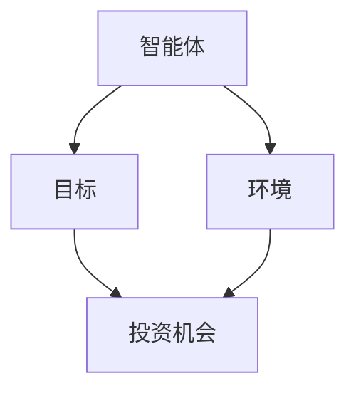
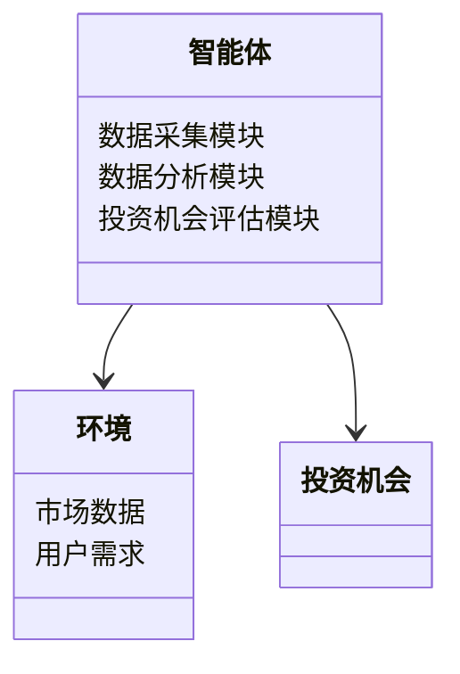
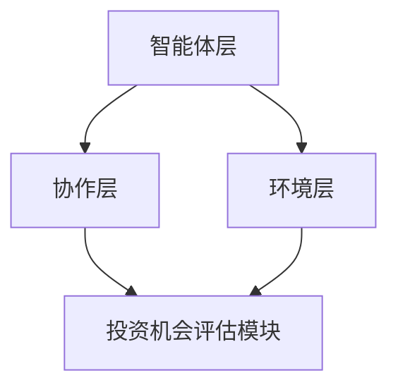
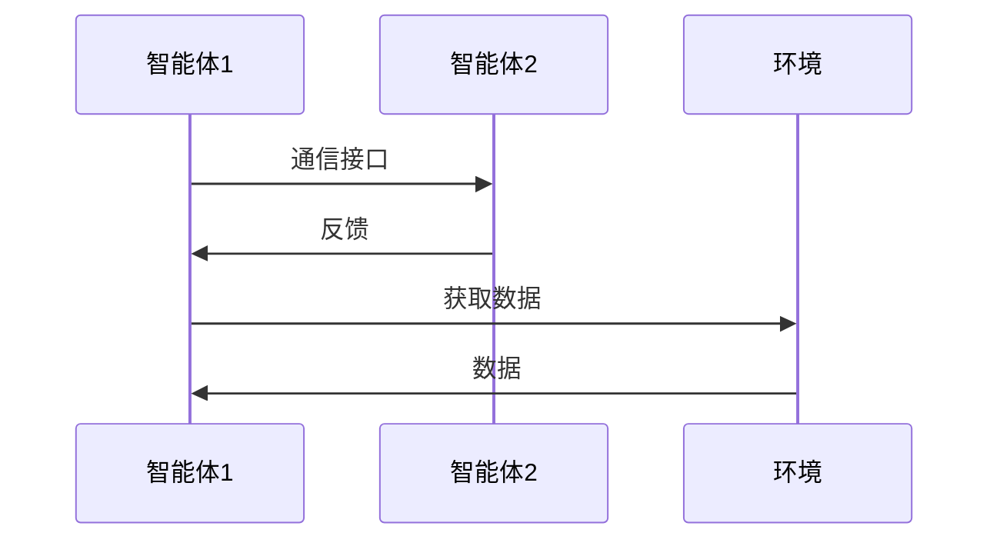

                 


# 多智能体系统在识别和评估新兴行业投资机会中的作用

## 关键词：多智能体系统，新兴行业，投资机会，人工智能，系统架构

## 摘要：  
本文探讨了多智能体系统（MAS）在识别和评估新兴行业投资机会中的作用。通过分析MAS的核心概念、算法原理、系统架构以及实际项目案例，本文展示了如何利用MAS的强大能力来优化投资决策过程，帮助投资者在快速变化的市场中捕捉潜在机会。文章还详细介绍了MAS在金融投资中的应用背景、算法原理以及系统设计，为读者提供了全面的视角。

---

# 第1章: 多智能体系统（MAS）的基本概念

## 1.1 多智能体系统（MAS）的定义与特点

### 1.1.1 多智能体系统的定义  
多智能体系统（Multi-Agent System, MAS）是由多个智能体（Agent）组成的复杂系统。这些智能体能够通过感知环境、自主决策并进行协作，共同完成特定任务。MAS的核心在于智能体之间的交互与协作，而非单一智能体的独立运作。

### 1.1.2 多智能体系统的核心特点  
- **分布式性**：智能体分布在不同的位置，能够独立决策和行动。  
- **协作性**：智能体之间通过通信和协作完成共同目标。  
- **反应性**：智能体能够根据环境变化实时调整行为。  
- **自治性**：每个智能体都具有一定的自主性和决策能力。  

### 1.1.3 多智能体系统与传统单智能体系统的区别  
| 特性         | 单智能体系统       | 多智能体系统       |  
|--------------|--------------------|--------------------|  
| 决策中心     | 单一决策中心       | 分布式决策中心     |  
| 通信方式     | 无通信             | 智能体间通信       |  
| 系统复杂性   | 简单               | 复杂               |  

---

## 1.2 多智能体系统在金融投资中的应用背景

### 1.2.1 金融投资领域的复杂性  
金融市场的复杂性主要体现在以下方面：  
1. **信息不对称**：投资者获取的信息可能存在偏差。  
2. **动态变化**：市场环境和投资机会随时变化。  
3. **多样性**：新兴行业涉及多个领域，具有多样化特征。  

### 1.2.2 多智能体系统在金融投资中的优势  
- **高效性**：MAS能够快速处理海量数据，提供实时分析。  
- **协作性**：智能体之间能够协同工作，覆盖多个投资维度。  
- **适应性**：MAS能够根据市场变化动态调整策略。  

### 1.2.3 新兴行业投资机会的特点  
- **高增长性**：新兴行业通常具有较高的增长潜力。  
- **不确定性**：新兴行业的市场前景具有不确定性。  
- **多样性**：新兴行业涵盖多个领域，如科技、绿色能源等。  

---

## 1.3 多智能体系统在新兴行业投资中的价值

### 1.3.1 新兴行业的定义与特点  
新兴行业是指在短时间内迅速发展、具有较高增长潜力的行业。其特点包括：  
- **技术创新驱动**：新兴行业通常由技术创新推动。  
- **市场渗透低**：新兴行业在市场中的渗透率较低。  
- **竞争激烈**：新兴行业往往面临激烈的竞争。  

### 1.3.2 多智能体系统在新兴行业投资中的应用场景  
- **数据收集与分析**：MAS可以实时收集并分析新兴行业的市场数据。  
- **趋势预测**：通过MAS的协作学习算法，预测行业发展趋势。  
- **投资决策支持**：MAS能够为投资者提供个性化的投资建议。  

### 1.3.3 多智能体系统如何帮助识别和评估投资机会  
- **信息整合**：MAS能够整合多源数据，提供全面的市场分析。  
- **风险评估**：通过MAS的博弈论算法，评估投资风险。  
- **动态调整**：MAS能够根据市场变化动态调整投资策略。  

---

## 1.4 本章小结  
本章介绍了多智能体系统的基本概念、在金融投资中的应用背景以及在新兴行业投资中的价值。通过MAS的强大能力，投资者能够更高效地识别和评估新兴行业的投资机会。

---

# 第2章: 多智能体系统的核心概念与联系

## 2.1 多智能体系统的组成与核心要素

### 2.1.1 智能体的定义与属性  
智能体（Agent）是一个能够感知环境、自主决策并采取行动的实体。智能体的属性包括：  
- **自主性**：能够独立决策。  
- **反应性**：能够根据环境变化调整行为。  
- **协作性**：能够与其他智能体协作完成任务。  

### 2.1.2 多智能体系统的组成结构  
多智能体系统的组成结构可以分为以下层次：  
1. **智能体层**：由多个智能体组成，每个智能体负责特定任务。  
2. **协作层**：负责智能体之间的通信与协作。  
3. **环境层**：智能体所处的外部环境，包括市场数据、用户需求等。  

### 2.1.3 核心要素的特征对比表格  
| 特征     | 单智能体系统       | 多智能体系统       |  
|----------|--------------------|--------------------|  
| 智能体数量 | 单一               | 多个               |  
| 通信方式 | 无通信             | 智能体间通信       |  
| 系统复杂性 | 简单               | 复杂               |  

---

## 2.2 多智能体系统的实体关系分析

### 2.2.1 ER实体关系图架构  
以下是一个简单的ER实体关系图，展示了MAS中的核心实体及其关系：  
- **智能体**：负责执行任务。  
- **环境**：智能体所处的外部环境。  
- **目标**：智能体需要实现的目标。  
- **投资机会**：智能体识别的投资机会。  

### 2.2.2 Mermaid流程图展示  


---

## 2.3 本章小结  
本章详细介绍了多智能体系统的组成与核心要素，并通过实体关系图和Mermaid流程图展示了MAS的结构和各部分之间的关系。

---

# 第3章: 多智能体系统的算法原理

## 3.1 多智能体系统中的典型算法

### 3.1.1 分布式计算算法  
分布式计算算法是一种在MAS中广泛应用的算法，用于实现智能体之间的协作与通信。  
- **工作原理**：通过分布式计算，智能体能够将任务分解为多个子任务，并在不同节点上进行计算。  
- **应用场景**：适用于需要大规模数据处理和实时响应的任务。  

### 3.1.2 协同学习算法  
协同学习算法是一种基于机器学习的算法，用于实现智能体之间的知识共享与协作。  
- **工作原理**：通过协同学习，智能体能够共享数据、模型和知识，从而提高整体的决策能力。  
- **应用场景**：适用于需要多智能体协同完成复杂任务的情况。  

### 3.1.3 博弈论与决策算法  
博弈论与决策算法是一种基于博弈论的算法，用于实现智能体之间的策略选择与优化。  
- **工作原理**：通过分析不同策略的收益与风险，选择最优策略。  
- **应用场景**：适用于需要多智能体竞争与协作的场景。  

---

## 3.2 多智能体系统的数学模型

### 3.2.1 分布式计算的数学模型  
分布式计算的数学模型可以表示为：  
$$ \text{任务分解} = \sum_{i=1}^{n} \text{子任务}_i $$  
其中，$n$表示子任务的数量。

### 3.2.2 协同学习的数学模型  
协同学习的数学模型可以表示为：  
$$ \text{整体性能} = \sum_{i=1}^{m} \text{智能体}_i \text{的贡献} $$  
其中，$m$表示智能体的数量。

### 3.2.3 博弈论的数学模型  
博弈论的数学模型可以表示为：  
$$ \text{最优策略} = \arg\max_{s \in S} \text{收益}(s) - \text{风险}(s) $$  
其中，$S$表示所有可能的策略。

---

## 3.3 本章小结  
本章介绍了多智能体系统中的典型算法，包括分布式计算算法、协同学习算法和博弈论与决策算法，并通过数学模型展示了这些算法的核心思想。

---

# 第4章: 多智能体系统的系统架构设计

## 4.1 问题场景介绍  
本章将通过一个具体的项目案例，展示如何利用多智能体系统来识别和评估新兴行业投资机会。项目目标是设计一个基于MAS的投资机会评估系统。

---

## 4.2 系统功能设计

### 4.2.1 领域模型图  
以下是一个简单的领域模型图，展示了MAS的投资机会评估系统的主要功能模块：  
- **数据采集模块**：负责采集市场数据。  
- **数据分析模块**：负责分析市场数据。  
- **投资机会评估模块**：负责评估投资机会。  



---

## 4.3 系统架构设计

### 4.3.1 系统架构图  
以下是一个基于MAS的投资机会评估系统的架构图：  
- **智能体层**：由多个智能体组成，每个智能体负责特定任务。  
- **协作层**：负责智能体之间的通信与协作。  
- **环境层**：包括市场数据和用户需求。  



---

## 4.4 系统接口设计  
系统接口设计主要涉及智能体之间的通信接口和与外部环境的接口。以下是接口设计的简单示意图：  


---

## 4.5 本章小结  
本章通过一个具体的项目案例，展示了多智能体系统的系统架构设计，包括领域模型图、系统架构图和接口设计。

---

# 第5章: 多智能体系统的项目实战

## 5.1 环境安装  
本项目需要以下环境：  
- **Python**：3.8及以上版本。  
- **依赖库**：`numpy`, `pandas`, `scikit-learn`。  

## 5.2 系统核心实现

### 5.2.1 数据采集模块  
```python
import numpy as np
import pandas as pd

def collect_data():
    # 数据采集逻辑
    data = pd.DataFrame(np.random.rand(100, 5), columns=['特征1', '特征2', '特征3', '特征4', '特征5'])
    return data

if __name__ == '__main__':
    data = collect_data()
    print(data)
```

### 5.2.2 数据分析模块  
```python
from sklearn.cluster import KMeans

def analyze_data(data):
    # 数据分析逻辑
    model = KMeans(n_clusters=3)
    model.fit(data)
    return model.labels_

if __name__ == '__main__':
    data = pd.DataFrame(np.random.rand(100, 5), columns=['特征1', '特征2', '特征3', '特征4', '特征5'])
    labels = analyze_data(data)
    print(labels)
```

### 5.2.3 投资机会评估模块  
```python
def evaluate_opportunity(labels):
    # 投资机会评估逻辑
    opportunity = labels[0]
    return opportunity

if __name__ == '__main__':
    labels = [0, 1, 2]
    opportunity = evaluate_opportunity(labels)
    print(opportunity)
```

---

## 5.3 代码解读与分析  
以上代码展示了MAS在投资机会评估中的核心实现，包括数据采集、数据分析和投资机会评估三个模块。通过这些模块的协作，系统能够实时分析市场数据并评估投资机会。

---

## 5.4 实际案例分析  
通过上述代码的运行，我们可以看到MAS在新兴行业投资机会评估中的实际应用。例如，在科技行业，MAS可以通过数据分析模块识别出具有高增长潜力的新兴技术，并通过投资机会评估模块提供投资建议。

---

## 5.5 本章小结  
本章通过一个具体的项目案例，展示了多智能体系统的实际应用，包括环境安装、系统核心实现、代码解读与分析以及实际案例分析。

---

# 第6章: 多智能体系统的最佳实践与展望

## 6.1 最佳实践  
- **数据质量**：确保数据的准确性和完整性。  
- **算法优化**：根据具体场景选择合适的算法。  
- **系统维护**：定期更新系统和模型，确保系统的高效运行。  

## 6.2 小结  
本文详细探讨了多智能体系统在识别和评估新兴行业投资机会中的作用，通过理论分析和实际案例展示了MAS的强大能力。

## 6.3 注意事项  
- **数据隐私**：在数据采集和分析过程中，需要注意数据隐私和合规性。  
- **系统安全性**：确保系统的安全性，防止数据泄露和攻击。  
- **算法可解释性**：在复杂场景中，需要确保算法的可解释性。  

## 6.4 拓展阅读  
- 推荐阅读相关领域的书籍和论文，深入理解多智能体系统的理论和应用。  

---

# 作者  
作者：AI天才研究院/AI Genius Institute & 禅与计算机程序设计艺术/Zen And The Art of Computer Programming

