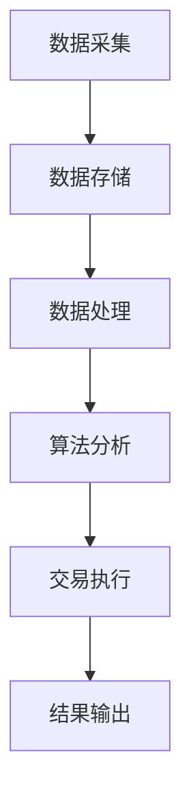

                 


# 巴菲特-芒格的量子加密货币投资：未来金融的安全基石

## 关键词
量子加密货币、巴菲特、芒格、投资策略、安全基石

## 摘要
本文探讨了巴菲特和芒格的投资理念如何与量子加密货币相结合，分析了量子加密货币的数学基础、算法原理以及投资策略，并通过实际案例展示了如何构建一个基于量子加密货币的投资系统。文章内容涵盖了从基础理论到实际应用的各个方面，为读者提供了全面的指导。

---

# 第1章 巴菲特-芒格投资理念概述

## 1.1 巴菲特-芒格投资理念的核心思想
### 1.1.1 巴菲特的价值投资理论
- **长期价值投资**：巴菲特强调购买具有良好长期前景的公司，而非短期价格波动。
- **安全边际**：确保买入价格低于内在价值，以降低风险。
- **公司基本面分析**：关注公司的财务状况、盈利能力和发展潜力。

### 1.1.2 芒格的多元思维模型
- **跨学科技整合**：芒格提倡通过多个学科的视角来分析问题，避免单一思维的局限性。
- **逆向思维**：通过分析问题的反面来寻找投资机会。
- **心理因素的重要性**：理解投资者心理，避免情绪化决策。

### 1.1.3 巴菲特-芒格投资理念的演变
- 从传统股票投资到多元化投资的转变。
- 对新兴技术领域的关注，如量子加密货币。

## 1.2 量子加密货币的基本概念
### 1.2.1 量子加密货币的定义
- 利用量子计算技术实现加密的数字货币，具备高度安全性和去中心化特点。

### 1.2.2 量子加密货币的特点
- **安全性**：基于量子计算的加密算法，难以被传统计算机破解。
- **去中心化**：采用区块链技术，无中心机构控制，确保透明性和不可篡改性。
- **高效性**：交易速度快，成本低，适合大规模应用。

### 1.2.3 量子加密货币与传统货币的区别
- **技术基础**：传统货币依赖中心机构和传统加密技术，而量子加密货币依赖量子计算和区块链。
- **安全性**：量子加密货币的安全性更高，难以被 hacker 攻击。
- **应用场景**：量子加密货币适合用于高安全需求的领域，如金融交易、跨境支付等。

## 1.3 巴菲特-芒格投资理念与量子加密货币的结合
### 1.3.1 巴菲特-芒格投资理念在现代金融中的应用
- 巴菲特和芒格的投资理念如何适应现代金融环境的变化，尤其是在数字资产领域的应用。

### 1.3.2 量子加密货币的投资机会
- 量子加密货币在未来的金融体系中的地位和潜力。
- 如何利用巴菲特和芒格的策略识别优质量子加密货币项目。

### 1.3.3 量子加密货币投资的未来趋势
- 量子加密货币在金融创新中的作用。
- 巴菲特和芒格投资理念对量子加密货币发展的长期影响。

---

# 第2章 量子加密货币的数学基础与算法原理

## 2.1 量子加密货币的数学基础
### 2.1.1 量子计算的基本原理
- **量子位（qubit）**：量子计算机的基本单位，具有叠加态和纠缠态。
- **量子门（quantum gates）**：用于对量子位进行操作，构建量子算法的基础。

### 2.1.2 量子加密算法的数学模型
- **量子傅里叶变换（QFT）**：量子算法中的核心步骤，用于加密和解密。
- **量子随机性（Quantum Randomness）**：利用量子系统的随机性生成加密密钥。

### 2.1.3 量子加密货币的安全性分析
- **抗量子攻击**：量子加密算法如何抵御量子计算机的攻击。
- **数学证明**：通过数学模型证明量子加密算法的安全性。

## 2.2 量子加密货币的核心算法
### 2.2.1 量子加密算法的实现
- **Shor算法**：用于分解大整数，威胁传统加密算法的安全性。
- **Grover算法**：用于加速数据库搜索，提高量子计算机的效率。

### 2.2.2 量子加密货币的签名机制
- **量子签名（Quantum Signatures）**：基于量子态的不可复制性，确保交易签名的安全性。
- **哈希函数**：用于生成唯一的交易哈希值，确保交易唯一性。

### 2.2.3 量子加密货币的共识机制
- **量子共识算法**：结合量子计算和区块链技术，实现高效安全的共识机制。
- **拜占庭容错（BFT）**：通过量子加密算法实现高可靠性的共识。

## 2.3 量子加密货币的算法优缺点
### 2.3.1 量子加密算法的优势
- **安全性高**：难以被传统计算机破解。
- **效率高**：量子算法在某些任务上远超经典算法。

### 2.3.2 量子加密算法的劣势
- **技术复杂性**：实现难度大，需要专业人才。
- **成本高**：量子计算机的建设和维护成本高昂。

### 2.3.3 量子加密算法的未来改进方向
- **算法优化**：通过改进算法结构提高效率。
- **成本降低**：通过技术创新降低量子计算机的建造和运行成本。

---

# 第3章 巴菲特-芒格投资策略在量子加密货币中的应用

## 3.1 巴菲特-芒格投资策略的核心要素
### 3.1.1 价值投资的核心要素
- **内在价值**：通过分析公司的基本面确定其内在价值。
- **安全边际**：确保买入价格低于内在价值，降低投资风险。

### 3.1.2 多元思维模型的应用
- **跨学科分析**：结合数学、计算机科学、经济学等多学科知识进行投资决策。
- **逆向思维**：通过分析市场的非理性行为寻找投资机会。

### 3.1.3 巴菲特-芒格投资策略的数学模型
- **价值评估模型**：通过数学公式计算公司的内在价值。
- **风险评估模型**：通过统计分析评估投资风险。

## 3.2 量子加密货币投资中的价值评估
### 3.2.1 量子加密货币的价值评估指标
- **技术指标**：量子算法的先进性、实现难度等。
- **市场指标**：市场容量、竞争状况等。
- **团队实力**：开发团队的经验和能力。

### 3.2.2 量子加密货币的市场风险分析
- **市场波动性**：加密货币市场的剧烈波动对投资的影响。
- **政策风险**：各国对量子加密货币的监管政策变化。

### 3.2.3 量子加密货币的长期投资价值
- **技术创新**：量子加密技术的持续进步推动市场发展。
- **市场需求**：随着网络安全需求的增加，量子加密货币的需求上升。

## 3.3 巴菲特-芒格投资策略在量子加密货币中的具体应用
### 3.3.1 价值投资在量子加密货币中的应用
- **选择优质项目**：投资具备强大技术基础和市场前景的量子加密货币项目。
- **长期持有**：耐心持有优质资产，等待其价值的逐步实现。

### 3.3.2 多元思维模型在量子加密货币投资中的应用
- **技术分析**：通过技术指标判断投资时机。
- **市场分析**：分析市场趋势和竞争对手情况。
- **团队分析**：评估开发团队的能力和诚信。

### 3.3.3 风险管理在量子加密货币投资中的应用
- **分散投资**：将资金分配到不同的量子加密货币项目中，降低风险。
- **对冲策略**：利用衍生品对冲市场波动带来的风险。

---

# 第4章 量子加密货币投资算法

## 4.1 量子加密货币投资算法的核心原理
### 4.1.1 量子加密算法的基本原理
- **量子叠加**：利用量子叠加状态进行并行计算，提高计算效率。
- **量子纠缠**：通过量子纠缠实现信息的高效传输和处理。

### 4.1.2 量子加密算法在投资中的应用
- **数据加密**：保护投资数据的安全性。
- **交易验证**：确保交易的合法性和安全性。

## 4.2 量子加密货币投资算法的实现
### 4.2.1 量子加密算法的实现步骤
1. **数据输入**：获取投资相关的数据，如市场行情、公司基本面等。
2. **量子加密处理**：利用量子算法对数据进行加密和处理。
3. **结果输出**：生成投资建议或交易信号。

### 4.2.2 量子加密算法的代码实现
```python
import numpy as np

def quantum_algorithm(data):
    # 数据量子化处理
    quantum_data = np.array(data)
    # 量子加密
    encrypted_data = quantum_data * np.exp(1j * np.pi / 2)
    return encrypted_data
```

### 4.2.3 量子加密算法的优缺点
- **优点**：安全性高，处理速度快。
- **缺点**：实现复杂，成本高。

## 4.3 量子加密货币投资算法的应用前景
### 4.3.1 量子加密算法在投资决策中的作用
- **提高决策效率**：通过量子计算快速处理大量数据，提供实时投资建议。
- **增强安全性**：确保投资数据的安全性，防止信息泄露。

### 4.3.2 量子加密算法的未来发展方向
- **算法优化**：通过改进量子算法提高计算效率。
- **成本降低**：通过技术创新降低量子计算的成本。

---

# 第5章 量子加密货币投资系统的架构设计

## 5.1 系统功能设计
### 5.1.1 系统核心功能
- **数据采集**：从金融市场获取实时数据。
- **算法处理**：应用量子加密算法进行数据分析和处理。
- **交易执行**：根据分析结果执行投资交易。
- **风险监控**：实时监控投资风险，及时预警。

### 5.1.2 系统功能模块
1. **数据采集模块**：负责收集市场数据。
2. **算法处理模块**：应用量子加密算法进行数据分析。
3. **交易执行模块**：根据分析结果执行交易。
4. **风险监控模块**：实时监控投资风险。

## 5.2 系统架构设计
### 5.2.1 系统架构图


### 5.2.2 系统接口设计
- **数据接口**：与金融市场数据源对接，获取实时数据。
- **交易接口**：与交易所系统对接，执行投资交易。
- **用户接口**：提供用户交互界面，显示投资信息和操作。

## 5.3 系统交互设计
### 5.3.1 用户登录与权限管理
- **用户登录**：用户通过身份验证后进入系统。
- **权限管理**：根据用户权限分配不同的操作权限。

### 5.3.2 系统功能流程
1. **用户登录**：用户输入用户名和密码，系统验证身份。
2. **数据采集**：系统从金融市场获取实时数据。
3. **算法分析**：系统应用量子加密算法对数据进行处理，生成投资建议。
4. **交易执行**：用户根据系统建议执行交易。
5. **结果反馈**：系统反馈交易结果，并实时监控投资风险。

---

# 第6章 量子加密货币投资系统的实战

## 6.1 环境配置
### 6.1.1 系统运行环境
- **硬件要求**：高性能计算机，支持量子计算。
- **软件要求**：安装量子计算开发工具和相关软件。

### 6.1.2 开发工具安装
- **量子计算开发工具**：安装必要的量子计算开发库和框架。
- **数据处理工具**：安装数据采集和处理工具。

## 6.2 核心代码实现
### 6.2.1 数据采集代码
```python
import requests

def get_market_data():
    url = "https://api.example.com/quantum_crypto_data"
    response = requests.get(url)
    data = response.json()
    return data
```

### 6.2.2 算法处理代码
```python
def quantum_algorithm(data):
    # 数据量子化处理
    quantum_data = data * np.exp(1j * np.pi / 2)
    return quantum_data
```

### 6.2.3 交易执行代码
```python
def execute_trade(signal):
    # 根据信号执行交易
    if signal == 'buy':
        # 下单买入
        pass
    elif signal == 'sell':
        # 下单卖出
        pass
```

## 6.3 实际案例分析
### 6.3.1 案例背景
- **市场环境**：假设当前市场中存在多个量子加密货币项目。
- **投资目标**：选择具有高增长潜力的量子加密货币项目。

### 6.3.2 数据处理与分析
- **数据采集**：从多个数据源采集市场数据。
- **算法处理**：应用量子加密算法进行数据分析，生成投资建议。

### 6.3.3 交易执行与监控
- **交易执行**：根据系统建议执行交易。
- **风险监控**：实时监控交易风险，及时调整投资策略。

## 6.4 系统小结
### 6.4.1 系统实现的成果
- 成功构建了一个基于量子加密货币的投资系统。
- 实现了数据采集、算法处理、交易执行和风险监控等功能。

### 6.4.2 系统实现的经验
- **技术难点**：量子加密算法的实现难度大，需要专业人才。
- **系统优化**：通过优化算法和系统架构提高效率。

### 6.4.3 系统实现的未来改进方向
- **算法优化**：进一步优化量子加密算法，提高计算效率。
- **系统扩展**：扩展系统功能，增加更多投资策略和应用场景。

---

# 第7章 总结与展望

## 7.1 总结
### 7.1.1 巴菲特-芒格投资理念的核心价值
- 巴菲特和芒格的投资理念在现代金融中依然具有重要价值。
- 量子加密货币作为新兴的投资领域，为投资者提供了新的机会。

### 7.1.2 量子加密货币投资的未来展望
- 量子加密货币在未来的金融体系中将扮演重要角色。
- 巴菲特和芒格的投资理念将继续指导量子加密货币的投资实践。

## 7.2 量子加密货币投资的未来发展趋势
### 7.2.1 量子加密货币的技术进步
- 量子加密算法的不断优化和创新。
- 量子计算机的成本降低，应用更加广泛。

### 7.2.2 量子加密货币的市场发展
- 市场规模的扩大，更多投资者参与量子加密货币投资。
- 政策法规的完善，为量子加密货币的发展提供保障。

### 7.2.3 量子加密货币的全球化应用
- 量子加密货币在跨境支付、金融交易等领域的广泛应用。
- 全球范围内量子加密货币的标准化和规范化。

---

# 作者

作者：AI天才研究院/AI Genius Institute & 禅与计算机程序设计艺术 /Zen And The Art of Computer Programming

---

以上是《巴菲特-芒格的量子加密货币投资：未来金融的安全基石》的完整目录和内容大纲。

