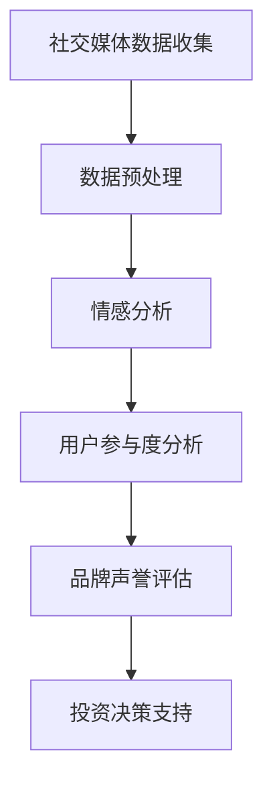
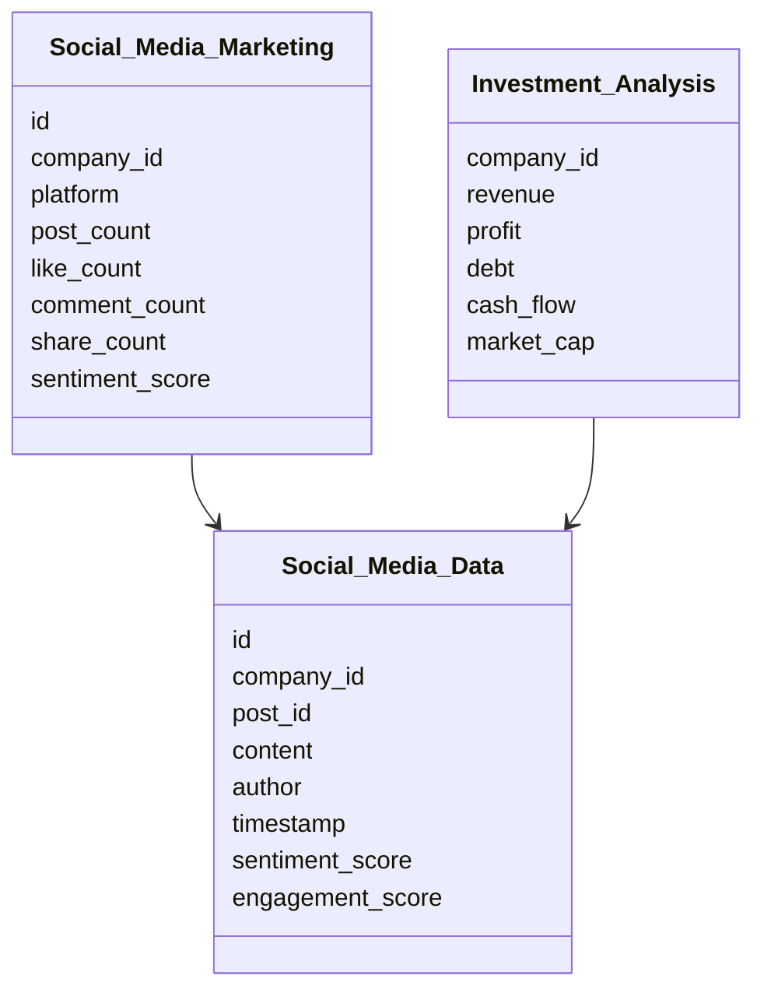

                 


# 彼得林奇如何评估公司的社交媒体营销效果

## 关键词：彼得林奇，社交媒体营销，投资分析，营销效果评估，数据驱动

## 摘要：本文详细探讨了彼得林奇如何将社交媒体营销效果纳入其投资分析体系，分析了社交媒体营销的核心要素、评估指标和方法，并结合实际案例展示了如何通过社交媒体数据来评估公司的营销效果，进而影响投资决策。文章结构清晰，内容详实，适合投资者和营销分析人士阅读。

---

## 第一部分: 背景与核心概念

### 第1章: 背景介绍

#### 1.1 问题背景

- **社交媒体营销的兴起与重要性**
  - 社交媒体平台（如Facebook、Twitter、Instagram）的普及改变了企业的营销方式，社交媒体营销已成为企业品牌推广和用户互动的重要手段。
  - 社交媒体营销能够实时监测品牌声誉、用户反馈和市场趋势，为投资决策提供实时数据支持。

- **彼得林奇投资方法的核心理念**
  - 彼得林奇以基本面分析著称，注重研究公司的财务状况、行业地位和管理团队。
  - 他认为，公司的长期价值取决于其核心业务的稳定性和增长潜力。

- **社交媒体营销如何影响公司价值**
  - 社交媒体营销能够提升品牌知名度、用户参与度和客户忠诚度，进而影响公司的收入和利润。
  - 通过社交媒体数据，投资者可以更全面地评估公司的市场表现和用户反馈。

#### 1.2 问题描述

- **社交媒体营销的定义与特征**
  - 社交媒体营销是指通过社交媒体平台推广品牌、产品或服务，与目标受众互动的一种营销方式。
  - 其特征包括互动性、病毒式传播、数据驱动和实时性。

- **彼得林奇投资分析中的关键问题**
  - 彼得林奇关注公司的基本面，包括收入、利润、负债和现金流等。
  - 他需要通过社交媒体数据来补充传统财务数据的不足，更全面地评估公司的市场表现。

- **社交媒体营销对公司基本面的影响**
  - 社交媒体营销可以提升品牌价值、增加用户流量和销售额，从而改善公司的财务状况。
  - 通过分析社交媒体数据，投资者可以更早地发现市场趋势和潜在风险。

#### 1.3 问题解决

- **社交媒体营销评估的核心目标**
  - 评估社交媒体营销的效果，包括品牌曝光度、用户参与度和转化率。
  - 通过分析社交媒体数据，为投资决策提供支持。

- **如何将社交媒体营销效果转化为投资决策依据**
  - 将社交媒体数据与传统财务数据结合，评估公司的市场表现和潜在增长。
  - 通过实时监测社交媒体数据，发现市场趋势和潜在风险。

- **社交媒体营销的边界与外延**
  - 社交媒体营销的边界在于其数据的局限性，如样本偏差和数据噪声。
  - 其外延包括与其他数字营销渠道（如SEO、内容营销）的结合。

#### 1.4 概念结构与核心要素组成

- **社交媒体营销的核心要素分析**
  - 品牌曝光度：品牌在社交媒体上的提及次数和覆盖范围。
  - 用户参与度：用户的点赞、评论、分享和关注行为。
  - 转化率：社交媒体用户转化为实际客户的比例。

- **投资分析中的关键指标**
  - 财务指标：收入、利润、负债、现金流。
  - 市场指标：市场份额、品牌价值、用户增长。

- **社交媒体营销与公司基本面的关联模型**
  - 通过回归分析，建立社交媒体数据与财务指标之间的关系模型。
  - 关键变量包括社交媒体曝光度、用户参与度和转化率。

---

## 第二部分: 核心概念与联系

### 第2章: 核心概念与联系

#### 2.1 社会媒体营销的核心原理

- **社交媒体营销的基本原理**
  - 基于用户生成内容（UGC）和社交网络效应，社交媒体营销能够快速传播品牌信息。
  - 通过数据分析，企业可以优化营销策略，提升营销效果。

- **彼得林奇投资分析的核心原理**
  - 通过基本面分析，评估公司的长期价值和潜在风险。
  - 关注公司的财务健康状况和管理团队的稳定性。

- **两者之间的联系与区别**
  - 联系：社交媒体数据可以作为公司基本面分析的补充信息。
  - 区别：社交媒体营销关注市场推广，投资分析关注财务表现。

#### 2.2 核心概念属性特征对比表格

| 概念               | 特征               | 描述                                                                 |
|--------------------|--------------------|----------------------------------------------------------------------|
| 社会媒体营销       | 互动性             | 用户与品牌之间的双向互动，用户可以实时反馈对品牌或产品的看法。            |
|                    | 病毒式传播         | 内容通过用户分享快速扩散，形成口碑效应，扩大品牌影响力。                  |
| 投资分析           | 数据驱动           | 基于财务数据和市场数据的分析，评估公司的投资价值和潜在风险。             |
|                    | 长期视角           | 关注公司的长期价值创造，而非短期市场波动。                                |

#### 2.3 ER实体关系图（使用 Mermaid）

```mermaid
erDiagram
    company {
     
      title 公司与社交媒体的关系
      company <--- social_media_data
      social_media_data --> user_engagement
      social_media_data --> brand_sentiment
      company --> financial_data
    }
```

---

## 第三部分: 算法原理

### 第3章: 算法原理

#### 3.1 算法流程图（使用 Mermaid）



#### 3.2 算法原理

- **情感分析**
  - 使用自然语言处理技术，分析社交媒体上的文本数据，判断用户情感倾向（正面、中性、负面）。
  - 例如，使用VADER情感分析器对社交媒体评论进行分类。

- **用户参与度分析**
  - 计算用户的互动行为，如点赞、评论、分享和关注次数。
  - 通过这些数据，评估用户的活跃度和忠诚度。

- **品牌声誉评估**
  - 结合情感分析和用户参与度，评估品牌在社交媒体上的整体声誉。
  - 例如，使用品牌声誉指数（BRI）对品牌进行评分。

- **投资决策支持**
  - 将社交媒体数据与传统财务数据结合，评估公司的市场表现和潜在风险。
  - 例如，使用回归分析预测公司股价走势。

#### 3.3 数学公式

- **情感分析模型**
  - 情感得分计算公式：
    $$ \text{情感得分} = \sum (\text{情感强度} \times \text{权重}) $$
  
- **用户参与度指数**
  - 用户参与度指数（UI）计算公式：
    $$ UI = \frac{\text{互动次数}}{\text{关注用户数}} \times 100 $$

- **品牌声誉指数**
  - 品牌声誉指数（BRI）计算公式：
    $$ BRI = \frac{\text{正面情感比例} - \text{负面情感比例}}{\text{总评论数}} \times 100 $$

---

## 第四部分: 系统分析

### 第4章: 系统分析

#### 4.1 系统功能设计（领域模型Mermaid类图）



#### 4.2 系统架构设计（Mermaid架构图）


---

## 第五部分: 项目实战

### 第5章: 项目实战

#### 5.1 环境安装

- **工具安装**
  - 安装Python和相关库（如NLTK、VADER、pandas、scikit-learn）。
  - 安装Mermaid和Markdown编辑器。

- **数据获取**
  - 使用API（如Twitter API）获取社交媒体数据。
  - 数据清洗和预处理。

#### 5.2 系统核心实现源代码

```python
import pandas as pd
from textblob import TextBlob
from sklearn.metrics import confusion_matrix

# 数据预处理
def preprocess(text):
    return text.lower().replace('.', '')

# 情感分析
def get_sentiment(text):
    blob = TextBlob(preprocess(text))
    return blob.sentiment.polarity

# 用户参与度分析
def calculate_engagement(likes, comments, shares):
    return (likes + comments + shares) / len(users)

# 品牌声誉评估
def brand_reputation(social_data):
    positive = sum(1 for text in social_data if get_sentiment(text) > 0)
    negative = sum(1 for text in social_data if get_sentiment(text) < 0)
    return (positive - negative) / len(social_data) * 100

# 投资决策支持
def investment_decision(financial_data, reputation_score):
    if financial_data['revenue'] > financial_data['debt'] and reputation_score > 70:
        return '买入'
    else:
        return '观望'
```

#### 5.3 代码应用解读与分析

- **数据预处理**：将文本转换为小写并去除标点符号，便于后续分析。
- **情感分析**：使用TextBlob库对社交媒体文本进行情感分析，返回情感得分。
- **用户参与度分析**：计算用户的互动行为，评估用户的活跃度和忠诚度。
- **品牌声誉评估**：结合情感分析和用户参与度，评估品牌在社交媒体上的整体声誉。
- **投资决策支持**：将社交媒体数据与财务数据结合，评估公司的投资价值。

#### 5.4 实际案例分析和详细讲解剖析

- **案例背景**
  - 某科技公司计划在社交媒体上推广其新产品，希望通过社交媒体营销提升品牌知名度和用户参与度。

- **数据收集与分析**
  - 收集社交媒体上的评论、点赞和分享数据。
  - 分析情感倾向，发现用户对产品的正面评价较多，但负面评论集中在产品功能方面。

- **投资决策支持**
  - 通过品牌声誉评估，发现品牌声誉指数为85，高于行业平均水平。
  - 结合财务数据，公司收入增长稳定，债务较低，建议投资者“买入”。

---

## 第六部分: 总结

### 第6章: 总结

#### 6.1 最佳实践 tips

- **数据收集**：选择合适的社交媒体平台，确保数据的代表性和准确性。
- **情感分析**：使用多种情感分析工具，结合人工审核，提高分析的准确性。
- **用户参与度分析**：关注用户的活跃度和忠诚度，评估营销活动的效果。
- **品牌声誉评估**：结合情感分析和用户参与度，全面评估品牌声誉。
- **投资决策支持**：将社交媒体数据与财务数据结合，评估公司的长期价值。

#### 6.2 小结

通过本文的详细讲解，我们可以看到，彼得林奇如何将社交媒体营销效果纳入其投资分析体系，为投资决策提供数据支持。社交媒体营销不仅能够提升品牌知名度和用户参与度，还能够为投资者提供实时的市场反馈，帮助投资者更全面地评估公司的市场表现和潜在风险。

#### 6.3 注意事项

- **数据隐私**：在收集和分析社交媒体数据时，需遵守相关法律法规，保护用户隐私。
- **数据噪声**：社交媒体数据可能存在噪声和偏差，需进行数据清洗和预处理。
- **模型局限性**：情感分析和用户参与度分析模型可能存在局限性，需结合人工审核和多维度分析。

#### 6.4 拓展阅读

- 《The Social Media Marketing Handbook》
- 《Investing with Peter Lynch: The Classic Guide to Valuing and Selecting Growth Stocks》
- 《Data-Driven Marketing: Using Advanced Analytics to Transform Marketing Practice》

---

## 作者信息

作者：AI天才研究院/AI Genius Institute & 禅与计算机程序设计艺术/Zen And The Art of Computer Programming

