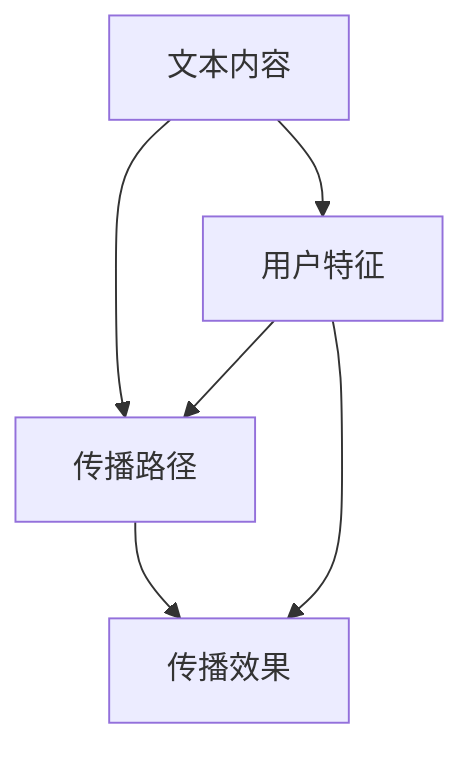

                 


# 构建基于NLP的金融社交媒体影响力传播模型

> 关键词：NLP，社交媒体，影响力传播，金融分析，文本挖掘，自然语言处理

> 摘要：本文旨在构建一个基于自然语言处理（NLP）的金融社交媒体影响力传播模型，通过分析社交媒体上的金融信息，利用NLP技术提取文本特征，构建传播模型，评估传播效果，并通过实战案例展示模型的应用。文章详细探讨了NLP技术、社交媒体数据结构、特征提取方法、传播模型构建及其优化策略。

---

## 第1章：背景与目标

### 1.1 问题背景

#### 1.1.1 金融社交媒体的兴起
随着互联网的普及，金融信息的传播方式发生了巨大变化。社交媒体平台如Twitter、LinkedIn、Reddit等成为金融信息传播的重要渠道，投资者、分析师和机构通过这些平台分享观点、分析市场趋势。

#### 1.1.2 社会影响力在金融领域的重要性
在金融领域，影响力传播是指信息通过社交媒体传播，影响更多用户的行为和决策。影响力传播可以影响市场情绪、股票价格波动等，因此研究影响力传播对于金融分析具有重要意义。

#### 1.1.3 NLP技术在金融分析中的应用
自然语言处理技术（NLP）能够从社交媒体文本中提取情感、主题和实体信息，为影响力传播模型提供数据支持。NLP技术在金融舆情分析、情感计算、文本挖掘等方面有广泛应用。

### 1.2 问题描述

#### 1.2.1 社会影响力传播的定义
影响力传播是指信息在社交媒体网络中通过用户互动传播，影响更多用户的行为或观点。在金融领域，影响力传播可能影响市场情绪和投资决策。

#### 1.2.2 金融社交媒体中的信息传播特点
金融社交媒体中的信息传播具有实时性、互动性和情感驱动等特点。信息传播速度快，用户之间通过评论、转发等方式互动，情感因素在传播中起重要作用。

#### 1.2.3 当前传播模型的局限性
传统的传播模型可能无法充分考虑社交媒体中的文本信息和情感因素。影响力传播模型需要结合NLP技术，提取文本特征，更准确地预测信息传播效果。

### 1.3 问题解决

#### 1.3.1 构建传播模型的目标
本文旨在构建一个基于NLP的影响力传播模型，通过分析社交媒体文本数据，预测信息的传播范围和影响程度。

#### 1.3.2 NLP技术如何助力影响力传播
NLP技术可以从社交媒体文本中提取情感、主题和用户特征，为影响力传播模型提供数据支持。通过分析文本内容，可以识别关键传播者和传播路径。

#### 1.3.3 数据驱动的传播模型优势
数据驱动的传播模型可以通过大量社交媒体数据训练，捕捉传播规律，预测传播趋势。结合NLP技术，模型可以更准确地理解文本内容，提高传播预测的准确性。

### 1.4 模型的边界与外延

#### 1.4.1 数据范围的界定
本文主要分析公开的社交媒体数据，包括文本内容、用户信息和互动数据。数据范围限定于金融领域，不涉及其他领域。

#### 1.4.2 应用场景的限制
本文构建的影响力传播模型主要用于金融社交媒体，预测信息传播效果，优化传播策略。模型的应用场景限于社交媒体平台，不考虑线下传播。

#### 1.4.3 模型的可扩展性
本文构建的模型具有一定的可扩展性，可以通过调整特征提取方法和传播模型结构，应用于其他领域。但本文主要关注金融社交媒体领域。

### 1.5 模型概念结构与核心要素

#### 1.5.1 核心要素的识别
影响力传播模型的核心要素包括：
1. **文本内容**：社交媒体中的文本信息，如新闻、评论等。
2. **用户特征**：用户的影响力、活跃度、关注领域等。
3. **互动数据**：用户之间的评论、转发、点赞等互动行为。
4. **传播路径**：信息从初始传播者到目标受众的路径。
5. **传播效果**：信息传播的范围、速度和影响程度。

#### 1.5.2 要素之间的关系
文本内容和用户特征影响传播路径和效果。用户互动行为数据是传播路径的重要组成部分，传播效果取决于传播路径和互动数据。

#### 1.5.3 概念结构图示


---

## 第2章：NLP与社交媒体基础

### 2.1 NLP技术基础

#### 2.1.1 NLP技术的定义与核心任务
自然语言处理（NLP）是计算机科学中的一个分支，旨在理解和生成人类语言。核心任务包括文本分类、情感分析、实体识别、文本生成等。

#### 2.1.2 NLP技术在社交媒体中的应用
NLP技术在社交媒体中用于情感分析、舆情监控、用户画像构建等。这些技术为影响力传播模型提供了数据支持。

#### 2.1.3 常用NLP工具与库
常用的NLP工具包括NLTK、spaCy、Gensim等。这些工具提供了文本处理、特征提取、主题建模等功能。

### 2.2 社交媒体数据结构

#### 2.2.1 社交媒体数据的类型
社交媒体数据主要包括文本数据（如帖子、评论）、用户数据（如用户ID、关注数）和互动数据（如点赞、转发）。

#### 2.2.2 文本数据的特征
文本数据的特征包括情感倾向、主题类别、关键词提取等。这些特征用于构建影响力传播模型。

#### 2.2.3 用户数据的特征
用户数据的特征包括用户影响力、活跃度、用户画像等。这些特征帮助识别关键传播者。

### 2.3 文本预处理

#### 2.3.1 文本预处理步骤
文本预处理包括分词、去除停用词、词干提取、标点符号处理等步骤。预处理步骤有助于提高NLP模型的准确性。

#### 2.3.2 文本分词与实体识别
文本分词将文本分割成词语或短语，实体识别识别文本中的实体，如人名、地名、组织名等。

#### 2.3.3 情感分析与主题分类
情感分析识别文本的情感倾向，主题分类将文本分为不同的主题类别，如股票、经济、市场等。

### 2.4 用户行为分析

#### 2.4.1 用户行为的定义
用户行为包括用户的发布行为、互动行为（如评论、转发、点赞）和关注行为。

#### 2.4.2 用户行为分析的意义
用户行为分析有助于识别关键传播者和传播路径，评估用户的影响力。

#### 2.4.3 用户影响力指标
用户影响力指标包括用户的关注数、粉丝数、互动频率等。这些指标帮助识别高影响力用户。

---

## 第3章：影响力传播模型构建

### 3.1 数据收集与预处理

#### 3.1.1 数据来源
数据来源包括社交媒体API获取的公开数据、爬虫抓取的数据等。数据收集需要遵守相关法律法规和平台的使用政策。

#### 3.1.2 数据清洗
数据清洗包括去除无效数据、处理重复数据、填补缺失值等步骤。数据清洗确保数据质量和一致性。

#### 3.1.3 数据格式转换
数据格式转换包括将文本数据转换为向量表示，如词袋模型或词嵌入模型。数据格式转换为后续模型构建提供标准化输入。

### 3.2 特征工程

#### 3.2.1 特征提取方法
特征提取方法包括文本特征提取、用户特征提取和互动特征提取。文本特征提取包括TF-IDF、词嵌入等方法。用户特征提取包括用户影响力、活跃度等指标。互动特征提取包括互动频率、互动强度等指标。

#### 3.2.2 特征选择
特征选择包括相关性分析、主成分分析等方法。特征选择旨在剔除冗余特征，提高模型性能。

#### 3.2.3 特征工程的意义
特征工程是构建高质量模型的关键步骤，有效的特征工程可以显著提高模型的准确性和预测能力。

### 3.3 模型构建

#### 3.3.1 传播模型的定义
传播模型包括信息传播路径模型和传播效果预测模型。信息传播路径模型描述信息从初始传播者到目标受众的路径。传播效果预测模型预测信息的传播范围和影响程度。

#### 3.3.2 模型构建步骤
模型构建步骤包括选择合适的算法、训练模型、验证模型性能等。模型构建需要结合具体的数据特点和传播规律。

#### 3.3.3 模型训练与验证
模型训练使用训练数据进行参数优化，验证阶段使用验证集评估模型性能。模型验证包括准确率、召回率、F1值等指标。

---

## 第4章：特征提取与表示

### 4.1 NLP特征提取

#### 4.1.1 词袋模型与词嵌入
词袋模型将文本表示为词的集合，词嵌入模型（如Word2Vec）将词表示为低维向量。

#### 4.1.2 文本摘要与关键词提取
文本摘要提取文本的关键信息，关键词提取识别文本中的重要词汇。

#### 4.1.3 情感分析与主题分类
情感分析识别文本的情感倾向，主题分类将文本分为不同的主题类别。

### 4.2 文本表示方法

#### 4.2.1 词袋模型
词袋模型将文本表示为词的出现频率向量。例如，文本“我爱自然语言处理”可以表示为一个向量，其中“我”、“爱”、“自然语言处理”三个词的位置为1，其他位置为0。

#### 4.2.2 词嵌入模型
词嵌入模型（如Word2Vec、GloVe）将词表示为低维向量，捕捉词义信息。例如，词“爱”可能表示为向量[0.2, 0.5, -0.1]。

#### 4.2.3 文本向量表示
文本向量表示可以通过词袋模型或词嵌入模型生成。例如，使用Word2Vec生成文本向量表示。

### 4.3 特征选择

#### 4.3.1 特征选择方法
特征选择方法包括相关性分析、主成分分析（PCA）、LASSO回归等。相关性分析计算特征与目标变量的相关性，选择相关性较高的特征。

#### 4.3.2 特征重要性排序
特征重要性排序可以通过模型权重或特征贡献度排序。例如，使用LASSO回归模型，特征权重高的特征更重要。

#### 4.3.3 特征选择的意义
特征选择可以减少模型复杂度，提高模型性能，降低计算成本。选择重要的特征有助于模型更好地捕捉传播规律。

---

## 第5章：模型构建

### 5.1 传播模型的算法原理

#### 5.1.1 算法原理概述
传播模型的算法原理包括传播路径预测和传播效果预测。传播路径预测模型预测信息传播的路径，传播效果预测模型预测信息传播的效果。

#### 5.1.2 算法流程
算法流程包括数据预处理、特征提取、模型训练、模型评估和模型优化。数据预处理包括清洗数据、格式转换等。特征提取包括文本特征提取、用户特征提取等。模型训练包括选择算法、调整参数等。模型评估包括准确率、召回率等指标。模型优化包括调整模型参数、选择最优模型。

#### 5.1.3 算法实现步骤
算法实现步骤包括数据预处理、特征提取、模型训练、模型评估和模型优化。数据预处理确保数据质量，特征提取为模型提供输入，模型训练生成传播模型，模型评估验证模型性能，模型优化提高模型性能。

### 5.2 算法实现

#### 5.2.1 算法选择
算法选择需要考虑数据特点、模型复杂度和计算资源。传播路径预测可以选择图神经网络（如GCN、GAT）模型，传播效果预测可以选择基于LSTM的序列模型。

#### 5.2.2 算法实现步骤
算法实现步骤包括数据预处理、特征提取、模型训练、模型评估和模型优化。数据预处理确保数据质量，特征提取为模型提供输入，模型训练生成传播模型，模型评估验证模型性能，模型优化提高模型性能。

#### 5.2.3 代码实现示例
以下是使用Python实现的基于LSTM的情感分析模型代码示例：

```python
import numpy as np
import pandas as pd
from sklearn.model_selection import train_test_split
from keras.models import Sequential
from keras.layers import LSTM, Dense, Dropout

# 数据预处理
data = pd.read_csv('social_media_data.csv')
X = data['text'].values
y = data['label'].values
X_train, X_test, y_train, y_test = train_test_split(X, y, test_size=0.2)

# 特征提取
from tensorflow.keras.preprocessing.text import Tokenizer
tokenizer = Tokenizer(num_words=1000)
tokenizer.fit_on_texts(X_train)
X_train_sequences = tokenizer.texts_to_sequences(X_train)
X_test_sequences = tokenizer.texts_to_sequences(X_test)

# 填充序列
from tensorflow.keras.preprocessing.sequence import pad_sequences
max_length = 500
X_train_padded = pad_sequences(X_train_sequences, maxlen=max_length)
X_test_padded = pad_sequences(X_test_sequences, maxlen=max_length)

# 模型构建
model = Sequential()
model.add(LSTM(100, dropout=0.2, recurrent_dropout=0.2, input_shape=(max_length,)))
model.add(Dense(1, activation='sigmoid'))

model.compile(loss='binary_crossentropy', optimizer='adam', metrics=['accuracy'])

# 模型训练
model.fit(X_train_padded, y_train, epochs=10, batch_size=32, validation_data=(X_test_padded, y_test))
```

---

## 第6章：模型评估与优化

### 6.1 评估指标

#### 6.1.1 评估指标的选择
评估指标包括准确率、召回率、F1值、AUC等。准确率衡量模型预测的准确程度，召回率衡量模型识别正样本的能力，F1值是准确率和召回率的调和平均，AUC衡量模型的区分能力。

#### 6.1.2 评估指标的计算
评估指标的计算需要根据模型预测结果和真实标签进行计算。例如，准确率=正确预测的样本数/总样本数。

#### 6.1.3 评估指标的意义
评估指标的意义在于衡量模型的性能，选择合适的评估指标有助于优化模型。

### 6.2 模型优化

#### 6.2.1 参数调整
参数调整包括调整LSTM的隐藏层大小、Dropout率、学习率等参数。参数调整可以通过网格搜索或随机搜索进行。

#### 6.2.2 模型优化策略
模型优化策略包括数据增强、模型集成、超参数优化等。数据增强可以通过生成更多的训练数据提高模型的泛化能力。模型集成通过结合多个模型的预测结果提高模型性能。超参数优化通过调整模型参数找到最优配置。

#### 6.2.3 模型优化的意义
模型优化的意义在于提高模型的准确性和泛化能力，降低模型的过拟合风险。

### 6.3 案例分析

#### 6.3.1 案例背景
案例背景介绍具体的数据集和应用场景。例如，使用Twitter上的金融 tweets 数据集，构建影响力传播模型。

#### 6.3.2 模型评估结果
模型评估结果包括准确率、召回率、F1值等指标。例如，模型在测试集上的准确率为85%，召回率为80%，F1值为0.825。

#### 6.3.3 模型优化效果
模型优化效果包括参数调整后的性能提升。例如，调整Dropout率后，模型的准确率提高了5%，召回率提高了3%。

---

## 第7章：项目实战

### 7.1 环境安装与配置

#### 7.1.1 环境需求
环境需求包括Python版本、相关库的安装。例如，Python 3.8以上，安装TensorFlow、Keras、NLTK、spaCy等库。

#### 7.1.2 数据集准备
数据集准备包括数据清洗、格式转换、数据预处理等步骤。例如，使用Twitter API获取金融领域的tweets数据，清洗数据，格式转换为模型输入格式。

#### 7.1.3 工具安装
工具安装包括安装NLP库、机器学习库、数据处理库等。例如，安装spaCy进行文本处理，安装scikit-learn进行机器学习。

### 7.2 系统分析与架构设计

#### 7.2.1 问题场景介绍
问题场景介绍金融社交媒体影响力传播模型的应用场景。例如，预测一条金融新闻在Twitter上的传播范围和速度。

#### 7.2.2 系统功能设计
系统功能设计包括数据采集、数据预处理、特征提取、模型训练、模型预测、结果展示等功能模块。

#### 7.2.3 系统架构设计
系统架构设计包括数据层、业务逻辑层、表现层。数据层存储原始数据和处理数据，业务逻辑层实现数据处理和模型训练，表现层展示结果和用户交互。

#### 7.2.4 系统交互设计
系统交互设计包括用户输入、系统处理、结果输出等步骤。例如，用户输入一条金融新闻，系统预测其传播范围和速度。

### 7.3 系统实现

#### 7.3.1 核心代码实现
核心代码实现包括数据预处理、特征提取、模型训练、模型预测等步骤。例如，使用LSTM模型进行影响力传播预测。

#### 7.3.2 代码应用解读
代码应用解读包括代码的功能说明、关键代码段的解释。例如，解释LSTM层的参数设置、模型编译的优化策略等。

#### 7.3.3 代码示例
以下是使用Python实现的影响力传播模型的代码示例：

```python
import numpy as np
import pandas as pd
from sklearn.model_selection import train_test_split
from keras.models import Sequential
from keras.layers import LSTM, Dense, Dropout

# 数据预处理
data = pd.read_csv('social_media_data.csv')
X = data['text'].values
y = data['label'].values
X_train, X_test, y_train, y_test = train_test_split(X, y, test_size=0.2)

# 特征提取
from tensorflow.keras.preprocessing.text import Tokenizer
tokenizer = Tokenizer(num_words=1000)
tokenizer.fit_on_texts(X_train)
X_train_sequences = tokenizer.texts_to_sequences(X_train)
X_test_sequences = tokenizer.texts_to_sequences(X_test)

# 填充序列
from tensorflow.keras.preprocessing.sequence import pad_sequences
max_length = 500
X_train_padded = pad_sequences(X_train_sequences, maxlen=max_length)
X_test_padded = pad_sequences(X_test_sequences, maxlen=max_length)

# 模型构建
model = Sequential()
model.add(LSTM(100, dropout=0.2, recurrent_dropout=0.2, input_shape=(max_length,)))
model.add(Dense(1, activation='sigmoid'))

model.compile(loss='binary_crossentropy', optimizer='adam', metrics=['accuracy'])

# 模型训练
model.fit(X_train_padded, y_train, epochs=10, batch_size=32, validation_data=(X_test_padded, y_test))
```

### 7.4 案例分析

#### 7.4.1 案例背景
案例背景介绍具体的数据集和应用场景。例如，使用Twitter上的金融 tweets 数据集，构建影响力传播模型。

#### 7.4.2 数据分析与处理
数据分析与处理包括数据清洗、格式转换、特征提取等步骤。例如，清洗数据，去除无效数据，转换文本为向量表示。

#### 7.4.3 模型训练与预测
模型训练与预测包括训练传播模型，预测信息传播效果。例如，训练LSTM模型，预测一条金融新闻的传播范围和速度。

#### 7.4.4 结果展示与解读
结果展示与解读包括模型预测结果的展示和解读。例如，展示模型预测的传播路径和传播效果，解读结果的意义。

---

## 第8章：总结与展望

### 8.1 最佳实践

#### 8.1.1 模型优化
模型优化包括参数调整、特征选择、模型集成等。例如，通过超参数优化提高模型性能，通过特征选择减少冗余特征。

#### 8.1.2 数据处理
数据处理包括数据清洗、格式转换、数据增强等。例如，清洗数据，去除无效数据，增强数据多样性。

#### 8.1.3 模型部署
模型部署包括将模型部署到生产环境，实现实时预测和分析。例如，将影响力传播模型部署到社交媒体分析平台，实时监测信息传播。

### 8.2 小结

本文构建了一个基于NLP的金融社交媒体影响力传播模型，通过分析社交媒体文本数据，提取文本特征，构建传播模型，评估传播效果，并通过实战案例展示模型的应用。文章详细探讨了NLP技术、社交媒体数据结构、特征提取方法、传播模型构建及其优化策略。

### 8.3 注意事项

#### 8.3.1 数据隐私
在实际应用中，需要注意数据隐私问题，确保数据的合法性和合规性。

#### 8.3.2 模型局限性
本文构建的模型存在一定的局限性，例如数据依赖性、模型泛化能力等。在实际应用中，需要结合具体场景和数据特点，选择合适的模型和方法。

#### 8.3.3 持续优化
影响力传播模型是一个动态变化的系统，需要持续优化和更新。例如，随着社交媒体数据的增加和传播规律的变化，需要不断优化模型参数和更新模型结构。

### 8.4 拓展阅读

#### 8.4.1 相关技术
相关技术包括自然语言处理（NLP）、图神经网络（GNN）、深度学习等。这些技术为影响力传播模型提供了理论和技术支持。

#### 8.4.2 相关领域
相关领域包括社交媒体分析、信息传播、舆情监控、情感计算等。这些领域与影响力传播模型密切相关，值得深入研究。

#### 8.4.3 最新研究
最新研究包括基于图神经网络的信息传播预测、基于Transformer的文本生成、多模态数据融合等。这些研究为影响力传播模型提供了新的思路和方法。

---

## 作者：AI天才研究院/AI Genius Institute & 禅与计算机程序设计艺术/Zen And The Art of Computer Programming

---

通过本文的详细讲解，读者可以系统地了解如何构建基于NLP的金融社交媒体影响力传播模型，掌握相关技术和方法，应用于实际场景中。

