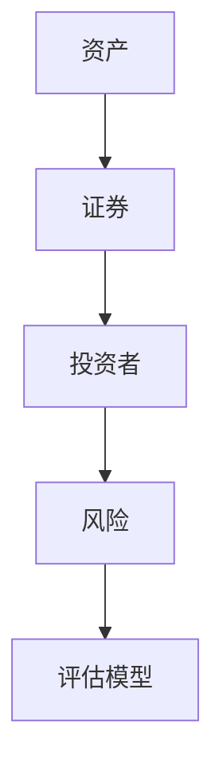
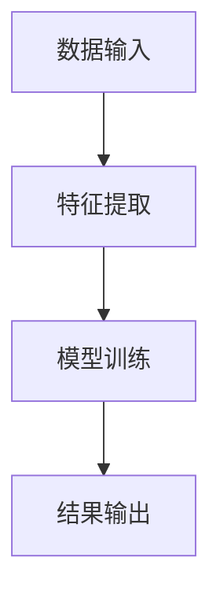
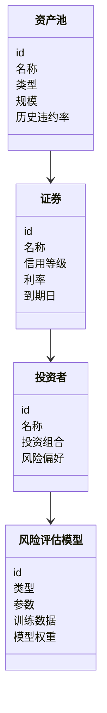
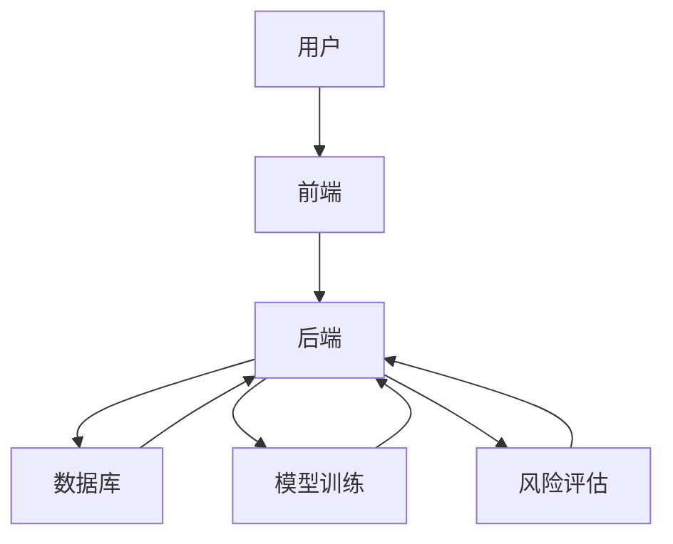
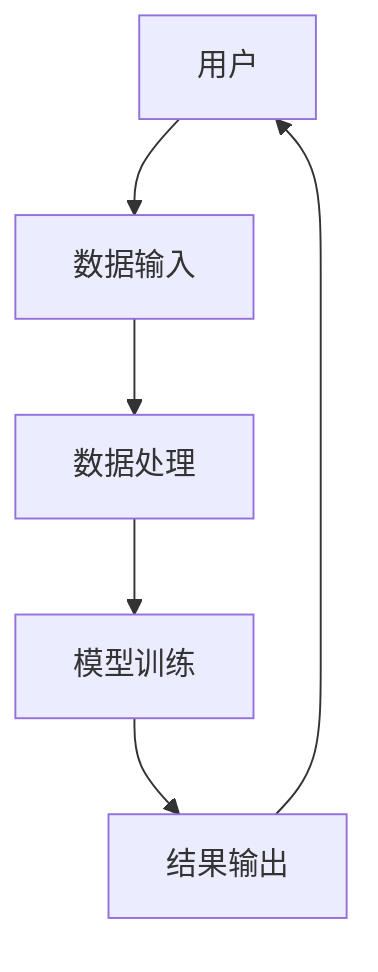

                 


# 构建智能化的资产证券化风险评估模型

> 关键词：资产证券化，风险评估，人工智能，机器学习，金融模型

> 摘要：本文详细探讨了如何利用人工智能技术构建智能化的资产证券化风险评估模型。通过分析资产证券化的核心概念、风险类型及智能化评估的必要性，结合具体算法和系统架构设计，为读者提供了一套完整的解决方案。文章从理论到实践，详细阐述了模型构建的每一步骤，并通过实际案例分析，展示了模型的应用效果及优化方向。

---

# 第一部分: 资产证券化与风险评估模型概述

## 第1章: 资产证券化与风险评估模型背景

### 1.1 资产证券化的概念与特点
资产证券化是一种将缺乏流动性但具有未来现金流的资产转化为可在市场上流通的证券的过程。其核心在于通过结构性设计，将资产的风险与收益分离，从而实现资产的高效配置和风险分散。

#### 1.1.1 资产证券化的定义
资产证券化是指将特定资产（如应收账款、房地产等）转化为可在市场上交易的金融产品（如债券、票据等），并将其信用风险与原始资产的所有者分离的过程。

#### 1.1.2 资产证券化的核心特点
- **现金流稳定**：资产证券化的基础资产通常具有稳定的现金流，如租赁、应收账款等。
- **风险隔离**：通过法律结构设计，将基础资产的风险与原始权益人隔离。
- **流动性增强**：通过证券化，原本流动性较低的资产可以转化为高流动性的证券，便于投资者交易。

#### 1.1.3 资产证券化与传统融资方式的区别
- **融资方式**：资产证券化是一种基于资产信用的融资方式，而传统融资方式（如贷款）通常基于企业信用。
- **风险承担**：资产证券化的风险主要由投资者承担，而传统融资方式的风险由债权人和债务人共同承担。
- **流动性**：资产证券化提高了资产的流动性，而传统融资方式流动性较低。

### 1.2 风险评估模型的定义与作用
风险评估模型是用于量化和预测资产证券化过程中可能面临的风险的工具。其核心作用在于帮助投资者、发行人和评级机构更好地理解和管理风险。

#### 1.2.1 风险评估模型的定义
风险评估模型是通过对资产池的信用风险、市场风险、流动性风险等进行建模和分析，评估资产证券化产品的信用等级和风险敞口的工具。

#### 1.2.2 风险评估模型的核心作用
- **信用评级**：通过模型评估资产池的信用质量，确定证券的评级。
- **风险定价**：根据模型计算的风险敞口，确定证券的合理市场价格。
- **风险监控**：实时监控资产池的风险变化，及时预警潜在风险。

#### 1.2.3 风险评估模型的分类
- **信用评分模型**：基于资产的历史违约数据，评估资产的信用风险。
- **市场风险模型**：通过VaR（Value at Risk）等方法，评估资产的市场风险。
- **组合风险模型**：分析资产池的整体风险敞口，优化资产组合的风险收益比。

### 1.3 资产证券化中的风险类型
资产证券化过程中可能面临多种风险，主要包括信用风险、市场风险、流动性风险和操作风险。

#### 1.3.1 市场风险
市场风险是指由于市场波动导致资产证券化产品价格下跌的风险。例如，利率上升会导致债券价格下降。

#### 1.3.2 信用风险
信用风险是指由于资产池中资产发生违约，导致投资者无法收回本金和利息的风险。

#### 1.3.3 流动性风险
流动性风险是指由于资产证券化产品缺乏流动性，投资者无法在需要时迅速变现的风险。

#### 1.3.4 操作风险
操作风险是指由于操作失误或内部欺诈导致的损失风险，例如交易错误或文档丢失。

### 1.4 智能化风险评估模型的必要性
随着金融市场的发展，传统的风险评估模型逐渐暴露出诸多局限性，例如数据维度不足、模型复杂性高、计算效率低等。智能化风险评估模型通过引入人工智能和大数据技术，可以显著提升风险评估的精度和效率。

#### 1.4.1 传统风险评估模型的局限性
- 数据维度有限：传统模型通常基于历史财务数据，难以捕捉实时市场变化和复杂关联性。
- 计算效率低下：传统模型需要大量人工干预和手动计算，效率较低。
- 模型复杂性高：复杂的模型难以解释和优化。

#### 1.4.2 智能化评估的优势
- 数据处理能力强大：智能化模型可以处理海量多维数据，包括文本、图像、交易数据等。
- 计算效率高：通过机器学习算法，智能化模型可以快速完成风险评估和预测。
- 模型可解释性强：通过特征重要性分析和可视化工具，智能化模型可以提供更直观的结果解释。

#### 1.4.3 智能化评估的未来发展趋势
智能化风险评估模型将朝着以下几个方向发展：
- **实时评估**：通过实时数据流处理，实现动态风险评估。
- **多模态数据融合**：结合文本、图像、语音等多种数据源，提升风险评估的全面性。
- **自适应学习**：通过在线学习算法，模型可以自动适应市场变化和新数据。

### 1.5 本章小结
本章介绍了资产证券化的基本概念、风险类型以及智能化风险评估模型的必要性。通过分析传统模型的局限性和智能化模型的优势，为后续章节的模型构建奠定了理论基础。

---

## 第2章: 资产证券化风险评估模型的核心概念

### 2.1 资产证券化风险评估模型的原理
资产证券化风险评估模型通过对资产池的现金流、信用质量、市场环境等因素进行建模，预测资产证券化产品的信用等级和风险敞口。

#### 2.1.1 数据输入
- 资产池数据：包括资产的类型、规模、历史违约率等。
- 市场数据：包括利率、汇率、宏观经济指标等。
- 交易数据：包括交易量、交易价格等。

#### 2.1.2 模型计算
- 特征提取：从原始数据中提取有助于风险评估的关键特征。
- 模型训练：利用机器学习算法对特征进行训练，构建风险评估模型。
- 模型验证：通过历史数据验证模型的准确性和稳定性。

#### 2.1.3 结果输出
- 信用评级：如AAA、AA、A、BBB等。
- 风险定价：如债券的到期收益率、利差等。
- 风险预警：如违约概率、VaR值等。

### 2.2 核心概念与联系
资产证券化风险评估模型涉及多个核心概念，包括数据特征、模型选择和评估指标等。

#### 2.2.1 数据特征对比表格
以下是几种常见数据特征的对比：

```markdown
| 特征 | 描述 | 示例 |
|------|------|------|
| 时间性 | 数据的时间依赖性 | 历史违约率 |
| 空间性 | 数据的空间分布 | 地区经济指标 |
| 关联性 | 数据之间的相关性 | 资产池相关性 |
```

#### 2.2.2 ER实体关系图
通过ER图可以清晰地展示资产证券化过程中各实体之间的关系：



### 2.3 模型构建的关键步骤
资产证券化风险评估模型的构建需要经历数据收集与预处理、模型选择与训练、模型验证与优化三个主要阶段。

#### 2.3.1 数据收集与预处理
- 数据收集：从多种数据源获取资产池、市场、交易等数据。
- 数据清洗：处理缺失值、异常值、重复值等。
- 数据转换：将数据转换为适合模型输入的格式，如标准化、归一化等。

#### 2.3.2 模型选择与训练
- 模型选择：根据数据特征和业务需求选择合适的算法，如逻辑回归、支持向量机（SVM）、随机森林等。
- 模型训练：利用训练数据对模型进行参数优化，确保模型具有较高的准确性和稳定性。

#### 2.3.3 模型验证与优化
- 模型验证：通过测试数据验证模型的性能，计算准确率、召回率、F1值等指标。
- 模型优化：通过调整模型参数、引入新特征、优化算法等方式提升模型性能。

### 2.4 本章小结
本章详细介绍了资产证券化风险评估模型的核心概念和构建步骤，为后续章节的算法实现和系统设计奠定了基础。

---

## 第3章: 资产证券化风险评估模型的算法原理

### 3.1 常见算法介绍
在资产证券化风险评估模型中，常用的算法包括逻辑回归、支持向量机（SVM）、随机森林和神经网络等。

#### 3.1.1 逻辑回归
逻辑回归是一种用于分类的统计方法，常用于预测资产的违约概率。

##### 3.1.1.1 算法流程图


##### 3.1.1.2 算法实现代码
```python
import pandas as pd
from sklearn.linear_model import LogisticRegression

# 假设我们有一个包含资产池数据的DataFrame df
# features是特征列，target是目标变量
model = LogisticRegression()
model.fit(df[features], df[target])
```

##### 3.1.1.3 数学公式
逻辑回归的损失函数可以表示为：
$$
L(\theta) = -\frac{1}{n}\sum_{i=1}^{n} [y_i\log(p_i) + (1-y_i)\log(1-p_i)]
$$
其中，$p_i$ 是第 $i$ 个样本的预测概率，可以表示为：
$$
p_i = \frac{e^{\theta^T x_i}}{1 + e^{\theta^T x_i}}
$$

#### 3.1.2 支持向量机（SVM）
SVM是一种监督学习算法，常用于分类和回归问题，适用于非线性可分的数据。

##### 3.1.2.1 算法流程图


##### 3.1.2.2 算法实现代码
```python
from sklearn import svm

model = svm.SVC()
model.fit(df[features], df[target])
```

##### 3.1.2.3 数学公式
SVM的目标是最小化 hinge loss：
$$
L(\theta) = \sum_{i=1}^{n} \max(0, y_i - \theta^T x_i + b)
$$

#### 3.1.3 随机森林
随机森林是一种基于决策树的集成学习算法，具有较高的准确性和鲁棒性。

##### 3.1.3.1 算法流程图


##### 3.1.3.2 算法实现代码
```python
from sklearn.ensemble import RandomForestClassifier

model = RandomForestClassifier()
model.fit(df[features], df[target])
```

##### 3.1.3.3 数学公式
随机森林通过集成多个决策树的结果来提高模型的准确性和稳定性，具体公式如下：
$$
\hat{y} = \frac{1}{n} \sum_{i=1}^{n} y_i
$$
其中，$n$ 是决策树的数量，$y_i$ 是第 $i$ 棵树的预测结果。

#### 3.1.4 神经网络
神经网络是一种模仿人脑结构和功能的机器学习算法，适用于处理复杂的非线性关系。

##### 3.1.4.1 算法流程图


##### 3.1.4.2 算法实现代码
```python
import keras
from keras import layers

model = keras.Sequential()
model.add(layers.Dense(64, activation='relu', input_shape=(n_features,)))
model.add(layers.Dense(1, activation='sigmoid'))
model.compile(optimizer='adam', loss='binary_crossentropy', metrics=['accuracy'])
model.fit(df[features], df[target], epochs=10, batch_size=32)
```

##### 3.1.4.3 数学公式
神经网络的损失函数可以表示为：
$$
L(\theta) = -\frac{1}{n} \sum_{i=1}^{n} [y_i \log(a_i) + (1 - y_i) \log(1 - a_i)]
$$
其中，$a_i$ 是神经网络的输出，即：
$$
a_i = \sigma(z_i)
$$
$$
z_i = \theta^T x_i + b
$$
$$
\sigma(z_i) = \frac{1}{1 + e^{-z_i}}
$$

### 3.2 算法流程图
资产证券化风险评估模型的算法流程图如下：


### 3.3 算法实现代码
以下是逻辑回归、SVM、随机森林和神经网络四种算法的实现代码示例：

#### 3.3.1 逻辑回归
```python
import pandas as pd
from sklearn.linear_model import LogisticRegression

# 假设我们有一个包含资产池数据的DataFrame df
# features是特征列，target是目标变量
model = LogisticRegression()
model.fit(df[features], df[target])
```

#### 3.3.2 支持向量机（SVM）
```python
from sklearn import svm

model = svm.SVC()
model.fit(df[features], df[target])
```

#### 3.3.3 随机森林
```python
from sklearn.ensemble import RandomForestClassifier

model = RandomForestClassifier()
model.fit(df[features], df[target])
```

#### 3.3.4 神经网络
```python
import keras
from keras import layers

model = keras.Sequential()
model.add(layers.Dense(64, activation='relu', input_shape=(n_features,)))
model.add(layers.Dense(1, activation='sigmoid'))
model.compile(optimizer='adam', loss='binary_crossentropy', metrics=['accuracy'])
model.fit(df[features], df[target], epochs=10, batch_size=32)
```

### 3.4 本章小结
本章详细介绍了资产证券化风险评估模型中常用的几种算法，包括逻辑回归、SVM、随机森林和神经网络，并通过流程图和代码示例展示了这些算法的实现过程。

---

## 第4章: 资产证券化风险评估模型的系统分析与架构设计

### 4.1 问题场景介绍
资产证券化风险评估模型需要处理大量的多维数据，包括资产池、市场、交易等数据。因此，系统设计需要考虑数据的实时性、准确性和安全性。

#### 4.1.1 系统功能设计
系统功能模块包括数据采集、数据处理、模型训练、风险评估和结果展示。

##### 4.1.1.1 数据采集模块
数据采集模块负责从多种数据源（如数据库、API接口等）获取资产池、市场、交易等数据。

##### 4.1.1.2 数据处理模块
数据处理模块对采集到的数据进行清洗、转换和特征提取，为后续的模型训练提供高质量的数据。

##### 4.1.1.3 模型训练模块
模型训练模块利用机器学习算法对数据进行训练，构建资产证券化风险评估模型。

##### 4.1.1.4 风险评估模块
风险评估模块通过模型对资产池进行风险评估，输出信用评级、风险定价和风险预警等结果。

##### 4.1.1.5 结果展示模块
结果展示模块将模型输出的结果以可视化的方式展示给用户，便于理解和决策。

#### 4.1.2 系统架构设计
系统架构设计采用分层架构，包括数据层、业务逻辑层和用户界面层。

##### 4.1.2.1 数据层
数据层负责数据的存储和管理，包括数据库、数据仓库等。

##### 4.1.2.2 业务逻辑层
业务逻辑层负责数据处理、模型训练和风险评估等核心业务逻辑的实现。

##### 4.1.2.3 用户界面层
用户界面层负责与用户的交互，展示模型输出的结果和系统状态。

#### 4.1.3 系统交互流程图
系统交互流程图展示了用户与系统之间的交互过程：


### 4.2 项目介绍
本项目旨在构建一个智能化的资产证券化风险评估模型，利用机器学习和大数据技术，提升风险评估的精度和效率。

#### 4.2.1 项目背景
随着金融市场的快速发展，资产证券化业务规模不断扩大，传统的风险评估方法逐渐暴露出数据维度有限、计算效率低下的问题。因此，引入智能化技术成为必然选择。

#### 4.2.2 系统功能设计
系统功能模块包括数据采集、数据处理、模型训练、风险评估和结果展示。

##### 4.2.2.1 数据采集模块
数据采集模块需要支持多种数据源的接入，例如：
- 数据库：MySQL、PostgreSQL、MongoDB等。
- API接口：通过REST API获取实时市场数据。
- 文件：支持CSV、Excel等格式的数据导入。

##### 4.2.2.2 数据处理模块
数据处理模块需要实现数据清洗、特征提取和数据转换等功能。例如：
- 数据清洗：处理缺失值、异常值、重复值等。
- 特征提取：从文本、图像等多模态数据中提取特征。
- 数据转换：对数据进行标准化、归一化处理，使其适合模型输入。

##### 4.2.2.3 模型训练模块
模型训练模块需要支持多种机器学习算法，例如逻辑回归、SVM、随机森林和神经网络等。同时，需要实现模型的参数优化和性能评估。

##### 4.2.2.4 风险评估模块
风险评估模块需要根据模型输出的结果，生成资产证券化产品的信用评级、风险定价和风险预警等信息。

##### 4.2.2.5 结果展示模块
结果展示模块需要将模型输出的结果以可视化的方式展示给用户，例如：
- 信用评级：通过颜色、图标等方式展示不同资产的信用等级。
- 风险预警：通过警报、图表等方式展示潜在风险。

#### 4.2.3 领域模型类图
领域模型类图展示了系统中各实体之间的关系：



#### 4.2.4 系统架构图
系统架构图展示了系统的整体架构：



#### 4.2.5 系统接口设计
系统接口设计包括数据接口和模型接口两部分。

##### 4.2.5.1 数据接口
- 数据接口类型：REST API
- 数据接口地址：/api/data/input
- 数据接口协议：HTTP
- 数据接口参数：文件名、数据格式、数据路径等

##### 4.2.5.2 模型接口
- 模型接口类型：REST API
- 模型接口地址：/api/model/predict
- 模型接口协议：HTTP
- 模型接口参数：输入特征、模型类型、参数配置等

#### 4.2.6 系统交互流程图
系统交互流程图展示了用户与系统之间的交互过程：



### 4.3 本章小结
本章通过系统分析和架构设计，详细介绍了资产证券化风险评估模型的实现过程，包括系统功能设计、架构设计、接口设计和交互流程设计。

---

## 第5章: 资产证券化风险评估模型的项目实战

### 5.1 项目环境安装
#### 5.1.1 安装Python
- 下载并安装Python：https://www.python.org/downloads/
- 安装Python包管理工具：pip
- 安装必要的Python库：
  - `pandas`：数据处理
  - `numpy`：数值计算
  - `scikit-learn`：机器学习算法
  - `keras`：深度学习框架
  - `matplotlib`：数据可视化

#### 5.1.2 安装数据库
- 下载并安装数据库：MySQL、PostgreSQL、MongoDB等
- 安装数据库驱动：如`pymysql`、`psycopg2`、`pymongo`等

#### 5.1.3 安装可视化工具
- 下载并安装Jupyter Notebook：https://jupyter.org/
- 下载并安装Visual Studio Code：https://code.visualstudio.com/

### 5.2 系统核心实现源代码
以下是资产证券化风险评估模型的核心代码实现：

#### 5.2.1 数据处理代码
```python
import pandas as pd
import numpy as np

# 数据加载
df = pd.read_csv('asset_pool.csv')

# 数据清洗
df = df.dropna()
df = df.drop_duplicates()

# 特征提取
features = ['feature1', 'feature2', 'feature3']
target = 'target'

# 数据转换
from sklearn.preprocessing import StandardScaler

scaler = StandardScaler()
df[features] = scaler.fit_transform(df[features])
```

#### 5.2.2 模型训练代码
```python
from sklearn.ensemble import RandomForestClassifier

# 模型训练
model = RandomForestClassifier(n_estimators=100, max_depth=10, random_state=42)
model.fit(df[features], df[target])
```

#### 5.2.3 模型验证代码
```python
from sklearn.metrics import accuracy_score, recall_score, f1_score

# 模型验证
y_pred = model.predict(df[features])
print(f"Accuracy: {accuracy_score(df[target], y_pred)}")
print(f"Recall: {recall_score(df[target], y_pred)}")
print(f"F1 Score: {f1_score(df[target], y_pred)}")
```

#### 5.2.4 风险评估代码
```python
# 风险评估
importances = model.feature_importances_
feature_importances = pd.DataFrame({'feature': features, 'importance': importances})
print(feature_importances.sort_values(by='importance', ascending=False))
```

### 5.3 代码应用解读与分析
#### 5.3.1 数据处理
数据处理是模型训练的前提，主要包括数据清洗、特征提取和数据转换。数据清洗去除缺失值和重复值，特征提取选择关键特征，数据转换对特征进行标准化或归一化处理。

#### 5.3.2 模型训练
模型训练是通过算法对数据进行学习，生成能够预测风险的模型。随机森林是一种集成学习算法，具有较高的准确性和鲁棒性。

#### 5.3.3 模型验证
模型验证通过准确率、召回率和F1值等指标评估模型的性能。准确率衡量模型的分类准确程度，召回率衡量模型识别正类的能力，F1值是准确率和召回率的调和平均数。

#### 5.3.4 风险评估
风险评估通过模型的特征重要性分析，识别影响风险的关键因素，从而为投资者提供科学的决策依据。

### 5.4 实际案例分析
#### 5.4.1 案例背景
假设我们有一个包含资产池数据的CSV文件`asset_pool.csv`，其中包含资产池的历史违约率、资产规模、地区经济指标等特征。

#### 5.4.2 案例分析
通过数据处理和模型训练，我们可以构建一个随机森林模型，用于预测资产池的违约概率。

#### 5.4.3 分析结果
模型训练完成后，我们可以使用测试数据验证模型的性能，并通过特征重要性分析识别影响违约概率的关键因素。

### 5.5 项目小结
本章通过实际案例展示了资产证券化风险评估模型的实现过程，包括数据处理、模型训练、模型验证和风险评估等步骤。通过代码实现和案例分析，读者可以更好地理解模型的构建和应用。

---

## 第6章: 资产证券化风险评估模型的最佳实践

### 6.1 小结
资产证券化风险评估模型的构建需要综合考虑数据特征、算法选择、系统设计等多个方面。通过智能化技术的应用，可以显著提升风险评估的精度和效率。

### 6.2 注意事项
在实际应用中，需要注意以下几点：
- **数据质量**：确保数据的准确性和完整性。
- **模型解释性**：选择具有较高解释性的模型，便于分析和优化。
- **实时性**：通过实时数据处理，提升模型的响应速度和准确性。
- **模型更新**：定期更新模型参数和特征，确保模型的适应性和稳定性。

### 6.3 拓展阅读
为了进一步深入学习，读者可以参考以下资料：
- 《机器学习实战》：深入理解机器学习算法的实现和应用。
- 《Python机器学习》：学习如何利用Python进行机器学习开发。
- 《金融风险管理》：了解金融领域的风险管理理论和实践。

### 6.4 本章小结
本章总结了资产证券化风险评估模型的构建过程，并提出了实际应用中的注意事项和拓展阅读资料，为读者提供了进一步学习和实践的方向。

---

# 第七章: 作者介绍

作者：AI天才研究院/AI Genius Institute & 禅与计算机程序设计艺术 /Zen And The Art of Computer Programming

本文由AI天才研究院与“禅与计算机程序设计艺术”联合撰写，结合人工智能和金融领域的专业知识，为您提供最权威的技术指导和实践方案。如需了解更多内容，请访问我们的官方网站或关注我们的社交媒体账号。

---

以上是《构建智能化的资产证券化风险评估模型》的完整目录和内容概述，涵盖了从理论到实践的各个方面，旨在为您提供全面的技术指导和实践方案。

