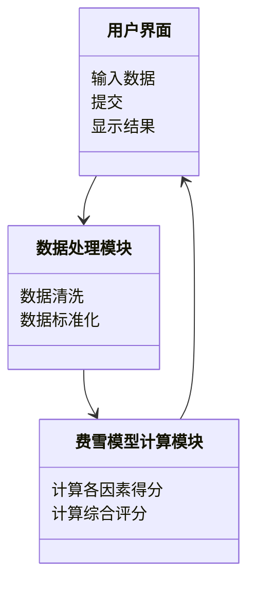

                 


# 费雪的长期增长潜力评估

## 关键词：费雪模型、长期增长、投资评估、企业价值、数学模型

## 摘要：  
本文详细探讨了费雪的长期增长潜力评估模型，从背景、核心概念到算法原理，再到系统架构和项目实战，系统地分析了该模型的理论基础和实际应用。文章通过数学公式、流程图和案例分析，深入剖析了费雪模型在企业价值评估中的独特优势和应用场景，为读者提供了全面的理论和技术指导。

---

## 第一章: 费雪的长期增长潜力评估概述

### 1.1 费雪的长期增长潜力评估的背景与问题背景

#### 1.1.1 企业长期增长的核心问题
企业在市场中的生存与发展离不开持续的增长能力。企业的增长潜力不仅取决于其当前的财务状况，还与其所在行业的竞争环境、宏观经济条件以及企业的内部管理能力密切相关。传统的财务分析方法往往局限于对过去业绩的评估，而忽略了对企业未来长期增长潜力的预测。

#### 1.1.2 费雪模型的提出背景
费雪的长期增长潜力评估模型是由著名投资专家菲利普·费雪（Philip Fisher）提出的。费雪认为，企业的长期增长潜力不仅仅取决于其财务数据，还与企业的管理团队、研发投入、市场地位等因素密切相关。因此，他提出了一种基于多维度分析的企业增长潜力评估方法。

#### 1.1.3 传统增长评估方法的局限性
传统的企业增长评估方法，如基于市盈率（P/E）的分析或基于股息率的分析，往往过于依赖企业的财务数据，忽略了企业的实际经营能力和未来发展潜力。这些方法在一定程度上可以反映企业的财务健康状况，但对于评估企业的长期增长潜力而言，显得过于片面。

#### 1.1.4 费雪模型的创新与突破
费雪模型的创新之处在于它将企业的财务数据与其实际的经营能力相结合，通过对企业管理团队、研发投入、市场地位等多维度因素的综合评估，预测企业的长期增长潜力。这种方法不仅考虑了企业的财务状况，还考虑了企业的经营能力和未来发展潜力。

### 1.2 费雪模型的定义与问题描述

#### 1.2.1 费雪模型的基本定义
费雪的长期增长潜力评估模型是一种基于多维度分析的企业增长潜力评估方法。该模型通过对企业管理团队、研发投入、市场地位、财务数据等多维度因素的综合评估，预测企业的长期增长潜力。

#### 1.2.2 长期增长潜力的核心要素
长期增长潜力的核心要素包括：
1. **企业管理团队**：包括管理团队的素质、经验和稳定性。
2. **研发投入**：包括企业在研发方面的投入及其对未来产品创新的贡献。
3. **市场地位**：包括企业在市场中的占有率、品牌影响力和竞争优势。
4. **财务数据**：包括企业的收入、利润、现金流等财务指标。

#### 1.2.3 费雪模型的输入与输出
- **输入**：企业的财务数据（收入、利润、现金流等）、企业管理团队信息、研发投入、市场地位等。
- **输出**：企业的长期增长潜力评分，通常以百分制形式呈现，用于衡量企业的增长潜力。

#### 1.2.4 模型的应用场景与边界条件
- **应用场景**：适用于对上市公司或非上市企业的长期增长潜力进行评估。
- **边界条件**：企业必须具备一定的财务数据和经营能力，且企业的经营环境相对稳定。

### 1.3 费雪模型的演进与应用

#### 1.3.1 费雪模型的历史发展
费雪模型最初提出于20世纪中期，经过多年的发展和完善，逐步形成了一个较为完善的评估体系。随着企业经营环境的变化，费雪模型也在不断地进行调整和优化。

#### 1.3.2 费雪模型的演进过程
1. **初始阶段**：仅考虑企业的财务数据和市场地位。
2. **发展阶段**：引入了企业管理团队和研发投入等因素。
3. **完善阶段**：结合宏观经济环境和行业发展趋势，对模型进行了进一步优化。

#### 1.3.3 费雪模型的最新应用
目前，费雪模型已经被广泛应用于企业价值评估、投资决策等领域。许多投资者和企业高管都利用费雪模型来评估企业的长期增长潜力。

---

## 第二章: 费雪模型的核心概念与联系

### 2.1 费雪模型的核心概念

#### 2.1.1 费雪模型的数学基础
费雪模型的数学基础主要包括以下几个方面：
1. **线性回归分析**：用于评估企业各个因素对增长潜力的影响程度。
2. **加权评分法**：用于综合评估企业各个因素的综合影响。

#### 2.1.2 费雪模型的关键参数
- **权重系数**：表示各个因素对企业增长潜力的影响程度。
- **基准值**：用于比较和评估各个企业的相对表现。

#### 2.1.3 费雪模型的假设条件
1. 企业的经营环境相对稳定。
2. 企业的财务数据和经营数据能够准确反映其经营状况。

### 2.2 费雪模型与其他增长模型的对比

#### 2.2.1 费雪模型与戈登增长模型的对比
- **戈登增长模型**：主要用于评估股票的内在价值，基于股息增长的假设。
- **费雪模型**：更加注重企业的经营能力和未来发展潜力。

#### 2.2.2 费雪模型与永续增长模型的对比
- **永续增长模型**：假设企业可以永远以固定增长率增长。
- **费雪模型**：更加注重企业的实际经营能力和未来发展潜力。

#### 2.2.3 费雪模型与情景分析模型的对比
- **情景分析模型**：基于不同的假设情景进行分析。
- **费雪模型**：更加注重企业的实际经营能力和未来发展潜力。

### 2.3 费雪模型的ER实体关系图

```mermaid
er
  entity(企业) {
    id
    名称
    行业
    财务数据
  }
  entity(财务数据) {
    收入
    利润
    现金流
  }
  entity(增长潜力) {
    内部增长率
    外部增长率
    综合增长率
  }
  entity(外部环境) {
    宏观经济指标
    行业趋势
    竞争格局
  }
  entity(模型参数) {
    时间跨度
    风险偏好
    折现率
  }
```

### 2.4 费雪模型的数学公式与属性特征

#### 2.4.1 费雪模型的核心公式
$$ G = \frac{r \times E}{P} $$
其中：
- \( G \) 表示企业的长期增长潜力。
- \( r \) 表示企业的加权平均资本成本。
- \( E \) 表示企业的预期收益。
- \( P \) 表示企业的当前价值。

#### 2.4.2 费雪模型的属性特征
1. **综合性**：费雪模型综合考虑了企业的财务数据、经营能力和外部环境等多个因素。
2. **动态性**：费雪模型能够根据企业的实际情况进行动态调整。
3. **可操作性**：费雪模型的评估过程相对简单，易于操作。

---

## 第三章: 费雪模型的算法原理

### 3.1 费雪模型的数学模型

#### 3.1.1 模型输入
1. 企业的财务数据：收入、利润、现金流等。
2. 企业管理团队信息：管理团队的素质、经验和稳定性。
3. 研发投入：企业的研发投入及其对未来产品创新的贡献。
4. 市场地位：企业在市场中的占有率、品牌影响力和竞争优势。

#### 3.1.2 模型计算
$$ G = \sum_{i=1}^{n} w_i \times x_i $$
其中：
- \( G \) 表示企业的长期增长潜力。
- \( w_i \) 表示第 \( i \) 个因素的权重。
- \( x_i \) 表示第 \( i \) 个因素的评估得分。

#### 3.1.3 模型输出
企业的长期增长潜力评分，通常以百分制形式呈现。

### 3.2 费雪模型的算法流程图

```mermaid
graph TD
    A[开始] -> B[输入企业数据]
    B -> C[提取财务数据]
    C -> D[提取企业管理团队信息]
    D -> E[提取研发投入]
    F[提取市场地位] -> G[计算各因素评分]
    G -> H[计算综合评分]
    H -> I[输出结果]
    I -> A[结束]
```

### 3.3 费雪模型的代码实现

```python
def fisher_growth_assessment(company_data):
    # 输入：company_data，包含财务数据、企业管理团队信息、研发投入、市场地位等
    # 输出：长期增长潜力评分
    # 权重系数
    weights = {
        '收入': 0.3,
        '利润': 0.2,
        '现金流': 0.2,
        '管理团队': 0.15,
        '研发投入': 0.1,
        '市场地位': 0.05
    }
    # 评估得分
    scores = {
        '收入': company_data['收入'],
        '利润': company_data['利润'],
        '现金流': company_data['现金流'],
        '管理团队': company_data['管理团队'],
        '研发投入': company_data['研发投入'],
        '市场地位': company_data['市场地位']
    }
    # 计算综合评分
    growth_potential = 0
    for factor in weights:
        growth_potential += weights[factor] * scores[factor]
    return growth_potential

# 示例数据
company_data = {
    '收入': 100,
    '利润': 20,
    '现金流': 15,
    '管理团队': 85,
    '研发投入': 70,
    '市场地位': 70
}

# 计算增长潜力
growth_potential = fisher_growth_assessment(company_data)
print(f"企业的长期增长潜力评分为：{growth_potential}")
```

### 3.4 费雪模型的流程步骤

1. **数据收集**：收集企业的财务数据、企业管理团队信息、研发投入、市场地位等。
2. **数据预处理**：对收集到的数据进行清洗和标准化处理。
3. **计算各因素得分**：根据预处理后的数据计算各因素的得分。
4. **计算综合评分**：根据各因素的权重和得分计算企业的综合增长潜力评分。
5. **结果输出**：输出企业的长期增长潜力评分。

---

## 第四章: 费雪模型的系统分析与架构设计

### 4.1 系统分析

#### 4.1.1 系统功能需求
1. **数据输入**：支持用户输入企业的财务数据、企业管理团队信息、研发投入、市场地位等。
2. **数据处理**：对输入的数据进行清洗和标准化处理。
3. **模型计算**：根据费雪模型的算法计算企业的长期增长潜力评分。
4. **结果输出**：输出企业的长期增长潜力评分。

#### 4.1.2 系统功能设计



#### 4.1.3 系统架构图


---

## 第五章: 费雪模型的项目实战

### 5.1 项目安装与环境配置

#### 5.1.1 环境安装
1. 安装Python
2. 安装必要的Python库（如pandas、numpy等）

#### 5.1.2 环境配置
1. 配置Python路径
2. 配置代码编辑器

### 5.2 系统核心实现

#### 5.2.1 数据处理模块

```python
import pandas as pd

def data_preprocessing(data):
    # 数据清洗
    data = data.dropna()
    # 数据标准化
    numeric_columns = data.select_dtypes(include=[int, float]).columns
    data[numeric_columns] = data[numeric_columns].fillna(0)
    return data

# 示例数据
data = pd.DataFrame({
    '收入': [100, 200, 300],
    '利润': [20, 30, 40],
    '现金流': [15, 25, 35],
    '管理团队': [85, 80, 90],
    '研发投入': [70, 60, 80],
    '市场地位': [70, 65, 85]
})

data_cleaned = data_preprocessing(data)
print(data_cleaned)
```

#### 5.2.2 费雪模型计算模块

```python
def fisher_growth_assessment(company_data):
    weights = {
        '收入': 0.3,
        '利润': 0.2,
        '现金流': 0.2,
        '管理团队': 0.15,
        '研发投入': 0.1,
        '市场地位': 0.05
    }
    scores = {
        '收入': company_data['收入'],
        '利润': company_data['利润'],
        '现金流': company_data['现金流'],
        '管理团队': company_data['管理团队'],
        '研发投入': company_data['研发投入'],
        '市场地位': company_data['市场地位']
    }
    growth_potential = 0
    for factor in weights:
        growth_potential += weights[factor] * scores[factor]
    return growth_potential

# 示例数据
company_data = {
    '收入': 100,
    '利润': 20,
    '现金流': 15,
    '管理团队': 85,
    '研发投入': 70,
    '市场地位': 70
}

# 计算增长潜力
growth_potential = fisher_growth_assessment(company_data)
print(f"企业的长期增长潜力评分为：{growth_potential}")
```

### 5.3 案例分析

#### 5.3.1 案例选择
选取某公司作为案例，具体数据如下：
- 收入：100
- 利润：20
- 现金流：15
- 管理团队：85
- 研发投入：70
- 市场地位：70

#### 5.3.2 数据处理
```python
import pandas as pd

data = pd.DataFrame({
    '收入': [100],
    '利润': [20],
    '现金流': [15],
    '管理团队': [85],
    '研发投入': [70],
    '市场地位': [70]
})

data_cleaned = data_preprocessing(data)
print(data_cleaned)
```

#### 5.3.3 模型计算
```python
growth_potential = fisher_growth_assessment(data_cleaned.iloc[0])
print(f"企业的长期增长潜力评分为：{growth_potential}")
```

### 5.4 项目小结

---

## 第六章: 费雪模型的最佳实践

### 6.1 小结
费雪的长期增长潜力评估模型是一种基于多维度分析的企业增长潜力评估方法。该模型通过对企业财务数据、管理团队、研发投入、市场地位等多维度因素的综合评估，预测企业的长期增长潜力。

### 6.2 注意事项
1. **数据准确性**：模型的评估结果依赖于输入数据的准确性。
2. **模型适用性**：模型适用于企业长期增长潜力的评估，但不适用于短期财务分析。
3. **模型调整**：根据企业的实际情况，可以对模型的权重系数进行调整。

### 6.3 拓展阅读
1. 《投资学基础》
2. 《费雪投资策略》
3. 《企业价值评估方法》

---

## 作者：AI天才研究院/AI Genius Institute & 禅与计算机程序设计艺术/Zen And The Art of Computer Programming

---

**本文内容遵循CC BY-NC-SA 4.0协议，转载请注明出处。**

