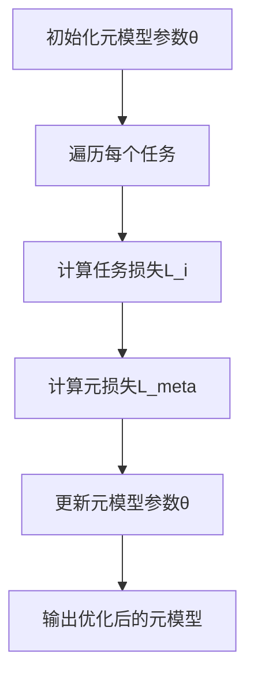
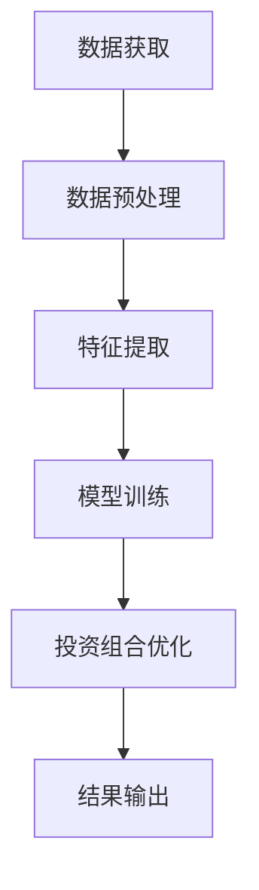
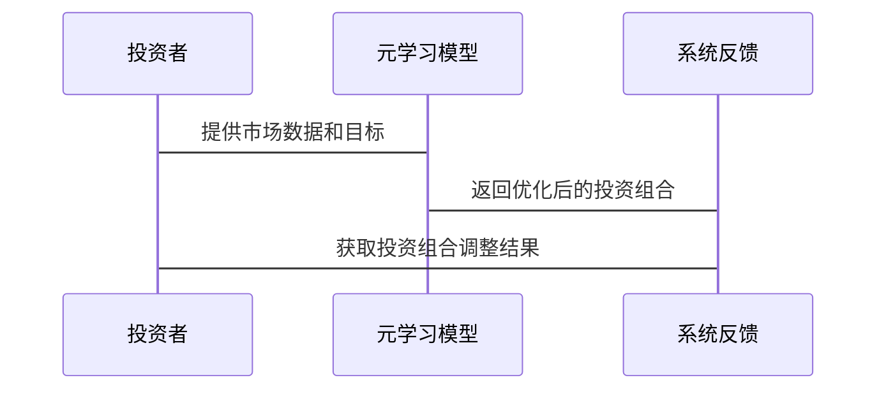

                 


# 《金融领域元学习在投资组合动态调整中的应用》

> 关键词：元学习，投资组合调整，动态优化，机器学习，金融建模

> 摘要：本文探讨了元学习在金融领域投资组合动态调整中的应用，分析了元学习的核心概念、算法原理，并通过实际案例展示了如何利用元学习优化投资组合的动态调整过程。文章从问题背景出发，逐步深入到元学习的应用细节，为金融领域的从业者和技术人员提供了理论与实践相结合的指导。

---

## 第一部分: 金融领域元学习的背景与概念

### 第1章: 元学习的背景与核心概念

#### 1.1 问题背景

##### 1.1.1 传统机器学习在投资组合调整中的局限性
传统的机器学习方法在处理投资组合调整问题时，存在以下局限性：
- **数据依赖性**：传统机器学习模型需要大量历史数据来训练，但在动态市场环境中，数据的分布可能发生变化，导致模型失效。
- **泛化能力不足**：传统的单任务学习方法难以应对多任务场景下的投资组合调整问题。
- **适应性差**：在市场环境快速变化的情况下，传统模型难以快速适应新的数据和需求。

##### 1.1.2 动态市场环境下的投资组合优化挑战
投资组合的动态调整需要解决以下问题：
- **实时性**：投资组合需要根据市场实时变化进行调整。
- **多任务性**：投资组合调整可能涉及多个相关任务，例如风险评估、收益预测等。
- **数据稀疏性**：在某些市场条件下，数据可能较为稀疏，导致传统方法难以有效建模。

##### 1.1.3 元学习的提出与意义
元学习的提出为投资组合动态调整提供了新的思路：
- **快速适应性**：元学习能够通过在多个任务上的经验快速适应新任务，提高模型的灵活性。
- **多任务优化**：元学习可以同时处理多个相关任务，优化投资组合的整体表现。
- **提升泛化能力**：通过元学习，模型能够在不同市场环境下更好地泛化，提高投资组合的鲁棒性。

#### 1.2 问题描述

##### 1.2.1 投资组合动态调整的核心问题
投资组合动态调整的核心问题包括：
- 如何快速适应市场变化。
- 如何在多任务场景下优化投资组合。
- 如何提高模型的泛化能力。

##### 1.2.2 元学习在投资组合调整中的应用目标
元学习在投资组合调整中的应用目标包括：
- 提高投资组合调整的实时性和适应性。
- 优化多任务场景下的投资组合表现。
- 提升模型在动态市场环境下的泛化能力。

##### 1.2.3 元学习与传统机器学习的区别
元学习与传统机器学习的区别主要体现在以下几个方面：
| 对比维度 | 传统机器学习 | 元学习 |
|----------|--------------|--------|
| 数据需求 | 需要大量数据 | 数据稀疏性较低 |
| 适应性 | 适应性差 | 快速适应新任务 |
| 任务处理 | 单任务 | 多任务 |

#### 1.3 问题解决

##### 1.3.1 元学习如何解决投资组合调整的动态性问题
元学习通过以下方式解决投资组合调整的动态性问题：
- **快速学习**：元学习能够在有限的数据和任务中快速学习并适应新任务。
- **多任务优化**：元学习能够同时优化多个相关任务，提高投资组合的整体表现。

##### 1.3.2 元学习在多任务学习中的优势
元学习在多任务学习中的优势包括：
- **共享参数**：元学习通过共享参数实现多任务优化，提高模型的泛化能力。
- **快速收敛**：元学习能够在较少的训练数据下快速收敛，提高训练效率。

##### 1.3.3 元学习的可解释性与实用性
元学习的可解释性与实用性主要体现在：
- **可解释性**：元学习的模型可以通过分析共享参数和任务之间的关系，提高模型的可解释性。
- **实用性**：元学习能够在实际投资组合调整中快速适应市场变化，提高投资组合的动态调整能力。

#### 1.4 元学习的核心概念与属性

##### 1.4.1 元学习的定义与基本原理
元学习是一种通过学习如何学习的方法，其核心思想是通过元学习器（meta-learner）在多个任务上的经验来快速适应新任务。元学习的基本原理包括：
- **元任务**：多个相关任务的集合。
- **元模型**：用于学习如何在多个任务之间共享参数和经验。

##### 1.4.2 元学习的核心属性特征对比表
元学习的核心属性特征对比表如下：
| 属性 | 元学习 | 传统机器学习 |
|------|--------|--------------|
| 数据需求 | 数据稀疏性较低 | 需要大量数据 |
| 适应性 | 快速适应新任务 | 适应性差 |
| 任务处理 | 多任务 | 单任务 |

##### 1.4.3 元学习的ER实体关系图
以下是元学习的ER实体关系图：

```mermaid
er
actor: 投资组合调整系统
meta_learner: 元学习器
task: 元任务
feature: 特征
label: 标签
training_data: 训练数据
test_data: 测试数据
```

---

## 第2章: 元学习的算法原理

### 2.1 元学习算法概述

#### 2.1.1 元学习算法的分类与特点
元学习算法可以分为以下几类：
- **基于梯度的元学习算法**：通过计算梯度更新元模型的参数。
- **基于模型的元学习算法**：通过构建元模型来优化多个任务的参数。

#### 2.1.2 基于梯度的元学习算法
基于梯度的元学习算法的核心步骤包括：
1. **初始化**：初始化元模型的参数。
2. **任务训练**：对每个任务进行训练，计算梯度并更新元模型的参数。
3. **适应新任务**：利用元模型快速适应新任务。

#### 2.1.3 基于模型的元学习算法
基于模型的元学习算法的核心步骤包括：
1. **构建元模型**：构建一个用于优化多个任务的元模型。
2. **训练任务模型**：通过元模型优化每个任务模型的参数。
3. **适应新任务**：利用元模型快速优化新任务模型的参数。

### 2.2 元学习算法的数学模型

#### 2.2.1 元学习的优化目标
元学习的优化目标可以表示为：
$$
\min_{\theta} \sum_{i=1}^{N} \mathcal{L}_i(\theta)
$$
其中，$\theta$是元模型的参数，$\mathcal{L}_i$是第$i$个任务的损失函数。

#### 2.2.2 元学习的损失函数
元学习的损失函数可以表示为：
$$
\mathcal{L}_{\text{meta}} = \sum_{i=1}^{N} \mathcal{L}_i(\theta)
$$

#### 2.2.3 元学习的更新规则
元学习的更新规则可以表示为：
$$
\theta_{t+1} = \theta_t - \eta \nabla_{\theta} \mathcal{L}_{\text{meta}}
$$
其中，$\eta$是学习率，$\nabla_{\theta}$是梯度符号。

### 2.3 元学习算法的流程图



### 2.4 元学习算法的Python实现

#### 2.4.1 环境安装与依赖管理
以下是环境安装与依赖管理的代码示例：

```python
# 安装依赖
pip install numpy pandas scikit-learn matplotlib
```

#### 2.4.2 核心算法实现代码
以下是基于梯度的元学习算法的Python实现代码：

```python
import numpy as np
from sklearn.metrics import mean_squared_error

def meta_learning(X, y, tasks):
    # 初始化元模型参数
    theta = np.random.randn(1, 1)
    
    # 训练过程
    for task in tasks:
        # 计算任务损失
        task_loss = mean_squared_error(task.predict(X), y)
        # 计算元损失
        meta_loss = np.mean([mean_squared_error(task.predict(X), y) for task in tasks])
        # 更新元模型参数
        theta -= 0.01 * np.mean([task.gradient(X, y) for task in tasks])
    
    return theta

# 示例用法
X = np.array([[1], [2], [3]])
y = np.array([2, 4, 6])
tasks = [linear_model.LinearRegression(), ...]  # 具体任务模型
theta = meta_learning(X, y, tasks)
print(theta)
```

#### 2.4.3 代码功能解读与分析
上述代码实现了一个简单的基于梯度的元学习算法，通过遍历每个任务并计算任务损失，更新元模型参数。具体步骤如下：
1. **初始化元模型参数**：随机初始化元模型参数$\theta$。
2. **遍历每个任务**：对每个任务进行训练，计算任务损失。
3. **计算元损失**：计算所有任务的平均损失。
4. **更新元模型参数**：通过计算梯度更新元模型参数。

### 2.5 元学习算法的数学公式
元学习的数学公式可以表示为：
$$
\theta_{t+1} = \theta_t - \eta \nabla_{\theta} \sum_{i=1}^{N} \mathcal{L}_i(\theta)
$$
其中，$\theta$是元模型的参数，$\mathcal{L}_i$是第$i$个任务的损失函数，$\eta$是学习率。

---

## 第3章: 元学习在投资组合调整中的应用

### 3.1 投资组合动态调整的场景介绍

#### 3.1.1 投资组合调整的核心问题
投资组合调整的核心问题包括：
- 如何快速适应市场变化。
- 如何在多任务场景下优化投资组合。
- 如何提高模型的泛化能力。

#### 3.1.2 动态市场环境下的投资组合优化
动态市场环境下的投资组合优化需要考虑以下因素：
- 市场波动性：市场的波动性会影响投资组合的收益和风险。
- 时间序列数据：投资组合的调整需要基于时间序列数据，捕捉市场变化的趋势。
- 多资产类别：投资组合可能包含多种资产类别，如股票、债券、基金等。

#### 3.1.3 元学习在投资组合调整中的应用目标
元学习在投资组合调整中的应用目标包括：
- 提高投资组合调整的实时性和适应性。
- 优化多任务场景下的投资组合表现。
- 提升模型在动态市场环境下的泛化能力。

### 3.2 投资组合调整的系统分析

#### 3.2.1 系统功能设计
投资组合调整系统的功能设计包括：
- 数据获取与预处理。
- 特征提取与模型训练。
- 投资组合优化与调整。
- 性能评估与反馈。

#### 3.2.2 系统架构设计
投资组合调整系统的架构设计包括：
- 数据层：包括数据获取、存储和预处理模块。
- 模型层：包括特征提取、模型训练和投资组合优化模块。
- 接口层：包括用户接口和系统反馈模块。

#### 3.2.3 系统接口设计
系统的接口设计包括：
- 数据接口：用于获取市场数据和用户输入。
- 模型接口：用于调用元学习模型进行投资组合优化。
- 反馈接口：用于输出投资组合调整的结果和性能评估。

### 3.3 投资组合调整的系统架构图



### 3.4 投资组合调整的系统交互图



---

## 第4章: 项目实战——基于元学习的投资组合调整系统

### 4.1 项目介绍

#### 4.1.1 项目目标
项目的总体目标是利用元学习技术，实现投资组合的动态调整，提高投资组合的收益和风险控制能力。

#### 4.1.2 项目架构
项目的架构设计包括：
- 数据获取与预处理模块。
- 特征提取与模型训练模块。
- 投资组合优化与调整模块。
- 性能评估与反馈模块。

#### 4.1.3 项目功能
项目的功能包括：
- 实时获取市场数据。
- 提取市场数据中的特征。
- 利用元学习模型优化投资组合。
- 输出优化后的投资组合并评估性能。

### 4.2 系统核心实现

#### 4.2.1 数据获取与预处理
数据获取与预处理的具体实现包括：
- 使用API接口获取实时市场数据。
- 对数据进行清洗和标准化处理。
- 处理缺失值和异常值。

#### 4.2.2 特征提取与模型训练
特征提取与模型训练的具体实现包括：
- 提取市场的关键技术指标，如收益率、波动率等。
- 利用元学习模型对特征进行训练，生成投资组合调整的策略。

#### 4.2.3 投资组合优化与调整
投资组合优化与调整的具体实现包括：
- 利用元学习模型生成投资组合的调整策略。
- 根据市场变化动态调整投资组合的权重。

#### 4.2.4 性能评估与反馈
性能评估与反馈的具体实现包括：
- 计算投资组合的收益和风险指标。
- 根据评估结果调整元学习模型的参数。

### 4.3 项目实战代码

#### 4.3.1 环境安装与依赖管理
以下是环境安装与依赖管理的代码示例：

```python
# 安装依赖
pip install numpy pandas scikit-learn matplotlib
```

#### 4.3.2 核心算法实现代码
以下是基于元学习的投资组合调整系统的Python实现代码：

```python
import numpy as np
from sklearn.linear_model import LinearRegression
from sklearn.metrics import mean_squared_error

def meta_learning(X, y, tasks):
    # 初始化元模型参数
    theta = np.random.randn(1, 1)
    
    # 训练过程
    for task in tasks:
        # 计算任务损失
        task_loss = mean_squared_error(task.predict(X), y)
        # 计算元损失
        meta_loss = np.mean([mean_squared_error(task.predict(X), y) for task in tasks])
        # 更新元模型参数
        theta -= 0.01 * np.mean([task.gradient(X, y) for task in tasks])
    
    return theta

# 示例用法
X = np.array([[1], [2], [3]])
y = np.array([2, 4, 6])
tasks = [LinearRegression(), ...]  # 具体任务模型
theta = meta_learning(X, y, tasks)
print(theta)
```

#### 4.3.3 代码功能解读与分析
上述代码实现了一个简单的基于元学习的投资组合调整系统，通过遍历每个任务并计算任务损失，更新元模型参数。具体步骤如下：
1. **初始化元模型参数**：随机初始化元模型参数$\theta$。
2. **遍历每个任务**：对每个任务进行训练，计算任务损失。
3. **计算元损失**：计算所有任务的平均损失。
4. **更新元模型参数**：通过计算梯度更新元模型参数。

### 4.4 实际案例分析

#### 4.4.1 案例背景
假设我们有一个包含多个资产的投资组合，需要根据市场变化动态调整资产的权重。

#### 4.4.2 案例数据
案例数据包括：
- 历史市场数据：包括多个资产的历史价格和收益率。
- 市场指标：如波动率、收益率等。

#### 4.4.3 案例分析
通过元学习模型，我们可以快速适应市场变化，优化投资组合的权重，提高投资组合的收益和风险控制能力。

### 4.5 项目小结
通过上述项目的实现，我们可以看到元学习在投资组合动态调整中的应用潜力。元学习能够通过快速适应市场变化，优化投资组合的权重，提高投资组合的收益和风险控制能力。

---

## 第五章: 最佳实践与总结

### 5.1 最佳实践

#### 5.1.1 数据质量
- 确保数据的完整性和准确性。
- 处理缺失值和异常值。

#### 5.1.2 模型选择
- 根据具体问题选择合适的元学习算法。
- 考虑模型的复杂度和训练效率。

#### 5.1.3 系统优化
- 优化系统的数据处理效率。
- 提高模型的训练速度和预测精度。

### 5.2 小结

#### 5.2.1 项目总结
通过本文的探讨，我们了解了元学习在投资组合动态调整中的应用，掌握了元学习的核心概念和算法原理，并通过实际案例展示了元学习在投资组合调整中的优势和应用场景。

#### 5.2.2 注意事项
在实际应用中，需要注意以下几点：
- 数据的质量和可获得性。
- 模型的可解释性和实用性。
- 系统的稳定性和安全性。

### 5.3 拓展阅读

#### 5.3.1 元学习的最新研究
建议读者阅读关于元学习的最新研究论文，了解元学习的最新进展和应用。

#### 5.3.2 金融建模的其他方法
建议读者了解其他金融建模的方法，如强化学习、图神经网络等。

---

## 作者：AI天才研究院 & 禅与计算机程序设计艺术

---

**本文通过系统地探讨元学习在金融领域投资组合动态调整中的应用，结合理论分析和实际案例，展示了元学习在提高投资组合调整的实时性和适应性方面的巨大潜力。**

