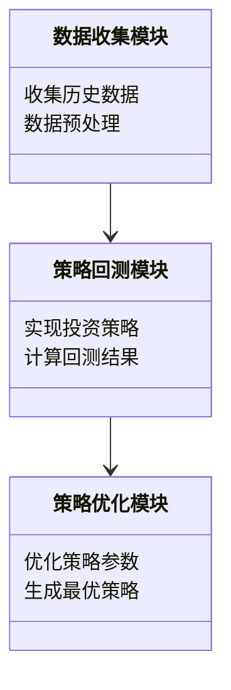
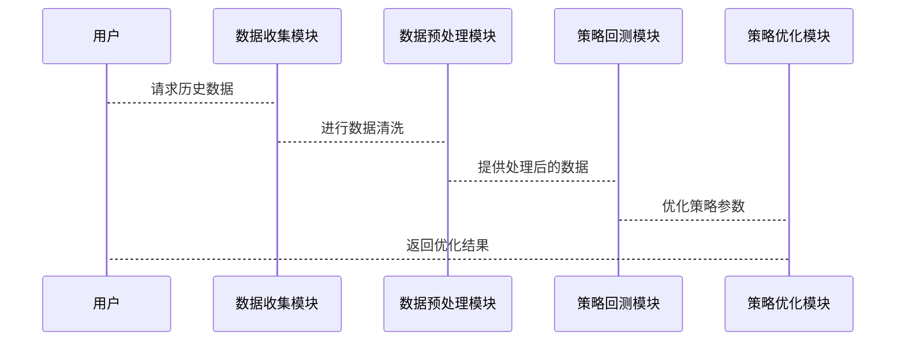

                 


# AI驱动的价值投资策略回测与优化

## 关键词：
- 价值投资
- AI驱动
- 策略优化
- 回测
- 投资组合管理

## 摘要：
本文详细探讨了如何利用人工智能技术优化价值投资策略的回测与优化过程。文章从价值投资的基本概念和AI在金融领域的应用入手，分析了AI驱动的策略回测与优化的核心概念、算法原理、系统架构设计以及实际案例。通过数学模型和公式、算法流程图、系统架构图等工具，深入剖析了AI在价值投资中的应用，为投资者提供了科学、高效的策略优化方法。

---

# 第1章 价值投资与AI技术的结合

## 1.1 价值投资的基本概念
### 1.1.1 价值投资的定义
价值投资是一种投资策略，旨在通过识别市场中被低估的资产（如股票）进行长期投资，以获取超额收益。其核心在于分析公司的基本面，寻找具有持续竞争优势和良好管理团队的企业。

### 1.1.2 价值投资的核心理念
- 价格与价值的分离：市场价格短期可能波动，但长期会回归其内在价值。
- 安全边际：买入价格低于内在价值，以降低投资风险。
- 长期持有：价值投资者倾向于长期持有优质资产，而非频繁交易。

### 1.1.3 价值投资在金融领域的应用
价值投资广泛应用于股票市场，尤其是对基本面分析和长期趋势预测的重视，使其成为机构投资者和专业投资者的重要策略。

---

## 1.2 AI技术在金融领域的应用
### 1.2.1 AI在金融分析中的作用
AI技术可以通过自然语言处理（NLP）分析财务报告、新闻和社交媒体，提取市场情绪和潜在的财务信息。

### 1.2.2 AI在投资策略中的应用
AI可以通过机器学习算法构建预测模型，优化投资组合，识别市场趋势，以及发现潜在的投资机会。

### 1.2.3 AI在风险控制中的作用
AI可以帮助识别市场风险，预测市场波动，并通过实时监控和预警系统降低投资风险。

---

## 1.3 AI驱动的价值投资策略的必要性
### 1.3.1 传统投资策略的局限性
传统价值投资依赖人工分析，存在主观性强、效率低、覆盖范围有限等问题。

### 1.3.2 AI技术在投资策略优化中的优势
- 数据处理能力：AI可以处理海量数据，提取传统方法难以察觉的模式和趋势。
- 自动化优化：AI可以通过算法优化投资组合，降低人为情绪干扰。
- 高效性：AI可以在短时间内完成复杂的计算和分析。

### 1.3.3 结合AI的价值投资策略的前景
结合AI的价值投资策略能够提高投资效率、降低风险，同时为投资者提供更精准的决策支持。

---

## 1.4 本章小结
本章介绍了价值投资的基本概念和AI技术在金融领域的应用，分析了AI驱动的价值投资策略的必要性和优势，为后续内容奠定了基础。

---

# 第2章 价值投资策略的回测与优化概述

## 2.1 价值投资策略的回测
### 2.1.1 回测的定义与作用
回测是指通过历史数据验证投资策略的有效性。其作用在于评估策略的盈利能力、风险承受能力和稳定性。

### 2.1.2 回测的关键步骤
1. 确定回测时间窗口：选择合适的历史时间段。
2. 数据准备：收集相关的历史数据。
3. 策略实现：编写代码实现投资策略。
4. 性能评估：计算回测结果的各项指标。

### 2.1.3 回测的常见指标
- � 净值增长率（Return）：策略的盈利能力。
- 净值波动率（Volatility）：策略的风险水平。
- 最大回撤（Maximum Drawdown）：策略的最大亏损幅度。
- Sharpe比率：衡量风险调整后的收益。

---

## 2.2 价值投资策略的优化
### 2.2.1 优化的定义与目标
优化是指通过调整策略参数或改进策略逻辑，提高投资策略的收益和风险调整后的收益。

### 2.2.2 优化的常见方法
1. 参数优化：调整策略中的参数（如买卖规则）。
2. 策略组合优化：结合多个策略，形成最优投资组合。
3. 风险优化：降低策略的风险水平。

### 2.2.3 优化的挑战与解决方案
- 过度拟合：避免在特定数据集上的过度优化。
- 计算复杂度：通过分布式计算和优化算法降低计算成本。

---

## 2.3 AI在策略回测与优化中的应用
### 2.3.1 AI驱动的回测流程
1. 数据收集与预处理。
2. 特征提取与选择。
3. 模型训练与验证。
4. 回测结果分析。

### 2.3.2 AI驱动的优化方法
1. 使用遗传算法优化策略参数。
2. 利用机器学习模型预测市场趋势。
3. 通过强化学习模拟交易决策。

### 2.3.3 AI在回测与优化中的优势
- 高效性：AI可以在短时间内处理大量数据。
- 精准性：AI可以通过复杂模型捕捉市场规律。

---

## 2.4 本章小结
本章详细介绍了价值投资策略的回测与优化过程，并探讨了AI技术在其中的应用，为后续的策略优化奠定了基础。

---

# 第3章 AI驱动的价值投资策略的核心概念与联系

## 3.1 核心概念
### 3.1.1 数据驱动的特征
AI依赖于数据进行学习和预测，数据的质量和数量直接影响策略的效果。

### 3.1.2 模型驱动的特征
通过构建机器学习模型，AI可以自动识别数据中的模式和趋势，从而优化投资策略。

### 3.1.3 策略优化的特征
策略优化的目标是找到最优的策略组合，以实现收益与风险的最佳平衡。

---

## 3.2 核心概念的对比
### 3.2.1 数据驱动与模型驱动的对比
| 特性 | 数据驱动 | 模型驱动 |
|------|----------|----------|
| 依赖 | 数据量    | 模型复杂度 | 
| 优势 | 可解释性低 | 预测能力强 |
| 劣势 | 需大量数据 | 过度拟合风险 |

### 3.2.2 策略优化与传统优化的对比
| 特性 | 传统优化 | AI驱动优化 |
|------|----------|------------|
| 方法 | 线性优化   | 非线性优化  |
| 工具 | 数学模型   | 机器学习模型 |
| 效率 | 低        | 高          |

### 3.2.3 AI驱动与传统驱动的对比
| 特性 | AI驱动 | 传统驱动 |
|------|--------|----------|
| 数据需求 | 高     | 低        |
| 计算复杂度 | 高     | 低        |
| 精准度 | 高     | 中等       |

---

## 3.3 实体关系图
### 3.3.1 数据流的实体关系


### 3.3.2 模型的实体关系


### 3.3.3 策略优化的实体关系


---

## 3.4 本章小结
本章通过对比分析，明确了AI驱动的价值投资策略的核心概念及其相互关系，为后续的策略优化提供了理论支持。

---

# 第4章 AI驱动的价值投资策略的核心算法原理

## 4.1 算法原理
### 4.1.1 机器学习算法
- 线性回归：用于预测资产价格。
- 支持向量机（SVM）：用于分类问题。
- 随机森林：用于特征选择和预测。

### 4.1.2 深度学习算法
- 卷积神经网络（CNN）：用于图像识别和时间序列分析。
- 循序神经网络（RNN）：用于时间序列预测。

### 4.1.3 集成学习算法
- 增强学习：通过强化学习模拟交易决策。
- Bagging：通过随机化技术降低模型过拟合风险。

---

## 4.2 算法流程图
### 4.2.1 机器学习算法流程图


### 4.2.2 深度学习算法流程图


### 4.2.3 集成学习算法流程图


---

## 4.3 算法实现
### 4.3.1 机器学习算法实现
```python
from sklearn.linear_model import LinearRegression
model = LinearRegression()
model.fit(X_train, y_train)
```

### 4.3.2 深度学习算法实现
```python
import tensorflow as tf
model = tf.keras.Sequential([
    tf.keras.layers.Dense(64, activation='relu'),
    tf.keras.layers.Dense(1, activation='sigmoid')
])
model.compile(optimizer='adam', loss='binary_crossentropy')
model.fit(X_train, y_train, epochs=10)
```

### 4.3.3 集成学习算法实现
```python
from sklearn.ensemble import VotingClassifier
model = VotingClassifier(estimators=[('lr', LogisticRegression()), ('rf', RandomForestClassifier())])
model.fit(X_train, y_train)
```

---

## 4.4 本章小结
本章详细介绍了AI驱动的价值投资策略中常用的算法及其实现方式，为后续的策略优化提供了技术支持。

---

# 第5章 价值投资策略的数学模型与公式

## 5.1 数学模型
### 5.1.1 价值投资模型
$$ \text{内在价值} = \frac{\text{现金流}}{\text{贴现率}} $$

### 5.1.2 AI驱动的优化模型
$$ \text{优化目标} = \max \left( \text{收益} - \lambda \times \text{风险} \right) $$

### 5.1.3 回测模型
$$ \text{回测结果} = f(\text{历史数据}, \text{策略逻辑}) $$

---

## 5.2 数学公式
### 5.2.1 价值投资模型公式
$$ \text{内在价值} = \sum_{t=1}^{n} \frac{\text{现金流}_t}{(1 + r)^t} $$

### 5.2.2 AI驱动的优化公式
$$ \text{优化参数} = \arg \max_{\theta} \left( \sum_{i=1}^{m} w_i \times f_i(\theta) \right) $$

### 5.2.3 回测模型公式
$$ \text{回测收益} = \sum_{t=1}^{T} \left( \text{收盘价}_t - \text{收盘价}_{t-1} \right) \times \text{持有量}_t $$

---

## 5.3 公式解释
### 5.3.1 价值投资模型公式的解释
内在价值是未来现金流的现值，贴现率反映了投资者的风险偏好。

### 5.3.2 AI驱动的优化公式的解释
优化目标是最大化收益减去风险的加权和，权重 $w_i$ 反映了各目标的重要性。

### 5.3.3 回测模型公式的解释
回测收益是策略在每段时间内的收益之和，持有量 $t$ 反映了在时间 $t$ 的持仓情况。

---

## 5.4 本章小结
本章通过数学模型和公式，详细阐述了价值投资策略的内在逻辑和AI驱动优化的数学基础。

---

# 第6章 价值投资策略的系统分析与架构设计

## 6.1 问题场景介绍
### 6.1.1 价值投资的背景
市场波动大，传统投资策略难以适应快速变化的市场环境。

### 6.1.2 问题描述
如何利用AI技术优化价值投资策略，提高回测效率和策略优化效果。

### 6.1.3 问题解决
通过AI技术实现自动化回测和策略优化，降低人工成本和提高决策效率。

---

## 6.2 项目介绍
### 6.2.1 项目目标
构建一个基于AI的价值投资策略回测与优化系统。

### 6.2.2 项目范围
涵盖数据收集、策略回测、策略优化和结果分析。

---

## 6.3 系统功能设计
### 6.3.1 领域模型


### 6.3.2 系统架构设计


### 6.3.3 系统接口设计
- 数据接口：与数据源（如股票数据库）对接。
- 策略接口：与策略回测模块对接。
- 优化接口：与策略优化模块对接。

### 6.3.4 系统交互


---

## 6.4 本章小结
本章通过系统分析与架构设计，明确了AI驱动的价值投资策略回测与优化系统的整体框架和实现路径。

---

# 第7章 价值投资策略的项目实战

## 7.1 环境安装
### 7.1.1 安装Python环境
```bash
pip install python3
pip install jupyterlab
```

### 7.1.2 安装AI库
```bash
pip install numpy pandas scikit-learn tensorflow
```

---

## 7.2 系统核心实现源代码
### 7.2.1 数据预处理代码
```python
import pandas as pd
data = pd.read_csv('stock_data.csv')
data = data.dropna()
```

### 7.2.2 特征选择代码
```python
from sklearn.feature_selection import SelectKBest
selector = SelectKBest(k=5)
selector.fit_transform(data)
```

### 7.2.3 模型训练代码
```python
from sklearn.ensemble import RandomForestClassifier
model = RandomForestClassifier()
model.fit(X_train, y_train)
```

### 7.2.4 回测结果分析代码
```python
import matplotlib.pyplot as plt
plt.plot(results)
plt.show()
```

---

## 7.3 代码应用解读与分析
### 7.3.1 数据预处理
数据预处理是确保模型输入数据的质量，包括去除缺失值和异常值。

### 7.3.2 特征选择
通过特征选择算法（如SelectKBest）选择最重要的特征，提高模型的准确性和效率。

### 7.3.3 模型训练
使用随机森林等机器学习模型进行训练，提取数据中的特征和模式。

### 7.3.4 回测结果分析
通过可视化工具分析回测结果，评估策略的盈利能力、风险水平和稳定性。

---

## 7.4 实际案例分析
### 7.4.1 案例背景
以某股票为例，分析其历史价格和相关指标。

### 7.4.2 案例实现
```python
# 数据加载与预处理
data = pd.read_csv('example.csv')
data = data.dropna()

# 特征选择
selector = SelectKBest(k=5)
selected_features = selector.fit_transform(data)

# 模型训练
model = RandomForestClassifier()
model.fit(selected_features, target)

# 回测结果分析
results = model.predict(test_data)
```

### 7.4.3 案例分析
通过案例分析，验证AI驱动的价值投资策略的有效性和可行性。

---

## 7.5 本章小结
本章通过项目实战，详细展示了AI驱动的价值投资策略回测与优化系统的实现过程，为读者提供了实际操作的经验。

---

# 第8章 AI驱动的价值投资策略的优化策略与注意事项

## 8.1 优化策略
### 8.1.1 参数优化
通过网格搜索或随机搜索优化策略参数。

### 8.1.2 策略组合优化
结合多个策略，形成最优投资组合。

### 8.1.3 风险优化
通过风险中性化和风险分层优化策略的风险水平。

---

## 8.2 注意事项
### 8.2.1 数据质量
确保数据的完整性和准确性，避免数据偏差。

### 8.2.2 模型过拟合
通过交叉验证和正则化技术防止模型过拟合。

### 8.2.3 市场变化
市场环境的变化可能会影响策略的有效性，需要定期更新和调整策略。

---

## 8.3 本章小结
本章总结了AI驱动的价值投资策略的优化策略和注意事项，为读者提供了实际应用中的重要参考。

---

# 第9章 总结与展望

## 9.1 总结
本文详细探讨了AI驱动的价值投资策略的回测与优化过程，分析了其核心概念、算法原理和系统架构设计，并通过实际案例展示了其在金融领域的应用。

## 9.2 展望
未来，随着AI技术的不断发展，价值投资策略的回测与优化将更加智能化和自动化。同时，结合区块链、大数据等技术，将进一步提升投资策略的效率和精准度。

---

# 作者：AI天才研究院/AI Genius Institute & 禅与计算机程序设计艺术 /Zen And The Art of Computer Programming

---

**本文旨在通过系统化的分析和实战案例，帮助读者深入理解AI驱动的价值投资策略的回测与优化过程，为金融领域的从业者和技术爱好者提供理论和实践的双重指导。**

