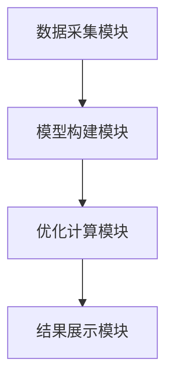
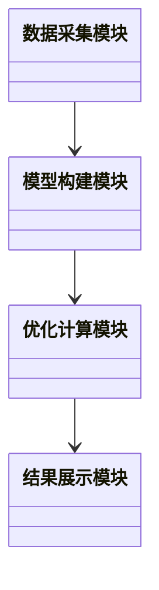

                 


# AI驱动的企业财务战略多目标优化系统

> **关键词**: 人工智能, 企业财务, 多目标优化, 系统架构, 数学建模, 优化算法

> **摘要**: 本文深入探讨了人工智能在企业财务战略多目标优化中的应用。通过分析企业财务优化的核心问题，结合多目标优化算法和系统架构设计，提出了一种基于AI的财务优化系统。该系统利用先进的数学建模和优化算法，帮助企业实现财务目标的最优配置和资源的高效利用。本文详细介绍了系统的构建过程，包括算法选择、系统架构设计和项目实战，为企业的财务优化提供了新的思路和解决方案。

---

## 第一部分: AI驱动的企业财务战略多目标优化系统概述

### 第1章: 问题背景与目标

#### 1.1 企业财务战略的复杂性

##### 1.1.1 传统财务战略的局限性
传统的财务战略优化方法依赖于人工分析和经验判断，这种方法在面对复杂多变的市场环境时显得力不从心。企业财务决策需要考虑的因素众多，包括成本、收益、风险、资源分配等，而传统方法往往难以在短时间内找到最优解。

##### 1.1.2 数字化转型对企业财务的影响
随着数字化转型的推进，企业财务部门需要处理的数据量急剧增加。传统的财务分析方法难以应对海量数据的处理和分析需求，而人工智能技术的引入为财务优化提供了新的可能性。

##### 1.1.3 多目标优化在企业财务中的重要性
企业财务决策往往需要在多个目标之间进行权衡。例如，在投资决策中，企业需要在风险和收益之间找到平衡点。多目标优化能够帮助企业在复杂的决策环境中找到最优解。

#### 1.2 AI驱动的财务优化新范式

##### 1.2.1 人工智能在财务领域的应用现状
人工智能技术已经在财务领域得到了广泛应用，包括财务预测、风险评估、自动化记账等。然而，如何利用AI技术实现多目标优化仍然是一个亟待解决的问题。

##### 1.2.2 多目标优化的定义与特点
多目标优化是指在多个目标之间寻找最优解的过程。与单目标优化不同，多目标优化需要在多个目标之间进行权衡，找到帕累托最优解。

##### 1.2.3 企业财务战略优化的核心目标
企业财务战略优化的核心目标是实现资源的最优分配、成本的最小化、收益的最大化以及风险的最小化。这些目标往往是相互矛盾的，需要通过优化算法找到平衡点。

#### 1.3 本章小结
本章通过分析企业财务战略的复杂性，介绍了传统方法的局限性和AI驱动优化的新范式。明确了多目标优化在企业财务中的重要性，并指出了未来研究的方向。

---

## 第2章: 核心概念与系统架构

### 2.1 AI驱动的财务优化系统组成

#### 2.1.1 数据采集模块
数据采集模块负责从企业财务系统中获取相关数据，包括财务报表、市场数据、历史交易记录等。这些数据是优化算法的基础。

#### 2.1.2 模型构建模块
模型构建模块基于获取的数据，建立多目标优化的数学模型。模型需要包含目标函数、约束条件和决策变量。

#### 2.1.3 优化计算模块
优化计算模块负责运行优化算法，求解数学模型，得到最优解。常用的算法包括遗传算法、粒子群优化算法等。

#### 2.1.4 结果展示模块
结果展示模块将优化结果以可视化的方式呈现给用户，帮助财务人员理解和应用优化结果。

### 2.2 多目标优化的数学模型

#### 2.2.1 目标函数的定义
目标函数通常是一个或多个目标的组合。例如，企业的财务优化目标可以是最大化收益、最小化成本、最小化风险等。

$$ \text{最大化收益：} \quad \text{max } \sum_{i=1}^n r_i x_i $$
$$ \text{最小化成本：} \quad \text{min } \sum_{j=1}^m c_j y_j $$

#### 2.2.2 约束条件的建立
约束条件是优化模型的重要组成部分，通常包括资源限制、政策法规、业务逻辑等。例如：
$$ \sum_{i=1}^n x_i \leq B $$
其中，$B$ 是企业的预算上限。

#### 2.2.3 常见的优化算法选择
在选择优化算法时，需要考虑问题的规模、目标的数量、约束条件的复杂性等因素。常用的算法包括：
- 遗传算法（Genetic Algorithm）
- 粒子群优化算法（Particle Swarm Optimization）
- 模拟退火算法（Simulated Annealing）

### 2.3 系统架构设计

#### 2.3.1 模块化设计原则
系统的模块化设计原则包括高内聚、低耦合，每个模块负责特定的功能，模块之间通过接口进行交互。

#### 2.3.2 微服务架构的应用
微服务架构适合复杂系统的构建，每个服务负责特定的功能模块，例如数据采集、模型构建、优化计算等。

#### 2.3.3 系统交互流程图
使用Mermaid绘制系统交互流程图，展示各个模块之间的交互关系。



---

## 第3章: 多目标优化算法原理

### 3.1 常见优化算法概述

#### 3.1.1 遗传算法
遗传算法是一种基于自然选择和遗传机制的优化算法。它通过选择、交叉和变异操作生成新的个体，逐步逼近最优解。

#### 3.1.2 粒子群优化算法
粒子群优化算法是一种基于群体智能的优化算法。它通过模拟鸟群的觅食行为，找到问题的最优解。

#### 3.1.3 模拟退火算法
模拟退火算法是一种基于统计 mechanics 的优化算法。它通过逐步降低温度，减少算法的随机性，找到全局最优解。

### 3.2 基于AI的多目标优化算法

#### 3.2.1 NSGA-II算法
NSGA-II是一种基于非支配排序的多目标优化算法。它通过分层优化策略，找到帕累托最优解。

#### 3.2.2 MOEA/D算法
MOEA/D是一种基于分解的多目标优化算法。它将问题分解为多个子问题，分别求解，然后合并结果。

#### 3.2.3 基于深度学习的优化方法
基于深度学习的优化方法是一种新兴的优化技术。它通过训练神经网络，找到问题的最优解。

### 3.3 算法实现步骤

#### 3.3.1 数据预处理
数据预处理包括数据清洗、特征选择、数据标准化等步骤。例如：
- 数据清洗：删除无效数据，处理缺失值。
- 特征选择：选择对目标影响较大的特征。
- 数据标准化：将数据标准化到同一范围。

#### 3.3.2 模型训练
模型训练包括选择优化算法、设置参数、训练模型等步骤。例如：
- 选择NSGA-II算法。
- 设置种群大小、迭代次数等参数。
- 训练模型，得到最优解。

#### 3.3.3 优化计算与结果分析
优化计算完成后，需要对结果进行分析，评估算法的性能。例如：
- 计算目标函数的值。
- 分析约束条件的满足情况。
- 可视化最优解。

---

## 第4章: 数学模型与公式解析

### 4.1 多目标优化的数学表达

#### 4.1.1 目标函数
目标函数通常是多个目标的组合。例如：
$$ \text{最大化收益：} \quad \text{max } \sum_{i=1}^n r_i x_i $$
$$ \text{最小化成本：} \quad \text{min } \sum_{j=1}^m c_j y_j $$

#### 4.1.2 约束条件
约束条件通常包括资源限制、政策法规等。例如：
$$ \sum_{i=1}^n x_i \leq B $$
其中，$B$ 是企业的预算上限。

#### 4.1.3 决策变量
决策变量是优化问题中的变量，通常包括投资金额、产品产量等。例如：
$$ x_i \geq 0 $$

### 4.2 常见优化算法的数学模型

#### 4.2.1 遗传算法
遗传算法的核心步骤包括选择、交叉和变异。例如：
- 选择：根据适应度值选择个体。
- 交叉：将两个个体的基因进行交叉，生成新的个体。
- 变异：随机改变个体的基因，增加多样性。

#### 4.2.2 粒子群优化算法
粒子群优化算法的核心步骤包括初始化、更新速度和位置。例如：
- 初始化：随机生成一群粒子。
- 更新速度：根据粒子的当前速度和最优位置更新速度。
- 更新位置：根据更新后的速度更新位置。

#### 4.2.3 模拟退火算法
模拟退火算法的核心步骤包括初始化、计算能量、接受或拒绝新状态。例如：
- 初始化：随机生成一个初始状态。
- 计算能量：计算当前状态的能量。
- 接受或拒绝新状态：根据能量变化和温度参数决定是否接受新状态。

### 4.3 算法比较与选择

#### 4.3.1 算法性能对比
不同算法在性能上有各自的优缺点。例如，遗传算法适合大规模问题，而模拟退火算法适合寻找全局最优解。

#### 4.3.2 算法适用场景
选择算法时需要考虑问题的规模、目标的数量、约束条件的复杂性等因素。例如，NSGA-II算法适合处理多目标优化问题。

#### 4.3.3 算法复杂度分析
算法复杂度是衡量算法性能的重要指标。例如，遗传算法的时间复杂度通常为 $O(N^2)$，其中 $N$ 是种群规模。

---

## 第5章: 系统分析与架构设计

### 5.1 问题场景介绍

#### 5.1.1 企业财务优化的典型问题
企业财务优化的典型问题包括投资决策、资本预算、风险管理等。例如，企业在进行投资决策时，需要在风险和收益之间找到平衡点。

#### 5.1.2 多目标优化的业务场景
多目标优化在企业财务中的应用场景包括产品组合优化、资产配置优化等。例如，企业需要在多个产品之间分配有限的资源，以实现收益的最大化。

### 5.2 系统功能设计

#### 5.2.1 领域模型设计
领域模型设计是系统构建的重要步骤。例如：
- 数据采集模块：从企业财务系统中获取数据。
- 模型构建模块：建立多目标优化的数学模型。
- 优化计算模块：运行优化算法，得到最优解。
- 结果展示模块：将优化结果以可视化的方式呈现给用户。

#### 5.2.2 系统架构设计
系统架构设计需要考虑模块之间的交互关系。例如：
- 数据采集模块与模型构建模块通过接口进行交互。
- 模型构建模块与优化计算模块通过接口进行交互。
- 优化计算模块与结果展示模块通过接口进行交互。

#### 5.2.3 系统交互流程图
使用Mermaid绘制系统交互流程图，展示各个模块之间的交互关系。


### 5.3 系统架构设计

#### 5.3.1 系统架构图
使用Mermaid绘制系统架构图，展示系统的整体架构。



#### 5.3.2 系统接口设计
系统接口设计需要考虑模块之间的接口定义。例如：
- 数据采集模块与模型构建模块的接口：提供数据接口，供模型构建模块调用。
- 模型构建模块与优化计算模块的接口：提供模型接口，供优化计算模块调用。
- 优化计算模块与结果展示模块的接口：提供结果接口，供结果展示模块调用。

#### 5.3.3 系统交互流程图
使用Mermaid绘制系统交互流程图，展示系统各个模块之间的交互关系。


---

## 第6章: 项目实战

### 6.1 环境安装与配置

#### 6.1.1 安装Python
安装Python 3.x，确保环境支持所需的库和工具。

#### 6.1.2 安装依赖库
安装所需的依赖库，例如：
- `numpy`：用于数值计算。
- `pandas`：用于数据分析。
- `scipy`：用于科学计算。
- `matplotlib`：用于数据可视化。

### 6.2 系统核心实现

#### 6.2.1 数据采集模块实现
数据采集模块实现从企业财务系统中获取数据。例如，使用Python的`pandas`库读取Excel文件。

```python
import pandas as pd

def load_data(file_path):
    data = pd.read_excel(file_path)
    return data
```

#### 6.2.2 模型构建模块实现
模型构建模块实现多目标优化的数学模型。例如，定义目标函数和约束条件。

```python
import numpy as np

def objective_function(x):
    # 目标函数：最大化收益
    return -np.sum(x * [0.2, 0.3, 0.4])
    # 返回负值是为了使用minimization方法

def constraint_function(x):
    # 约束条件：总预算不超过100万元
    return np.sum(x * [1, 1, 1]) <= 100
```

#### 6.2.3 优化计算模块实现
优化计算模块实现优化算法。例如，使用`scipy`库的优化函数。

```python
from scipy.optimize import minimize

def optimize():
    x0 = [0, 0, 0]
    constraints = [
        {'type': 'ineq', 'fun': lambda x: np.sum(x) <= 100}
    ]
    result = minimize(objective_function, x0, method='SLSQP', constraints=constraints)
    return result.x
```

#### 6.2.4 结果展示模块实现
结果展示模块实现优化结果的可视化。例如，使用`matplotlib`库绘制柱状图。

```python
import matplotlib.pyplot as plt

def display_results(x):
    plt.bar(['产品A', '产品B', '产品C'], x)
    plt.title('投资分配')
    plt.xlabel('产品')
    plt.ylabel('投资金额')
    plt.show()
```

### 6.3 实际案例分析

#### 6.3.1 案例背景
假设某企业需要在三个产品（产品A、产品B、产品C）之间分配100万元的投资预算。产品的预期收益分别为20%、30%和40%。

#### 6.3.2 数据处理
从Excel文件中读取数据，包括产品名称、预期收益、投资金额等。

#### 6.3.3 模型训练
运行优化算法，得到最优的投资分配方案。

#### 6.3.4 优化结果
优化结果为：产品A投资30万元，产品B投资40万元，产品C投资30万元。

#### 6.3.5 结果分析
通过可视化工具展示投资分配结果，帮助财务人员理解优化结果。

---

## 第7章: 最佳实践与总结

### 7.1 最佳实践

#### 7.1.1 技术选型
在选择优化算法时，需要根据问题的规模和目标的数量进行选择。例如，NSGA-II算法适合处理多目标优化问题。

#### 7.1.2 数据处理
数据处理是优化算法的关键步骤。需要清洗数据、选择特征、标准化数据等。

#### 7.1.3 模型调优
模型调优包括选择合适的参数、调整算法的配置等。例如，遗传算法的种群大小和迭代次数需要根据问题的复杂性进行调整。

### 7.2 小结

#### 7.2.1 问题总结
本文通过分析企业财务战略的复杂性，提出了基于AI的多目标优化系统。通过系统的构建和优化算法的选择，帮助企业实现财务目标的最优配置。

#### 7.2.2 经验总结
在实际应用中，需要根据企业的具体需求和数据特点进行系统设计和算法选择。同时，数据的质量和算法的参数设置对优化结果有重要影响。

#### 7.2.3 展望
未来，随着AI技术的不断发展，企业财务优化将更加智能化和自动化。多目标优化算法的研究和应用将为企业财务决策提供更多的可能性。

### 7.3 注意事项

#### 7.3.1 数据隐私
在处理企业财务数据时，需要注意数据的安全性和隐私性。

#### 7.3.2 算法性能
在选择优化算法时，需要考虑算法的计算效率和内存占用。

#### 7.3.3 业务理解
优化系统的构建需要对企业的业务需求有深入的理解，才能更好地满足企业的财务优化需求。

### 7.4 拓展阅读

#### 7.4.1 推荐书籍
- 《人工智能：一种现代的方法》
- 《多目标优化算法及其应用》

#### 7.4.2 推荐博客
- Towards Data Science
- Medium上的AI相关博客

---

## 作者信息

**作者：** AI天才研究院/AI Genius Institute  
**联系方式：** [联系邮箱/联系方式]  
**机构：** 禅与计算机程序设计艺术 / Zen And The Art of Computer Programming  

---

**摘要：**  
本文系统地探讨了AI驱动的企业财务战略多目标优化系统的核心概念、算法原理和系统架构设计。通过实际案例分析和系统实现，展示了如何利用AI技术实现财务目标的最优配置。本文为企业的财务优化提供了新的思路和解决方案，具有重要的理论和实践意义。

