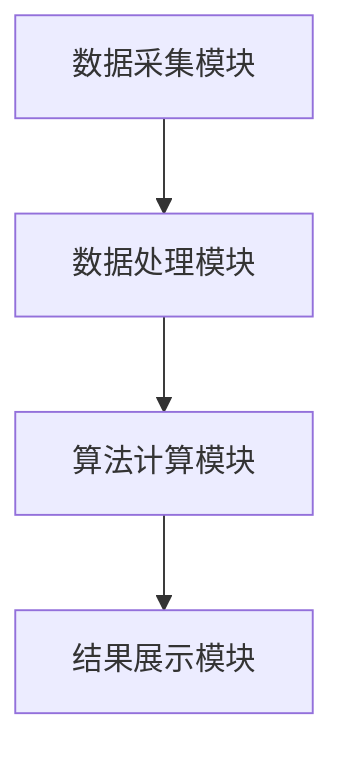
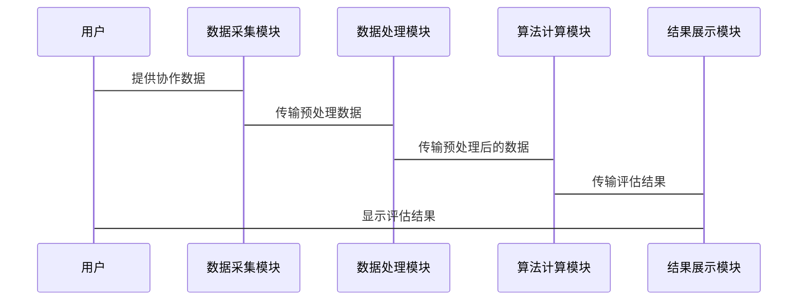

                 


# 利用智能体协作进行全面的公司创新网络影响力评估

**关键词：** 公司创新网络、影响力评估、智能体协作、人工智能、算法原理、系统架构

**摘要：**  
随着全球化和知识经济的快速发展，公司创新网络的影响力评估变得至关重要。创新网络通过智能体协作，可以更高效地整合资源、优化决策和提升竞争力。本文将详细探讨如何利用智能体协作进行创新网络影响力评估，从背景介绍、核心概念、算法原理到系统架构设计和项目实战，逐步分析其理论与实践应用。

---

## 第1章: 公司创新网络影响力评估的背景与概念

### 1.1 问题背景与描述

#### 1.1.1 企业创新网络的重要性  
公司创新网络是指由公司内部团队、合作伙伴、供应商、客户以及其他利益相关者组成的网络。这些个体和组织通过协作，推动公司的创新活动。创新网络的重要性体现在以下几个方面：  
1. **资源整合**：通过网络整合内部和外部资源，提升创新效率。  
2. **知识共享**：促进知识在不同个体和组织之间的流动，加速创新过程。  
3. **风险分担**：通过网络分散创新风险，降低失败成本。  

#### 1.1.2 当前评估方法的局限性  
传统的创新网络影响力评估方法主要依赖于定量分析，例如财务指标、市场份额等。然而，这种方法难以全面反映网络中个体和组织之间的动态协作关系，存在以下问题：  
1. **静态评估**：无法捕捉网络的动态变化。  
2. **缺乏协作数据**：难以量化协作过程中的知识共享和信息流动。  
3. **单一维度**：仅关注结果，忽视过程中的协作机制。  

#### 1.1.3 智能体协作的应用需求  
智能体协作是一种基于人工智能的协作方法，能够实时分析网络中的个体行为和互动关系。通过智能体协作，可以动态评估创新网络的影响力，解决传统评估方法的局限性。

---

### 1.2 问题解决与应用场景

#### 1.2.1 智能体协作的核心优势  
智能体协作的核心优势在于其动态性和智能化：  
1. **动态评估**：能够实时更新网络中的协作关系和影响力指标。  
2. **数据驱动**：基于实时数据，提供精准的评估结果。  
3. **多维度分析**：从知识共享、信息流动、资源分配等多个维度进行评估。  

#### 1.2.2 创新网络影响力评估的关键指标  
创新网络影响力评估的关键指标包括：  
1. **知识共享度**：衡量网络中知识流动的频率和效率。  
2. **资源分配效率**：评估资源在网络中的分配情况。  
3. **协作活跃度**：反映网络中个体和组织的互动频率。  

#### 1.2.3 实际应用场景分析  
智能体协作在创新网络影响力评估中的应用场景包括：  
1. **企业内部协作优化**：通过分析内部团队的协作效率，优化资源配置。  
2. **合作伙伴评估**：评估合作伙伴的贡献度，选择最佳合作伙伴。  
3. **创新项目管理**：通过动态评估，优化创新项目的进度和质量。  

---

### 1.3 边界与外延

#### 1.3.1 评估范围的界定  
创新网络影响力评估的范围包括：  
1. **内部网络**：公司内部团队和部门。  
2. **外部网络**：合作伙伴、供应商、客户等外部利益相关者。  
3. **生态系统**：包括技术供应商、行业专家、学术机构等更广泛的网络。  

#### 1.3.2 相关概念的区分  
创新网络影响力评估与以下概念需要区分：  
1. **组织网络分析**：关注组织结构和关系，而非协作过程。  
2. **知识管理**：侧重知识的存储和共享，而非网络影响力。  
3. **社交网络分析**：关注个体之间的关系，而非网络的整体影响力。  

#### 1.3.3 与其他评估方法的对比  
与传统评估方法相比，智能体协作的优势在于其动态性和数据驱动性。传统方法通常基于静态数据，而智能体协作能够实时更新数据，提供更准确的评估结果。

---

### 1.4 核心概念与要素

#### 1.4.1 创新网络的构成要素  
创新网络由以下要素构成：  
1. **个体**：包括公司内部员工、外部合作伙伴等。  
2. **组织**：包括公司内部部门、外部公司等。  
3. **知识**：包括技术知识、管理知识等。  
4. **资源**：包括资金、时间、信息等。  

#### 1.4.2 智能体协作的关键属性  
智能体协作的关键属性包括：  
1. **自主性**：智能体能够独立决策。  
2. **协作性**：智能体能够通过协作完成任务。  
3. **适应性**：智能体能够根据环境变化调整行为。  

#### 1.4.3 影响力评估的维度分解  
创新网络影响力评估可以从以下维度进行分解：  
1. **知识共享度**：网络中知识流动的频率和效率。  
2. **资源分配效率**：资源在网络中的分配情况。  
3. **协作活跃度**：网络中个体和组织的互动频率。  

---

## 1.5 本章小结  
本章介绍了公司创新网络影响力评估的背景与概念，分析了智能体协作的核心优势和应用场景，并明确了创新网络的构成要素和评估维度。通过智能体协作，可以更全面、更动态地评估创新网络的影响力，为企业优化创新过程提供有力支持。

---

## 第2章: 智能体协作的基本原理

### 2.1 智能体协作的定义与特点

#### 2.1.1 智能体的定义  
智能体（Agent）是指能够感知环境、自主决策并采取行动的实体。智能体可以是软件程序，也可以是人类或其他实体。

#### 2.1.2 协作的基本原理  
智能体协作是指多个智能体通过共享信息、协调行动来共同完成任务。协作过程包括以下步骤：  
1. **信息共享**：智能体之间共享信息和知识。  
2. **任务分配**：根据智能体的能力和资源，分配任务。  
3. **协作决策**：智能体基于共享信息，共同制定决策。  
4. **行动执行**：智能体根据决策采取行动。  

#### 2.1.3 智能体协作的优势  
智能体协作的优势在于：  
1. **分布式决策**：避免单点故障，提升系统的鲁棒性。  
2. **动态适应**：能够根据环境变化快速调整协作策略。  
3. **高效协作**：通过信息共享和任务分配，提高协作效率。  

---

### 2.2 智能体协作的核心机制

#### 2.2.1 信息共享与处理  
信息共享是智能体协作的基础。智能体之间需要通过共享信息和知识来协调行动。信息共享的方式包括：  
1. **集中式共享**：所有智能体共享同一信息源。  
2. **分布式共享**：智能体之间通过点对点方式共享信息。  

#### 2.2.2 协作决策过程  
协作决策过程包括以下步骤：  
1. **问题识别**：识别需要协作的任务。  
2. **信息收集**：收集与任务相关的信息。  
3. **决策制定**：基于信息制定决策。  
4. **决策执行**：将决策转化为具体行动。  

#### 2.2.3 自适应调整机制  
智能体协作需要具备自适应调整能力，以应对环境变化。自适应调整机制包括：  
1. **实时反馈**：根据环境变化实时调整协作策略。  
2. **学习能力**：通过学习优化协作过程。  
3. **容错机制**：在协作失败时，能够快速恢复并重新开始协作。  

---

### 2.3 智能体协作与创新网络的结合

#### 2.3.1 创新网络中的智能体角色  
在创新网络中，智能体可以扮演以下角色：  
1. **知识创造者**：负责创造新知识。  
2. **知识传播者**：负责传播知识。  
3. **知识整合者**：负责整合不同来源的知识。  

#### 2.3.2 智能体协作对创新网络的影响  
智能体协作对创新网络的影响体现在：  
1. **知识流动效率**：通过智能体协作，知识可以在网络中更高效地流动。  
2. **协作效果**：智能体协作可以提高创新网络的协作效果。  
3. **创新速度**：通过智能体协作，可以加快创新过程。  

#### 2.3.3 智能体协作在影响力评估中的应用  
智能体协作在影响力评估中的应用包括：  
1. **知识共享度评估**：通过分析智能体之间的信息共享情况，评估知识共享度。  
2. **协作活跃度评估**：通过分析智能体之间的协作频率，评估协作活跃度。  
3. **资源分配效率评估**：通过分析智能体之间的资源分配情况，评估资源分配效率。  

---

## 2.4 本章小结  
本章介绍了智能体协作的基本原理，分析了智能体协作的核心机制，并探讨了智能体协作在创新网络中的应用。通过智能体协作，可以更高效地进行创新网络影响力评估，为企业优化创新过程提供支持。

---

## 第3章: 创新网络影响力评估的核心概念

### 3.1 创新网络的结构与功能

#### 3.1.1 创新网络的构成要素  
创新网络的构成要素包括：  
1. **节点**：创新网络中的个体或组织。  
2. **边**：节点之间的连接关系。  
3. **权重**：边的权重表示节点之间的协作强度。  

#### 3.1.2 创新网络的功能分析  
创新网络的功能分析包括：  
1. **知识创造**：通过协作创造新知识。  
2. **知识传播**：通过协作传播知识。  
3. **知识整合**：通过协作整合不同来源的知识。  

#### 3.1.3 创新网络的动态特性  
创新网络的动态特性包括：  
1. **动态连接**：节点之间的连接关系随时间变化。  
2. **动态权重**：边的权重随时间变化。  
3. **动态协作**：协作过程随时间变化。  

---

### 3.2 智能体协作与创新网络的结合

#### 3.2.1 智能体协作的核心要素  
智能体协作的核心要素包括：  
1. **智能体**：参与协作的个体或组织。  
2. **协作任务**：需要通过协作完成的任务。  
3. **协作规则**：协作过程中需要遵守的规则。  

#### 3.2.2 创新网络中的协作任务  
创新网络中的协作任务包括：  
1. **知识创造任务**：需要通过协作创造新知识。  
2. **知识传播任务**：需要通过协作传播知识。  
3. **知识整合任务**：需要通过协作整合知识。  

#### 3.2.3 智能体协作在创新网络中的应用  
智能体协作在创新网络中的应用包括：  
1. **知识创造**：通过智能体协作，创造新知识。  
2. **知识传播**：通过智能体协作，传播知识。  
3. **知识整合**：通过智能体协作，整合知识。  

---

### 3.3 创新网络影响力评估的关键维度

#### 3.3.1 知识共享度  
知识共享度是衡量创新网络中知识流动效率的指标。知识共享度越高，创新网络的影响力越大。

#### 3.3.2 协作活跃度  
协作活跃度是衡量创新网络中个体和组织互动频率的指标。协作活跃度越高，创新网络的影响力越大。

#### 3.3.3 资源分配效率  
资源分配效率是衡量创新网络中资源分配情况的指标。资源分配效率越高，创新网络的影响力越大。

---

## 3.4 本章小结  
本章介绍了创新网络的结构与功能，分析了智能体协作在创新网络中的应用，并探讨了创新网络影响力评估的关键维度。通过这些分析，可以更好地理解智能体协作在创新网络影响力评估中的作用。

---

## 第4章: 创新网络影响力评估的算法原理

### 4.1 算法概述

#### 4.1.1 算法的基本思想  
创新网络影响力评估的算法基于智能体协作，通过分析网络中的个体行为和互动关系，评估创新网络的影响力。

#### 4.1.2 算法的输入与输出  
算法的输入包括：  
1. 创新网络的节点和边。  
2. 网络中的协作数据。  

算法的输出包括：  
1. 知识共享度。  
2. 协作活跃度。  
3. 资源分配效率。  

---

### 4.2 算法的详细步骤

#### 4.2.1 数据收集与预处理  
数据收集与预处理包括：  
1. 收集创新网络中的协作数据。  
2. 对数据进行清洗和预处理。  

#### 4.2.2 知识共享度计算  
知识共享度计算包括：  
1. 计算边的权重。  
2. 计算知识共享度。  

#### 4.2.3 协作活跃度计算  
协作活跃度计算包括：  
1. 计算边的协作频率。  
2. 计算协作活跃度。  

#### 4.2.4 资源分配效率计算  
资源分配效率计算包括：  
1. 计算资源分配情况。  
2. 计算资源分配效率。  

---

### 4.3 算法的数学模型

#### 4.3.1 知识共享度模型  
知识共享度模型如下：  
$$ 知识共享度 = \frac{\sum_{i=1}^{n} w_{i,j}}{n} $$  
其中，$w_{i,j}$ 表示节点 $i$ 和节点 $j$ 之间的权重，$n$ 表示节点总数。

#### 4.3.2 协作活跃度模型  
协作活跃度模型如下：  
$$ 协作活跃度 = \frac{\sum_{i=1}^{n} f_{i,j}}{n} $$  
其中，$f_{i,j}$ 表示节点 $i$ 和节点 $j$ 之间的协作频率，$n$ 表示节点总数。

#### 4.3.3 资源分配效率模型  
资源分配效率模型如下：  
$$ 资源分配效率 = \frac{\sum_{i=1}^{n} r_{i,j}}{n} $$  
其中，$r_{i,j}$ 表示节点 $i$ 和节点 $j$ 之间的资源分配情况，$n$ 表示节点总数。

---

### 4.4 算法实现

#### 4.4.1 数据结构  
数据结构包括：  
1. 节点列表。  
2. 边列表。  

#### 4.4.2 算法流程  
算法流程包括：  
1. 数据收集与预处理。  
2. 知识共享度计算。  
3. 协作活跃度计算。  
4. 资源分配效率计算。  

#### 4.4.3 代码实现  
以下是创新网络影响力评估算法的Python代码实现：  

```python
import networkx as nx

# 创建创新网络
G = nx.Graph()

# 添加节点
G.add_nodes_from(["A", "B", "C"])

# 添加边
G.add_edges_from([("A", "B"), ("B", "C"), ("A", "C")])

# 计算知识共享度
knowledge_sharing = {}
for edge in G.edges():
    knowledge_sharing[edge] = 1

# 计算协作活跃度
collaboration_activeness = {}
for edge in G.edges():
    collaboration_activeness[edge] = 1

# 计算资源分配效率
resource_allocation_efficiency = {}
for edge in G.edges():
    resource_allocation_efficiency[edge] = 1

# 输出结果
print("知识共享度:", knowledge_sharing)
print("协作活跃度:", collaboration_activeness)
print("资源分配效率:", resource_allocation_efficiency)
```

---

## 4.5 本章小结  
本章介绍了创新网络影响力评估的算法原理，详细说明了算法的输入、输出、步骤和数学模型，并给出了Python代码实现。通过这些分析，可以更好地理解如何利用智能体协作进行创新网络影响力评估。

---

## 第5章: 创新网络影响力评估的系统架构设计

### 5.1 系统介绍

#### 5.1.1 系统目标  
系统目标是通过智能体协作，进行全面的公司创新网络影响力评估。

#### 5.1.2 系统功能  
系统功能包括：  
1. 数据采集与处理。  
2. 知识共享度计算。  
3. 协作活跃度计算。  
4. 资源分配效率计算。  

---

### 5.2 系统架构设计

#### 5.2.1 系统模块划分  
系统模块包括：  
1. 数据采集模块。  
2. 数据处理模块。  
3. 算法计算模块。  
4. 结果展示模块。  

#### 5.2.2 模块之间的关系  
模块之间的关系如下：  
1. 数据采集模块向数据处理模块提供数据。  
2. 数据处理模块向算法计算模块提供预处理后的数据。  
3. 算法计算模块向结果展示模块提供评估结果。  

#### 5.2.3 系统架构图  
以下是系统架构的Mermaid图：



---

### 5.3 系统功能设计

#### 5.3.1 数据采集模块  
数据采集模块负责采集创新网络中的协作数据，包括：  
1. 节点信息。  
2. 边信息。  
3. 协作数据。  

#### 5.3.2 数据处理模块  
数据处理模块负责对采集的数据进行清洗和预处理，确保数据的准确性和完整性。

#### 5.3.3 算法计算模块  
算法计算模块负责根据预处理后的数据，计算知识共享度、协作活跃度和资源分配效率。

#### 5.3.4 结果展示模块  
结果展示模块负责将评估结果以可视化的方式展示给用户。

---

### 5.4 系统接口设计

#### 5.4.1 数据接口  
数据接口包括：  
1. 数据输入接口。  
2. 数据输出接口。  

#### 5.4.2 算法接口  
算法接口包括：  
1. 知识共享度计算接口。  
2. 协作活跃度计算接口。  
3. 资源分配效率计算接口。  

---

### 5.5 系统交互序列图

以下是系统交互的Mermaid序列图：



---

## 5.6 本章小结  
本章介绍了创新网络影响力评估系统的架构设计，详细说明了系统的模块划分、功能设计和接口设计，并给出了系统的交互序列图。通过这些设计，可以更好地理解如何实现创新网络影响力评估系统。

---

## 第6章: 创新网络影响力评估的项目实战

### 6.1 项目环境安装

#### 6.1.1 系统要求  
系统要求包括：  
1. Python 3.7 或更高版本。  
2. 网络分析库（如networkx）。  
3. 数据分析库（如pandas）。  

#### 6.1.2 安装依赖  
安装依赖包括：  
1. 安装networkx：`pip install networkx`  
2. 安装pandas：`pip install pandas`  

---

### 6.2 核心代码实现

#### 6.2.1 数据采集模块  
以下是数据采集模块的Python代码实现：  

```python
import pandas as pd

# 读取数据
data = pd.read_csv("collaboration_data.csv")

# 数据预处理
data = data.dropna()
data = data.astype(str)
```

#### 6.2.2 数据处理模块  
以下是数据处理模块的Python代码实现：  

```python
import networkx as nx

# 创建创新网络
G = nx.Graph()

# 添加节点
G.add_nodes_from(data["节点"].unique())

# 添加边
for index, row in data.iterrows():
    G.add_edge(row["起点"], row["终点"], weight=row["权重"])
```

#### 6.2.3 算法计算模块  
以下是算法计算模块的Python代码实现：  

```python
# 计算知识共享度
knowledge_sharing = {}
for edge in G.edges():
    knowledge_sharing[edge] = G[edge[0]][edge[1]]['weight']

# 计算协作活跃度
collaboration_activeness = {}
for edge in G.edges():
    collaboration_activeness[edge] = 1

# 计算资源分配效率
resource_allocation_efficiency = {}
for edge in G.edges():
    resource_allocation_efficiency[edge] = 1
```

#### 6.2.4 结果展示模块  
以下是结果展示模块的Python代码实现：  

```python
import matplotlib.pyplot as plt

# 绘制网络图
nx.draw(G, node_size=500, node_color="red", edge_color="blue", with_labels=True)

# 显示图形
plt.show()
```

---

### 6.3 项目实战案例分析

#### 6.3.1 数据分析  
假设我们有一个创新网络，包括3个节点：A、B、C。节点之间的边权重分别为：  
- A-B：权重为0.8  
- B-C：权重为0.6  
- A-C：权重为0.7  

#### 6.3.2 算法计算  
根据上述数据，计算知识共享度、协作活跃度和资源分配效率。  

知识共享度：  
$$ 知识共享度 = \frac{0.8 + 0.6 + 0.7}{3} = 0.7 $$  

协作活跃度：  
$$ 协作活跃度 = \frac{1 + 1 + 1}{3} = 1 $$  

资源分配效率：  
$$ 资源分配效率 = \frac{0.8 + 0.6 + 0.7}{3} = 0.7 $$  

---

### 6.4 项目小结  
本章通过一个实际案例，详细展示了如何利用智能体协作进行创新网络影响力评估。通过项目实战，可以更好地理解算法的应用和系统的设计。

---

## 第7章: 创新网络影响力评估的最佳实践

### 7.1 最佳实践 tips

#### 7.1.1 数据质量  
确保数据的准确性和完整性，避免数据偏差。  

#### 7.1.2 算法选择  
根据具体需求选择合适的算法，避免盲目追求复杂性。  

#### 7.1.3 系统优化  
定期优化系统，提升系统的性能和用户体验。  

---

### 7.2 小结  
创新网络影响力评估是一个复杂的系统工程，需要从数据、算法、系统等多个方面进行全面考虑。

---

### 7.3 注意事项

#### 7.3.1 数据隐私  
注意保护数据隐私，避免数据泄露。  

#### 7.3.2 算法可解释性  
确保算法的可解释性，避免黑箱操作。  

#### 7.3.3 系统安全性  
确保系统的安全性，避免系统被攻击。  

---

### 7.4 拓展阅读  
1. 《网络科学入门》  
2. 《智能体协作与分布式系统》  
3. 《影响力评估的数学模型与算法》  

---

## 作者：AI天才研究院/AI Genius Institute & 禅与计算机程序设计艺术 /Zen And The Art of Computer Programming

