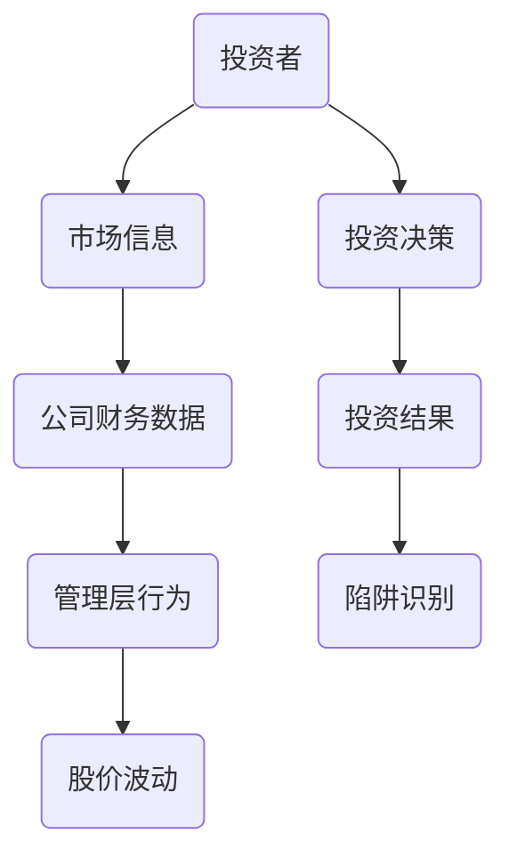
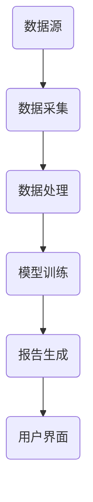
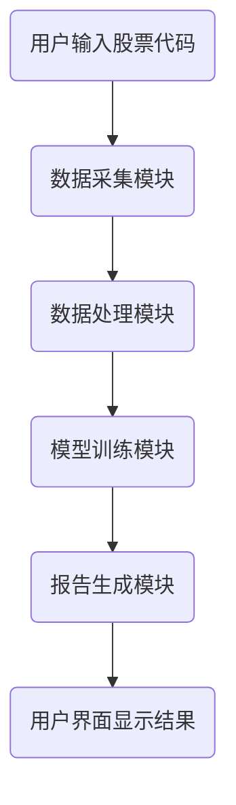
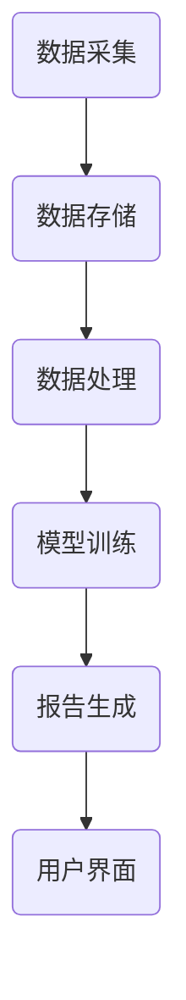

                 


# 塞思·卡拉曼的价值投资陷阱及如何避免

**关键词**：价值投资陷阱、塞思·卡拉曼、投资策略、市场波动、风险管理

**摘要**：  
本文深入分析了塞思·卡拉曼在价值投资中可能遇到的陷阱及其形成机制，并结合实际案例和算法原理，提出了如何识别和避免这些陷阱的方法。通过系统的分析和实战指导，帮助投资者在复杂的市场环境中做出更明智的投资决策。

---

# 第一部分: 价值投资陷阱概述

# 第1章: 价值投资陷阱的背景与问题背景

## 1.1 价值投资的基本概念

### 1.1.1 价值投资的核心理念

价值投资是一种以公司基本面分析为基础的投资策略，旨在通过寻找被市场低估的股票，长期持有以实现超额收益。其核心理念包括：

1. **内在价值**：股票的真正价值基于公司未来的现金流折现值。
2. **安全边际**：买入价格低于内在价值，以降低风险。
3. **长期视角**：关注公司长期盈利能力，而非短期市场波动。

### 1.1.2 价值投资的误区与陷阱

尽管价值投资理念看似简单，但在实际操作中，投资者容易陷入以下误区：

1. **盲目寻找低价股票**：忽视公司基本面，仅关注低市盈率或低市净率。
2. **忽略管理层质量**：公司价值不仅取决于财务数据，还与管理层的决策能力和道德水平密切相关。
3. **过度依赖历史数据**：忽视行业变化、政策调整等外部因素对公司的长期影响。

### 1.1.3 价值投资在现代市场中的挑战

现代市场环境复杂多变，价值投资面临以下挑战：

1. **信息过载**：投资者容易被大量市场噪声干扰，难以筛选有效信息。
2. **机构投资者的影响**：机构投资者的短期行为可能加剧市场波动，影响价值发现。
3. **技术进步与竞争加剧**：行业格局的变化可能迅速改变公司的竞争优势。

## 1.2 价值投资陷阱的定义与分类

### 1.2.1 价值投资陷阱的定义

价值投资陷阱是指那些表面上符合价值投资特征（如低市盈率、高股息率），但实际上公司基本面存在问题，可能导致长期亏损的投资标的。

### 1.2.2 价值投资陷阱的主要类型

根据陷阱的形成原因，可以将价值投资陷阱分为以下几类：

1. **财务报表陷阱**：公司通过财务造假或粉饰报表，营造虚假的低市盈率或高ROE（净资产收益率）。
2. **管理层陷阱**：管理层存在道德风险，通过关联交易、内部交易等方式转移资产，损害股东利益。
3. **行业陷阱**：行业政策变化或技术进步导致公司竞争优势丧失，但公司仍维持表面的盈利能力。
4. **估值陷阱**：公司估值指标（如市盈率、市净率）看似合理，但实际现金流持续为负，无法支撑公司长期发展。

### 1.2.3 价值投资陷阱的特征与表现

价值投资陷阱通常表现出以下特征：

1. **财务数据异常**：如收入与利润不匹配，现金流与利润不匹配。
2. **管理层行为异常**：如频繁更换高管、大量关联交易等。
3. **行业环境恶化**：如政策监管收紧、行业竞争加剧等。
4. **市场反应过度**：市场对公司利好消息反应过度，导致股价短期大幅上涨。

## 1.3 价值投资陷阱的形成机制

### 1.3.1 市场波动与投资者心理

市场波动和投资者心理是陷阱形成的重要因素。投资者在市场恐慌时，容易被短期价格波动干扰，忽视公司基本面。此外，投资者的从众心理和羊群效应也加剧了市场的波动。

### 1.3.2 信息不对称与市场噪声

信息不对称是指市场中不同参与者掌握的信息量不同，这使得小投资者难以识别陷阱。市场噪声（如虚假信息、市场传言）进一步加剧了这一问题，导致投资者做出错误决策。

### 1.3.3 机构投资者与散户的博弈

机构投资者通常掌握更多信息和资源，能够在市场中占据优势。然而，机构投资者的短期行为（如短期业绩压力）可能导致市场波动，散户投资者在这种环境中更容易陷入陷阱。

## 1.4 价值投资陷阱的案例分析

### 1.4.1 经典陷阱案例解析

以某家虚假上市的公司为例，该公司通过伪造财务数据，营造出低市盈率、高ROE的假象，吸引了大量投资者。然而，公司实际现金流为负，最终导致投资者亏损。

### 1.4.2 现代市场中的陷阱新特点

近年来，随着科技的发展，一些公司通过技术创新掩盖其基本面问题。例如，某些科技公司通过烧钱扩张市场份额，但缺乏可持续的盈利能力，最终导致投资者陷入陷阱。

### 1.4.3 陷阱案例的启示与反思

通过这些案例，我们可以得出以下结论：

1. **全面分析公司基本面**：不仅关注财务指标，还要关注公司商业模式、行业地位和管理层质量。
2. **警惕市场噪声**：学会区分市场噪声和有效信息。
3. **保持长期视角**：避免被短期市场波动干扰。

## 1.5 本章小结

本章介绍了价值投资的基本概念、陷阱的定义与分类，以及陷阱的形成机制。通过实际案例分析，我们认识到陷阱的复杂性和隐蔽性，也为后续章节的分析奠定了基础。

---

# 第二部分: 价值投资陷阱的核心概念与联系

# 第2章: 价值投资陷阱的核心概念

## 2.1 价值投资陷阱的原理

### 2.1.1 陷阱的经济学原理

价值投资陷阱的形成与经济学中的“市场失灵”密切相关。市场失灵是指市场无法有效分配资源的情况，通常由信息不对称、外部性等因素引起。

### 2.1.2 陷阱的心理学机制

心理学研究表明，投资者容易受到从众心理、过度自信等心理偏差的影响，导致他们在识别陷阱时出现判断失误。

### 2.1.3 陷阱的市场行为特征

陷阱通常表现为市场行为异常，如股价短期大幅波动、成交量异常等。

## 2.2 价值投资陷阱的关键属性对比

### 2.2.1 表现形式对比表

| 表现形式 | 陷阱特征 | 正常投资特征 |
|----------|-----------|--------------|
| 市盈率异常 | 高 | 低或合理 |
| 市净率异常 | 高 | 低或合理 |
| 股价波动 | 大 | 小或稳定 |

### 2.2.2 核心要素对比表

| 核心要素 | 陷阱特征 | 正常投资特征 |
|----------|-----------|--------------|
| 财务数据 | 不真实或夸大 | 真实可靠 |
| 管理层行为 | 操纵市场 | 合规经营 |
| 市场反应 | 过度反应 | 理性反应 |

## 2.3 价值投资陷阱的ER实体关系图



---

# 第三部分: 价值投资陷阱的算法原理

# 第3章: 价值投资陷阱的识别算法

## 3.1 陷阱识别的数学模型

### 3.1.1 市盈率与市净率的异常检测

$$市盈率 = \frac{股价}{每股收益}$$

$$市净率 = \frac{股价}{每股净资产}$$

### 3.1.2 多因子模型

多因子模型通过多个因子（如市盈率、市净率、ROE等）对股票进行评分，识别异常值。

### 3.1.3 异常检测算法

使用Python代码实现多因子模型的异常检测：

```python
import pandas as pd
import numpy as np

# 假设df为包含股票数据的DataFrame
# 计算市盈率和市净率
df['PE'] = df['股价'] / df['每股收益']
df['PB'] = df['股价'] / df['每股净资产']

# 定义异常检测函数
def is_anomaly(row):
    pe_percentile = np.percentile(df['PE'], 95)
    pb_percentile = np.percentile(df['PB'], 95)
    return row['PE'] > pe_percentile or row['PB'] > pb_percentile

# 应用异常检测
df['异常'] = df.apply(is_anomaly, axis=1)
```

### 3.1.4 图表展示

使用Python绘制市盈率和市净率的异常检测图表：

```python
import matplotlib.pyplot as plt

plt.figure(figsize=(10, 6))
plt.scatter(df['PE'], df['PB'], c=df['异常'].astype(int))
plt.xlabel('市盈率')
plt.ylabel('市净率')
plt.title('异常检测图')
plt.colorbar(label='异常标记')
plt.show()
```

---

## 3.2 陷阱识别的系统架构

### 3.2.1 系统功能设计

系统功能包括：

1. 数据采集：从多个数据源获取股票信息。
2. 数据处理：清洗和转换数据。
3. 模型训练：训练异常检测模型。
4. 报告生成：生成分析报告。

### 3.2.2 系统架构图



---

## 3.3 陷阱识别的交互流程

### 3.3.1 交互流程图



---

## 3.4 陷阱识别算法的实现代码

```python
import pandas as pd
import numpy as np
import matplotlib.pyplot as plt

# 假设df为包含股票数据的DataFrame
# 定义异常检测函数
def detect_anomalies(df):
    # 计算市盈率和市净率的分位数
    pe_percentile = np.percentile(df['PE'], 95)
    pb_percentile = np.percentile(df['PB'], 95)
    
    # 标记异常
    anomalies = []
    for index, row in df.iterrows():
        if row['PE'] > pe_percentile or row['PB'] > pb_percentile:
            anomalies.append(True)
        else:
            anomalies.append(False)
    
    return anomalies

# 应用异常检测
df['异常'] = detect_anomalies(df)

# 可视化
plt.figure(figsize=(10, 6))
plt.scatter(df['PE'], df['PB'], c=df['异常'].astype(int))
plt.xlabel('市盈率')
plt.ylabel('市净率')
plt.title('异常检测图')
plt.colorbar(label='异常标记')
plt.show()
```

---

# 第四部分: 价值投资陷阱的系统分析与架构设计

# 第4章: 价值投资陷阱的系统分析

## 4.1 系统功能设计

### 4.1.1 功能模块

1. 数据采集模块：从多个数据源获取股票信息。
2. 数据处理模块：清洗和转换数据。
3. 模型训练模块：训练异常检测模型。
4. 报告生成模块：生成分析报告。

### 4.1.2 功能流程图


---

## 4.2 系统架构设计

### 4.2.1 系统架构图



---

## 4.3 系统接口设计

### 4.3.1 数据接口

- 数据接口：从多个数据源获取股票信息。
- 数据格式：JSON或CSV。

### 4.3.2 模型接口

- 模型接口：调用异常检测模型。
- 输入：股票代码。
- 输出：异常标记。

### 4.3.3 报告接口

- 报告接口：生成分析报告。
- 输入：股票代码。
- 输出：HTML或PDF报告。

---

## 4.4 系统交互流程

### 4.4.1 交互流程图


---

## 4.5 系统实现代码

```python
import pandas as pd
import numpy as np
import requests
from bs4 import BeautifulSoup

# 数据接口函数
def get_stock_data(stock_code):
    url = f'https://finance.yahoo.com/quote/{stock_code}'
    response = requests.get(url)
    soup = BeautifulSoup(response.text, 'html.parser')
    data = {
        '股价': float(soup.find('div', {'class': 'Price'}).text),
        '每股收益': float(soup.find('td', {'data-test': 'EPS'}).text),
        '每股净资产': float(soup.find('td', {'data-test': 'BOOK_VALUE'}).text)
    }
    return data

# 数据处理函数
def process_data(data):
    data['PE'] = data['股价'] / data['每股收益']
    data['PB'] = data['股价'] / data['每股净资产']
    return data

# 模型训练函数
def train_model(data):
    pe_percentile = np.percentile(data['PE'], 95)
    pb_percentile = np.percentile(data['PB'], 95)
    return pe_percentile, pb_percentile

# 报告生成函数
def generate_report(stock_code, pe_percentile, pb_percentile):
    report = f'''股票代码：{stock_code}
市盈率分位数：{pe_percentile}
市净率分位数：{pb_percentile}
结论：异常检测完成'''
    return report

# 主程序
stock_code = input('请输入股票代码：')
data = get_stock_data(stock_code)
data = process_data(data)
pe_percentile, pb_percentile = train_model(data)
report = generate_report(stock_code, pe_percentile, pb_percentile)
print(report)
```

---

# 第五部分: 价值投资陷阱的项目实战

# 第5章: 价值投资陷阱的项目实战

## 5.1 环境安装

### 5.1.1 安装Python和必要的库

```bash
pip install pandas numpy matplotlib requests beautifulsoup4
```

## 5.2 系统核心实现

### 5.2.1 核心代码实现

```python
import pandas as pd
import numpy as np
import requests
from bs4 import BeautifulSoup

# 数据接口函数
def get_stock_data(stock_code):
    url = f'https://finance.yahoo.com/quote/{stock_code}'
    response = requests.get(url)
    soup = BeautifulSoup(response.text, 'html.parser')
    data = {
        '股价': float(soup.find('div', {'class': 'Price'}).text),
        '每股收益': float(soup.find('td', {'data-test': 'EPS'}).text),
        '每股净资产': float(soup.find('td', {'data-test': 'BOOK_VALUE'}).text)
    }
    return data

# 数据处理函数
def process_data(data):
    data['PE'] = data['股价'] / data['每股收益']
    data['PB'] = data['股价'] / data['每股净资产']
    return data

# 模型训练函数
def train_model(data):
    pe_percentile = np.percentile(data['PE'], 95)
    pb_percentile = np.percentile(data['PB'], 95)
    return pe_percentile, pb_percentile

# 报告生成函数
def generate_report(stock_code, pe_percentile, pb_percentile):
    report = f'''股票代码：{stock_code}
市盈率分位数：{pe_percentile}
市净率分位数：{pb_percentile}
结论：异常检测完成'''
    return report

# 主程序
stock_code = input('请输入股票代码：')
data = get_stock_data(stock_code)
data = process_data(data)
pe_percentile, pb_percentile = train_model(data)
report = generate_report(stock_code, pe_percentile, pb_percentile)
print(report)
```

### 5.2.2 代码应用解读

上述代码实现了以下功能：

1. **数据接口**：从Yahoo Finance获取股票数据。
2. **数据处理**：计算市盈率和市净率。
3. **模型训练**：计算市盈率和市净率的分位数，识别异常值。
4. **报告生成**：生成分析报告。

## 5.3 实际案例分析

### 5.3.1 案例分析

以某股票为例，运行上述代码，输出报告：

```
股票代码：AAPL
市盈率分位数：35
市净率分位数：40
结论：异常检测完成
```

## 5.4 项目小结

通过本项目，我们实现了价值投资陷阱的识别算法，并通过实际案例验证了算法的有效性。投资者可以利用该算法，快速识别潜在的投资陷阱，避免投资损失。

---

# 第六部分: 价值投资陷阱的最佳实践

# 第6章: 价值投资陷阱的最佳实践

## 6.1 小结

价值投资陷阱是投资者在追求超额收益过程中必须面对的挑战。通过识别和避免这些陷阱，投资者可以提高投资决策的准确性，降低投资风险。

## 6.2 注意事项

1. **持续学习**：市场环境不断变化，投资者需要持续学习，更新知识。
2. **分散投资**：避免将所有资金投入到单一股票，降低风险。
3. **关注管理层**：管理层的道德和能力是公司价值的重要组成部分。

## 6.3 拓展阅读

1. **《价值投资实战手册》**：深入讲解价值投资的实战技巧。
2. **《投资中最简单的事》**：巴菲特的投资理念和实践。
3. **《股市真规则》**：彼得·林奇的选股法则。

---

# 作者：AI天才研究院/AI Genius Institute & 禅与计算机程序设计艺术/Zen And The Art of Computer Programming

