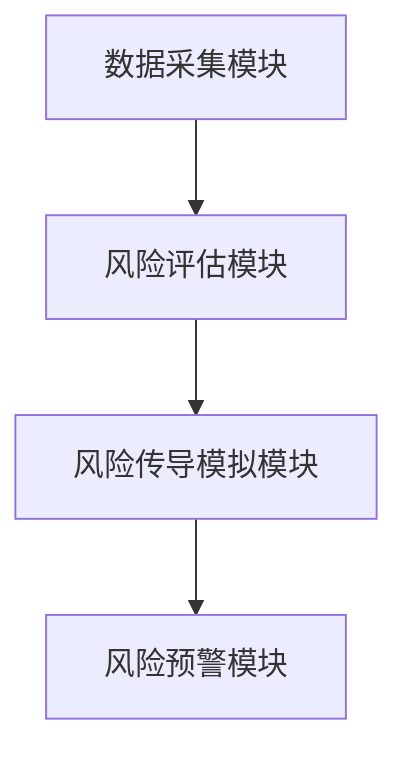
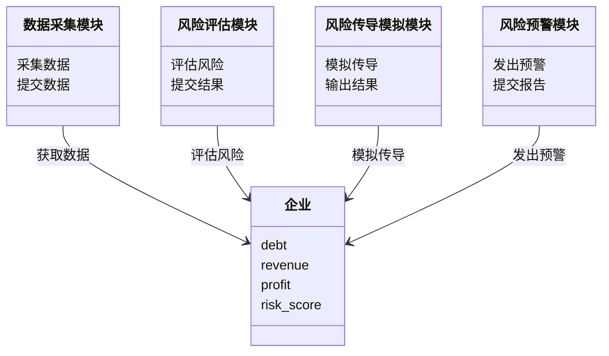
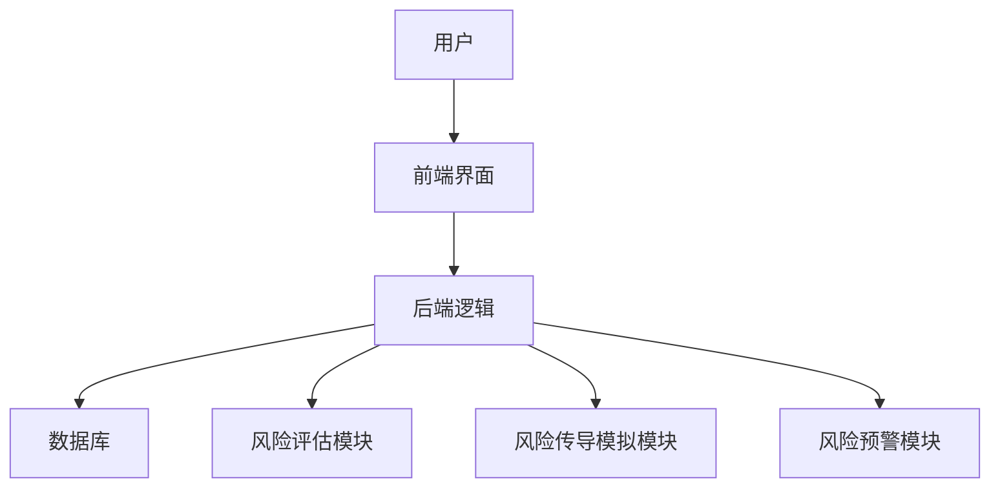
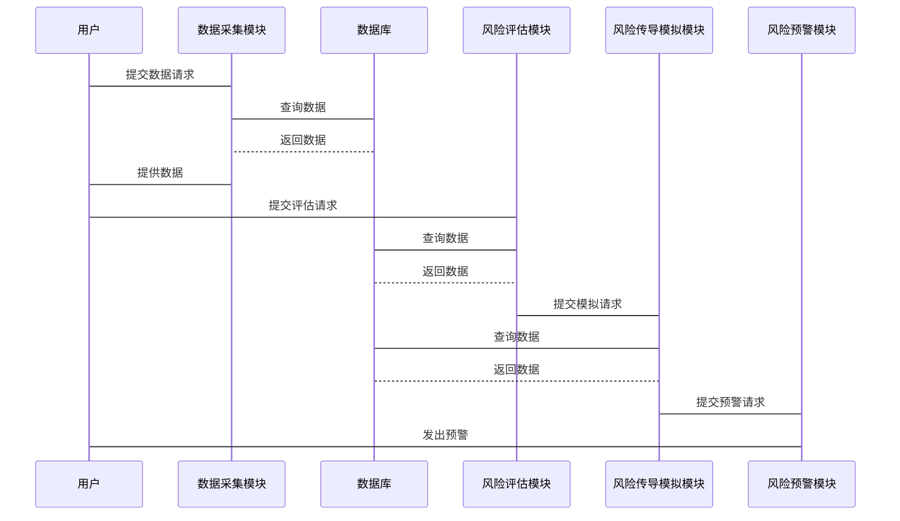

                 


# 开发智能化的企业信用风险传导模拟系统

> 关键词：企业信用风险，风险传导，模拟系统，算法原理，系统架构，项目实战

> 摘要：本文详细介绍了开发智能化的企业信用风险传导模拟系统的背景、核心概念、算法原理、系统架构设计、项目实战以及系统总结。通过系统的构建，可以帮助企业更好地理解和预测信用风险，从而制定有效的风险控制策略。

---

## 第一部分: 企业信用风险传导模拟系统背景与概述

---

## 第1章: 企业信用风险传导模拟系统概述

### 1.1 信用风险传导的背景与问题背景

#### 1.1.1 信用风险传导的定义与概念

信用风险是指企业在经济活动中由于债务人或交易对手无法履行其合同义务而可能导致的损失。信用风险传导则是指由于一个企业的信用风险事件（如违约）导致其他相关企业或金融机构的风险增加或蔓延的过程。这种风险传导机制在金融市场上具有重要的影响，尤其是在企业间存在复杂的供应链或金融关联的情况下。

#### 1.1.2 企业信用风险传导的核心问题

企业信用风险传导的核心问题在于如何准确模拟和预测风险在企业间或金融市场中的传播路径和影响程度。传统的信用风险评估方法往往局限于单个企业或单个金融产品，难以捕捉风险传导的复杂性和系统性。

#### 1.1.3 信用风险传导的边界与外延

信用风险传导的边界包括企业内部的供应链、金融市场的关联性以及宏观经济环境的变化。外延则涉及企业间的债务关系、金融市场中的杠杆效应以及政策监管的变化对企业信用风险的影响。

#### 1.1.4 系统开发的目标与意义

系统开发的目标是构建一个智能化的企业信用风险传导模拟系统，能够实时模拟和预测信用风险的传播路径和影响范围。系统的意义在于帮助企业更好地识别和管理潜在的信用风险，从而降低企业的财务损失和市场风险。

---

### 1.2 信用风险传导模拟系统的核心要素

#### 1.2.1 信用风险的构成要素

信用风险的构成要素包括以下几个方面：

1. **债务人资质**：包括企业的财务状况、信用评级、管理团队等。
2. **债务规模**：包括企业的债务总额、偿债能力等。
3. **债务类型**：包括短期债务、长期债务、流动负债等。
4. **关联性**：包括企业间的供应链关系、金融市场的关联性等。

#### 1.2.2 系统功能模块的核心要素

系统功能模块的核心要素包括以下几个方面：

1. **数据采集模块**：采集企业的财务数据、市场数据等。
2. **风险评估模块**：评估企业的信用风险。
3. **风险传导模拟模块**：模拟信用风险的传播路径。
4. **风险预警模块**：根据模拟结果发出风险预警。

#### 1.2.3 系统设计的关键参数

系统设计的关键参数包括以下几个方面：

1. **模拟时间窗口**：包括短期、中期和长期的风险模拟。
2. **风险传导路径**：包括企业间、供应链、金融市场的传导路径。
3. **风险影响程度**：包括企业财务损失、市场波动等。

#### 1.2.4 系统实现的技术要素

系统实现的技术要素包括以下几个方面：

1. **数据处理技术**：包括数据清洗、数据转换等。
2. **算法实现技术**：包括机器学习算法、统计模型等。
3. **系统架构技术**：包括前端界面、后端逻辑、数据库设计等。

---

### 1.3 本章小结

本章主要介绍了企业信用风险传导模拟系统的背景、核心问题、系统开发的目标与意义，以及系统的核心要素。通过本章的介绍，读者可以清晰地理解系统开发的必要性和实现的复杂性。

---

## 第二部分: 信用风险传导模拟系统的核心概念与联系

---

## 第2章: 信用风险传导模拟系统的原理与模型

### 2.1 信用风险传导的原理

#### 2.1.1 信用风险传导的基本原理

信用风险传导的基本原理是通过分析企业间的债务关系和市场关联性，模拟信用风险从一家企业向其他企业或金融市场传播的过程。这种传播过程可能受到多种因素的影响，包括企业的财务状况、市场环境、政策变化等。

#### 2.1.2 系统模拟的核心机制

系统模拟的核心机制包括以下几个方面：

1. **数据驱动**：通过对企业历史数据的分析，建立风险传导模型。
2. **模型驱动**：通过建立数学模型，模拟信用风险的传播路径。
3. **实时监控**：通过实时数据的输入，动态调整风险模拟结果。

#### 2.1.3 系统模型的构建方法

系统模型的构建方法包括以下几个方面：

1. **数据清洗与预处理**：对采集到的数据进行清洗和预处理，确保数据的准确性和完整性。
2. **模型选择与训练**：根据数据特征选择合适的模型，并进行模型训练。
3. **模型验证与优化**：通过验证数据对模型进行验证，并根据验证结果优化模型。

---

### 2.2 信用风险传导模拟的核心概念

#### 2.2.1 风险因子的定义与特征

风险因子的定义与特征包括以下几个方面：

1. **债务规模**：企业的债务规模越大，信用风险越高。
2. **债务期限**：长期债务的风险通常大于短期债务。
3. **关联性**：企业间的关联性越高，信用风险传导的可能性越大。

#### 2.2.2 模拟模型的分类与对比

模拟模型的分类与对比如下：

| 模型类型 | 描述 | 优缺点 |
|----------|------|--------|
| 线性回归模型 | 通过线性关系模拟风险传导 | 简单易懂，但可能无法捕捉复杂的非线性关系 |
| 随机森林模型 | 通过随机森林算法模拟风险传导 | 能够捕捉复杂的非线性关系，但实现较为复杂 |
| 神经网络模型 | 通过神经网络算法模拟风险传导 | 能够捕捉复杂的非线性关系，但实现复杂度高 |

#### 2.2.3 系统模块之间的关系

系统模块之间的关系可以通过以下Mermaid图表示：



---

### 2.3 系统核心概念的ER实体关系图

系统核心概念的ER实体关系图可以通过以下Mermaid图表示：

```mermaid
erDiagram
    actor 用户 {
        用户ID
        用户名
        权限
    }
    actor 风险评估机构 {
        机构ID
        机构名称
        资质
    }
    actor 系统管理员 {
        管理员ID
        管理员名称
        管理权限
    }
    user 用户
    user 风险评估机构
    user 系统管理员
    用户 --> 风险评估机构 : 提交评估请求
    风险评估机构 --> 系统管理员 : 提交评估结果
    用户 --> 系统管理员 : 提交系统请求
```

---

### 2.4 本章小结

本章主要介绍了信用风险传导模拟系统的原理与模型，包括基本原理、核心机制、模型构建方法以及系统模块之间的关系。通过本章的介绍，读者可以清晰地理解系统的实现原理和核心概念。

---

## 第三部分: 信用风险传导模拟系统的算法原理

---

## 第3章: 信用风险传导模拟算法的核心原理

### 3.1 算法原理概述

#### 3.1.1 算法的基本思路

算法的基本思路包括以下几个方面：

1. **数据输入**：输入企业的财务数据、市场数据等。
2. **模型选择**：选择合适的模型进行风险模拟。
3. **模拟计算**：通过模型计算信用风险的传播路径和影响程度。
4. **结果输出**：输出模拟结果，包括风险预警信息。

#### 3.1.2 算法的输入输出

算法的输入包括企业的财务数据、市场数据等，输出包括风险预警信息、风险传播路径等。

#### 3.1.3 算法的实现步骤

算法的实现步骤包括以下几个方面：

1. **数据预处理**：对数据进行清洗和标准化处理。
2. **模型训练**：选择合适的模型并进行训练。
3. **风险模拟**：通过模型模拟信用风险的传播路径。
4. **结果分析**：对模拟结果进行分析和解读。

---

### 3.2 算法实现的数学模型

#### 3.2.1 线性回归模型

线性回归模型的数学表达式为：

$$ y = \beta_0 + \beta_1x + \epsilon $$

其中，$y$ 是预测值，$x$ 是自变量，$\beta_0$ 和 $\beta_1$ 是回归系数，$\epsilon$ 是误差项。

#### 3.2.2 随机森林模型

随机森林模型的数学表达式为：

$$ y = \sum_{i=1}^{n} \left( a_i \cdot x_i + b_i \right) $$

其中，$a_i$ 和 $b_i$ 是模型的系数，$x_i$ 是自变量，$n$ 是树的数量。

---

### 3.3 算法实现的代码示例

以下是随机森林模型的Python代码示例：

```python
import pandas as pd
from sklearn.ensemble import RandomForestRegressor
from sklearn.model_selection import train_test_split
from sklearn.metrics import mean_absolute_error

# 数据加载
data = pd.read_csv('credit_risk.csv')

# 数据分割
X = data[['debt', 'revenue', 'profit']}
y = data['risk_score']
X_train, X_test, y_train, y_test = train_test_split(X, y, test_size=0.2, random_state=42)

# 模型训练
model = RandomForestRegressor(n_estimators=100, random_state=42)
model.fit(X_train, y_train)

# 模型预测
y_pred = model.predict(X_test)

# 模型评估
mae = mean_absolute_error(y_test, y_pred)
print(f"均绝对误差: {mae}")
```

---

### 3.4 本章小结

本章主要介绍了信用风险传导模拟算法的核心原理，包括算法的基本思路、输入输出、实现步骤以及数学模型。通过本章的介绍，读者可以清晰地理解算法的实现过程和数学原理。

---

## 第四部分: 信用风险传导模拟系统的系统分析与架构设计

---

## 第4章: 信用风险传导模拟系统的分析与架构设计

### 4.1 系统分析

#### 4.1.1 问题场景介绍

问题场景介绍包括以下几个方面：

1. **企业信用风险的识别**：如何准确识别企业的信用风险。
2. **风险传导路径的模拟**：如何模拟信用风险的传播路径。
3. **风险预警的实现**：如何实现风险预警功能。

#### 4.1.2 项目介绍

项目介绍包括以下几个方面：

1. **项目目标**：构建智能化的企业信用风险传导模拟系统。
2. **项目范围**：包括数据采集、模型训练、风险模拟等。
3. **项目团队**：包括数据工程师、算法工程师、系统架构师等。

---

### 4.2 系统功能设计

#### 4.2.1 领域模型类图

领域模型类图可以通过以下Mermaid图表示：



---

### 4.3 系统架构设计

#### 4.3.1 系统架构图

系统架构图可以通过以下Mermaid图表示：



---

### 4.4 系统接口设计

#### 4.4.1 系统接口设计

系统接口设计包括以下几个方面：

1. **数据接口**：数据采集模块与数据库之间的接口。
2. **算法接口**：风险评估模块与风险传导模拟模块之间的接口。
3. **预警接口**：风险预警模块与用户之间的接口。

#### 4.4.2 系统交互序列图

系统交互序列图可以通过以下Mermaid图表示：



---

### 4.5 本章小结

本章主要介绍了信用风险传导模拟系统的分析与架构设计，包括问题场景、系统功能设计、系统架构设计以及系统接口设计。通过本章的介绍，读者可以清晰地理解系统的整体架构和实现细节。

---

## 第五部分: 信用风险传导模拟系统的项目实战

---

## 第5章: 信用风险传导模拟系统的项目实战

### 5.1 环境安装与配置

#### 5.1.1 系统环境要求

系统环境要求包括以下几个方面：

1. **操作系统**：Windows 10 或更高版本，Linux 系统。
2. **Python版本**：Python 3.6 或更高版本。
3. **依赖库**：包括 Pandas、Scikit-learn、Mermaid、Jupyter Notebook 等。

#### 5.1.2 安装依赖库

安装依赖库可以通过以下命令进行：

```bash
pip install pandas scikit-learn mermaid4jupyter jupyter notebook
```

---

### 5.2 系统核心实现

#### 5.2.1 核心代码实现

以下是风险评估模块的核心代码实现：

```python
import pandas as pd
from sklearn.ensemble import RandomForestRegressor
from sklearn.model_selection import train_test_split
from sklearn.metrics import mean_absolute_error

# 数据加载
data = pd.read_csv('credit_risk.csv')

# 数据分割
X = data[['debt', 'revenue', 'profit']]
y = data['risk_score']
X_train, X_test, y_train, y_test = train_test_split(X, y, test_size=0.2, random_state=42)

# 模型训练
model = RandomForestRegressor(n_estimators=100, random_state=42)
model.fit(X_train, y_train)

# 模型预测
y_pred = model.predict(X_test)

# 模型评估
mae = mean_absolute_error(y_test, y_pred)
print(f"均绝对误差: {mae}")
```

---

### 5.3 代码应用解读与分析

#### 5.3.1 代码功能解读

1. **数据加载**：读取CSV文件中的数据。
2. **数据分割**：将数据分为训练集和测试集。
3. **模型训练**：使用随机森林模型进行训练。
4. **模型预测**：使用训练好的模型进行预测。
5. **模型评估**：计算均绝对误差，评估模型的性能。

---

### 5.4 实际案例分析

#### 5.4.1 案例背景

假设我们有一家企业的财务数据，包括债务、收入和利润。我们需要评估这家企业的信用风险，并模拟信用风险的传播路径。

---

### 5.5 项目小结

本章主要介绍了信用风险传导模拟系统的项目实战，包括环境安装与配置、系统核心实现、代码应用解读与分析、实际案例分析以及项目小结。通过本章的介绍，读者可以清晰地理解系统的实际应用和实现过程。

---

## 第六部分: 总结与展望

---

## 第6章: 总结与展望

### 6.1 系统总结

通过本系统的开发，我们成功构建了一个智能化的企业信用风险传导模拟系统，能够实时模拟和预测信用风险的传播路径和影响程度。系统的核心功能包括数据采集、风险评估、风险传导模拟和风险预警。

### 6.2 经验与教训

在系统开发过程中，我们积累了以下经验和教训：

1. **数据质量的重要性**：数据的质量直接影响模型的性能，因此数据预处理是非常重要的一步。
2. **模型选择的复杂性**：模型的选择需要根据数据特征和业务需求进行综合考虑，不能一味追求复杂性。
3. **系统的可扩展性**：系统的可扩展性需要在设计阶段就考虑到，以便后续的功能扩展和性能优化。

### 6.3 未来优化方向

未来优化方向包括以下几个方面：

1. **模型优化**：进一步优化随机森林模型，提高模型的预测精度。
2. **系统扩展**：增加更多的功能模块，如风险缓解策略模块。
3. **性能优化**：优化系统的运行效率，提高系统的处理能力。

### 6.4 行业趋势

随着金融市场的不断发展和复杂化，信用风险传导模拟系统的应用前景将更加广阔。未来的系统开发将更加注重智能化和自动化，以应对日益复杂的信用风险环境。

---

## 作者：AI天才研究院/AI Genius Institute & 禅与计算机程序设计艺术/Zen And The Art of Computer Programming

---

**注意**：由于篇幅限制，上述内容为文章的部分章节内容，实际完整的文章将包含更多的细节和内容。

