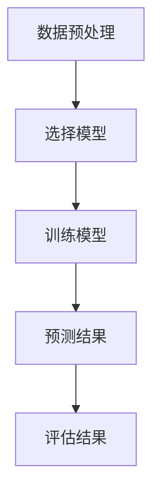
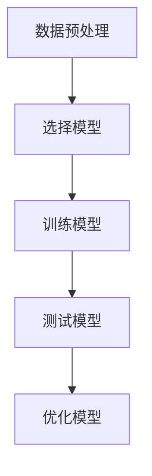
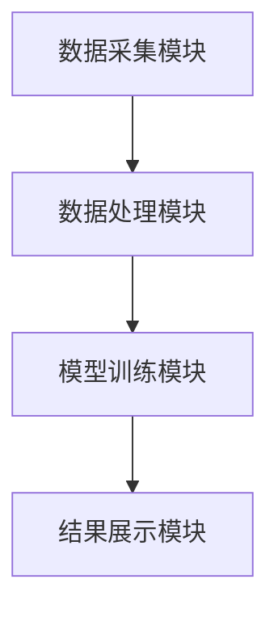
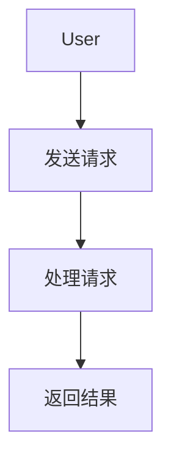

                 


# 开发智能化的金融市场微观结构变化影响评估工具

## 关键词：金融市场微观结构、时间序列分析、机器学习、系统架构设计、Python实现

## 摘要：金融市场微观结构的变化对市场运行有着重要影响，开发智能化的评估工具可以帮助投资者和监管机构更好地理解和应对这些变化。本文从核心概念、算法原理、系统设计到项目实战，详细介绍了开发此类工具的全过程，为读者提供全面的技术指导。

---

# 第一部分: 金融市场微观结构变化影响评估工具的背景与核心概念

# 第1章: 金融市场微观结构概述

## 1.1 金融市场微观结构的基本概念

### 1.1.1 金融市场的定义与分类

金融市场是指资金的融通场所，根据交易对象的不同，可以分为股票市场、债券市场、外汇市场等。微观结构关注的是市场中的个体行为和市场机制。

### 1.1.2 微观结构的定义与研究意义

微观结构指的是市场中的订单簿、交易量、价格波动等细节。研究微观结构有助于理解市场的流动性、价格形成机制和市场参与者的策略。

### 1.1.3 金融市场微观结构的核心要素

- **订单簿**：记录所有未成交的订单。
- **交易量**：一定时间内成交的数量。
- **价格波动**：资产价格的短期变化。

## 1.2 金融市场微观结构变化的影响

### 1.2.1 微观结构变化的来源

- **市场参与者的策略变化**：如高频交易、算法交易。
- **市场环境的变化**：如监管政策、市场情绪。

### 1.2.2 微观结构变化对市场的影响

- **流动性风险**：订单簿变薄可能导致流动性下降。
- **价格波动性**：高频交易可能导致价格剧烈波动。
- **市场稳定性**：极端的微观结构变化可能引发市场崩盘。

### 1.2.3 评估工具的必要性与目标

- **必要性**：及时发现和评估微观结构变化，预防系统性风险。
- **目标**：量化微观结构的变化，评估其对市场的影响。

## 1.3 评估工具的定义与功能

### 1.3.1 工具的定义

评估工具是一种智能化系统，用于实时监测和分析金融市场微观结构的变化，并预测其对市场的影响。

### 1.3.2 工具的功能模块

- **数据采集**：实时获取订单簿、交易量等数据。
- **数据分析**：使用算法分析数据，识别异常变化。
- **风险评估**：评估微观结构变化带来的风险。
- **结果展示**：以可视化方式展示分析结果。

### 1.3.3 工具的应用场景

- **金融机构**：帮助交易员做出决策。
- **监管机构**：监控市场，维护市场稳定。
- **学术研究**：提供数据支持。

## 1.4 本章小结

本章介绍了金融市场微观结构的基本概念、变化的影响以及评估工具的必要性和功能。

---

# 第2章: 金融市场微观结构变化的数学模型与算法原理

## 2.1 微观结构变化的数学建模

### 2.1.1 时间序列分析模型

时间序列分析用于预测未来的价格走势。常用的模型包括ARIMA、LSTM等。

#### ARIMA模型

ARIMA（自回归积分滑动平均模型）用于预测未来的趋势。其公式为：

$$ ARIMA(p, d, q) $$

其中，p为自回归阶数，d为差分阶数，q为滑动平均阶数。

### 2.1.2 随机过程模型

随机过程模型用于描述市场的不确定性。常用的模型包括布朗运动和马尔可夫链。

#### 布朗运动

布朗运动描述了资产价格的随机波动，其公式为：

$$ dS_t = \mu dt + \sigma dW_t $$

其中，$\mu$为漂移系数，$\sigma$为波动率，$dW_t$为标准布朗运动。

### 2.1.3 网络图模型

网络图模型用于分析市场参与者的相互关系。例如，订单网络可以表示为图结构。

#### 图结构表示

节点表示市场参与者，边表示交易关系。例如：

```
A -> B: 交易订单
```

## 2.2 机器学习在微观结构变化中的应用

### 2.2.1 监督学习模型

监督学习用于分类和回归任务。例如，使用随机森林预测价格波动。

#### 随机森林

随机森林是一种集成学习方法，通过构建多个决策树进行投票或平均。

### 2.2.2 无监督学习模型

无监督学习用于聚类和降维。例如，使用K均值聚类识别市场状态。

#### K均值聚类

将数据分成K个簇，公式为：

$$ \arg \min \sum_{i=1}^K \sum_{j \in C_i} (x_j - \mu_i)^2 $$

其中，$C_i$是第i个簇，$\mu_i$是簇中心。

### 2.2.3 强化学习模型

强化学习用于策略优化。例如，使用Q-learning优化交易策略。

## 2.3 算法原理与流程图

### 2.3.1 时间序列分析算法流程图



### 2.3.2 机器学习算法流程图



## 2.4 本章小结

本章介绍了时间序列分析和机器学习在金融市场微观结构变化中的应用，并通过流程图展示了算法的实现流程。

---

# 第3章: 评估工具的核心算法实现

## 3.1 时间序列分析算法实现

### 3.1.1 ARIMA模型的实现

使用Python的`statsmodels`库实现ARIMA模型：

```python
from statsmodels.tsa.arima_model import ARIMA

model = ARIMA(train_data, order=(5, 1, 0))
model_fit = model.fit()
```

### 3.1.2 LSTM模型的实现

使用Keras实现LSTM模型：

```python
from keras.models import Sequential
from keras.layers import LSTM, Dense

model = Sequential()
model.add(LSTM(50, input_shape=(1, look_back)))
model.add(Dense(1))
model.compile(loss='mean_squared_error', optimizer='adam')
```

### 3.1.3 模型的比较与优化

通过交叉验证选择最佳模型，例如使用网格搜索优化超参数。

## 3.2 机器学习算法实现

### 3.2.1 XGBoost模型的实现

使用XGBoost库实现分类任务：

```python
from xgboost import XGBClassifier

model = XGBClassifier(n_estimators=100, learning_rate=0.1)
model.fit(X_train, y_train)
```

### 3.2.2 随机森林模型的实现

使用Scikit-learn实现随机森林：

```python
from sklearn.ensemble import RandomForestClassifier

model = RandomForestClassifier(n_estimators=100)
model.fit(X_train, y_train)
```

### 3.2.3 模型的调参与优化

使用网格搜索或贝叶斯优化选择最佳参数。

## 3.3 算法实现的代码示例

### 3.3.1 时间序列分析的Python代码

```python
import pandas as pd
import numpy as np

data = pd.read_csv('market_data.csv')
train_data = data['price'].values
```

### 3.3.2 机器学习模型的Python代码

```python
from sklearn.model_selection import train_test_split
from sklearn.metrics import accuracy_score

X_train, X_test, y_train, y_test = train_test_split(X, y)
model.fit(X_train, y_train)
y_pred = model.predict(X_test)
print("Accuracy:", accuracy_score(y_test, y_pred))
```

## 3.4 本章小结

本章详细介绍了时间序列分析和机器学习算法的实现，并提供了Python代码示例。

---

# 第4章: 评估工具的系统架构设计

## 4.1 系统功能设计

### 4.1.1 数据采集模块

从数据源（如交易所API）获取实时数据。

### 4.1.2 数据处理模块

清洗和转换数据，使其适合模型输入。

### 4.1.3 模型训练模块

使用训练好的模型进行预测和评估。

### 4.1.4 结果展示模块

以可视化方式展示分析结果。

## 4.2 系统架构图



## 4.3 接口设计与交互流程

### 4.3.1 数据接口的设计

使用RESTful API与数据源交互。

### 4.3.2 用户接口的设计

设计友好的GUI界面，方便用户操作。

### 4.3.3 交互流程的Mermaid图



## 4.4 本章小结

本章设计了评估工具的系统架构，并展示了模块之间的交互关系。

---

# 第5章: 项目实战与案例分析

## 5.1 项目环境的安装与配置

### 5.1.1 Python环境的搭建

安装Python和必要的库（如Pandas、NumPy、Keras等）。

### 5.1.2 第三方库的安装

使用pip安装所需的库：

```bash
pip install pandas numpy keras statsmodels
```

### 5.1.3 开发工具的配置

配置IDE（如Jupyter Notebook）和版本控制工具（如Git）。

## 5.2 核心代码的实现

### 5.2.1 数据采集与处理的代码

```python
import pandas as pd
import requests

def get_data(api_key):
    url = f'https://api.example.com/data?api_key={api_key}'
    response = requests.get(url)
    data = response.json()
    df = pd.DataFrame(data)
    return df

data = get_data('your_api_key')
```

### 5.2.2 模型训练的代码

```python
from keras.models import Sequential
from keras.layers import LSTM, Dense

def build_model(input_shape):
    model = Sequential()
    model.add(LSTM(50, input_shape=input_shape))
    model.add(Dense(1))
    model.compile(loss='mean_squared_error', optimizer='adam')
    return model

model = build_model((look_back, 1))
model.fit(X_train, y_train, epochs=100, batch_size=32)
```

### 5.2.3 结果展示的代码

```python
import matplotlib.pyplot as plt

plt.plot(y_test, label='实际值')
plt.plot(y_pred, label='预测值')
plt.legend()
plt.show()
```

## 5.3 项目实战案例分析

### 5.3.1 数据分析与预处理

使用Jupyter Notebook进行数据清洗和特征工程。

### 5.3.2 模型训练与评估

训练模型并评估其性能，调整参数以优化结果。

### 5.3.3 结果展示与解读

将分析结果以图表形式展示，解读其对市场的影响。

## 5.4 本章小结

本章通过实际案例展示了评估工具的开发过程，并提供了详细的代码实现和结果解读。

---

# 第6章: 最佳实践、小结、注意事项与拓展阅读

## 6.1 最佳实践 tips

- **数据清洗**：确保数据的准确性和完整性。
- **模型优化**：使用交叉验证和网格搜索优化模型。
- **结果解读**：结合市场背景解读分析结果。

## 6.2 项目小结

本项目通过系统化的方法开发了一个智能化的金融市场微观结构变化影响评估工具，为投资者和监管机构提供了有力支持。

## 6.3 注意事项

- **数据隐私**：注意数据的隐私保护。
- **模型局限性**：认识到模型的局限性，避免过度依赖。
- **市场变化**：及时更新模型以适应市场变化。

## 6.4 拓展阅读

- **相关书籍**：《金融时间序列分析》、《机器学习实战》。
- **学术论文**：查找相关领域的学术论文，深入研究。

---

# 作者：AI天才研究院/AI Genius Institute & 禅与计算机程序设计艺术 /Zen And The Art of Computer Programming

---

以上是《开发智能化的金融市场微观结构变化影响评估工具》的技术博客文章的完整目录和内容大纲，希望对您有所帮助！如果需要进一步扩展某部分内容或添加更多细节，请随时告知！

