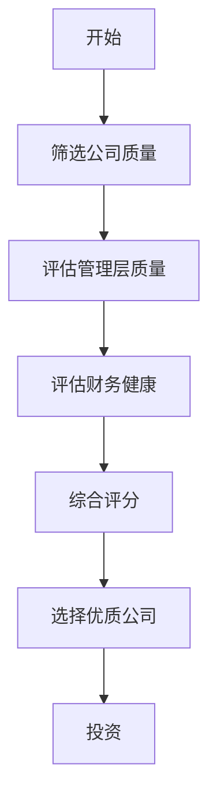
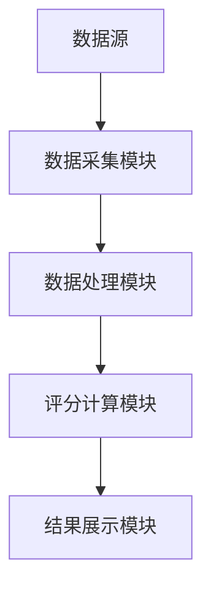

                 


# 彼得林奇的"质量优先"在新兴市场投资中的实践挑战

## 关键词：彼得林奇，质量优先，投资策略，新兴市场，风险管理，公司质量评估

## 摘要：  
本文深入探讨了彼得林奇的“质量优先”投资理念在新兴市场中的实践挑战。通过分析新兴市场的独特特点，本文详细阐述了如何在新兴市场中应用“质量优先”策略，包括公司质量评估、管理层稳定性、财务健康状况等关键因素。同时，本文结合实际案例，分析了在新兴市场中实施该策略时可能遇到的困难，并提出了相应的解决方案和优化建议。

---

## 第一章：彼得林奇“质量优先”投资理念的背景与基础

### 1.1 彼得林奇投资理念的起源

#### 1.1.1 彼得林奇的生平简介  
彼得·林奇（Peter Lynch）是美国著名的投资专家，被誉为“成长型投资之父”。他在富达投资集团（Fidelity）任职期间，管理的麦哲伦基金取得了令人瞩目的成绩，年化回报率超过29%，为投资者创造了巨大的价值。林奇的成功不仅在于他的投资业绩，更在于他总结出的一套独特的投资理念。

#### 1.1.2 “质量优先”投资理念的形成背景  
“质量优先”理念的核心在于选择那些具有持续竞争优势、良好管理团队和稳定财务表现的公司。这一理念的形成源于林奇对市场的深刻理解：优质公司能够在市场波动中保持稳健增长，为投资者提供长期的超额收益。

#### 1.1.3 该理念的核心要素与特点  
- **公司质量**：选择具有强大竞争优势、良好市场地位和持续增长潜力的公司。  
- **管理层质量**：重视管理层的稳定性、战略能力和职业道德。  
- **财务健康**：关注公司的盈利能力、资产负债情况和现金流健康状况。

### 1.2 新兴市场中的特殊挑战

#### 1.2.1 新兴市场的特点与风险  
新兴市场通常具有高增长潜力，但也伴随着更高的风险，包括市场波动性大、信息不透明、政策不确定性等。这些特点使得“质量优先”理念在新兴市场的应用更具挑战性。

#### 1.2.2 质量优先理念在新兴市场的适用性  
尽管新兴市场存在诸多不确定性，但“质量优先”理念的核心原则仍然适用。优质公司在新兴市场的增长潜力更大，能够为投资者提供更高的回报。

#### 1.2.3 新兴市场中的公司质量评估难点  
- **信息不透明**：新兴市场的公司信息披露可能不完整，增加了评估的难度。  
- **竞争环境复杂**：新兴市场中的竞争往往更加激烈，优质公司的识别更具挑战性。  
- **政策风险**：政策变化可能对公司的经营产生重大影响，增加了质量评估的复杂性。

---

## 第二章：质量优先投资理念的核心概念与联系

### 2.1 质量优先的核心概念

#### 2.1.1 质量优先的定义  
质量优先是指在投资决策中，优先选择具有高质量的公司，即那些在行业内具有竞争优势、财务健康、管理层稳定且道德可靠的公司。

#### 2.1.2 质量优先与其他投资策略的对比  
- **价值投资**：关注低估值的公司，而质量优先更关注公司的内在质量。  
- **成长投资**：关注高增长潜力的公司，而质量优先更注重公司的可持续增长能力。  
- **指数投资**：被动跟踪市场指数，而质量优先更注重主动选择优质公司。

#### 2.1.3 质量优先理念在新兴市场的独特性  
在新兴市场中，质量优先理念需要结合市场特点进行调整，例如更加注重公司的管理团队稳定性、财务健康状况以及对政策风险的敏感性。

### 2.2 质量优先在新兴市场的应用

#### 2.2.1 新兴市场中的公司质量特征  
- **行业地位**：公司在行业中的市场份额和竞争力。  
- **管理团队**：管理团队的经验、能力和稳定性。  
- **财务健康**：公司的盈利能力、资产负债情况和现金流健康状况。

#### 2.2.2 新兴市场中管理层质量的评估  
- **管理团队稳定性**：避免选择管理层频繁变动的公司。  
- **战略能力**：管理层是否具备清晰的战略规划和执行能力。  
- **道德风险**：关注管理层是否存在道德风险，例如关联交易、财务造假等。

#### 2.2.3 新兴市场中的财务健康评估  
- **盈利能力**：关注公司是否具有持续的盈利能力，尤其是在市场波动较大的情况下。  
- **资产负债情况**：关注公司的债务水平是否合理，是否存在过度杠杆的风险。  
- **现金流健康**：关注公司的现金流是否健康，能否支持公司的持续经营。

---

## 第三章：质量优先投资理念的算法原理

### 3.1 质量优先策略的筛选标准

#### 3.1.1 公司质量筛选标准  
- **行业地位**：公司在行业中的市场份额和竞争力。  
- **管理团队稳定性**：管理团队的稳定性、经验和能力。  
- **财务健康状况**：公司的盈利能力、资产负债情况和现金流健康状况。

#### 3.1.2 管理层质量筛选标准  
- **管理团队稳定性**：避免选择管理层频繁变动的公司。  
- **战略能力**：管理层是否具备清晰的战略规划和执行能力。  
- **道德风险**：关注管理层是否存在道德风险，例如关联交易、财务造假等。

#### 3.1.3 财务健康筛选标准  
- **盈利能力**：关注公司是否具有持续的盈利能力，尤其是在市场波动较大的情况下。  
- **资产负债情况**：关注公司的债务水平是否合理，是否存在过度杠杆的风险。  
- **现金流健康**：关注公司的现金流是否健康，能否支持公司的持续经营。

### 3.2 质量优先策略的算法流程图



### 3.3 质量优先策略的数学模型

#### 3.3.1 公司质量评分模型  
公司质量评分模型可以通过以下公式计算：

$$
\text{公司质量评分} = 0.4 \times \text{行业地位评分} + 0.3 \times \text{管理团队评分} + 0.3 \times \text{财务健康评分}
$$

其中，行业地位评分、管理团队评分和财务健康评分均采用0-10分的评分标准。

#### 3.3.2 管理层质量评分模型  
管理层质量评分模型可以通过以下公式计算：

$$
\text{管理层质量评分} = 0.5 \times \text{管理团队稳定性评分} + 0.3 \times \text{战略能力评分} + 0.2 \times \text{道德风险评分}
$$

其中，管理团队稳定性评分、战略能力评分和道德风险评分均采用0-10分的评分标准。

#### 3.3.3 财务健康评分模型  
财务健康评分模型可以通过以下公式计算：

$$
\text{财务健康评分} = 0.4 \times \text{盈利能力评分} + 0.3 \times \text{资产负债情况评分} + 0.3 \times \text{现金流健康评分}
$$

其中，盈利能力评分、资产负债情况评分和现金流健康评分均采用0-10分的评分标准。

---

## 第四章：质量优先投资理念的系统架构与实现

### 4.1 系统架构设计

#### 4.1.1 系统功能设计  
- **数据采集**：采集新兴市场的公司数据，包括行业地位、管理团队信息和财务数据。  
- **数据处理**：对采集到的数据进行清洗、转换和标准化处理。  
- **评分计算**：根据质量优先评分模型，计算公司质量评分、管理层质量评分和财务健康评分。  
- **结果展示**：展示筛选出的优质公司列表和评分结果。

#### 4.1.2 系统架构图  



### 4.2 系统接口设计

#### 4.2.1 数据接口  
- **输入接口**：接收新兴市场的公司数据，包括行业地位、管理团队信息和财务数据。  
- **输出接口**：输出公司质量评分、管理层质量评分和财务健康评分。

#### 4.2.2 用户接口  
- **输入接口**：接收用户的查询请求，包括公司名称、行业和财务指标。  
- **输出接口**：显示筛选出的优质公司列表和评分结果。

---

## 第五章：质量优先投资理念的项目实战

### 5.1 环境安装与数据准备

#### 5.1.1 环境安装  
- **Python环境**：安装Python 3.8及以上版本。  
- **依赖库安装**：安装pandas、numpy、scikit-learn等依赖库。

#### 5.1.2 数据准备  
- **数据来源**：从新兴市场中选择一定数量的公司，收集其行业地位、管理团队信息和财务数据。  
- **数据格式**：将数据存储为CSV格式，便于后续处理和分析。

### 5.2 系统核心实现

#### 5.2.1 数据清洗与预处理  
```python
import pandas as pd

# 读取数据
df = pd.read_csv('emerging_markets_companies.csv')

# 删除缺失值
df.dropna(inplace=True)

# 标准化处理
from sklearn.preprocessing import StandardScaler
scaler = StandardScaler()
df[['revenue', 'profit', 'debt']] = scaler.fit_transform(df[['revenue', 'profit', 'debt']])
```

#### 5.2.2 质量评分计算  
```python
def calculate_company_quality_score(df):
    industry_position = df['industry_position'].values
    management_team = df['management_team'].values
    financial_health = df['financial_health'].values
    
    quality_score = 0.4 * industry_position + 0.3 * management_team + 0.3 * financial_health
    return quality_score

# 计算公司质量评分
df['quality_score'] = calculate_company_quality_score(df)
```

#### 5.2.3 管理层评分计算  
```python
def calculate_management_quality_score(df):
    management_stability = df['management_stability'].values
    strategic_capability = df['strategic_capability'].values
    ethical_risk = df['ethical_risk'].values
    
    management_score = 0.5 * management_stability + 0.3 * strategic_capability + 0.2 * ethical_risk
    return management_score

# 计算管理层质量评分
df['management_score'] = calculate_management_quality_score(df)
```

#### 5.2.4 财务评分计算  
```python
def calculate_financial_health_score(df):
    profitability = df['profitability'].values
    debt_ratio = df['debt_ratio'].values
    cash_flow = df['cash_flow'].values
    
    financial_score = 0.4 * profitability + 0.3 * debt_ratio + 0.3 * cash_flow
    return financial_score

# 计算财务健康评分
df['financial_score'] = calculate_financial_health_score(df)
```

### 5.3 实际案例分析

#### 5.3.1 案例背景  
假设我们有以下新兴市场的公司数据：

| 公司名称 | 行业地位 | 管理团队 | 财务状况 |
|----------|----------|----------|----------|
| 公司A    | 高       | 稳定     | 健康     |
| 公司B    | 中       | 不稳定   | 良好     |
| 公司C    | 低       | 稳定     | 健康     |

#### 5.3.2 筛选过程  
根据质量优先评分模型，计算每家公司的质量评分：

$$
\text{公司A质量评分} = 0.4 \times 10 + 0.3 \times 8 + 0.3 \times 9 = 4 + 2.4 + 2.7 = 9.1
$$

$$
\text{公司B质量评分} = 0.4 \times 6 + 0.3 \times 5 + 0.3 \times 7 = 2.4 + 1.5 + 2.1 = 6.0
$$

$$
\text{公司C质量评分} = 0.4 \times 4 + 0.3 \times 8 + 0.3 \times 7 = 1.6 + 2.4 + 2.1 = 6.1
$$

根据上述评分结果，公司A的评分最高，因此被筛选为优质公司。

---

## 第六章：质量优先投资理念的总结与展望

### 6.1 最佳实践

#### 6.1.1 关注公司质量  
在新兴市场中，选择具有强大竞争优势、良好市场地位和持续增长潜力的公司。

#### 6.1.2 重视管理层稳定性  
管理层的稳定性是影响公司长期表现的重要因素，因此在选择公司时，需要特别关注管理层的稳定性。

#### 6.1.3 评估财务健康状况  
财务健康状况是衡量公司质量的重要指标，需要关注公司的盈利能力、资产负债情况和现金流健康状况。

### 6.2 投资策略小结

- **长期投资**：选择优质公司进行长期投资，避免频繁交易。  
- **分散投资**：通过分散投资降低风险，避免过度集中于某一家公司或行业。  
- **持续监控**：定期监控公司的经营状况和财务表现，及时调整投资组合。

### 6.3 投资注意事项

- **信息透明度**：新兴市场的信息透明度较低，需要通过多种渠道获取信息，确保数据的准确性。  
- **政策风险**：新兴市场中的政策变化可能对公司的经营产生重大影响，需要密切关注政策动态。  
- **市场波动**：新兴市场波动较大，需要具备较强的风险承受能力。

### 6.4 拓展阅读

- **书籍推荐**：  
  - 《彼得林奇的投资哲学》  
  - 《新兴市场的投资机会与挑战》  
- **网站推荐**：  
  - [富达投资集团](https://www.fidelity.com)  
  - [新兴市场投资协会](https://www.emergingmarkets.org)

---

## 结语  

彼得林奇的“质量优先”投资理念在新兴市场中的应用具有重要的现实意义。通过本文的分析，我们可以看到，尽管新兴市场存在诸多挑战，但通过科学的质量评估和合理的投资策略，仍然可以在新兴市场中找到优质的投资标的。未来，随着新兴市场的进一步发展，质量优先理念的应用也将更加广泛和深入。

---

## 作者：AI天才研究院/AI Genius Institute & 禅与计算机程序设计艺术/Zen And The Art of Computer Programming

