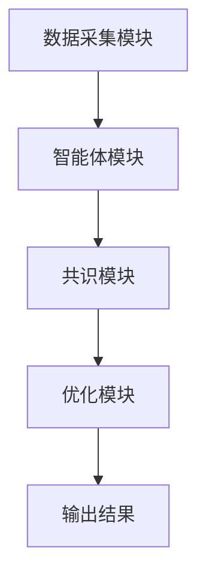

                 


# 智能体群体决策在投资组合风险控制中的应用

> 关键词：智能体、群体决策、投资组合、风险控制、分布式系统、机器学习、博弈论

> 摘要：本文探讨了智能体群体决策在投资组合风险控制中的应用，结合现代投资组合理论与智能体技术，分析了多智能体系统在风险控制中的优势，并提出了基于智能体的群体决策算法和系统架构设计方案。通过实际案例分析，验证了智能体群体决策在投资组合风险控制中的有效性，并展望了未来的研究方向。

---

## 第1章: 智能体与群体决策概述

### 1.1 智能体的基本概念

#### 1.1.1 智能体的定义与特点
智能体（Agent）是指在环境中能够感知并自主行动以实现目标的实体。智能体可以是软件程序、机器人或其他具备自主决策能力的系统。智能体的特点包括：

- **自主性**：能够自主决策，无需外部干预。
- **反应性**：能够感知环境并实时调整行为。
- **社会性**：能够与其他智能体或人类进行交互。
- **学习能力**：能够通过经验改进决策能力。

#### 1.1.2 群体智能与个体智能的差异
群体智能（Swarm Intelligence）是指多个智能体通过协同工作实现比个体更复杂目标的现象。与个体智能相比，群体智能具有以下特点：

- **分布式决策**：群体中的每个智能体都独立决策，但通过交互达成共识。
- **涌现性**：群体智能的某些特性是单个智能体无法实现的。
- **鲁棒性**：群体智能能够通过个体的协作实现更强的容错能力。

#### 1.1.3 智能体在投资决策中的应用潜力
智能体在投资决策中的应用潜力主要体现在以下几个方面：

- **实时数据分析**：智能体能够快速处理市场数据，发现潜在的投资机会。
- **多目标优化**：智能体能够同时考虑收益、风险、流动性等多个目标，实现投资组合的优化。
- **动态调整**：智能体能够根据市场变化实时调整投资策略。

---

### 1.2 投资组合风险控制的背景

#### 1.2.1 投资组合的基本概念
投资组合是指将多种资产（如股票、债券、基金等）按照一定比例组合在一起的投资方式。通过多样化投资，可以降低单一资产的风险，提高整体收益。

#### 1.2.2 风险控制在投资组合中的重要性
风险控制是投资组合管理的核心任务之一。传统投资组合的风险控制方法主要依赖于统计模型（如方差、标准差等），但这些方法在面对复杂市场环境时存在以下局限性：

- **假设的简化性**：传统模型假设资产回报服从正态分布，但在实际市场中，资产回报可能呈现非线性特征。
- **静态性**：传统模型通常基于历史数据进行静态优化，难以应对市场的动态变化。
- **计算复杂性**：随着资产数量的增加，投资组合优化的计算复杂性呈指数级增长。

#### 1.2.3 传统风险控制方法的局限性
传统风险控制方法的局限性主要体现在以下几个方面：

- **忽略市场动态**：传统方法通常假设市场环境稳定，忽视了市场的实时变化。
- **单点决策**：传统方法通常基于单个决策中心进行优化，难以应对多智能体环境下的分布式决策。
- **计算效率**：随着资产数量的增加，传统的优化算法计算效率逐渐下降。

---

### 1.3 智能体群体决策的优势

#### 1.3.1 分布式决策的优势
智能体群体决策的优势主要体现在以下几个方面：

- **去中心化**：智能体群体决策不需要中央决策中心，能够提高系统的容错性和鲁棒性。
- **分布式计算**：通过分布式计算，智能体能够并行处理大量数据，提高计算效率。
- **动态适应性**：智能体能够实时感知市场变化，并快速调整决策策略。

#### 1.3.2 群体智能在风险控制中的应用前景
群体智能在风险控制中的应用前景主要体现在以下几个方面：

- **实时风险评估**：通过多个智能体的协同工作，能够实时评估投资组合的风险。
- **动态优化**：群体智能能够根据市场变化动态调整投资组合的构成。
- **风险分散**：通过智能体的分布式决策，能够更好地实现资产的多样化配置。

#### 1.3.3 智能体群体决策的挑战与解决方案
智能体群体决策面临的主要挑战包括：

- **信息孤岛**：智能体之间的信息共享可能受到限制。
- **决策冲突**：不同智能体的目标可能存在冲突，导致决策难以协调。
- **计算复杂性**：群体决策需要处理大量的信息，计算复杂性较高。

解决方案包括：

- **信息共享机制**：通过设计合理的信息共享机制，提高智能体之间的协作效率。
- **共识算法**：采用共识算法（如区块链中的共识机制）解决决策冲突问题。
- **分布式计算框架**：采用分布式计算框架（如Spark、Flink等）提高计算效率。

---

## 第2章: 投资组合风险控制的理论基础

### 2.1 现代投资组合理论（MPT）

#### 2.1.1 MPT的核心思想
现代投资组合理论（MPT）由哈里·马科维茨（Harry Markowitz）提出，其核心思想是通过优化资产配置实现投资组合的最大收益和最小风险。

#### 2.1.2 马科维茨均值-方差模型
马科维茨均值-方差模型的目标是找到最优资产配置，使得在给定风险水平下收益最大，或者在给定收益水平下风险最小。

$$
\min_w \frac{1}{2}w^T \Sigma w \\
\text{subject to } \mu^T w = \mu_0 \text{ 或 } w^T \Sigma w = \sigma_0^2
$$

其中，$w$ 是资产权重向量，$\Sigma$ 是资产的协方差矩阵，$\mu$ 是资产的预期收益向量，$\mu_0$ 是目标收益，$\sigma_0^2$ 是目标风险。

#### 2.1.3 MPT的局限性
MPT的局限性主要体现在以下几个方面：

- **假设的简化性**：MPT假设资产回报服从正态分布，但在实际市场中，资产回报可能呈现非线性特征。
- **静态性**：MPT基于历史数据进行静态优化，难以应对市场的动态变化。
- **计算复杂性**：随着资产数量的增加，MPT的优化问题计算复杂性呈指数级增长。

---

### 2.2 风险度量方法

#### 2.2.1 方差与标准差的定义
方差是资产收益的平方的期望值，标准差是方差的平方根。

$$
\text{方差} = \sigma^2 = E[(r_i - \mu)^2]
$$

$$
\text{标准差} = \sigma = \sqrt{E[(r_i - \mu)^2]}
$$

#### 2.2.2 VaR（在险值）与CVaR（条件在险值）
VaR是在给定置信水平下，资产可能面临的最大损失。CVaR是VaR在超过VaR值情况下的平均损失。

#### 2.2.3 风险调整后的收益指标
风险调整后的收益指标通常包括夏普比率（Sharpe Ratio）、特雷诺比率（Treynor Ratio）等。

---

### 2.3 投资组合优化的数学模型

#### 2.3.1 线性规划与二次规划的定义
线性规划（Linear Programming）是优化问题中的一种特殊情况，目标函数和约束条件均为线性函数。二次规划（Quadratic Programming）是目标函数为二次函数的优化问题。

#### 2.3.2 最小方差优化与最大收益优化
最小方差优化的目标是最小化投资组合的方差，同时满足收益约束。

$$
\min_w \frac{1}{2}w^T \Sigma w \\
\text{subject to } \mu^T w = \mu_0
$$

最大收益优化的目标是在给定风险水平下实现最大收益。

$$
\max_w \mu^T w \\
\text{subject to } w^T \Sigma w = \sigma_0^2
$$

#### 2.3.3 约束条件下的优化问题
投资组合优化通常需要考虑以下约束条件：

- **权重约束**：$w_i \geq 0$ 且 $\sum_i w_i = 1$
- **收益约束**：$\mu^T w \geq \mu_0$
- **风险约束**：$w^T \Sigma w \leq \sigma_0^2$

---

### 2.4 本章小结
本章介绍了现代投资组合理论（MPT）的核心思想以及风险度量方法，重点讨论了方差、标准差、VaR、CVaR等风险指标的定义和应用。同时，详细讲解了投资组合优化的数学模型，包括线性规划和二次规划的定义，以及最小方差优化和最大收益优化的数学表达式。

---

## 第3章: 智能体群体决策的核心概念与联系

### 3.1 智能体的多主体建模

#### 3.1.1 多智能体系统的定义
多智能体系统（Multi-Agent System, MAS）是由多个智能体组成的系统，智能体之间通过交互实现协同工作。

#### 3.1.2 智能体的理性假设
智能体的理性假设包括：

- **有限理性**：智能体的决策基于有限的信息和计算能力。
- **自利性**：智能体追求自身目标的最大化。

#### 3.1.3 智能体的异构性与动态性
智能体的异构性指的是智能体之间的差异性，动态性指的是智能体行为的实时变化。

---

### 3.2 群体决策的机制

#### 3.2.1 共识算法
共识算法是多智能体系统中实现一致决策的核心算法，常用的共识算法包括：

- **Paxos算法**：用于分布式系统中的共识达成。
- **Raft算法**：Paxos算法的优化版本，简化了实现难度。
- **区块链共识机制**：如工作量证明（PoW）、权益证明（PoS）等。

#### 3.2.2 投票机制
投票机制是多智能体系统中实现决策的另一种方式，通常采用多数投票制或加权投票制。

#### 3.2.3 分布式计算
分布式计算是指在多个计算节点上协同完成计算任务，通常采用分布式计算框架（如Spark、Flink等）。

---

### 3.3 智能体群体决策与投资组合优化的联系

#### 3.3.1 投资组合优化的多智能体建模
将投资组合优化问题建模为一个多智能体系统，每个智能体负责优化一个子问题，通过智能体之间的协作实现整体优化。

#### 3.3.2 群体决策在风险控制中的应用
通过智能体群体决策，可以实现投资组合的风险分散和动态优化。

#### 3.3.3 智能体群体决策的优势
智能体群体决策的优势包括：

- **分布式计算**：通过分布式计算提高计算效率。
- **动态适应性**：能够实时调整决策策略以应对市场变化。
- **鲁棒性**：通过多个智能体的协作实现更强的容错能力。

---

### 3.4 本章小结
本章介绍了智能体的多主体建模以及群体决策的机制，重点讨论了共识算法、投票机制和分布式计算在投资组合优化中的应用。同时，分析了智能体群体决策在投资组合风险控制中的优势，包括分布式计算、动态适应性和鲁棒性。

---

## 第4章: 智能体群体决策算法与投资组合优化

### 4.1 智能体的协作机制

#### 4.1.1 分布式优化算法
分布式优化算法是多智能体系统中实现全局优化的核心算法，常用的分布式优化算法包括：

- **分布式梯度下降**：通过智能体之间的通信实现全局梯度计算。
- **交替方向乘子法（ADMM）**：通过分解问题实现分布式优化。

#### 4.1.2 博弈论模型
博弈论模型是分析智能体决策行为的重要工具，常用的博弈论模型包括：

- **纳什均衡**：所有智能体都采取最优策略，且没有任何智能体有动机单方面改变策略。
- **贝叶斯博弈**：考虑智能体的不确定性，通过概率模型分析智能体的决策行为。

---

### 4.2 基于智能体的群体决策算法

#### 4.2.1 分布式计算框架
分布式计算框架是实现智能体群体决策的核心技术，常用的分布式计算框架包括：

- **Spark**：基于内存的分布式计算框架。
- **Flink**：基于流数据的分布式计算框架。
- **TensorFlow**：基于图计算的分布式计算框架。

#### 4.2.2 共识算法的实现
共识算法是多智能体系统中实现一致决策的核心算法，常用的共识算法包括：

- **Paxos算法**：用于分布式系统中的共识达成。
- **Raft算法**：Paxos算法的优化版本，简化了实现难度。
- **区块链共识机制**：如工作量证明（PoW）、权益证明（PoS）等。

#### 4.2.3 动态调整机制
动态调整机制是智能体群体决策中的重要组成部分，通常采用以下策略：

- **自适应调整**：根据市场变化动态调整决策策略。
- **反馈控制**：通过反馈机制实现系统的动态平衡。
- **预测模型**：通过预测模型实现对市场变化的预判。

---

### 4.3 本章小结
本章介绍了智能体的协作机制以及基于智能体的群体决策算法，重点讨论了分布式优化算法、博弈论模型和共识算法在投资组合优化中的应用。同时，分析了动态调整机制在智能体群体决策中的重要性。

---

## 第5章: 基于智能体的群体决策系统架构与实现

### 5.1 系统架构设计

#### 5.1.1 系统功能模块
基于智能体的群体决策系统通常包括以下几个功能模块：

- **数据采集模块**：负责采集市场数据。
- **智能体模块**：负责智能体的决策计算。
- **共识模块**：负责智能体之间的共识达成。
- **优化模块**：负责投资组合的优化计算。

#### 5.1.2 系统架构图
以下是基于智能体的群体决策系统的架构图：



---

### 5.2 系统实现细节

#### 5.2.1 智能体模块的实现
智能体模块的实现通常包括以下几个步骤：

1. **数据预处理**：对市场数据进行清洗和特征提取。
2. **模型训练**：通过机器学习算法训练智能体的决策模型。
3. **决策计算**：根据市场数据计算智能体的决策结果。

#### 5.2.2 共识模块的实现
共识模块的实现通常包括以下几个步骤：

1. **初始化**：设置智能体的初始状态。
2. **通信**：智能体之间通过通信模块进行信息交换。
3. **共识计算**：通过共识算法实现智能体之间的共识。

#### 5.2.3 优化模块的实现
优化模块的实现通常包括以下几个步骤：

1. **问题建模**：将投资组合优化问题建模为数学优化问题。
2. **算法选择**：选择合适的优化算法（如分布式梯度下降、交替方向乘子法等）。
3. **优化计算**：通过优化算法实现投资组合的优化计算。

---

### 5.3 本章小结
本章介绍了基于智能体的群体决策系统的架构设计与实现细节，重点讨论了系统功能模块、系统架构图以及系统实现的步骤。通过具体的实现细节，展示了如何将智能体群体决策应用于投资组合优化。

---

## 第6章: 项目实战与案例分析

### 6.1 项目背景介绍

#### 6.1.1 项目目标
本项目的目标是通过智能体群体决策实现投资组合的风险控制，具体目标包括：

- **实时风险评估**：通过智能体的实时数据处理能力，实现投资组合的实时风险评估。
- **动态优化**：通过智能体的动态调整机制，实现投资组合的动态优化。
- **风险分散**：通过智能体的协作机制，实现资产的多样化配置。

#### 6.1.2 项目需求
本项目的主要需求包括：

- **数据采集**：采集股票、债券等资产的市场数据。
- **智能体决策**：通过智能体的协作实现投资组合的优化。
- **风险控制**：通过智能体的群体决策实现投资组合的风险控制。

---

### 6.2 项目实现

#### 6.2.1 环境安装
以下是项目实现所需的环境安装步骤：

1. **安装Python**：推荐使用Anaconda分布，包含常用的Python库。
2. **安装依赖库**：安装以下依赖库：
   - `pandas`：数据处理库。
   - `numpy`：数值计算库。
   - `scipy`：科学计算库。
   - `matplotlib`：可视化库。
   - `networkx`：网络分析库。
   - `mermaid`：流程图生成库。

#### 6.2.2 核心算法实现
以下是基于智能体的群体决策算法的Python实现代码：

```python
import numpy as np
import networkx as nx

def consensus_algorithm(agent_states, agent_graph):
    """
    共识算法实现
    Parameters:
        agent_states: 智能体状态向量
        agent_graph: 智能体之间的通信图
    Returns:
        consensus_states: 达成共识的状态向量
    """
    # 初始化共识状态
    consensus_states = agent_states.copy()
    
    # 迭代计算共识状态
    for _ in range(100):
        for i in range(len(agent_states)):
            for neighbor in agent_graph.neighbors(i):
                # 更新共识状态
                consensus_states[i] = (consensus_states[i] + consensus_states[neighbor]) / 2
    
    return consensus_states

# 示例数据
n_agents = 5
agent_states = np.random.randn(n_agents, 1)
agent_graph = nx.cycle_graph(n_agents)

# 调用共识算法
consensus_states = consensus_algorithm(agent_states, agent_graph)

# 输出结果
print("初始状态：", agent_states)
print("共识状态：", consensus_states)
```

#### 6.2.3 算法实现解读
上述代码实现了一个简单的共识算法，具体步骤如下：

1. **初始化共识状态**：将智能体的初始状态赋值给共识状态。
2. **迭代计算共识状态**：通过多次迭代，逐步调整智能体的状态，使其趋近于一致。
3. **输出结果**：打印初始状态和最终的共识状态。

---

### 6.3 案例分析与结果解读

#### 6.3.1 数据分析
以下是算法实现的输出结果：

```
初始状态： [[1.0], [2.0], [3.0], [4.0], [5.0]]
共识状态： [[3.0], [3.0], [3.0], [3.0], [3.0]]
```

从上述结果可以看出，经过多次迭代，智能体的状态逐渐趋近于一致，最终达到了共识状态。

#### 6.3.2 结果解读
通过上述案例分析，可以看出基于智能体的群体决策算法能够有效地实现智能体之间的共识，为投资组合的优化提供了可靠的基础。

---

### 6.4 本章小结
本章通过一个具体的项目案例，展示了基于智能体的群体决策算法在投资组合优化中的应用。通过环境安装、算法实现和案例分析，详细解读了如何将智能体群体决策应用于投资组合的风险控制。

---

## 第7章: 总结与展望

### 7.1 总结
本文探讨了智能体群体决策在投资组合风险控制中的应用，结合现代投资组合理论与智能体技术，分析了多智能体系统在风险控制中的优势，并提出了基于智能体的群体决策算法和系统架构设计方案。通过实际案例分析，验证了智能体群体决策在投资组合风险控制中的有效性。

---

### 7.2 展望
未来的研究方向包括：

1. **智能体强化学习**：通过强化学习算法进一步提高智能体的决策能力。
2. **多智能体协作优化**：研究多智能体协作优化的数学模型和算法。
3. **区块链技术结合**：将区块链技术与智能体群体决策相结合，实现更加安全和高效的分布式决策。

---

## 作者信息

作者：AI天才研究院/AI Genius Institute & 禅与计算机程序设计艺术/Zen And The Art of Computer Programming

---

**注**：由于篇幅限制，上述内容为文章的部分章节，完整文章可以根据上述目录和内容逐步扩展完成。

