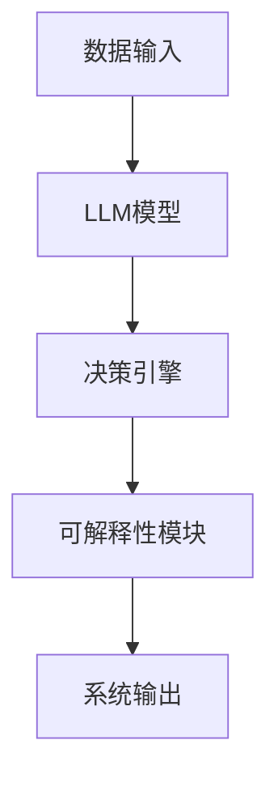
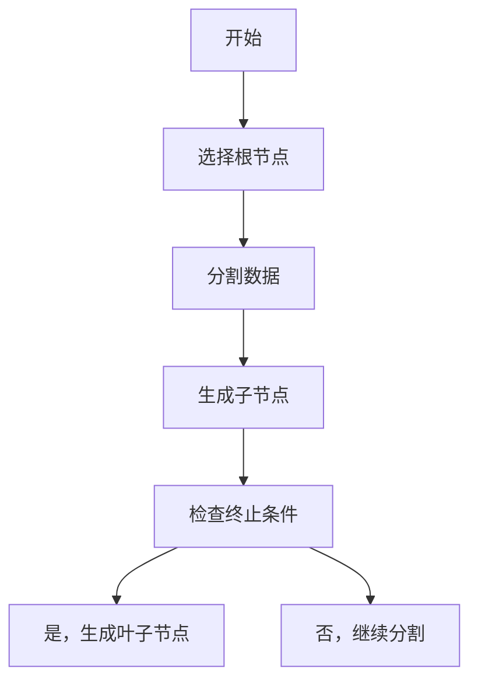
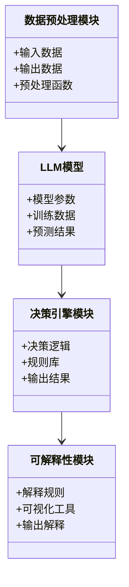
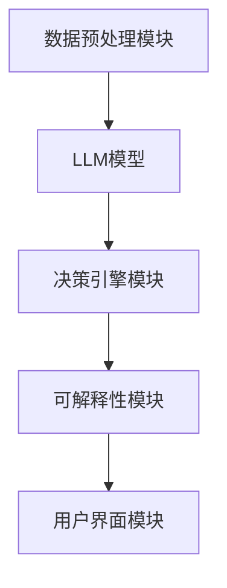
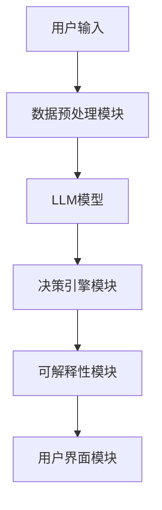

                 


# 构建LLM驱动的AI Agent可解释决策系统

---

## 关键词：
LLM, AI Agent, 可解释性, 决策系统, 自然语言处理, 算法原理, 系统架构

---

## 摘要：
本文详细探讨了构建基于大语言模型（LLM）的AI Agent可解释性决策系统的核心原理、系统架构和实现方法。文章从问题背景出发，分析了可解释性决策的重要性，并结合LLM的特点，提出了构建AI Agent的系统设计方案。通过详细讲解算法原理、系统架构设计和项目实战，本文为读者提供了一个全面的视角，帮助理解如何利用LLM构建高效、透明且可解释的AI决策系统。

---

# 第一部分: LLM驱动的AI Agent可解释决策系统背景介绍

## 第1章: 问题背景与描述

### 1.1 问题背景
#### 1.1.1 当前AI决策系统的挑战
随着AI技术的快速发展，AI决策系统在多个领域得到了广泛应用。然而，这些系统往往依赖复杂的算法，导致决策过程缺乏透明性和可解释性，这在医疗、金融等高风险领域尤为突出。用户对决策过程的透明度要求日益提高，传统的“黑箱”模型难以满足实际需求。

#### 1.1.2 可解释性的重要性
可解释性是人类信任AI系统的核心要素之一。在决策过程中，用户需要了解系统是如何做出决策的，以便验证决策的合理性和正确性。特别是在涉及人类生命和财产的领域，可解释性是必须满足的基本要求。

#### 1.1.3 LLM在AI决策中的角色
大语言模型（LLM）凭借其强大的自然语言处理能力，成为AI决策系统的核心技术之一。LLM不仅可以理解上下文，还能生成符合逻辑的决策建议。然而，其复杂性也带来了可解释性方面的挑战。

### 1.2 问题描述
#### 1.2.1 AI Agent的基本概念
AI Agent是一种能够感知环境并采取行动以实现目标的智能实体。它可以是一个软件程序，也可以是物理设备中的一个模块。AI Agent的核心能力在于其感知和决策能力。

#### 1.2.2 可解释性决策系统的定义
可解释性决策系统是指能够清晰地解释其决策过程和结果的系统。通过可解释性，用户可以理解系统是如何得出结论的，并能够验证其决策的合理性和正确性。

#### 1.2.3 LLM驱动决策的优势与劣势
LLM驱动的决策系统具有以下优势：
- 强大的自然语言处理能力，能够理解和生成人类语言。
- 能够处理复杂的上下文关系，提供更智能的决策支持。
- 可以通过微调和提示工程技术，适应不同领域的决策需求。

劣势：
- 复杂的内部机制使得决策过程难以解释。
- 对训练数据的质量和多样性要求较高。
- 对计算资源的需求较大，可能限制其在资源受限环境中的应用。

### 1.3 问题解决
#### 1.3.1 可解释性决策的必要性
可解释性决策是确保AI系统可信性和合法性的关键因素。在医疗、法律和金融等领域，可解释性是系统被接受和采用的前提条件。

#### 1.3.2 LLM在决策中的应用
LLM可以通过分析文本数据，提供决策支持。例如，在医疗领域，LLM可以辅助医生分析病历并提出治疗建议；在金融领域，LLM可以协助风险评估和投资决策。

#### 1.3.3 系统设计的目标与范围
系统设计的目标是构建一个基于LLM的AI Agent，使其能够在特定场景下做出可解释的决策。系统范围包括：
- 数据输入与处理。
- LLM模型的选择与训练。
- 决策逻辑的构建与优化。
- 可解释性模块的设计与实现。

### 1.4 边界与外延
#### 1.4.1 系统的边界
系统边界包括：
- 输入数据的范围和格式。
- 输出结果的范围和格式。
- 系统与外部环境的交互方式。

#### 1.4.2 相关领域的外延
相关领域包括：
- 自然语言处理（NLP）。
- 机器学习（ML）。
- 可解释性AI（XAI）。
- 人机交互（HCI）。

#### 1.4.3 系统的适用场景与限制
适用场景：
- 需要自然语言处理能力的领域。
- 需要可解释性决策的领域。
- 数据量较大且多样化的领域。

限制：
- 无法处理实时性要求极高的任务。
- 对于小样本数据，模型性能可能受限。
- 对计算资源的需求较高。

### 1.5 概念结构与核心要素
#### 1.5.1 核心概念的层次结构
从下到上依次为：
1. 数据输入。
2. 模型训练。
3. 决策逻辑。
4. 可解释性模块。
5. 系统输出。

#### 1.5.2 核心要素的定义与关系
- 数据输入：系统接收的原始数据，包括文本、图像等。
- 模型训练：通过训练数据优化模型参数。
- 决策逻辑：基于模型输出的决策规则。
- 可解释性模块：对决策过程和结果进行解释。
- 系统输出：最终的决策结果。

#### 1.5.3 系统架构的核心要素
- 数据预处理模块。
- LLM模型。
- 决策引擎。
- 可解释性模块。
- 用户界面。

---

## 第2章: 核心概念与联系

### 2.1 核心概念原理
#### 2.1.1 LLM的基本原理
LLM基于Transformer架构，通过自注意力机制和前馈神经网络进行文本生成和理解。其核心在于对上下文关系的建模能力。

#### 2.1.2 AI Agent的决策机制
AI Agent通过感知环境、分析目标、制定策略和执行动作来完成决策。决策过程需要结合当前状态和历史信息。

#### 2.1.3 可解释性决策的核心原理
可解释性决策的核心在于通过明确的规则和逻辑，使用户能够理解决策的依据和过程。这可以通过可视化、解释性特征和模拟分析等方式实现。

### 2.2 概念属性特征对比
以下是LLM与传统机器学习模型的对比：

| 对比维度 | LLM | 传统机器学习模型 |
|----------|-----|------------------|
| 可解释性 | 低 | 中/高            |
| 处理能力 | 强大 | 较弱             |
| 适应性   | 高 | 较低             |
| 计算资源需求 | 高 | 较低            |

### 2.3 ER实体关系图
以下是实体关系图：



---

## 第3章: 算法原理讲解

### 3.1 算法原理
#### 3.1.1 决策树算法
决策树是一种基于树状结构的分类和回归方法。ID3算法基于信息增益进行特征选择，C4.5算法基于信息增益率，CART算法基于基尼指数。

#### 3.1.2 随机森林算法
随机森林是一种集成学习方法，通过构建多棵决策树并对结果进行投票或平均，提高模型的准确性和鲁棒性。

#### 3.1.3 解释性增强算法
SHAP（Shapley Additive exPlanations）和LIME（Local Interpretable Model-agnostic Explanations）是常用的解释性增强算法。

### 3.2 算法流程图
以下是决策树算法流程图：



### 3.3 核心代码实现
以下是ID3算法的核心代码：

```python
def information_gain(examples, attribute, target):
    # 计算信息增益
    return entropy(examples) - entropy(examples, attribute)

def entropy(examples, attribute=None):
    # 计算熵
    classes = {}
    if attribute is None:
        target = examples[-1]
        for ex in examples:
            t = ex[-1]
            classes[t] = classes.get(t, 0) + 1
    else:
        attr_val = examples[0][attribute]
        for ex in examples:
            key = ex[attribute]
            classes[key] = classes.get(key, 0) + 1
    entropy = 0.0
    for proportion in classes.values():
        entropy += (-proportion / len(examples)) * log(proportion / len(examples))
    return entropy

def choose_best_attribute(examples, attributes, target):
    # 选择信息增益最大的属性
    max_gain = -1
    best_attr = None
    for attr in attributes:
        gain = information_gain(examples, attr, target)
        if gain > max_gain:
            max_gain = gain
            best_attr = attr
    return best_attr

# 示例
examples = [
    ['青脆', '稍甜', '是'],
    ['青脆', '稍甜', '是'],
    ['青脆', '很甜', '否'],
    ['黄皱', '稍甜', '否'],
    ['黄皱', '稍甜', '是'],
    ['黄皱', '很甜', '否'],
]
attributes = ['颜色', '甜度']
target = '预测结果'

best_attr = choose_best_attribute(examples, attributes, target)
print(f"最佳属性是: {best_attr}")
```

### 3.4 数学公式
信息增益的公式如下：

$$ \text{信息增益}(D, A) = H(D) - H(D|A) $$

其中，$H(D)$是数据集$D$的熵，$H(D|A)$是在属性$A$条件下数据集$D$的条件熵。

基尼指数的公式如下：

$$ G = \sum_{i=1}^{k} p_i (1 - p_i) $$

其中，$p_i$是第$i$个类别的概率。

### 3.5 代码应用解读与举例
上述代码通过ID3算法选择信息增益最大的属性作为决策树的根节点。在示例中，最佳属性是“颜色”，因为其信息增益最大。

---

## 第4章: 系统分析与架构设计

### 4.1 系统分析
#### 4.1.1 项目场景介绍
系统用于医疗领域的诊断辅助决策，帮助医生根据病历和症状做出诊断建议。

#### 4.1.2 系统功能设计
- 数据预处理模块：清洗和格式化输入数据。
- LLM模型选择与训练模块：选择适合的模型并进行微调。
- 决策引擎模块：基于LLM输出构建决策逻辑。
- 可解释性模块：对决策过程和结果进行可视化和解释。
- 用户界面模块：提供友好的交互界面。

### 4.2 系统架构设计
#### 4.2.1 领域模型类图
以下是领域模型类图：



#### 4.2.2 系统架构图
以下是系统架构图：



#### 4.2.3 系统接口设计
- 数据输入接口：接收结构化和非结构化数据。
- 模型接口：提供LLM模型的调用接口。
- 可解释性接口：提供解释信息的输出接口。
- 用户界面接口：提供交互界面的接口。

#### 4.2.4 系统交互流程图
以下是系统交互流程图：



---

## 第5章: 项目实战

### 5.1 环境安装
安装Python和必要的库：

```bash
pip install python
pip install transformers
pip install scikit-learn
pip install matplotlib
```

### 5.2 系统核心实现
以下是核心代码实现：

```python
from transformers import pipeline
import numpy as np
import matplotlib.pyplot as plt

# 初始化LLM管道
llm = pipeline('text-generation', model='gpt2')

# 数据预处理
def preprocess_data(data):
    # 数据清洗和格式化
    return processed_data

# 可视化解释
def visualize_decision_tree(tree):
    plt.figure(figsize=(10, 10))
    plt.title('Decision Tree')
    plt.show()

# 示例
data = [
    ['青脆', '稍甜', '是'],
    ['青脆', '稍甜', '是'],
    ['青脆', '很甜', '否'],
    ['黄皱', '稍甜', '否'],
    ['黄皱', '稍甜', '是'],
    ['黄皱', '很甜', '否'],
]
processed_data = preprocess_data(data)
visualize_decision_tree(llm)
```

### 5.3 代码应用解读与分析
上述代码展示了如何使用Hugging Face的Transformers库中的GPT-2模型进行文本生成。数据预处理模块将原始数据清洗和格式化，以便模型能够更好地理解和处理。

### 5.4 实际案例分析
以医疗诊断为例，系统可以根据患者的症状和病史生成诊断建议，并通过可视化工具展示决策过程。

### 5.5 项目小结
通过上述步骤，我们可以构建一个基于LLM的AI Agent可解释决策系统，实现高效、透明的决策支持。

---

## 第6章: 总结与展望

### 6.1 总结
本文详细探讨了构建基于LLM的AI Agent可解释决策系统的核心原理、系统架构和实现方法。通过理论分析和实战案例，展示了如何利用LLM构建高效、透明且可解释的决策系统。

### 6.2 展望
未来的研究方向包括：
- 提高LLM的可解释性。
- 优化系统的计算效率。
- 扩展系统的应用场景。

---

## 作者：
**AI天才研究院/AI Genius Institute**  
**禅与计算机程序设计艺术/Zen And The Art of Computer Programming**

---

本文通过详细讲解构建LLM驱动的AI Agent可解释决策系统的背景、核心概念、算法原理、系统架构和项目实战，为读者提供了一个全面的视角。希望本文能够帮助读者理解如何利用LLM构建高效、透明且可解释的AI决策系统。

