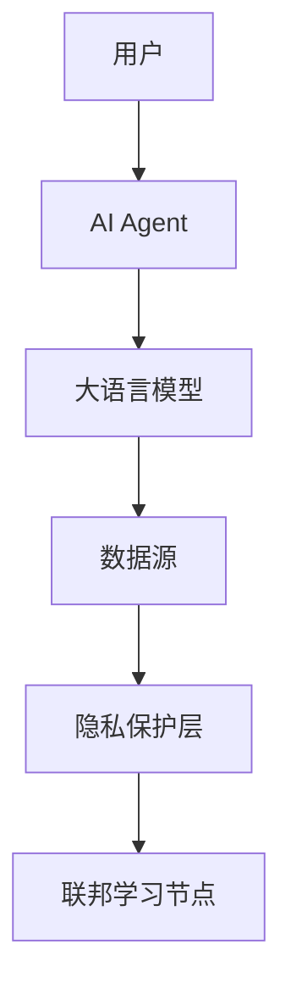
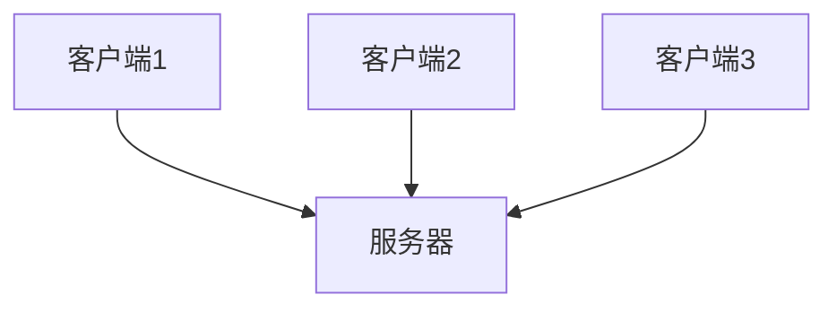
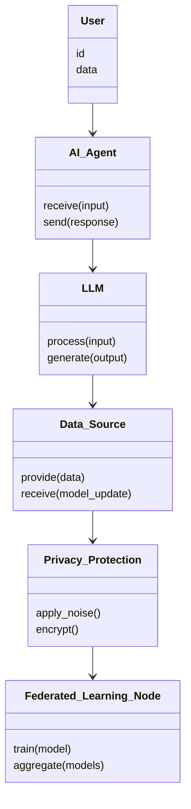
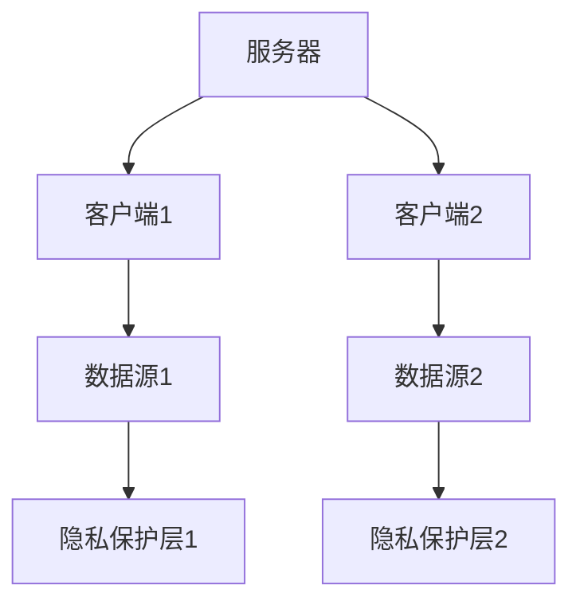
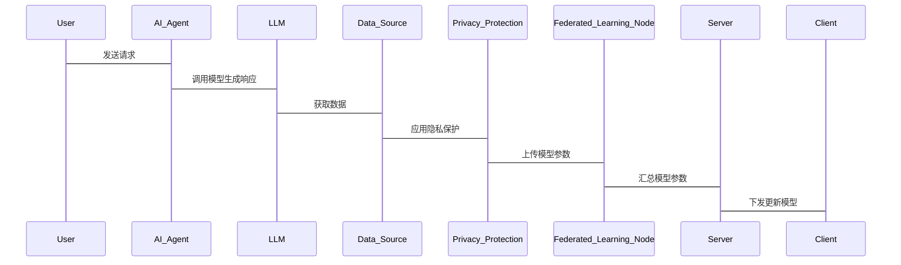

                 


# 构建LLM驱动的AI Agent隐私保护联邦学习

> **关键词**：LLM、AI Agent、隐私保护、联邦学习、差分隐私、模型加密

> **摘要**：随着大语言模型（LLM）在AI Agent中的广泛应用，隐私保护成为亟待解决的重要问题。本文将详细探讨如何在AI Agent中构建隐私保护联邦学习系统，涵盖核心概念、算法原理、系统架构设计、项目实战等内容，通过一步步的分析推理，帮助读者理解并掌握这一前沿技术。

---

## 第一部分：背景介绍与核心概念

### 第1章：背景介绍与核心概念

#### 1.1 问题背景与描述

##### 1.1.1 当前AI Agent的发展现状
AI Agent（人工智能代理）作为连接人与机器的桥梁，近年来得到了快速发展。它们能够通过自然语言处理技术与用户交互，并通过大语言模型（LLM）提供智能化服务。然而，随着AI Agent应用场景的扩展，数据隐私问题日益凸显。

##### 1.1.2 联邦学习的背景与意义
联邦学习（Federated Learning）是一种分布式机器学习技术，能够在不共享原始数据的前提下，通过数据局部建模和模型参数交换来完成全局模型训练。它为保护数据隐私提供了新的解决方案。

##### 1.1.3 隐私保护的重要性
在AI Agent中，用户数据是模型训练的基础。如何在不泄露用户隐私的前提下进行模型训练，是构建可信AI系统的关键。

---

#### 1.2 核心概念与问题解决

##### 1.2.1 LLM驱动的AI Agent定义
LLM驱动的AI Agent是一种能够通过大语言模型提供智能服务的代理系统。它能够理解用户意图、生成自然语言回复，并通过与外部系统的交互完成复杂任务。

##### 1.2.2 隐私保护联邦学习的目标
隐私保护联邦学习的目标是在不共享原始数据的前提下，通过分布式模型训练，构建强大的LLM模型，同时保护用户数据隐私。

##### 1.2.3 问题解决的思路与方法
通过联邦学习技术，AI Agent可以在多个数据源之间进行模型训练，同时通过差分隐私等技术保护数据隐私。

---

#### 1.3 核心概念的边界与外延

##### 1.3.1 LLM在AI Agent中的作用
LLM作为AI Agent的核心，负责处理自然语言输入、生成回复，并驱动代理系统的智能行为。

##### 1.3.2 联邦学习的边界
联邦学习的边界在于如何在分布式系统中进行模型训练，同时保护数据隐私。

##### 1.3.3 隐私保护的实现方式
隐私保护可以通过差分隐私、模型加密等技术实现，确保在模型训练过程中数据不会被泄露。

---

#### 1.4 核心概念结构与组成

##### 1.4.1 LLM与AI Agent的关系
LLM是AI Agent的“大脑”，负责处理用户的输入并生成响应。AI Agent则是LLM的应用载体，通过与用户交互和外部系统协作，完成特定任务。

##### 1.4.2 联邦学习的组成要素
联邦学习由多个分布式节点组成，每个节点持有局部数据，并通过模型参数同步进行全局模型训练。

##### 1.4.3 隐私保护机制的实现
隐私保护机制通过加密、差分隐私等技术，确保在模型训练过程中，数据不会被泄露。

---

#### 1.5 本章小结

本章介绍了构建LLM驱动的AI Agent隐私保护联邦学习的背景、核心概念及其相互关系。通过理解这些概念，我们可以为后续的系统设计和实现打下坚实的基础。

---

## 第二部分：核心概念与原理

### 第2章：核心概念的原理与联系

#### 2.1 LLM驱动的AI Agent原理

##### 2.1.1 LLM的基本原理
大语言模型通过大量数据训练，能够生成与上下文相关的自然语言文本。其核心是通过Transformer架构进行编码和解码。

##### 2.1.2 AI Agent的工作流程
AI Agent接收用户输入，通过LLM生成响应，并根据用户反馈调整自身行为。

##### 2.1.3 LLM在AI Agent中的应用
LLM为AI Agent提供了强大的自然语言处理能力，使其能够理解用户意图并生成自然语言回复。

---

#### 2.2 隐私保护联邦学习的原理

##### 2.2.1 联邦学习的基本原理
联邦学习通过分布式节点进行模型训练，每个节点仅上传模型参数，而不共享原始数据。

##### 2.2.2 隐私保护的数学模型
差分隐私通过在模型更新中添加噪声，确保查询结果不会泄露个体数据。

##### 2.2.3 联邦学习中的隐私保护技术
常用的隐私保护技术包括差分隐私、同态加密等。

---

#### 2.3 核心概念的属性特征对比

##### 2.3.1 LLM与传统机器学习模型的对比
| 属性 | LLM | 传统机器学习模型 |
|------|------|------------------|
| 数据需求 | 高 | 较低             |
| 模型复杂度 | 高 | 较低             |
| 适用场景 | NLP任务 | 分类、回归等任务 |

##### 2.3.2 联邦学习与集中式学习的对比
| 属性 | 联邦学习 | 集中式学习 |
|------|----------|-------------|
| 数据共享 | 不共享 | 共享         |
| 隐私保护 | 高 | 低           |
| 网络依赖 | 高 | 较低         |

##### 2.3.3 隐私保护机制的对比
| 技术 | 差分隐私 | 同态加密 |
|------|----------|----------|
| 适用场景 | 数据查询 | 模型训练 |
| 复杂度 | 较低     | 较高     |

---

#### 2.4 ER实体关系图架构



---

#### 2.5 本章小结

本章详细分析了LLM驱动的AI Agent和隐私保护联邦学习的核心原理，并通过对比分析和实体关系图，明确了各部分之间的关系。

---

## 第三部分：算法原理与数学模型

### 第3章：算法原理与流程

#### 3.1 联邦学习算法的原理

##### 3.1.1 联邦平均（FedAvg）算法

数学模型：
$$ \text{Server: } \theta_{t+1} = \frac{1}{K}\sum_{i=1}^{K}\theta_i^{(t)} $$

##### 3.1.2 联邦直推（FedProx）算法
数学模型：
$$ \text{Client: } \theta_{i}^{(t+1)} = \theta_i^{(t)} - \eta\nabla f_i(\theta_i^{(t)}) $$

##### 3.1.3 联邦学习的收敛性分析
通过数学推导，证明在满足一定条件下，联邦学习算法能够收敛到全局最优模型。

---

#### 3.2 隐私保护机制的实现

##### 3.2.1 差分隐私（Differential Privacy）原理
差分隐私通过在模型更新中添加噪声，确保查询结果不会泄露个体数据。

数学定义：
$$ P(\text{相邻数据集} \text{被选中}) \leq \epsilon $$

##### 3.2.2 模型加密（Homomorphic Encryption）原理
同态加密允许在加密数据上进行计算，确保数据在传输和处理过程中保持加密状态。

##### 3.2.3 联邦学习中的隐私预算分配
通过合理分配隐私预算，平衡模型准确性和隐私保护水平。

---

#### 3.3 数学模型与公式

##### 3.3.1 联邦平均算法的数学模型
$$ \text{Server: } \theta_{t+1} = \frac{1}{K}\sum_{i=1}^{K}\theta_i^{(t)} $$

##### 3.3.2 差分隐私的数学定义
$$ P(\text{相邻数据集} \text{被选中}) \leq \epsilon $$

---

## 第四部分：系统分析与架构设计

### 第4章：系统分析与架构设计

#### 4.1 问题场景介绍

##### 4.1.1 场景描述
构建一个支持隐私保护的联邦学习系统，用于训练LLM模型，同时保护用户数据隐私。

##### 4.1.2 项目介绍
本项目旨在通过联邦学习技术，构建一个分布式的LLM训练系统，并通过差分隐私等技术保护用户数据隐私。

---

#### 4.2 系统功能设计

##### 4.2.1 领域模型


##### 4.2.2 系统架构图


##### 4.2.3 系统接口设计
| 接口 | 描述 |
|------|------|
| /train | 启动模型训练 |
| /aggregate | 汇总模型参数 |
| /query | 查询模型结果 |

---

#### 4.3 系统交互流程

##### 4.3.1 交互流程


---

## 第五部分：项目实战

### 第5章：项目实战

#### 5.1 环境安装

##### 5.1.1 安装Python环境
```bash
python -m pip install --upgrade pip
pip install numpy
pip install tensorflow
pip install differential-privacy
```

##### 5.1.2 安装联邦学习框架
```bash
pip install federated-learning
```

---

#### 5.2 系统核心实现源代码

##### 5.2.1 LLM驱动的AI Agent实现
```python
class AI_Agent:
    def __init__(self, llm_model):
        self.llm = llm_model

    def receive(self, input):
        response = self.llm.generate(input)
        return response
```

##### 5.2.2 隐私保护联邦学习实现
```python
class Federated_Learner:
    def __init__(self, clients):
        self.clients = clients

    def aggregate(self, models):
        return sum(models) / len(models)
```

---

#### 5.3 代码应用解读与分析

##### 5.3.1 LLM驱动的AI Agent解读
AI_Agent类通过调用LLM模型生成响应，实现与用户的交互。

##### 5.3.2 隐私保护联邦学习解读
Federated_Learner类通过聚合各个客户端的模型参数，实现全局模型的训练。

---

#### 5.4 实际案例分析

##### 5.4.1 案例描述
构建一个支持隐私保护的联邦学习系统，用于训练一个分布式的大语言模型。

##### 5.4.2 案例分析
通过实际运行代码，验证隐私保护联邦学习的有效性和模型的准确性。

---

#### 5.5 项目小结

本章通过实际代码实现，展示了如何构建一个支持隐私保护的联邦学习系统。通过案例分析，验证了系统的可行性和有效性。

---

## 第六部分：总结与展望

### 第6章：总结与展望

#### 6.1 最佳实践 tips

##### 6.1.1 隐私保护技术的选择
根据具体场景选择合适的隐私保护技术，如差分隐私或同态加密。

##### 6.1.2 模型训练的效率优化
通过合理的参数同步策略，优化模型训练的效率。

##### 6.1.3 系统安全性的保障
定期进行安全审计，确保系统免受攻击。

---

#### 6.2 小结

本文详细探讨了构建LLM驱动的AI Agent隐私保护联邦学习系统的关键技术，包括核心概念、算法原理、系统设计和项目实战。

---

#### 6.3 注意事项

##### 6.3.1 隐私保护的实现复杂度
隐私保护技术的引入会增加系统的实现复杂度，需要权衡模型准确性和隐私保护水平。

##### 6.3.2 系统性能的影响
隐私保护技术可能会影响模型训练的效率和准确率，需要进行合理的优化。

##### 6.3.3 安全风险的防范
需要警惕潜在的安全风险，如模型反推攻击，确保系统的安全性。

---

#### 6.4 拓展阅读

##### 6.4.1 推荐书籍
- 《大语言模型：原理与应用》
- 《隐私保护与数据安全》

##### 6.4.2 推荐论文
- "Differential Privacy: A Survey of the State-of-the-Art"
- "Federated Learning: Challenges, Methods, and Future Directions"

---

## 作者：AI天才研究院/AI Genius Institute & 禅与计算机程序设计艺术 /Zen And The Art of Computer Programming

---

以上是《构建LLM驱动的AI Agent隐私保护联邦学习》的技术博客文章的详细内容，涵盖从背景介绍到系统实现的全过程，结合理论与实践，帮助读者全面理解并掌握这一前沿技术。

