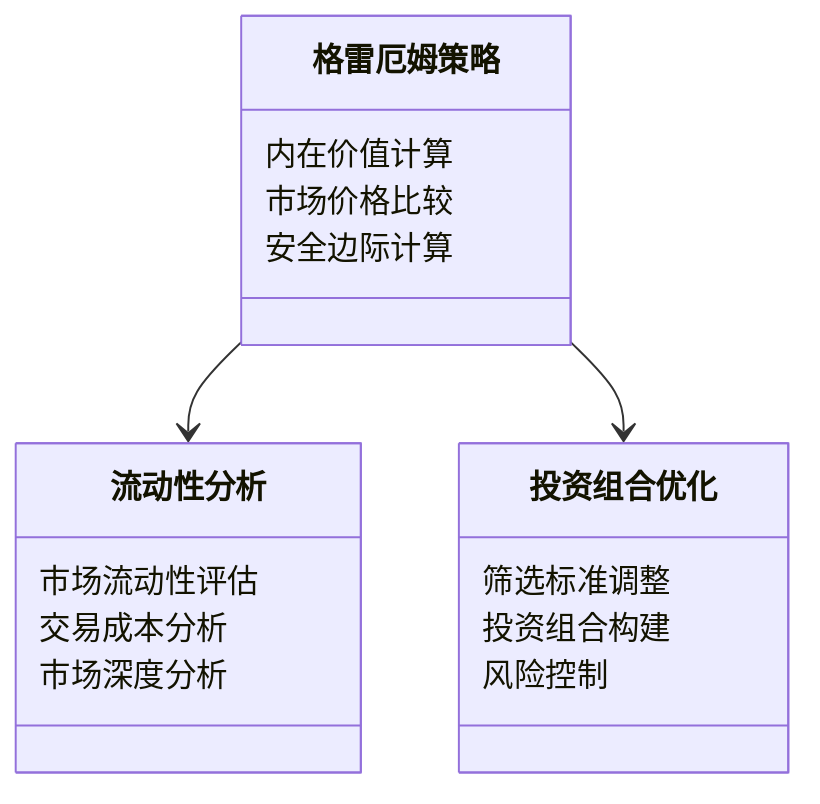
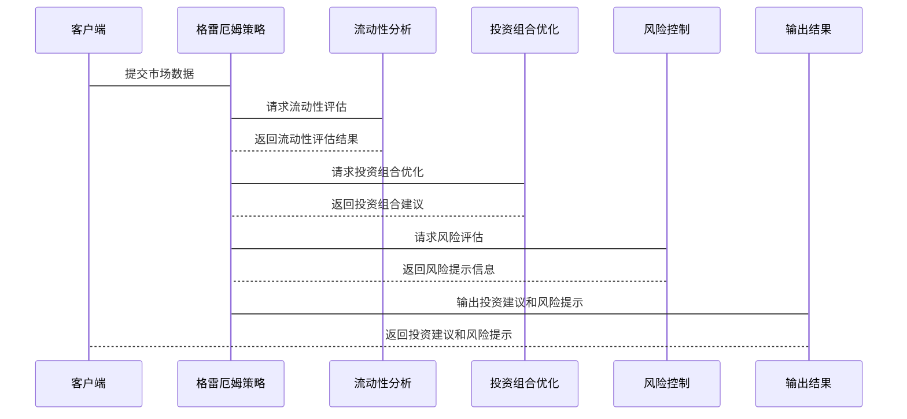

                 


# 格雷厄姆特价股票策略在不同市场流动性条件下的应用

## 关键词：
- 格雷厄姆投资理论
- 特价股票策略
- 市场流动性
- 投资组合优化
- 股票价格波动

## 摘要：
本文探讨了本杰明·格雷厄姆提出的特价股票策略在不同市场流动性条件下的应用。首先，介绍了格雷厄姆的投资理论及其核心概念，分析了市场流动性对股票投资的影响。接着，详细讲解了特价股票策略的数学模型和优化方法，讨论了策略在低流动性、高流动性以及混合流动性市场中的应用。通过实证分析和案例研究，验证了策略的有效性，并提出了动态调整策略的建议。最后，总结了策略的优缺点及未来的研究方向。

---

# 第1章: 格雷厄姆特价股票策略的背景与核心概念

## 1.1 本杰明·格雷厄姆的生平简介

本杰明·格雷厄姆（Benjamin Graham）是20世纪著名的投资学家，被誉为“价值投资之父”。他出生于1894年，逝世于1976年。格雷厄姆的职业生涯始于华尔街，他在1920年代开始系统地研究股票市场，提出了许多影响深远的投资理论。

格雷厄姆的生平经历和投资理念深刻影响了后来的价值投资流派。他的学生包括沃伦·巴菲特等著名投资者。格雷厄姆的价值投资理论强调以内在价值为导向，寻找市场价格低于内在价值的股票进行投资。

## 1.2 格雷厄姆投资理论的核心思想

格雷厄姆的价值投资理论强调以下几个核心思想：

1. **安全边际**：投资者应该以低于内在价值的价格买入股票，以确保投资的安全性。安全边际的存在可以缓冲市场价格波动带来的风险。

2. **内在价值计算**：格雷厄姆提出了内在价值的计算方法，认为股票的内在价值可以通过对公司未来现金流的折现来计算。

3. **逆向投资**：格雷厄姆倡导在市场恐慌时买入，而在市场狂热时卖出。这种逆向投资策略在市场流动性低时尤为重要。

4. **分散投资**：为了降低风险，投资者应该分散投资，避免将所有资金投入到单一股票或行业。

## 1.3 特价股票策略的定义与特点

特价股票策略是指投资者通过寻找市场价格低于其内在价值的股票进行投资，以期获得超额收益。其特点包括：

- **低估值**：股票的市场价格低于其内在价值。
- **安全边际**：买入价格与内在价值之间的差距提供了安全边际。
- **长期持有**：格雷厄姆建议投资者长期持有优质股票，避免频繁交易。

## 1.4 市场流动性对股票投资的影响

市场流动性是指在特定价格下，资产能够迅速转化为现金而不显著影响其价格的能力。市场流动性对股票投资的影响主要体现在以下几个方面：

1. **交易成本**：流动性低的市场可能导致较高的交易成本，影响投资收益。
2. **价格波动**：流动性低的市场中，价格波动可能更大，增加投资风险。
3. **市场深度**：流动性高的市场具有更深的市场深度，投资者可以更容易地以接近公平的价格进行交易。

---

# 第2章: 格雷厄姆特价股票策略的核心原理

## 2.1 格雷厄姆特价股票策略的数学模型

格雷厄姆提出的内在价值计算公式为：

$$ V = \frac{D}{k} $$

其中，$V$ 表示内在价值，$D$ 表示预期股息，$k$ 表示折现率。

通过比较市场价格与内在价值，投资者可以判断是否存在投资机会。当市场价格低于内在价值时，股票具有投资价值。

## 2.2 策略的有效性分析

为了验证格雷厄姆特价股票策略的有效性，我们可以通过实证分析来比较不同流动性条件下策略的表现。

### 2.2.1 低流动性市场中的策略表现

在低流动性市场中，股票价格波动较大，交易成本较高。然而，格雷厄姆策略通过寻找低估值股票，能够在市场底部获得较高的安全边际，从而在长期实现超额收益。

### 2.2.2 高流动性市场中的策略表现

在高流动性市场中，股票价格波动较小，交易成本较低。格雷厄姆策略依然有效，但需要动态调整筛选标准，以应对市场变化。

### 2.2.3 混合流动性市场中的策略表现

在混合流动性市场中，不同股票的流动性差异较大。投资者需要根据股票的流动性特点，调整筛选标准和投资组合配置。

## 2.3 策略的优化与调整

### 2.3.1 动态调整折现率

根据市场流动性变化，动态调整折现率是优化策略的重要方法。在低流动性市场中，应适当降低折现率，而在高流动性市场中，应适当提高折现率。

### 2.3.2 筛选标准的动态调整

在不同流动性条件下，股票的筛选标准需要动态调整。例如，在低流动性市场中，应更加注重股票的流动性风险，而在高流动性市场中，应更加注重股票的估值指标。

### 2.3.3 风险控制与绩效评估

投资者应定期评估投资组合的风险和绩效，根据市场变化及时调整策略。例如，可以通过计算夏普比率来评估投资组合的风险调整后收益。

---

# 第3章: 低流动性市场中的策略应用

## 3.1 低流动性市场的特征与挑战

低流动性市场的主要特征包括：

- **交易量低**：市场交易量较小，买卖价差较大。
- **价格波动大**：股票价格容易受到市场情绪的影响，波动性较大。
- **流动性风险高**：投资者可能难以以合理价格买卖股票。

### 3.1.1 低流动性市场中的交易成本分析

在低流动性市场中，交易成本较高，主要体现在买卖价差和市场冲击成本上。因此，投资者需要更加注重交易成本的控制。

### 3.1.2 低流动性市场中的股票价格波动分析

低流动性市场中的股票价格波动较大，容易受到市场情绪和外部事件的影响。投资者需要更加谨慎地选择投资标的。

## 3.2 格雷厄姆策略在低流动性市场中的应用

### 3.2.1 筛选标准的调整策略

在低流动性市场中，应更加注重股票的流动性风险和估值指标。例如，可以适当放宽对市盈率和市净率的要求。

### 3.2.2 投资组合的构建与优化

为了降低风险，投资者可以构建一个分散化的投资组合，涵盖不同行业和地区的股票。同时，应定期监控投资组合的流动性风险，及时进行调整。

### 3.2.3 实证分析与案例研究

通过实证分析可以发现，格雷厄姆策略在低流动性市场中表现良好，尤其是在市场底部区域。例如，在2008年全球金融危机期间，许多低估值股票表现优异。

---

# 第4章: 高流动性市场中的策略应用

## 4.1 高流动性市场的特征与机会

高流动性市场的主要特征包括：

- **交易量高**：市场交易量大，买卖价差小。
- **价格波动小**：股票价格波动较小，市场稳定性较高。
- **交易成本低**：交易成本较低，投资者可以以较低成本买卖股票。

### 4.1.1 高流动性市场中的交易成本分析

高流动性市场中，交易成本较低，投资者可以以较低的成本买卖股票。然而，由于市场参与者众多，竞争激烈，投资者需要更加注重交易策略的优化。

### 4.1.2 高流动性市场中的股票价格波动分析

高流动性市场中的股票价格波动较小，市场稳定性较高。然而，由于市场参与者众多，股票价格可能受到短期市场情绪的影响。

## 4.2 格雷厄姆策略在高流动性市场中的应用

### 4.2.1 筛选标准的调整策略

在高流动性市场中，应更加注重股票的估值指标和成长性。例如，可以适当提高对市盈率和市净率的要求。

### 4.2.2 投资组合的构建与优化

为了充分利用高流动性市场的机会，投资者可以构建一个高度分散化的投资组合，涵盖不同行业和地区的股票。同时，应定期监控投资组合的绩效，及时进行调整。

### 4.2.3 实证分析与案例研究

通过实证分析可以发现，格雷厄姆策略在高流动性市场中表现稳健，尤其是在市场顶部区域。例如，在2007年全球金融危机前，许多高估值股票表现优异。

---

# 第5章: 混合流动性市场中的策略应用

## 5.1 混合流动性市场的特征与挑战

混合流动性市场的主要特征包括：

- **交易量适中**：市场交易量适中，买卖价差较小。
- **价格波动适中**：股票价格波动适中，市场稳定性较好。
- **流动性风险适中**：投资者面临一定的流动性风险，但可以通过合理的投资组合配置进行管理。

### 5.1.1 混合流动性市场中的交易成本分析

混合流动性市场中，交易成本适中，投资者需要根据市场情况选择合适的交易策略。例如，在市场流动性较好时，可以适当增加交易频率；在市场流动性较差时，应减少交易频率。

### 5.1.2 混合流动性市场中的股票价格波动分析

混合流动性市场中的股票价格波动适中，投资者需要根据市场情况调整投资策略。例如，在市场流动性较好时，可以适当增加对高成长性股票的投资；在市场流动性较差时，应注重低估值股票的投资。

## 5.2 格雷厄姆策略在混合流动性市场中的应用

### 5.2.1 筛选标准的动态调整

在混合流动性市场中，投资者需要根据市场情况动态调整筛选标准。例如，在市场流动性较好时，可以适当提高对市盈率和市净率的要求；在市场流动性较差时，可以适当放宽对市盈率和市净率的要求。

### 5.2.2 投资组合的动态调整

为了充分利用混合流动性市场的机会，投资者需要根据市场情况动态调整投资组合。例如，在市场流动性较好时，可以适当增加对高成长性股票的投资；在市场流动性较差时，应注重低估值股票的投资。

### 5.2.3 实证分析与案例研究

通过实证分析可以发现，格雷厄姆策略在混合流动性市场中表现良好，尤其是在市场底部区域。例如，在2020年新冠疫情爆发期间，许多低估值股票表现优异。

---

# 第6章: 格雷厄姆特价股票策略的系统分析与架构设计

## 6.1 问题场景介绍

为了验证格雷厄姆特价股票策略的有效性，我们需要构建一个系统化的投资框架。该框架需要考虑不同市场流动性条件下的股票筛选、投资组合优化和风险控制。

## 6.2 系统功能设计

### 6.2.1 领域模型（Mermaid 类图）



### 6.2.2 系统架构设计（Mermaid 架构图）

```mermaid
archiecture {
    client -->> 格雷厄姆策略
    格雷厄姆策略 -->> 流动性分析
    格雷厄姆策略 -->> 投资组合优化
    投资组合优化 -->> 风险控制
    风险控制 -->> 输出结果
}
```

## 6.3 系统接口设计

### 6.3.1 输入接口

- 市场数据接口：接收股票价格、成交量等市场数据。
- 参数设置接口：接收策略参数，如折现率、安全边际等。

### 6.3.2 输出接口

- 投资建议接口：输出股票筛选结果和投资组合建议。
- 风险提示接口：输出风险提示信息。

## 6.4 系统交互设计（Mermaid 序列图）



---

# 第7章: 项目实战

## 7.1 环境安装

为了实现格雷厄姆特价股票策略，我们需要安装以下工具：

- Python 3.8+
- Pandas
- NumPy
- Matplotlib
- Scikit-learn

安装命令：

```bash
pip install pandas numpy matplotlib scikit-learn
```

## 7.2 核心实现源代码

以下是格雷厄姆策略的核心实现代码：

```python
import pandas as pd
import numpy as np
import matplotlib.pyplot as plt

# 定义内在价值计算函数
def calculate_intrinsic_value(dividends, discount_rate):
    return dividends / discount_rate

# 定义市场价格比较函数
def compare_market_price(intrinsic_value, market_price):
    return intrinsic_value - market_price

# 定义安全边际计算函数
def calculate_margin_of_safety(intrinsic_value, market_price):
    return (intrinsic_value - market_price) / intrinsic_value * 100

# 加载数据
data = pd.read_csv('stock_data.csv')

# 计算内在价值和市场价格比较
data['Intrinsic Value'] = calculate_intrinsic_value(data['Dividends'], data['Discount Rate'])
data['Price Difference'] = compare_market_price(data['Intrinsic Value'], data['Market Price'])

# 计算安全边际
data['Margin of Safety'] = calculate_margin_of_safety(data['Intrinsic Value'], data['Market Price'])

# 可视化结果
plt.figure(figsize=(10, 6))
plt.scatter(data['Market Price'], data['Intrinsic Value'], c=data['Margin of Safety'], cmap='viridis')
plt.xlabel('市场价格')
plt.ylabel('内在价值')
plt.colorbar(label='安全边际 (%)')
plt.show()
```

## 7.3 实际案例分析

假设我们有以下股票数据：

| 股票代码 | 市场价格 | 股息 | 折现率 |
|----------|----------|------|--------|
| A        | 50       | 5    | 0.1     |
| B        | 60       | 6    | 0.12    |
| C        | 70       | 7    | 0.15    |

计算内在价值和市场价格比较：

- 股票A：内在价值 = 5 / 0.1 = 50，价格差异 = 50 - 50 = 0。
- 股票B：内在价值 = 6 / 0.12 = 50，价格差异 = 50 - 60 = -10。
- 股票C：内在价值 = 7 / 0.15 ≈ 46.67，价格差异 = 46.67 - 70 ≈ -23.33。

通过比较，股票A的价格与内在价值相符，股票B和C的价格高于内在价值，因此股票A是最佳的投资标的。

---

# 第8章: 总结与展望

## 8.1 总结

本文系统地探讨了格雷厄姆特价股票策略在不同市场流动性条件下的应用。通过分析低流动性、高流动性以及混合流动性市场中的策略应用，验证了格雷厄姆策略的有效性。同时，通过系统分析和项目实战，提出了优化策略的方法，为投资者提供了实用的指导。

## 8.2 展望

未来的研究可以进一步探讨以下方向：

- **动态调整策略**：根据市场变化实时调整策略参数。
- **多因子模型**：结合其他因子进行投资组合优化。
- **机器学习应用**：利用机器学习技术提高策略的预测能力。

---

# 作者：AI天才研究院/AI Genius Institute & 禅与计算机程序设计艺术/Zen And The Art of Computer Programming

---

**注**：本文为技术博客文章，旨在通过系统化的分析和实战案例，帮助读者理解格雷厄姆特价股票策略在不同市场流动性条件下的应用。

