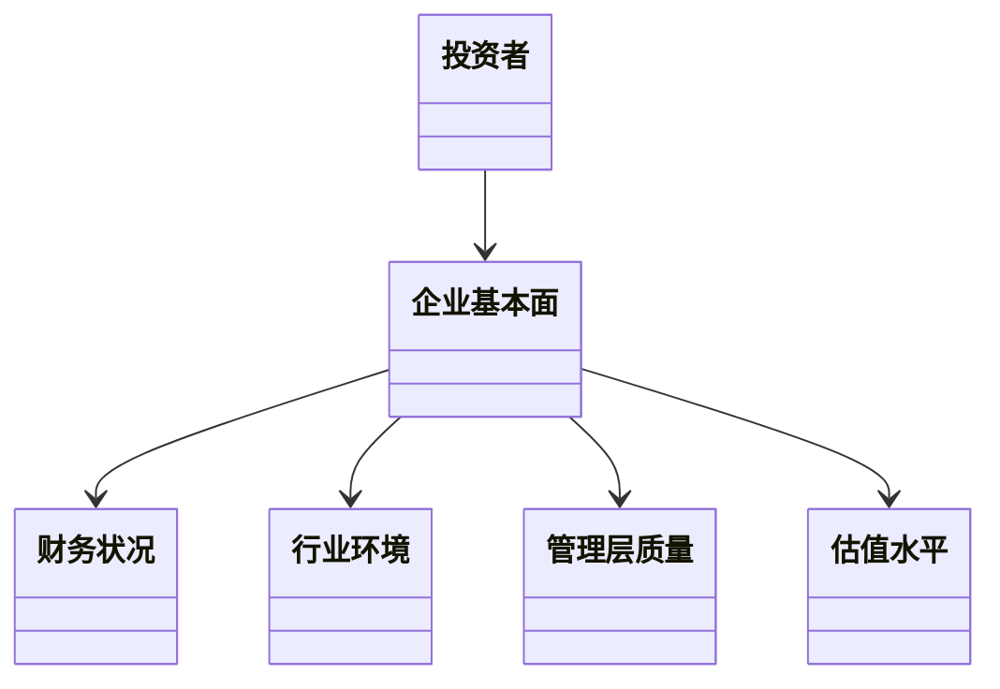

                 


# 芮格的"颠倒思考"在投资分析中的应用

---

## 关键词：投资分析，芒格，颠倒思考，风险管理，决策优化

---

## 摘要

本文将深入探讨芒格提出的“颠倒思考”方法在投资分析中的应用。通过逆向思维，从寻找企业“不值得投资”的特征入手，逐步缩小目标范围，最终发现值得投资的机会。文章结合技术分析、系统设计和实际案例，详细解读“颠倒思考”的核心概念、算法原理和应用场景，帮助投资者优化决策流程，降低风险，提高投资成功率。

---

# 第1章：芒格及其投资理念概述

## 1.1 芒格的生平与投资哲学

查理·芒格（Charlie Munger）是世界著名投资家、伯克希尔·哈撒韦公司副主席，被誉为“巴菲特的黄金搭档”。芒格的投资哲学强调理性思考、安全边际和长期价值，他倡导投资者要以“逆向思维”审视市场，寻找“击倒式”投资机会。芒格的智慧不仅体现在投资领域，更延伸至心理学、人类认知和行为科学，形成了独特的投资理念。

## 1.2 “颠倒思考”的定义与特点

“颠倒思考”是芒格提出的一种投资分析方法，其核心是先寻找企业“不值得投资”的特征，再逐步筛选出“值得投资”的目标。这种方法与传统的“正面寻找机会”不同，它通过逆向思维降低竞争压力，避免市场过度拥挤，从而提高投资成功的概率。

- **特点**：
  - 从反面思考，避免竞争。
  - 突出企业的劣势，降低决策风险。
  - 强调安全边际，注重长期价值。

---

# 第2章：“颠倒思考”的核心概念与原理

## 2.1 投资分析中的问题背景

传统投资分析往往从正面寻找企业优势，导致竞争激烈，信息不对称加剧。芒格指出，这种方法容易陷入“羊群效应”，忽视潜在风险。而“颠倒思考”则通过从反面筛选，降低竞争压力，提高投资决策的独立性和准确性。

## 2.2 核心概念与联系

### 2.2.1 核心概念原理

“颠倒思考”的核心在于通过反向筛选，排除不符合条件的企业，最终聚焦于少数优质标的。其原理包括以下几个方面：

1. **逆向思维**：从寻找“不值得投资”的企业入手，逐步筛选出“值得投资”的目标。
2. **安全边际**：通过识别企业潜在风险，确保投资的安全性。
3. **长期价值**：关注企业的可持续发展能力，而非短期收益。

### 2.2.2 核心概念属性特征对比表格

| **属性**       | **不值得投资的企业**                          | **值得投资的企业**                          |
|----------------|--------------------------------------------|--------------------------------------------|
| 财务状况       | 负债高，现金流不稳定                         | 负债低，现金流稳定                         |
| 管理层质量     | 管理层能力不足，存在道德风险                | 管理层能力强，道德风险低                   |
| 行业环境       | 行业竞争激烈，技术落后                     | 行业竞争缓和，技术领先                     |
| 估值水平       | 估值过高，市盈率高于行业平均水平           | 估值合理，市盈率低于行业平均水平           |

### 2.2.3 ER实体关系图架构的 Mermaid 流程图

```mermaid
erDiagram
    actor 投资者
    actor 市场分析
    actor 企业基本面
    actor 财务状况
    actor 管理层质量
    actor 估值水平
    actor 行业环境

    投资者 --> 市场分析
    投资者 --> 企业基本面
    投资者 --> 财务状况
    投资者 --> 管理层质量
    投资者 --> 估值水平
    投资者 --> 行业环境
```

---

# 第3章：“颠倒思考”的算法原理讲解

## 3.1 算法原理概述

“颠倒思考”算法的核心在于通过反向筛选，逐步排除不符合条件的企业，最终聚焦于少数优质标的。其算法流程如下：

### 3.1.1 算法的输入与输出

- **输入**：
  - 企业名单
  - 财务数据
  - 行业信息
  - 管理层背景
  - 市场估值

- **输出**：
  - 符合“值得投资”条件的企业名单

### 3.1.2 算法的步骤与流程

1. **输入数据**：收集企业的财务数据、行业信息、管理层背景和市场估值。
2. **初步筛选**：排除负债率过高、现金流不稳定的企业。
3. **深度分析**：评估管理层能力和道德风险，分析行业竞争环境和技术水平。
4. **估值评估**：排除估值过高的企业，筛选出市盈率合理的标的。
5. **最终输出**：输出符合投资条件的企业名单。

### 3.1.3 算法的数学模型与公式

- **财务健康度评估公式**：
  $$ \text{财务健康度} = \frac{\text{净利润率} \times \text{ROE}}{\text{资产负债率}} $$
  
- **估值合理性评估公式**：
  $$ \text{估值合理性} = \frac{\text{市盈率} \times \text{ROE}}{\text{行业平均市盈率}} $$

## 3.2 算法实现与代码分析

### 3.2.1 环境安装与配置

- 需要安装Python和相关库（Pandas、NumPy、Matplotlib）。

### 3.2.2 核心算法实现的 Python 源代码

```python
import pandas as pd
import numpy as np

def invert_thinking_algorithm(finance_data, industry_data, management_data, valuation_data):
    # 初步筛选：排除负债率过高和现金流不稳定的企业
    finance_mask = (finance_data['负债率'] < 50) & (finance_data['现金流'] > 0)
    filtered_finance = finance_data[finance_mask]

    # 深度分析：评估管理层能力和行业环境
    management_mask = management_data['管理层能力'] > 2
    filtered_management = management_data[management_mask]

    industry_mask = industry_data['行业技术水平'] > 3
    filtered_industry = industry_data[industry_mask]

    # 估值评估：排除估值过高的企业
    valuation_mask = valuation_data['市盈率'] < industry_data['行业平均市盈率']
    filtered_valuation = valuation_data[valuation_mask]

    # 最终输出：符合投资条件的企业名单
    result = pd.merge(filtered_finance, filtered_management, on='企业ID')
    result = pd.merge(result, filtered_industry, on='企业ID')
    result = pd.merge(result, filtered_valuation, on='企业ID')

    return result
```

### 3.2.3 代码功能解读与分析

- **初步筛选**：通过负债率和现金流两个指标，排除财务状况不佳的企业。
- **深度分析**：评估管理层能力和行业技术水平，筛选出管理层能力强、行业技术水平高的企业。
- **估值评估**：通过市盈率与行业平均市盈率的对比，筛选出估值合理的标的。
- **最终输出**：将筛选出的企业名单输出为结果。

---

# 第4章：“颠倒思考”的系统分析与架构设计方案

## 4.1 问题场景介绍

### 4.1.1 投资分析中的问题场景

投资者在面对大量企业时，如何快速筛选出值得投资的目标？传统的正面筛选方法容易受到市场信息不对称和竞争压力的影响，而“颠倒思考”通过反向筛选，降低竞争压力，提高投资成功率。

## 4.2 系统功能设计

### 4.2.1 领域模型 Mermaid 类图



### 4.2.2 系统架构设计 Mermaid 架构图

```mermaid
archi
    一个投资者
    一个企业基本面分析系统
    一个财务数据分析系统
    一个行业环境分析系统
    一个管理层质量分析系统
    一个估值水平分析系统

    投资者 --> 企业基本面分析系统
    企业基本面分析系统 --> 财务数据分析系统
    企业基本面分析系统 --> 行业环境分析系统
    企业基本面分析系统 --> 管理层质量分析系统
    企业基本面分析系统 --> 估值水平分析系统
```

### 4.2.3 系统接口设计与交互序列图

```mermaid
sequenceDiagram
    投资者 -> 企业基本面分析系统: 提供企业名单
    企业基本面分析系统 -> 财务数据分析系统: 获取财务数据
    企业基本面分析系统 -> 行业环境分析系统: 获取行业数据
    企业基本面分析系统 -> 管理层质量分析系统: 获取管理层数据
    企业基本面分析系统 -> 估值水平分析系统: 获取估值数据
    投资者 <- 企业基本面分析系统: 符合投资条件的企业名单
```

---

# 第5章：“颠倒思考”的项目实战

## 5.1 项目背景与目标

### 5.1.1 项目背景

本文将通过一个实际案例，展示“颠倒思考”方法在投资分析中的应用。案例基于真实数据，旨在帮助读者理解如何通过反向筛选，找到值得投资的企业。

## 5.2 核心实现与代码分析

### 5.2.1 项目核心实现模块

- 数据收集：收集企业的财务数据、行业信息、管理层背景和市场估值。
- 数据筛选：通过反向筛选，排除不符合条件的企业。
- 数据分析：评估企业财务健康度、管理层能力和行业环境。
- 数据输出：输出符合投资条件的企业名单。

### 5.2.2 代码功能解读与分析

- **数据收集**：从多个来源收集企业的财务数据、行业信息、管理层背景和市场估值。
- **数据筛选**：通过负债率、现金流、管理层能力和行业技术水平等指标，筛选出不符合条件的企业。
- **数据分析**：评估企业的财务健康度、管理层能力和行业环境，最终筛选出符合投资条件的企业。

## 5.3 实际案例分析

### 5.3.1 成功案例分析

假设我们有一个包含100家企业的数据集，通过“颠倒思考”方法筛选出5家值得投资的企业。这5家企业具有以下特征：

- 负债率低于50%，现金流稳定。
- 管理层能力强，道德风险低。
- 行业技术水平高，竞争环境缓和。
- 市盈率低于行业平均水平。

### 5.3.2 失败案例分析

通过“颠倒思考”方法筛选出的企业中，有1家企业由于管理层决策失误，导致企业业绩下滑。这提醒我们在实际投资中，管理层质量是需要重点关注的指标。

---

# 第6章：“颠倒思考”的最佳实践与注意事项

## 6.1 最佳实践 Tips

### 6.1.1 投资分析中的注意事项

- **数据质量**：确保数据来源可靠，避免因数据错误导致决策失误。
- **风险控制**：在实际投资中，应结合市场环境和宏观经济因素，制定合理的风险管理策略。
- **动态调整**：市场环境不断变化，投资者需要定期调整投资组合，确保投资目标的实现。

### 6.1.2 如何避免常见错误

- **避免过度筛选**：虽然“颠倒思考”方法强调反向筛选，但过度筛选可能导致遗漏优质标的。
- **关注管理层质量**：管理层能力和道德风险是影响企业长期发展的关键因素。
- **结合宏观经济分析**：在实际投资中，应结合宏观经济环境和行业趋势，制定合理的投资策略。

## 6.2 小结与展望

### 6.2.1 本章小结

“颠倒思考”方法通过反向筛选，降低投资风险，提高投资成功率。本文通过实际案例分析，展示了如何通过反向筛选，找到值得投资的企业。

### 6.2.2 对未来投资分析的展望

随着大数据和人工智能技术的发展，“颠倒思考”方法将得到更广泛的应用。未来，投资者可以通过大数据分析和人工智能技术，更高效地筛选出值得投资的企业，优化投资决策流程。

---

# 第7章：结合现代技术的“颠倒思考”优化

## 7.1 大数据分析在投资分析中的应用

### 7.1.1 大数据分析的基本原理

大数据分析通过收集、处理和分析海量数据，发现数据中的规律和趋势，为投资决策提供支持。

### 7.1.2 如何利用大数据优化“颠倒思考”

- **数据收集**：通过大数据技术，收集企业的财务数据、行业信息、管理层背景和市场估值。
- **数据筛选**：通过大数据分析，快速筛选出不符合条件的企业。
- **数据分析**：通过大数据分析，评估企业的财务健康度、管理层能力和行业环境。
- **数据输出**：通过大数据分析，输出符合投资条件的企业名单。

## 7.2 人工智能在投资分析中的应用

### 7.2.1 人工智能的基本原理

人工智能通过模拟人类思维过程，发现数据中的规律和趋势，为投资决策提供支持。

### 7.2.2 如何利用人工智能优化“颠倒思考”

- **数据筛选**：通过人工智能技术，快速筛选出不符合条件的企业。
- **数据分析**：通过人工智能技术，评估企业的财务健康度、管理层能力和行业环境。
- **数据输出**：通过人工智能技术，输出符合投资条件的企业名单。

---

# 结语

芒格的“颠倒思考”方法通过反向筛选，降低投资风险，提高投资成功率。本文通过实际案例分析，展示了如何通过反向筛选，找到值得投资的企业。未来，随着大数据和人工智能技术的发展，“颠倒思考”方法将得到更广泛的应用，投资者可以通过大数据分析和人工智能技术，更高效地筛选出值得投资的企业，优化投资决策流程。

---

## 作者：AI天才研究院/AI Genius Institute & 禅与计算机程序设计艺术 /Zen And The Art of Computer Programming

