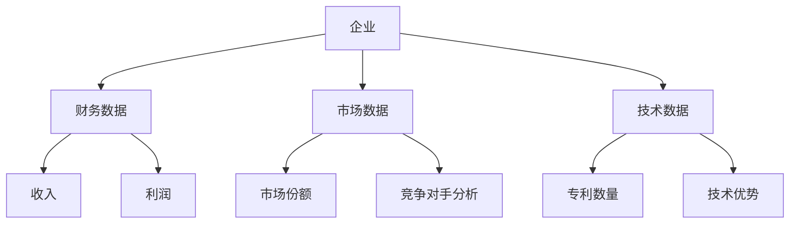
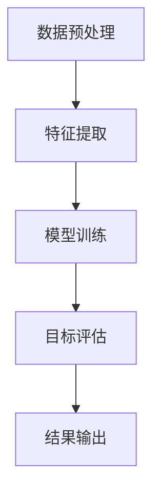
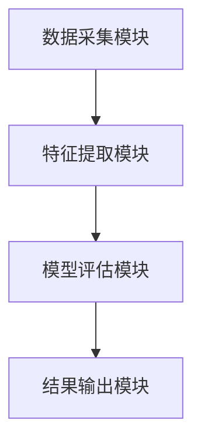

                 


# 设计智能化的企业并购目标筛选模型

> 关键词：企业并购、目标筛选、智能化模型、人工智能、机器学习

> 摘要：随着企业并购活动的日益频繁和复杂化，传统的筛选方法已难以满足高效性和准确性需求。本文提出了一种基于人工智能和大数据分析的智能化企业并购目标筛选模型，旨在通过数据驱动的方法，帮助企业更精准地识别潜在并购目标，优化决策过程。本文详细探讨了模型的设计原理、算法实现、系统架构以及实际应用案例，为企业的并购决策提供了新的思路和工具。

---

# 第1章: 企业并购目标筛选模型的背景介绍

## 1.1 问题背景与描述

### 1.1.1 传统企业并购的痛点
企业并购是企业扩展和优化业务的重要手段，但传统的目标筛选过程存在以下痛点：
- **信息不全**：依赖人工调研，数据收集范围有限，难以覆盖潜在目标的全貌。
- **效率低下**：传统方法耗时长，且难以快速响应市场变化。
- **主观性较强**：筛选结果受人为因素影响较大，缺乏客观性和系统性。

### 1.1.2 智能化筛选的必要性
随着大数据和人工智能技术的发展，智能化筛选成为可能：
- **数据驱动**：通过整合多源数据，构建全面的企业画像。
- **自动化与智能化**：利用AI算法快速筛选和评估潜在目标。
- **精准性提升**：通过模型优化，提高目标筛选的准确性和效率。

### 1.1.3 当前市场环境的变化
当前市场环境的复杂化和竞争加剧，要求企业并购目标筛选更加精准和高效：
- **行业动态**：行业整合加速，潜在目标不断变化。
- **数据可用性**：企业公开数据和非结构化数据的丰富性，为模型提供了更多可能性。
- **技术进步**：AI和大数据技术的成熟为智能化筛选提供了技术基础。

## 1.2 问题解决与边界

### 1.2.1 现有解决方案的局限性
现有企业并购目标筛选方法主要依赖于人工调研和经验判断，存在以下局限性：
- **主观性强**：缺乏统一的标准和客观评估。
- **效率低**：手动筛选耗时长，难以应对大量潜在目标。
- **覆盖范围有限**：难以全面覆盖潜在目标的多维度信息。

### 1.2.2 智能化模型的核心目标
智能化企业并购目标筛选模型的核心目标包括：
- **自动化筛选**：通过AI算法自动识别和评估潜在并购目标。
- **多维度评估**：基于财务、市场、技术等多维度数据，全面评估目标企业。
- **精准匹配**：根据企业战略需求，精准匹配潜在目标。

### 1.2.3 模型的适用边界与外延
该模型适用于以下场景：
- **企业并购前的初步筛选**：帮助企业快速锁定潜在目标。
- **目标企业评估**：对候选企业进行深入分析和评估。
- **行业趋势分析**：通过模型分析行业趋势，发现新兴潜在目标。

## 1.3 概念结构与核心要素

### 1.3.1 模型的核心概念
智能化企业并购目标筛选模型由以下几个核心概念组成：
- **数据源**：包括企业财务数据、市场数据、技术数据等。
- **特征提取**：通过算法从数据中提取关键特征。
- **评估模型**：基于特征进行企业评分和排名。
- **结果输出**：生成目标企业清单和评估报告。

### 1.3.2 关键要素的定义与特征
- **数据源**：企业并购涉及多方面的数据，包括财务数据（如收入、利润）、市场数据（如市场份额）、技术数据（如专利数量）等。
- **特征提取**：从数据源中提取关键特征，例如企业的成长性、竞争力、风险等。
- **评估模型**：基于特征的加权评分，评估目标企业的潜在价值。
- **结果输出**：生成目标企业清单，并提供详细的企业分析报告。

### 1.3.3 概念结构图（ER图）



---

# 第2章: 智能化筛选模型的核心概念与联系

## 2.1 核心概念原理

### 2.1.1 数据驱动的筛选机制
智能化筛选模型基于数据驱动的方法，通过整合多源数据，构建目标企业的全面画像。数据来源包括：
- **公开数据**：如企业年报、新闻报道。
- **行业数据**：如行业报告、市场分析。
- **内部数据**：如企业战略目标、并购历史数据。

### 2.1.2 AI算法的特征提取
通过机器学习算法从数据中提取关键特征，例如：
- **财务特征**：如ROE（净资产收益率）、毛利率。
- **市场特征**：如市场份额、品牌影响力。
- **技术特征**：如专利数量、技术领域分布。

### 2.1.3 多维度评估体系
模型基于多维度对企业进行评估，包括：
- **财务维度**：评估企业的盈利能力和财务健康状况。
- **市场维度**：评估企业的市场地位和竞争优势。
- **技术维度**：评估企业的技术实力和创新潜力。

## 2.2 概念属性对比表

| **属性**       | **目标企业**               | **竞争对手**             | **行业基准**             |
|----------------|----------------------------|--------------------------|--------------------------|
| 财务状况       | 净利润、收入增长率         | 净利润、收入增长率         | 行业平均净利润、平均收入增长率 |
| 市场地位       | 市场份额、品牌影响力         | 市场份额、品牌影响力         | 行业平均市场份额           |
| 技术实力       | 专利数量、技术领域分布     | 专利数量、技术领域分布     | 行业平均专利数量           |
| 管理团队       | 团队经验、管理能力           | 团队经验、管理能力           | 行业平均团队经验           |

## 2.3 ER实体关系图


---

# 第3章: 智能化筛选模型的算法原理

## 3.1 算法原理概述

### 3.1.1 基于机器学习的特征提取
特征提取是模型的核心步骤之一，通过机器学习算法从原始数据中提取有意义的特征。常用的算法包括：
- **主成分分析（PCA）**：用于降维，提取数据的主要特征。
- **线性回归**：用于预测目标企业的价值。
- **决策树**：用于分类和特征选择。

### 3.1.2 基于深度学习的目标评估
目标评估是模型的关键步骤，通过深度学习算法对企业进行全面评估。常用的算法包括：
- **神经网络**：用于非线性特征提取。
- **卷积神经网络（CNN）**：用于处理图像数据（如企业Logo、产品图片）。
- **循环神经网络（RNN）**：用于处理时间序列数据（如企业历史财务数据）。

### 3.1.3 算法的数学模型

#### 3.1.3.1 线性回归模型
线性回归模型用于预测目标企业的价值：
$$ y = \beta_0 + \beta_1x_1 + \beta_2x_2 + \ldots + \beta_nx_n + \epsilon $$

#### 3.1.3.2 神经网络模型
神经网络模型用于非线性特征提取和目标评估：
$$ a^{(l+1)} = g(a^{(l)}W^{(l)} + b^{(l)}) $$
其中，$g$ 是激活函数，$W$ 是权重矩阵，$b$ 是偏置向量。

## 3.2 算法流程图



## 3.3 核心算法代码实现

### 3.3.1 数据预处理代码

```python
import pandas as pd
import numpy as np

# 加载数据
data = pd.read_csv('enterprise_data.csv')

# 去除缺失值
data = data.dropna()

# 标准化处理
from sklearn.preprocessing import StandardScaler
scaler = StandardScaler()
data_scaled = scaler.fit_transform(data)
```

### 3.3.2 特征提取代码

```python
from sklearn.decomposition import PCA

# PCA特征提取
pca = PCA(n_components=5)
principal_components = pca.fit_transform(data_scaled)
```

### 3.3.3 模型训练代码

```python
from sklearn.neuralnetwork import MLPClassifier

# 神经网络模型训练
model = MLPClassifier(hidden_layer_sizes=(100, 50), max_iter=1000)
model.fit(principal_components, labels)
```

---

# 第4章: 智能化筛选模型的系统分析与架构设计

## 4.1 问题场景介绍

### 4.1.1 企业并购的典型场景
企业并购的典型场景包括：
- **战略并购**：为了扩展业务或进入新市场。
- **协同并购**：为了实现协同效应，降低成本。

### 4.1.2 目标筛选的关键环节
目标筛选的关键环节包括：
- **数据收集**：收集目标企业的多源数据。
- **特征提取**：提取关键特征。
- **模型评估**：评估目标企业的潜力。

## 4.2 系统功能设计

### 4.2.1 数据采集模块
数据采集模块负责收集目标企业的多源数据，包括：
- **财务数据**：如收入、利润、资产负债表。
- **市场数据**：如市场份额、竞争对手分析。
- **技术数据**：如专利数量、技术领域分布。

### 4.2.2 特征提取模块
特征提取模块通过机器学习算法从原始数据中提取关键特征，如：
- **主成分分析（PCA）**：用于降维。
- **决策树**：用于特征选择。

### 4.2.3 模型评估模块
模型评估模块负责评估目标企业的潜力，包括：
- **神经网络模型**：用于目标评估。
- **评估报告生成**：生成目标企业的评估报告。

## 4.3 系统架构设计

### 4.3.1 分层架构图



### 4.3.2 模块交互图


---

# 第5章: 项目实战与案例分析

## 5.1 环境安装与配置

### 5.1.1 开发环境搭建
- **操作系统**：Windows 10 或 macOS 10.15+
- **Python版本**：Python 3.8+
- **开发工具**：Jupyter Notebook 或 VS Code

### 5.1.2 数据库安装
- **关系型数据库**：MySQL 或 PostgreSQL
- **非关系型数据库**：MongoDB

### 5.1.3 工具链配置
- **数据处理工具**：Pandas、NumPy
- **机器学习库**：Scikit-learn、Keras
- **可视化工具**：Matplotlib、Seaborn

## 5.2 核心代码实现

### 5.2.1 数据预处理代码

```python
import pandas as pd
import numpy as np

# 加载数据
data = pd.read_csv('enterprise_data.csv')

# 去除缺失值
data = data.dropna()

# 标准化处理
from sklearn.preprocessing import StandardScaler
scaler = StandardScaler()
data_scaled = scaler.fit_transform(data)
```

### 5.2.2 特征提取代码

```python
from sklearn.decomposition import PCA

# PCA特征提取
pca = PCA(n_components=5)
principal_components = pca.fit_transform(data_scaled)
```

### 5.2.3 模型训练代码

```python
from sklearn.neuralnetwork import MLPClassifier

# 神经网络模型训练
model = MLPClassifier(hidden_layer_sizes=(100, 50), max_iter=1000)
model.fit(principal_components, labels)
```

## 5.3 案例分析与解读

### 5.3.1 案例背景介绍
假设某企业计划并购一家科技公司，目标是通过智能化模型筛选出具有高成长性和技术优势的潜在目标。

### 5.3.2 数据分析与处理
通过对目标企业的财务、市场和技术数据进行分析，提取关键特征，如收入增长率、市场份额、专利数量等。

### 5.3.3 模型评估与优化
通过神经网络模型对目标企业进行评估，生成目标企业清单和评估报告，优化模型参数以提高准确性。

---

# 第6章: 最佳实践与注意事项

## 6.1 最佳实践 tips

### 6.1.1 数据质量的重要性
- 数据的准确性和完整性直接影响模型的性能。
- 建议使用多种数据源进行交叉验证。

### 6.1.2 模型调优的技巧
- 使用交叉验证评估模型性能。
- 调整模型参数以优化性能。

### 6.1.3 部署与维护的注意事项
- 定期更新模型以适应市场变化。
- 监控模型性能，及时发现和解决异常情况。

## 6.2 小结与展望

### 6.2.1 本章内容回顾
- 本文提出了智能化企业并购目标筛选模型的设计与实现。
- 通过数据驱动的方法，帮助企业高效、精准地识别潜在并购目标。

### 6.2.2 未来研究方向
- 探索更高级的算法，如深度学习和强化学习。
- 结合自然语言处理技术，进一步提升模型的智能化水平。

### 6.2.3 模型的潜在应用领域
- 并购战略制定
- 投资决策支持
- 行业趋势分析

## 6.3 注意事项与风险提示

### 6.3.1 数据隐私风险
- 模型需要处理大量企业数据，需注意数据隐私和合规性。
- 建议采用数据脱敏技术，确保数据安全。

### 6.3.2 模型过拟合风险
- 模型过拟合可能导致评估结果不准确。
- 建议使用交叉验证和正则化方法，防止过拟合。

### 6.3.3 实际应用中的边界条件
- 模型适用于企业并购的初步筛选，最终决策需结合企业实际情况。
- 建议在模型评估后，进行进一步的尽职调查。

---

# 第7章: 拓展阅读与深入学习

## 7.1 拓展阅读推荐

### 7.1.1 相关书籍
- 《企业并购的策略与实践》
- 《数据驱动的决策分析》

### 7.1.2 专业论文
- "A Machine Learning Approach to Enterprise Mergers and Acquisitions"（《机器学习在企业并购中的应用》）
- "Deep Learning for Business Intelligence"（《深度学习在商业智能中的应用》）

### 7.1.3 在线资源
- Kaggle 数据集：企业并购相关数据
- Coursera 课程：数据科学与机器学习

## 7.2 深入学习路径

### 7.2.1 先进

---

作者：AI天才研究院/AI Genius Institute & 禅与计算机程序设计艺术 /Zen And The Art of Computer Programming

