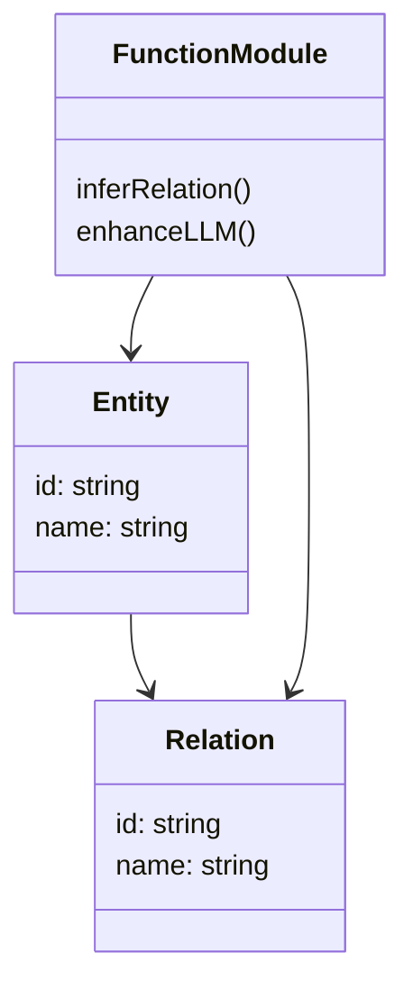
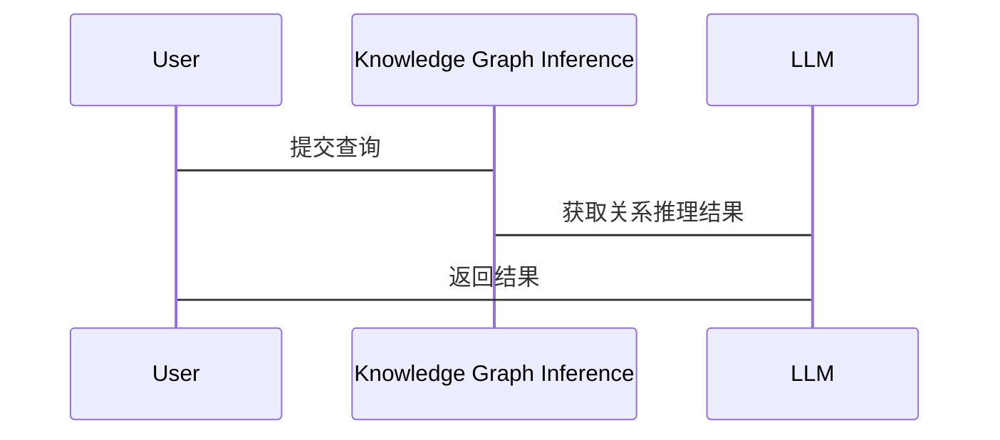

                 


# AI Agent 的知识图谱推理：增强 LLM 的关系理解

> 关键词：AI Agent, 知识图谱, 知识图谱推理, LLM, 大语言模型, 关系理解

> 摘要：本文深入探讨了AI Agent在知识图谱推理中的应用，分析了知识图谱如何增强大语言模型（LLM）的关系理解能力。文章首先介绍了AI Agent和知识图谱的基本概念，然后详细讲解了知识图谱推理的原理和算法，接着分析了如何将知识图谱与LLM结合，以提升模型的关系推理能力。最后，通过实际项目案例，展示了知识图谱推理在增强LLM中的具体应用和效果。

---

# 第1章: AI Agent 的知识图谱概述

## 1.1 AI Agent 的定义与核心概念

### 1.1.1 AI Agent 的定义

AI Agent（智能体）是指能够感知环境、自主决策并执行任务的智能系统。AI Agent可以是软件程序、机器人或其他智能系统，其核心目标是通过感知和行动来优化目标函数。

### 1.1.2 知识图谱的基本概念

知识图谱是一种以图结构表示知识的语义网络，由实体（概念、对象）和关系（属性、联系）组成。知识图谱通过结构化数据描述现实世界中的信息，为AI Agent提供了丰富的语义上下文。

### 1.1.3 知识图谱与 AI Agent 的关系

知识图谱为AI Agent提供了语义理解的基础，帮助其更好地理解和推理复杂的关系。AI Agent则利用知识图谱的结构化信息，提升任务执行的智能性和准确性。

## 1.2 知识图谱推理的背景与意义

### 1.2.1 知识图谱推理的背景

随着大数据和人工智能技术的发展，知识图谱的构建和应用逐渐成为研究热点。知识图谱推理是通过逻辑规则或机器学习模型，从知识图谱中推导出新的事实或关系的过程。

### 1.2.2 知识图谱推理的意义

知识图谱推理能够增强AI Agent的理解能力，使其能够从结构化的知识中推导出隐含的关系，从而更好地解决复杂问题。

### 1.2.3 知识图谱推理的应用场景

知识图谱推理在问答系统、对话系统、推荐系统等领域有广泛应用。例如，在问答系统中，AI Agent可以通过知识图谱推理找到隐含的答案，提供更准确的结果。

## 1.3 LLM 与知识图谱的关系

### 1.3.1 LLM 的基本原理

大语言模型（LLM）通过大量数据的预训练，能够理解和生成自然语言文本。其核心是基于Transformer的神经网络结构，通过自注意力机制捕捉文本中的语义信息。

### 1.3.2 知识图谱对 LLM 的增强作用

知识图谱为LLM提供了结构化的知识表示，帮助模型在理解上下文时，能够更准确地推理出实体之间的关系。

### 1.3.3 知识图谱推理在 LLM 中的应用

通过将知识图谱与LLM结合，可以增强模型的关系理解能力。例如，在对话系统中，LLM可以根据知识图谱中的实体关系，生成更连贯和合理的回答。

## 1.4 本章小结

本章介绍了AI Agent和知识图谱的基本概念，分析了知识图谱推理的背景和意义，并探讨了知识图谱与LLM的关系。通过这些内容，读者可以理解知识图谱在增强LLM关系理解中的重要作用。

---

# 第2章: 知识图谱的核心概念与构建方法

## 2.1 知识图谱的构成要素

### 2.1.1 实体与概念

实体是知识图谱的基本单元，代表现实世界中的具体事物或抽象概念。例如，"北京"可以是一个实体，表示一个城市。

### 2.1.2 关系与属性

关系描述实体之间的关联，属性则描述实体的特征或状态。例如，"位于"可以是关系，表示一个实体的位置关系。

### 2.1.3 知识图谱的结构化表示

知识图谱通常以图结构表示，由节点（实体或概念）和边（关系）组成。这种结构化表示使得知识图谱可以被计算机轻松解析和处理。

## 2.2 知识图谱的构建流程

### 2.2.1 数据收集与预处理

知识图谱的构建需要从多种数据源（如网页、数据库、文本）收集数据，并进行清洗和预处理。

### 2.2.2 实体识别与链接

通过自然语言处理技术，从文本中识别出实体，并将实体链接到知识图谱中的相应节点。

### 2.2.3 关系抽取与构建

从文本中抽取实体之间的关系，并构建知识图谱的边。

## 2.3 知识图谱的存储与管理

### 2.3.1 知识图谱的存储方式

知识图谱可以存储在图数据库（如Neo4j）或关系型数据库中。图数据库更适合存储复杂的图结构数据。

### 2.3.2 知识图谱的数据库选择

根据具体需求选择合适的数据库。例如，Neo4j适合存储大规模的图数据，而RDF三元组存储则适合存储结构化的知识表示。

### 2.3.3 知识图谱的版本控制

知识图谱的更新和维护需要版本控制，确保数据的准确性和一致性。

## 2.4 本章小结

本章详细介绍了知识图谱的构成要素和构建流程，分析了知识图谱的存储与管理方法。通过这些内容，读者可以理解知识图谱的基本结构和构建过程。

---

# 第3章: 知识图谱推理的基本原理

## 3.1 知识图谱推理的定义与分类

### 3.1.1 知识图谱推理的定义

知识图谱推理是指通过逻辑推理或机器学习方法，从知识图谱中推导出新的事实或关系的过程。

### 3.1.2 基于规则的推理

基于规则的推理通过预定义的逻辑规则，从知识图谱中推导出新的事实。例如，如果A是B的父亲，B是C的父亲，则A是C的祖父。

### 3.1.3 基于学习的推理

基于学习的推理通过训练机器学习模型，从知识图谱中学习推理模式。例如，使用神经网络模型进行关系抽取。

## 3.2 知识图谱推理的关键技术

### 3.2.1 实体关系推理

实体关系推理是指通过知识图谱推理出实体之间的关系。例如，推理出“张三是中国的领导人”。

### 3.2.2 逻辑推理与验证

逻辑推理是指通过逻辑规则验证知识图谱中的推理结果是否正确。例如，通过逻辑推理验证“所有鸟都会飞”是否正确。

### 3.2.3 可视化与解释性推理

可视化与解释性推理是指将推理过程可视化，并提供可解释的推理结果。例如，通过图谱可视化展示推理路径。

## 3.3 知识图谱推理的挑战与解决方案

### 3.3.1 数据稀疏性问题

知识图谱中的数据可能不够丰富，导致推理困难。解决方案包括数据增强和模型优化。

### 3.3.2 知识表示的复杂性

知识图谱的复杂性可能影响推理效率。解决方案包括简化知识表示和优化推理算法。

### 3.3.3 推理的可解释性

推理结果的可解释性是实际应用中的重要需求。解决方案包括设计可解释的推理模型和可视化推理过程。

## 3.4 本章小结

本章介绍了知识图谱推理的定义与分类，分析了推理的关键技术及面临的挑战。通过这些内容，读者可以理解知识图谱推理的基本原理和应用方法。

---

# 第4章: 增强 LLM 的关系理解

## 4.1 LLM 的关系理解能力

### 4.1.1 LLM 的上下文理解

大语言模型通过上下文理解语义，但其关系理解能力有限，需要通过知识图谱进行增强。

### 4.1.2 LLM 的关系推理能力

通过知识图谱，LLM可以推理出文本中隐含的关系，提升其关系理解能力。

### 4.1.3 LLM 的知识表示能力

知识图谱为LLM提供了结构化的知识表示，帮助模型更好地理解和推理复杂的关系。

## 4.2 知识图谱对 LLM 的增强作用

### 4.2.1 知识图谱与 LLM 的结合方式

知识图谱可以通过嵌入方式或符号方式与LLM结合。嵌入方式将知识图谱中的实体和关系表示为向量，与LLM的参数空间对齐。符号方式则通过符号推理增强LLM的推理能力。

### 4.2.2 知识图谱对 LLM 的语义增强

知识图谱为LLM提供了丰富的语义信息，帮助模型更好地理解文本中的实体关系。

### 4.2.3 知识图谱对 LLM 的推理增强

通过知识图谱，LLM可以推理出文本中隐含的事实，提升其推理能力。

## 4.3 本章小结

本章分析了知识图谱如何增强LLM的关系理解能力，探讨了知识图谱与LLM的结合方式及其对模型的提升作用。

---

# 第5章: 知识图谱推理的算法原理

## 5.1 知识图谱推理算法概述

知识图谱推理算法可以分为基于规则的推理和基于学习的推理两大类。

### 5.1.1 基于规则的推理算法

基于规则的推理算法通过预定义的逻辑规则进行推理。例如，通过SPARQL查询语言从知识图谱中提取信息。

### 5.1.2 基于学习的推理算法

基于学习的推理算法通过训练机器学习模型进行推理。例如，使用神经网络模型进行关系抽取和推理。

## 5.2 基于规则的推理算法实现

### 5.2.1 算法步骤

1. 数据预处理：将知识图谱转换为规则可执行的形式（如SPARQL）。
2. 规则匹配：根据预定义的规则，匹配知识图谱中的实体和关系。
3. 推理结果输出：输出推理结果。

### 5.2.2 代码实现

```python
from SPARQLWrapper import SPARQLWrapper

endpoint = "http://localhost:3030/dataset"
sparql = SPARQLWrapper(endpoint)

query = """
    SELECT ?x ?y WHERE {
        ?x rdf:type Person.
        ?x knows ?y.
    }
"""
sparql.setQuery(query)
results = sparql.query().convert()

for result in results["results"]["bindings"]:
    print(f"Person: {result['x']['value']}, Knows: {result['y']['value']}")
```

### 5.2.3 算法优势与不足

基于规则的推理算法简单易懂，但灵活性较低，难以处理复杂的关系推理。

## 5.3 基于学习的推理算法实现

### 5.3.1 算法步骤

1. 数据准备：收集和整理知识图谱中的实体和关系数据。
2. 模型训练：使用深度学习模型（如RGCN）进行关系推理。
3. 推理结果输出：根据训练好的模型进行推理，输出结果。

### 5.3.2 代码实现

```python
import tensorflow as tf
from tensorflow.keras.layers import Input, Embedding, Dense
from tensorflow.keras.models import Model

# 定义知识图谱的节点和关系
node embeddings = Embedding(input_dim=num_nodes, output_dim=embedding_dim)
relation embeddings = Embedding(input_dim=num_relations, output_dim=embedding_dim)

input_node = Input(shape=(1,))
input_relation = Input(shape=(1,))

node_vec = node_embeddings(input_node)
relation_vec = relation_embeddings(input_relation)

output = Dense(1, activation='sigmoid')(Concatenate()([node_vec, relation_vec]))

model = Model(inputs=[input_node, input_relation], outputs=output)
model.compile(optimizer='adam', loss='binary_crossentropy')
```

### 5.3.3 算法优势与不足

基于学习的推理算法具有较高的灵活性和扩展性，但需要大量数据和计算资源支持。

## 5.4 本章小结

本章详细介绍了知识图谱推理的算法原理，包括基于规则和基于学习的推理算法的实现方法和优缺点。通过这些内容，读者可以理解知识图谱推理的技术细节和实际应用。

---

# 第6章: 系统分析与架构设计

## 6.1 项目背景与目标

### 6.1.1 项目背景

本项目旨在通过知识图谱推理增强大语言模型的关系理解能力，提升模型在复杂场景中的智能水平。

### 6.1.2 项目目标

1. 构建知识图谱，提取实体和关系。
2. 实现知识图谱推理算法，增强LLM的关系理解能力。
3. 开发一个基于知识图谱推理的对话系统，验证模型的提升效果。

## 6.2 系统功能设计

### 6.2.1 领域模型设计

通过Mermaid类图展示系统的领域模型，包括实体、关系和功能模块。



### 6.2.2 系统架构设计

通过Mermaid架构图展示系统的整体架构，包括数据层、逻辑层和应用层。

```mermaid
container 数据层 {
    Knowledge Graph Database
}

container 逻辑层 {
    Knowledge Graph Inference
    LLM Integration
}

container 应用层 {
    User Interface
    Application Logic
}

Knowledge Graph Database --> Knowledge Graph Inference
Knowledge Graph Inference --> LLM Integration
LLM Integration --> Application Logic
Application Logic --> User Interface
```

### 6.2.3 接口设计

系统需要设计知识图谱推理接口和LLM增强接口，确保各模块之间的交互顺畅。

### 6.2.4 交互流程图

通过Mermaid交互流程图展示系统的交互流程。



## 6.3 本章小结

本章分析了项目的背景与目标，设计了系统的功能模块和架构，展示了系统的交互流程。通过这些内容，读者可以理解项目的整体设计和实现思路。

---

# 第7章: 项目实战与应用分析

## 7.1 项目环境安装

### 7.1.1 环境要求

需要安装Python、TensorFlow、SPARQLWrapper等依赖包。

### 7.1.2 安装命令

```bash
pip install python-sparqlwrapper tensorflow keras
```

## 7.2 系统核心实现

### 7.2.1 知识图谱构建

从文本数据中提取实体和关系，构建知识图谱。

### 7.2.2 知识图谱推理

实现基于规则和基于学习的推理算法，增强LLM的关系理解能力。

## 7.3 代码实现与解读

### 7.3.1 知识图谱构建代码

```python
from spacy.lang.zh import Chinese

nlp = Chinese()
doc = nlp("张三是北京人。北京是中国的首都。")

for token in doc:
    print(token.text)
```

### 7.3.2 知识图谱推理代码

```python
from tensorflow.keras.models import Model
from tensorflow.keras.layers import Input, Embedding, Concatenate, Dense

node_input = Input(shape=(1,))
relation_input = Input(shape=(1,))

node_embeddings = Embedding(1000, 10)(node_input)
relation_embeddings = Embedding(200, 10)(relation_input)

merged = Concatenate()([node_embeddings, relation_embeddings])
output = Dense(1, activation='sigmoid')(merged)

model = Model(inputs=[node_input, relation_input], outputs=output)
model.compile(optimizer='adam', loss='binary_crossentropy')
```

## 7.4 实际案例分析

通过一个具体案例，展示知识图谱推理在增强LLM中的应用效果。例如，在对话系统中，通过知识图谱推理，模型能够更准确地理解用户的问题，并生成更相关的回答。

## 7.5 项目小结

本章通过实际项目案例，展示了知识图谱推理在增强LLM关系理解中的具体应用。通过代码实现和案例分析，读者可以理解如何将理论应用于实践。

---

# 第8章: 最佳实践与未来展望

## 8.1 最佳实践 tips

### 8.1.1 知识图谱构建的注意事项

在构建知识图谱时，需要注意数据的准确性和完整性，避免信息冗余。

### 8.1.2 知识图谱推理的优化技巧

可以通过优化算法和增加数据量来提升推理的准确性和效率。

## 8.2 小结

知识图谱推理是一种重要的技术，能够显著增强大语言模型的关系理解能力。通过本文的介绍，读者可以全面了解知识图谱推理的原理和应用。

## 8.3 注意事项

在实际应用中，需要注意知识图谱的可扩展性和系统的可维护性，避免因数据或算法的复杂性导致系统性能下降。

## 8.4 拓展阅读

推荐阅读相关领域的最新研究论文和技术博客，了解知识图谱推理的最新进展和技术趋势。

---

# 作者

作者：AI天才研究院/AI Genius Institute & 禅与计算机程序设计艺术 /Zen And The Art of Computer Programming

---

以上就是《AI Agent 的知识图谱推理：增强 LLM 的关系理解》的完整目录和文章内容。通过系统的章节划分和详细的内容讲解，读者可以全面理解知识图谱推理的技术原理和实际应用。

