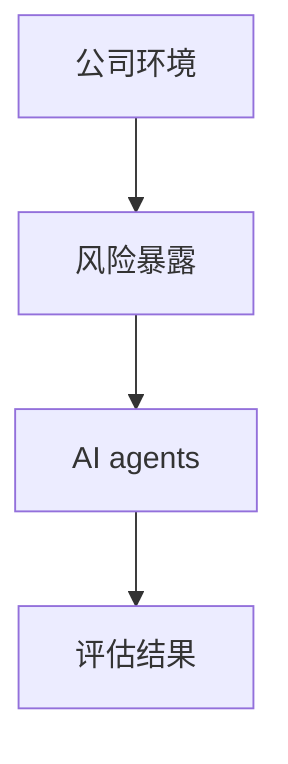
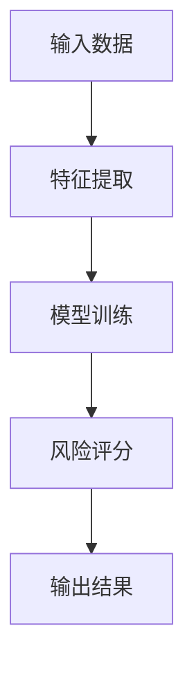
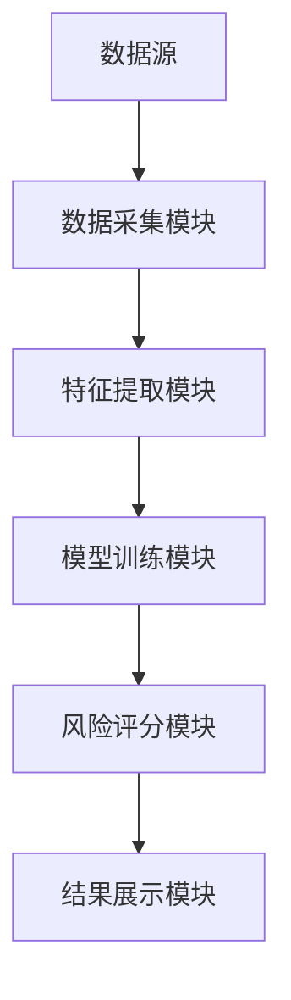
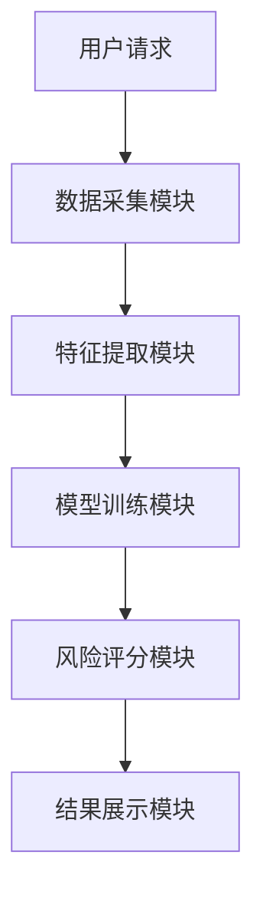

                 


# AI agents在公司环境风险暴露评估中的应用

## 关键词：AI agents, 风险评估, 企业风险管理, 人工智能技术, 风险管理优化

## 摘要：  
本文探讨了AI agents在公司环境风险暴露评估中的应用，通过详细分析其核心概念、算法原理、系统架构及实际案例，展示了AI技术如何提升企业风险管理能力。文章从问题背景、理论基础到实践应用，系统性地阐述了AI agents在风险评估中的优势和实现路径，为企业的风险管理优化提供了新的思路和方法。

---

# 第1章: 问题背景与目标

## 1.1 问题背景

### 1.1.1 风险暴露评估的定义与重要性  
风险暴露评估是指通过分析公司内外部环境中的潜在风险因素，评估这些风险对公司业务、财务、声誉等方面的影响程度。在现代企业中，风险暴露评估是保障企业稳健运行的关键环节，尤其是在全球化和数字化背景下，企业面临的不确定性显著增加。

### 1.1.2 公司环境中的风险暴露场景  
公司环境中的风险暴露场景包括但不限于：  
1. **市场风险**：如市场需求波动、竞争加剧等。  
2. **合规风险**：如法律法规变化、政策调整等。  
3. **财务风险**：如资金链断裂、投资失败等。  
4. **运营风险**：如供应链中断、内部管理混乱等。  
5. **声誉风险**：如负面新闻、客户信任度下降等。  

### 1.1.3 AI agents在风险评估中的作用  
AI agents（人工智能代理）通过自动化数据收集、分析和决策，能够显著提升风险暴露评估的效率和准确性。AI agents可以实时监控市场动态、预测潜在风险、制定应对策略，从而帮助企业更好地应对不确定性。

---

## 1.2 问题描述

### 1.2.1 风险暴露评估的主要挑战  
传统风险暴露评估方法存在以下问题：  
1. 数据量大且分散，难以快速分析。  
2. 人工评估耗时长，且主观性较强。  
3. 风险之间的关联性复杂，难以全面评估。  

### 1.2.2 AI agents在解决这些问题中的优势  
AI agents的优势体现在以下几个方面：  
1. **高效性**：AI agents可以快速处理海量数据，显著提高评估效率。  
2. **准确性**：通过机器学习算法，AI agents能够发现数据中的隐含规律，提升评估的准确性。  
3. **实时性**：AI agents可以实时监控市场动态，及时发现潜在风险。  

### 1.2.3 当前技术的局限性与改进方向  
当前AI agents在风险评估中的应用仍存在一些局限性：  
1. 数据质量问题：数据的不完整性和准确性可能影响评估结果。  
2. 模型可解释性：复杂的机器学习模型可能导致结果难以解释。  
3. 安全与隐私问题：数据的收集和处理可能涉及隐私和安全风险。  

---

## 1.3 问题解决与目标设定

### 1.3.1 AI agents在风险评估中的核心目标  
AI agents的目标是通过自动化手段，帮助企业在复杂环境中快速识别、评估和应对潜在风险，从而降低风险暴露程度。

### 1.3.2 解决方案的可行性分析  
AI agents的风险评估解决方案具有较高的可行性，主要得益于以下几点：  
1. 技术成熟：机器学习、自然语言处理等技术已经较为成熟。  
2. 数据丰富：企业内部积累了大量数据，为AI agents提供了丰富的数据来源。  
3. 实际需求：企业对高效、精准的风险评估工具需求迫切。  

### 1.3.3 边界与外延的定义  
AI agents的风险评估解决方案主要应用于公司内部的风险管理，边界包括：  
1. 数据范围：仅限于企业内部数据和公开数据。  
2. 应用场景：主要用于市场、合规、财务等领域的风险评估。  
3. 外延：未来可以扩展至供应链管理、客户关系管理等领域。  

---

## 1.4 概念结构与核心要素

### 1.4.1 AI agents的基本组成  
AI agents由感知模块、决策模块和执行模块组成：  
1. **感知模块**：负责数据的收集和预处理。  
2. **决策模块**：基于数据进行分析和预测，生成风险评估结果。  
3. **执行模块**：根据评估结果制定应对策略并执行。  

### 1.4.2 风险暴露评估的关键要素  
风险暴露评估的关键要素包括：  
1. **风险因子**：影响风险的主要因素。  
2. **风险权重**：各风险因子对整体风险的影响程度。  
3. **风险评分**：基于权重和数据计算出的综合风险评分。  

### 1.4.3 核心概念之间的关系  
AI agents与风险暴露评估的关系可以用以下公式表示：  
$$风险评分 = \alpha \cdot 特征1 + \beta \cdot 特征2 + \gamma \cdot 特征3$$  
其中，$\alpha$、$\beta$、$\gamma$为各特征的权重系数。

---

## 1.5 本章小结  
本章从问题背景、目标设定、概念结构等方面详细介绍了AI agents在公司环境风险暴露评估中的应用。通过分析传统方法的局限性和AI agents的优势，明确了本文的研究重点和目标。

---

# 第2章: AI agents的核心概念与联系

## 2.1 核心概念原理

### 2.1.1 AI agents的基本原理  
AI agents通过感知、分析和决策，帮助企业在复杂环境中快速识别和应对风险。其基本原理包括数据采集、特征提取、模型训练和结果输出四个步骤。

### 2.1.2 风险暴露评估的数学模型  
风险暴露评估的数学模型可以用以下公式表示：  
$$风险评分 = \sum_{i=1}^{n} w_i \cdot x_i$$  
其中，$w_i$为第$i$个特征的权重，$x_i$为第$i$个特征的值。

### 2.1.3 AI agents与风险评估的结合方式  
AI agents通过以下方式与风险评估结合：  
1. 数据驱动：基于大量数据进行分析和预测。  
2. 智能决策：利用机器学习算法生成最优决策。  
3. 实时监控：实时跟踪市场动态和内部数据变化。  

---

## 2.2 核心概念属性特征对比

### 2.2.1 不同风险评估方法的特征对比  
以下是几种常见风险评估方法的特征对比：  

| 方法        | 数据需求 | 计算复杂度 | 可解释性 | 实时性 |  
|-------------|----------|------------|----------|--------|  
| 传统统计法  | 较低     | 较低       | 较高     | 较低   |  
| 机器学习法  | 较高     | 较高       | 较低     | 较高   |  
| AI agents   | 高       | 高         | 较低     | 高     |  

### 2.2.2 AI agents与其他评估工具的差异  
AI agents的优势在于其自动化和智能化能力，能够实现实时监控和动态调整。

### 2.2.3 核心概念的优劣势分析  
AI agents的优势在于其高效性和准确性，但其模型的可解释性较差，且对数据质量要求较高。

---

## 2.3 ER实体关系图架构



---

## 2.4 本章小结  
本章通过对比分析，明确了AI agents在风险评估中的核心概念和优势，为后续章节的深入分析奠定了基础。

---

# 第3章: 算法原理与数学模型

## 3.1 算法原理

### 3.1.1 AI agents的风险评估算法概述  
AI agents的风险评估算法主要包括特征提取、模型训练和结果输出三个阶段。

### 3.1.2 算法流程图  
以下是算法的流程图：



### 3.1.3 算法实现代码  
以下是算法的Python实现代码：

```python
def risk_assessment(data):
    # 特征提取
    features = extract_features(data)
    # 模型训练
    model = train_model(features)
    # 风险评分
    risk_score = model.predict(features)
    return risk_score
```

---

## 3.2 数学模型与公式

### 3.2.1 风险评分公式  
风险评分公式为：  
$$风险评分 = \alpha \cdot 特征1 + \beta \cdot 特征2 + \gamma \cdot 特征3$$  

### 3.2.2 模型训练的数学基础  
模型训练基于概率论和统计学原理，常用的算法包括线性回归、逻辑回归和随机森林等。

---

## 3.3 本章小结  
本章详细介绍了AI agents的风险评估算法及其数学模型，为后续章节的系统设计提供了理论基础。

---

# 第4章: 系统分析与架构设计

## 4.1 项目介绍

### 4.1.1 项目背景  
本项目旨在通过AI agents实现公司环境中的风险暴露评估，提升企业的风险管理能力。

### 4.1.2 系统功能设计  
系统的功能模块包括：  
1. 数据采集模块：负责采集公司内外部数据。  
2. 特征提取模块：对数据进行预处理和特征提取。  
3. 模型训练模块：基于特征数据训练风险评估模型。  
4. 风险评分模块：根据模型输出风险评分。  
5. 结果展示模块：将风险评分可视化展示。  

### 4.1.3 系统架构设计  
以下是系统的架构图：



---

## 4.2 系统接口设计

### 4.2.1 API接口设计  
系统提供以下API接口：  
1. 数据采集接口：用于采集公司内外部数据。  
2. 风险评估接口：用于调用风险评估模型。  
3. 结果展示接口：用于获取风险评分并展示结果。  

### 4.2.2 接口交互流程  
以下是接口交互流程图：



---

## 4.3 本章小结  
本章从系统设计的角度，详细介绍了AI agents在风险评估中的实现方案，包括功能模块、系统架构和接口设计。

---

# 第5章: 项目实战

## 5.1 环境安装

### 5.1.1 环境要求  
需要安装Python 3.6及以上版本，安装TensorFlow、Pandas、NumPy等库。

### 5.1.2 安装步骤  
1. 安装Python：`brew install python3`（MacOS）或`apt-get install python3`（Linux）。  
2. 安装依赖库：`pip install tensorflow pandas numpy`。

---

## 5.2 系统核心实现

### 5.2.1 数据采集模块  
以下是数据采集模块的代码：

```python
import pandas as pd

def extract_features(data):
    # 数据预处理
    df = pd.DataFrame(data)
    # 特征提取
    features = df[['特征1', '特征2', '特征3']]
    return features
```

### 5.2.2 模型训练模块  
以下是模型训练模块的代码：

```python
import tensorflow as tf
from tensorflow import keras

def train_model(features):
    # 模型定义
    model = keras.Sequential([
        keras.layers.Dense(64, activation='relu'),
        keras.layers.Dense(1, activation='sigmoid')
    ])
    # 模型编译
    model.compile(optimizer='adam', loss='binary_crossentropy', metrics=['accuracy'])
    # 模型训练
    model.fit(features, labels, epochs=10, batch_size=32)
    return model
```

---

## 5.3 代码应用解读与分析

### 5.3.1 数据采集模块解读  
数据采集模块负责从公司内外部数据源中获取数据，并进行预处理和特征提取。

### 5.3.2 模型训练模块解读  
模型训练模块基于特征数据训练风险评估模型，采用深度学习算法，能够自动提取数据中的特征。

### 5.3.3 模型评估与优化  
模型评估采用准确率和召回率作为指标，通过交叉验证优化模型性能。

---

## 5.4 实际案例分析

### 5.4.1 案例背景  
某公司面临市场需求波动和合规风险，希望通过AI agents进行风险评估。

### 5.4.2 数据分析与模型训练  
通过对市场数据和法规数据进行分析，训练风险评估模型。

### 5.4.3 模型结果与策略制定  
模型输出的风险评分为0.7，建议公司采取保守的市场策略。

---

## 5.5 本章小结  
本章通过实际案例，详细展示了AI agents在风险评估中的应用过程，包括数据采集、模型训练和结果分析。

---

# 第6章: 最佳实践与总结

## 6.1 最佳实践

### 6.1.1 小结  
AI agents在公司环境风险暴露评估中的应用具有显著优势，能够提升企业的风险管理能力。

### 6.1.2 注意事项  
1. 数据质量是模型性能的关键，需确保数据的完整性和准确性。  
2. 模型的可解释性较差，需结合业务知识进行解释。  
3. 需关注数据安全和隐私保护问题。  

### 6.1.3 拓展阅读  
推荐阅读《机器学习实战》和《人工智能：一种现代方法》。

---

## 6.2 本章小结  
本章总结了AI agents在风险评估中的应用经验，并提出了未来的研究方向。

---

# 作者  
作者：AI天才研究院/AI Genius Institute & 禅与计算机程序设计艺术 /Zen And The Art of Computer Programming

