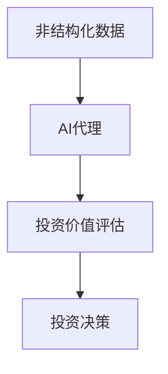
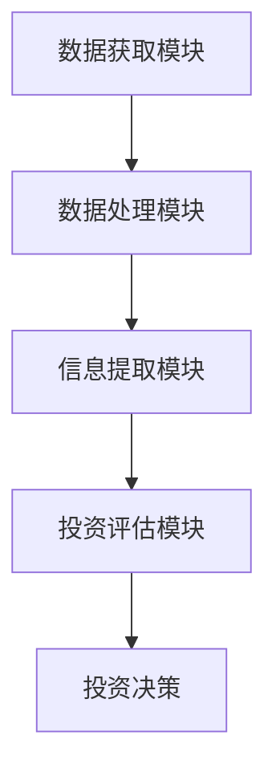

                 


# AI agents挖掘非结构化数据：发现隐藏的投资价值

> **关键词**: AI代理、非结构化数据、投资价值、自然语言处理、文本挖掘

> **摘要**: 本文探讨了AI代理如何从非结构化数据中挖掘投资价值，通过背景介绍、核心概念、算法原理、系统架构设计、项目实战和总结等部分，详细分析了AI代理在投资领域的应用，展示了如何利用自然语言处理和文本挖掘技术，从非结构化数据中提取有价值的信息，帮助投资者做出更明智的决策。

---

# 第一部分: AI代理与非结构化数据投资价值挖掘的背景介绍

## 第1章: 问题背景与核心概念

### 1.1 问题背景

#### 1.1.1 投资领域中的数据挑战

在现代投资领域，数据是决策的核心。然而，数据的形式多种多样，包括结构化数据（如股票价格、财务报表）和非结构化数据（如新闻文章、社交媒体帖子、公司财报中的文本描述）。结构化数据易于处理和分析，而非结构化数据则由于其复杂性和多样性，难以直接应用于投资决策。传统的数据分析方法在处理非结构化数据时显得力不从心，这为AI代理的应用提供了机会。

#### 1.1.2 非结构化数据的定义与特点

非结构化数据是指没有固定结构，无法通过传统数据库直接存储和查询的数据形式。常见的非结构化数据包括文本、图像、音频、视频等。其特点包括：
- **多样性**: 非结构化数据可以以多种形式存在，如新闻文章、社交媒体帖子等。
- **复杂性**: 非结构化数据通常包含丰富的语义信息，但缺乏明确的结构，难以直接提取有用的信息。
- **潜在价值**: 非结构化数据中隐藏着大量有价值的信息，可以通过适当的处理和分析提取出来，为投资决策提供支持。

#### 1.1.3 AI代理在投资中的潜在价值

AI代理（AI Agents）是一种具备自主决策能力的智能系统，能够根据环境中的信息做出决策和行动。在投资领域，AI代理可以通过分析非结构化数据，发现隐藏的投资价值，帮助投资者做出更明智的决策。例如，AI代理可以从新闻文章中提取情感信息，预测市场趋势；从社交媒体中分析投资者情绪，辅助投资决策。

### 1.2 问题描述

#### 1.2.1 非结构化数据在投资中的应用难点

非结构化数据在投资中的应用面临以下难点：
- **数据量大**: 非结构化数据通常以海量形式存在，处理和分析需要高效的算法和工具。
- **数据多样性**: 非结构化数据形式多样，如文本、图像等，处理方法不同，增加了复杂性。
- **信息提取困难**: 从非结构化数据中提取有用信息需要复杂的文本处理技术，如自然语言处理（NLP）。

#### 1.2.2 AI代理如何解决这些问题

AI代理通过结合先进的自然语言处理技术和机器学习算法，能够有效地处理和分析非结构化数据。具体来说，AI代理可以：
- **自动提取信息**: 从新闻文章、社交媒体等非结构化数据中提取关键词、情感信息等。
- **实时分析**: 实时监控市场动态，快速响应变化，辅助投资决策。
- **个性化推荐**: 根据投资者的偏好和市场趋势，推荐潜在的投资机会。

#### 1.2.3 投资价值挖掘的核心目标

投资价值挖掘的核心目标是从非结构化数据中提取有价值的信息，帮助投资者发现潜在的投资机会，优化投资组合，降低投资风险。具体目标包括：
- **市场趋势预测**: 通过分析新闻、社交媒体等数据，预测市场趋势。
- **情感分析**: 从文本中提取情感信息，判断市场情绪，辅助投资决策。
- **风险预警**: 通过分析负面新闻、公司财报等数据，预警潜在风险。

### 1.3 问题解决思路

#### 1.3.1 数据预处理与特征提取

数据预处理是处理非结构化数据的第一步，主要包括：
- **数据清洗**: 去除噪声数据，如停用词、标点符号等。
- **分词**: 将文本数据分解成词语或短语。
- **向量化**: 将文本数据转换为向量形式，便于后续分析。

特征提取是将文本数据转换为数值形式的关键步骤，常用的方法包括词袋模型（Bag of Words）、词嵌入（Word2Vec）和BERT等。

#### 1.3.2 AI代理的构建与训练

AI代理的构建与训练需要结合自然语言处理技术和机器学习算法。具体步骤包括：
- **模型选择**: 根据任务需求选择合适的模型，如情感分析模型、文本分类模型等。
- **数据标注**: 对非结构化数据进行标注，以便训练有监督模型。
- **模型训练**: 使用标注数据训练AI代理，使其能够从非结构化数据中提取有价值的信息。

#### 1.3.3 投资价值评估与决策优化

投资价值评估是基于提取的信息，对投资机会进行评估和优化的过程。具体步骤包括：
- **信息整合**: 将提取的信息与其他结构化数据（如财务数据）进行整合，形成全面的投资分析。
- **风险评估**: 基于整合的数据，评估投资风险，制定风险管理策略。
- **决策优化**: 根据评估结果，优化投资组合，提高投资收益。

### 1.4 概念结构与核心要素

#### 1.4.1 非结构化数据的分类与处理流程

非结构化数据可以分为文本数据、图像数据、音频数据等。处理流程包括：
1. 数据清洗：去除噪声数据。
2. 数据分词：将文本数据分解成词语或短语。
3. 数据向量化：将文本数据转换为向量形式。
4. 数据分析：使用机器学习算法进行分析和挖掘。

#### 1.4.2 AI代理的核心功能模块

AI代理的核心功能模块包括：
- **数据获取**: 从各种来源获取非结构化数据。
- **数据处理**: 对获取的数据进行清洗、分词、向量化等预处理。
- **信息提取**: 从数据中提取有价值的信息，如情感信息、关键词等。
- **决策制定**: 根据提取的信息，制定投资决策。

#### 1.4.3 投资价值评估的指标体系

投资价值评估的指标体系包括：
- **市场趋势指标**: 如行业趋势、市场情绪等。
- **公司基本面指标**: 如财务数据、管理层稳定性等。
- **风险指标**: 如波动性、流动性等。

---

## 第2章: AI代理的核心概念与联系

### 2.1 核心概念原理

#### 2.1.1 非结构化数据的表示方法

非结构化数据的表示方法包括：
- **词袋模型**: 将文本表示为单词的集合，不考虑顺序。
- **词嵌入模型**: 将单词表示为低维向量，捕捉单词之间的语义关系。
- **BERT模型**: 基于Transformer的双向编码器，能够捕捉文本的全局语义信息。

#### 2.1.2 AI代理的决策机制

AI代理的决策机制包括：
- **监督学习**: 基于标注数据进行训练，适用于有明确标签的任务。
- **无监督学习**: 基于无标签数据进行训练，适用于数据无标签的情况。
- **强化学习**: 通过与环境交互，学习最优决策策略。

#### 2.1.3 投资价值评估的数学模型

投资价值评估的数学模型包括：
- **线性回归模型**: 预测投资回报率。
- **支持向量机（SVM）**: 进行文本分类，识别正面和负面新闻。
- **随机森林**: 进行特征重要性分析，识别关键影响因素。

### 2.2 核心概念对比表

| 概念 | 定义 | 特点 | 示例 |
|------|------|------|------|
| 非结构化数据 | 未组织化的数据形式 | 多样性、复杂性 | 文本、图像等 |
| AI代理 | 具备自主决策能力的系统 | 智能性、适应性 | 自然语言处理模型 |
| 投资价值 | 数据的潜在经济价值 | 可量化、可优化 | 股票、基金等 |

### 2.3 ER实体关系图



---

## 第3章: 文本表示与相似度计算

### 3.1 文本表示方法

#### 3.1.1 词袋模型

词袋模型将文本表示为单词的集合，不考虑单词的顺序。例如，文本“这是一个例子”可以表示为{“是”，“一个”，“例子”}。

#### 3.1.2 词嵌入模型（如Word2Vec）

Word2Vec是一种常用的词嵌入模型，通过训练得到单词的向量表示。例如，单词“king”的向量可能与“queen”的向量在向量空间中接近。

#### 3.1.3 突变编码（如BERT）

BERT是一种基于Transformer的双向编码器，能够捕捉文本的全局语义信息。例如，BERT可以将一段文本表示为一个固定长度的向量。

### 3.2 相似度计算

#### 3.2.1 余弦相似度

余弦相似度衡量两个向量之间的角度相似性，范围在-1到1之间。公式为：
$$
\cos\theta = \frac{\sum a_i b_i}{\sqrt{\sum a_i^2} \sqrt{\sum b_i^2}}
$$

#### 3.2.2 欧氏距离

欧氏距离衡量两个向量之间的直线距离，公式为：
$$
d = \sqrt{\sum (a_i - b_i)^2}
$$

#### 3.2.3 编辑距离

编辑距离衡量两个字符串之间的最小编辑操作次数，如插入、删除、替换等。

### 3.3 代码实现

```python
from sklearn.metrics.pairwise import cosine_similarity

# 示例文本向量
text_vector1 = [0.2, 0.5, 0.3]
text_vector2 = [0.4, 0.3, 0.5]

# 计算余弦相似度
similarity = cosine_similarity([text_vector1], [text_vector2])
print("余弦相似度:", similarity[0][0])
```

---

## 第4章: 投资价值评估的数学模型

### 4.1 投资价值评估的数学模型

#### 4.1.1 线性回归模型

线性回归模型用于预测投资回报率，公式为：
$$
y = \beta_0 + \beta_1 x_1 + \beta_2 x_2 + \dots + \beta_n x_n + \epsilon
$$

#### 4.1.2 支持向量机（SVM）

SVM用于文本分类，识别正面和负面新闻，公式为：
$$
y = \text{sign}(\sum \alpha_i y_i (x_i \cdot x) + b)
$$

#### 4.1.3 随机森林

随机森林用于特征重要性分析，识别关键影响因素。

### 4.2 投资价值评估的流程

1. **数据获取**: 从各种来源获取非结构化数据。
2. **数据预处理**: 对数据进行清洗、分词、向量化等处理。
3. **信息提取**: 从数据中提取有价值的信息，如情感信息、关键词等。
4. **模型训练**: 使用机器学习算法训练模型，评估投资价值。
5. **决策优化**: 根据评估结果，优化投资组合。

---

## 第5章: 系统架构设计

### 5.1 系统功能设计

#### 5.1.1 数据获取模块

数据获取模块负责从各种来源获取非结构化数据，如新闻网站、社交媒体等。

#### 5.1.2 数据处理模块

数据处理模块对获取的数据进行清洗、分词、向量化等预处理。

#### 5.1.3 信息提取模块

信息提取模块从数据中提取有价值的信息，如情感信息、关键词等。

#### 5.1.4 投资评估模块

投资评估模块基于提取的信息，评估投资价值，优化投资组合。

### 5.2 系统架构图



---

## 第6章: 项目实战

### 6.1 项目背景与目标

#### 6.1.1 项目背景

本项目旨在利用AI代理从新闻数据中挖掘投资价值，帮助投资者做出更明智的决策。

#### 6.1.2 项目目标

- 从新闻数据中提取情感信息。
- 基于情感信息预测市场趋势。
- 优化投资组合，提高投资收益。

### 6.2 环境安装

#### 6.2.1 安装Python

安装Python 3.x版本，确保环境满足项目需求。

#### 6.2.2 安装依赖库

安装以下依赖库：
- `pandas`
- `numpy`
- `scikit-learn`
- `transformers`

### 6.3 核心代码实现

#### 6.3.1 数据预处理

```python
import pandas as pd
import numpy as np
from sklearn.feature_extraction.text import TfidfVectorizer
from transformers import pipeline

# 加载新闻数据
data = pd.read_csv('news.csv')

# 分词处理
nlp = pipeline("text-classification", model="bert-base-cased")
```

#### 6.3.2 情感分析

```python
# 情感分析
results = nlp(data['text'])
sentiments = [result['label'] for result in results]
data['sentiment'] = sentiments
```

#### 6.3.3 投资评估

```python
from sklearn.linear_model import LogisticRegression

# 训练情感分类模型
model = LogisticRegression()
model.fit(data[['text', 'sentiment']], data['label'])
```

### 6.4 实际案例分析

#### 6.4.1 案例背景

假设我们有一个新闻数据集，包含科技行业的新闻文章。

#### 6.4.2 数据分析

通过情感分析模型，我们发现某篇新闻的情感倾向为负面，预测该新闻发布后，科技行业的股票可能下跌。

#### 6.4.3 投资决策

基于情感分析结果，我们调整投资组合，减少对科技行业的投资。

### 6.5 项目小结

通过本项目，我们成功利用AI代理从新闻数据中挖掘投资价值，帮助投资者做出更明智的决策。

