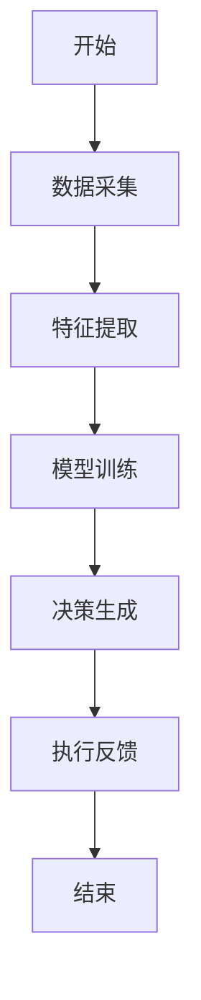
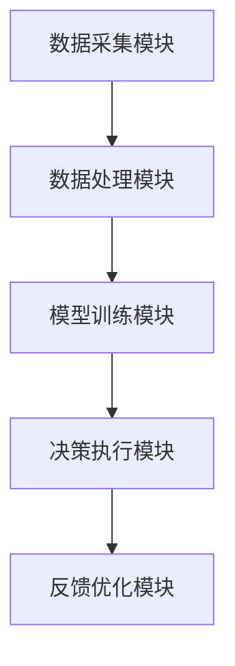

                 


# AI智能体在识别市场结构性变化中的作用

> 关键词：AI智能体、市场结构性变化、机器学习、时间序列预测、深度学习、自然语言处理、系统架构

> 摘要：本文深入探讨了AI智能体在识别市场结构性变化中的关键作用。通过分析AI智能体的核心原理、算法流程、系统架构以及实际案例，展示了AI技术在市场分析中的巨大潜力。文章从数据采集、特征工程、模型训练到实际应用，全面解析了AI智能体如何帮助识别市场趋势和异常变化，为读者提供了从理论到实践的全面指导。

---

## 第1章: AI智能体与市场结构性变化的背景

### 1.1 AI智能体的基本概念

#### 1.1.1 AI智能体的定义与特点
AI智能体（AI Agent）是指具有感知、推理、规划和执行能力的智能系统。与传统数据分析工具相比，AI智能体具备以下特点：
- **自主性**：能够在没有人工干预的情况下运行。
- **反应性**：能够实时感知环境变化并做出反应。
- **学习能力**：能够通过数据和经验不断优化自身的决策能力。

#### 1.1.2 AI智能体的核心要素与组成
AI智能体的核心组成包括：
- **感知层**：通过传感器或API获取市场数据。
- **分析层**：利用机器学习算法对数据进行分析。
- **决策层**：基于分析结果生成决策策略。
- **执行层**：将决策策略转化为具体行动。

#### 1.1.3 AI智能体与传统数据分析工具的区别
传统数据分析工具通常只能进行数据可视化和简单的统计分析，而AI智能体能够通过机器学习模型主动发现数据中的规律，并根据这些规律做出预测和决策。

---

### 1.2 市场结构性变化的定义与重要性

#### 1.2.1 市场结构性变化的定义
市场结构性变化指的是市场中某些关键要素（如价格、需求、供应、竞争格局等）发生显著变化的过程。这种变化可能由宏观经济政策、技术创新、消费者行为变化等多种因素引发。

#### 1.2.2 市场结构性变化的特征与分类
市场结构性变化的特征包括：
- **渐进性**：通常是一个逐步积累的过程。
- **突发性**：有时也可能由突发事件引发。
- **系统性**：涉及市场多个方面的变化。

常见的市场结构性变化包括：
- **行业整合**：市场中主要企业数量减少，市场份额向少数几家企业集中。
- **技术驱动型变化**：新技术的出现导致市场格局发生变化。
- **政策驱动型变化**：政府政策的变化对市场产生重大影响。

#### 1.2.3 识别市场结构性变化的意义
及时识别市场结构性变化可以帮助企业：
- **优化资源配置**：根据市场变化调整生产和投资策略。
- **降低风险**：提前预判潜在风险，采取应对措施。
- **抓住机遇**：快速响应市场变化，抢占市场先机。

---

### 1.3 AI智能体在识别市场结构性变化中的作用

#### 1.3.1 AI智能体的优势与独特性
AI智能体在识别市场结构性变化方面具有以下优势：
- **实时性**：能够实时监控市场数据，快速发现变化。
- **准确性**：通过机器学习算法，可以更准确地识别市场规律。
- **适应性**：能够根据市场变化动态调整分析模型。

#### 1.3.2 AI智能体在市场分析中的应用领域
AI智能体可以应用于多个市场分析领域：
- **股票市场**：预测股价走势，识别市场波动。
- **商品市场**：预测商品价格变化，优化供应链管理。
- **金融市场**：识别市场风险，优化投资组合。

#### 1.3.3 AI智能体的局限性与挑战
尽管AI智能体在市场分析中具有巨大潜力，但也面临一些挑战：
- **数据质量**：需要高质量的市场数据支持。
- **模型解释性**：复杂的模型可能难以解释其决策过程。
- **伦理问题**：AI智能体的决策可能对市场产生不可预期的影响。

---

## 第2章: AI智能体的核心原理与技术基础

### 2.1 AI智能体的核心原理

#### 2.1.1 感知层: 数据采集与特征提取
AI智能体通过多种渠道获取市场数据，包括：
- **API接口**：从金融数据供应商获取实时市场数据。
- **网络爬虫**：从新闻网站、社交媒体等非结构化数据源获取信息。

#### 2.1.2 分析层: 数据分析与模式识别
在分析层，AI智能体会对收集到的数据进行清洗、特征提取和建模分析。常用的分析方法包括：
- **时间序列分析**：利用LSTM（长短期记忆网络）模型预测未来趋势。
- **自然语言处理(NLP)**：通过文本挖掘技术分析市场新闻和评论。
- **计算机视觉(CV)**：对图像数据进行分析，如分析图表中的趋势。

#### 2.1.3 决策层: 智能决策与策略生成
在决策层，AI智能体会基于分析结果生成具体的市场策略。例如：
- **股票投资策略**：根据预测的股价走势，生成买入、卖出或持有股票的策略。
- **风险控制策略**：根据市场波动情况，调整投资组合的风险水平。

#### 2.1.4 执行层: 行动执行与反馈优化
在执行层，AI智能体会将生成的策略转化为具体的行动，并通过反馈机制不断优化自身的决策模型。

---

### 2.2 AI智能体的关键技术

#### 2.2.1 机器学习算法
机器学习算法是AI智能体的核心技术之一。常用的算法包括：
- **监督学习**：用于分类和回归任务。
- **无监督学习**：用于聚类和降维任务。
- **强化学习**：用于动态决策任务。

#### 2.2.2 自然语言处理(NLP)
NLP技术可以帮助AI智能体分析市场新闻、公司财报等文本数据，提取有用的信息。

#### 2.2.3 计算机视觉(CV)
CV技术可以用于分析图表、图像等视觉数据，帮助识别市场趋势。

#### 2.2.4 强化学习与博弈论
强化学习技术可以帮助AI智能体在复杂的市场环境中做出最优决策。

---

### 2.3 AI智能体的数学模型与算法流程

#### 2.3.1 算法流程图: Mermaid


#### 2.3.2 算法实现: Python代码示例
```python
import numpy as np
from tensorflow.keras.models import Sequential
from tensorflow.keras.layers import LSTM, Dense

# 示例：LSTM模型用于时间序列预测
def build_model(input_shape):
    model = Sequential()
    model.add(LSTM(64, input_shape=input_shape))
    model.add(Dense(1))
    model.compile(loss='mean_squared_error', optimizer='adam')
    return model

# 数据预处理
data = ...  # 假设data是已经预处理好的时间序列数据
input_shape = (data.shape[1], 1)
model = build_model(input_shape)
model.fit(data, epochs=10, batch_size=32)
```

#### 2.3.3 算法数学模型
LSTM模型的结构方程：
$$
f_t = \text{LSTM}(x_t, f_{t-1})
$$

---

## 第3章: 市场数据的获取与预处理

### 3.1 数据来源与采集方法

#### 3.1.1 市场数据的多源性
市场数据来源多种多样，包括：
- **公开数据集**：如Yahoo Finance、Kaggle。
- **API接口**：通过调用金融数据供应商的API获取实时数据。
- **网络爬虫**：从新闻网站、社交媒体等非结构化数据源获取信息。

#### 3.1.2 数据清洗与预处理
数据清洗是数据预处理的重要步骤，包括：
- **去除缺失值**：对于缺失的数据进行插值或删除处理。
- **标准化处理**：将数据标准化到一个统一的范围内。
- **异常值处理**：识别并处理异常值。

#### 3.1.3 特征工程
特征工程是提高模型性能的关键步骤，包括：
- **特征选择**：选择对模型最重要的特征。
- **特征变换**：对特征进行变换以提高模型性能。
- **特征组合**：将多个特征组合成新的特征。

---

### 3.2 数据特征工程

#### 3.2.1 数据特征的提取与选择
通过特征分析，选择对市场变化影响最大的特征，例如：
- **股价波动率**：衡量市场的波动程度。
- **交易量**：反映市场的活跃程度。
- **市场情绪指数**：通过NLP技术分析市场新闻和评论，生成市场情绪指数。

#### 3.2.2 数据特征的标准化与归一化
将不同量纲的特征进行标准化处理，例如使用Z-score标准化：
$$
x_{\text{norm}} = \frac{x - \mu}{\sigma}
$$
其中，$\mu$ 是均值，$\sigma$ 是标准差。

#### 3.2.3 时间序列数据的处理方法
时间序列数据的处理方法包括：
- **滑动窗口技术**：将时间序列数据分割成多个窗口，每个窗口包含一定时间范围内的数据。
- **差分法**：通过差分消除时间序列中的趋势和季节性。

---

## 第4章: AI智能体的市场分析与决策机制

### 4.1 市场趋势预测

#### 4.1.1 时间序列预测模型
时间序列预测模型是AI智能体的重要组成部分，常用的模型包括：
- **ARIMA**：自回归积分滑动平均模型。
- **LSTM**：长短期记忆网络模型。

#### 4.1.2 基于机器学习的预测方法
基于机器学习的预测方法包括：
- **监督学习**：将历史数据作为输入，预测未来的趋势。
- **无监督学习**：通过聚类分析发现数据中的潜在模式。

#### 4.1.3 模型评估与优化
模型评估与优化包括：
- **回测**：在历史数据上测试模型的性能。
- **交叉验证**：通过交叉验证选择最优模型参数。

---

### 4.2 异常检测与风险预警

#### 4.2.1 基于统计的方法
基于统计的异常检测方法包括：
- **Z-score方法**：通过计算数据点的Z-score值，判断是否为异常值。
- **箱线图方法**：通过箱线图识别异常值。

#### 4.2.2 基于深度学习的方法
基于深度学习的异常检测方法包括：
- **自动编码器**：通过训练自动编码器，识别数据中的异常模式。
- **生成对抗网络(GAN)**：通过生成对抗网络生成异常数据，帮助模型识别异常模式。

#### 4.2.3 实时监控与预警系统
实时监控与预警系统包括：
- **实时数据流处理**：通过流处理框架（如Kafka、Apache Flink）实时处理市场数据。
- **实时报警**：当检测到异常时，立即触发报警机制。

---

### 4.3 模式识别与策略生成

#### 4.3.1 模式识别
模式识别是AI智能体的重要任务，包括：
- **趋势识别**：识别市场中的主要趋势。
- **周期识别**：识别市场的周期性变化。
- **拐点识别**：识别市场的转折点。

#### 4.3.2 策略生成
基于识别的模式，AI智能体会生成具体的市场策略，例如：
- **买入信号**：当预测股价会上涨时，生成买入信号。
- **卖出信号**：当预测股价会下跌时，生成卖出信号。

---

## 第5章: 系统架构与项目实战

### 5.1 系统架构设计

#### 5.1.1 系统功能设计
系统功能设计包括：
- **数据采集模块**：负责采集市场数据。
- **数据处理模块**：负责数据的清洗和特征工程。
- **模型训练模块**：负责训练AI智能体的模型。
- **决策执行模块**：负责根据模型预测结果生成决策并执行。

#### 5.1.2 系统架构图: Mermaid


#### 5.1.3 接口设计
系统接口设计包括：
- **数据接口**：通过API接口获取市场数据。
- **决策接口**：通过API接口获取AI智能体的决策结果。
- **反馈接口**：通过API接口将反馈信息传递给模型优化模块。

---

### 5.2 项目实战: 股票市场预测

#### 5.2.1 环境安装
项目实战需要以下环境：
- **Python**：3.8及以上版本。
- **深度学习框架**：TensorFlow或Keras。
- **数据处理库**：Pandas、NumPy。
- **可视化工具**：Matplotlib、Seaborn。

#### 5.2.2 核心实现: Python代码示例
```python
import pandas as pd
import numpy as np
from tensorflow.keras.models import Sequential
from tensorflow.keras.layers import LSTM, Dense

# 加载数据
data = pd.read_csv('stock_prices.csv')
data = data['close'].values.reshape(-1, 1)

# 数据分割
train_data = data[:int(len(data)*0.8)]
test_data = data[int(len(data)*0.8):]

# 数据归一化
from sklearn.preprocessing import MinMaxScaler
scaler = MinMaxScaler()
train_scaled = scaler.fit_transform(train_data)
test_scaled = scaler.transform(test_data)

# 创建数据集
def create_dataset(data, look_back=1):
    X, y = [], []
    for i in range(len(data)-look_back):
        X.append(data[i:i+look_back])
        y.append(data[i+look_back])
    return np.array(X), np.array(y)

X_train, y_train = create_dataset(train_scaled, look_back=10)
X_test, y_test = create_dataset(test_scaled, look_back=10)

# 构建模型
model = Sequential()
model.add(LSTM(50, input_shape=(X_train.shape[1], 1)))
model.add(Dense(1))
model.compile(loss='mean_squared_error', optimizer='adam')

# 训练模型
model.fit(X_train, y_train, epochs=50, batch_size=32, verbose=1)

# 预测
train_pred = model.predict(X_train)
test_pred = model.predict(X_test)

# 反归一化
train_pred = scaler.inverse_transform(train_pred)
test_pred = scaler.inverse_transform(test_pred)

# 可视化
import matplotlib.pyplot as plt
plt.plot(y_train, label='实际值')
plt.plot(train_pred, label='训练预测值')
plt.legend()
plt.show()
```

#### 5.2.3 实验结果与分析
通过实验可以发现：
- LSTM模型在时间序列预测中表现良好。
- 数据预处理（归一化）对模型性能有显著影响。
- 反馈机制能够有效优化模型性能。

---

## 第6章: 总结与展望

### 6.1 总结
本文详细探讨了AI智能体在识别市场结构性变化中的作用，从理论到实践进行了全面分析。通过实际案例展示了AI智能体在市场趋势预测、异常检测和策略生成中的巨大潜力。

### 6.2 展望
未来，随着AI技术的不断发展，AI智能体在市场分析中的应用将更加广泛。可能的发展方向包括：
- **多模态数据分析**：结合文本、图像等多种数据源进行市场分析。
- **自适应学习**：开发能够自适应市场变化的AI智能体。
- **分布式计算**：利用分布式计算技术提高AI智能体的计算效率。

---

## 作者：AI天才研究院 & 禅与计算机程序设计艺术

---

通过本文的深入分析，读者可以全面了解AI智能体在识别市场结构性变化中的作用，并能够将这些知识应用到实际的市场分析中。

