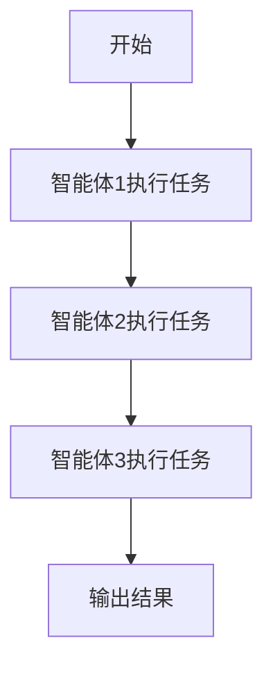
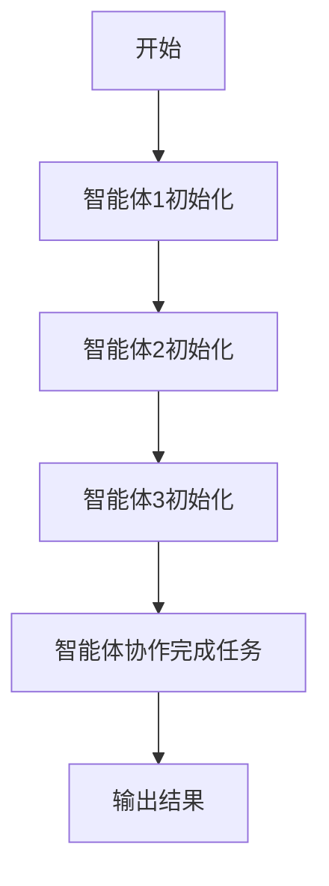
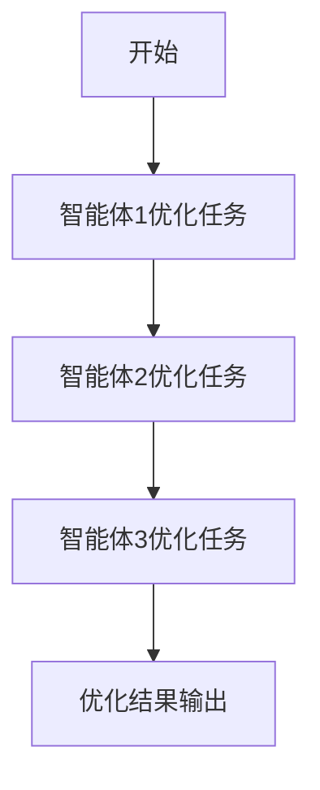
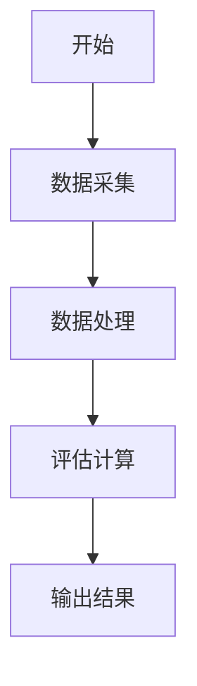
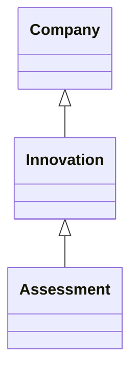
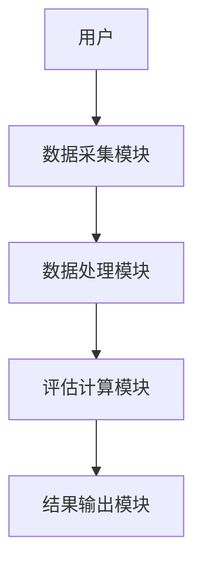
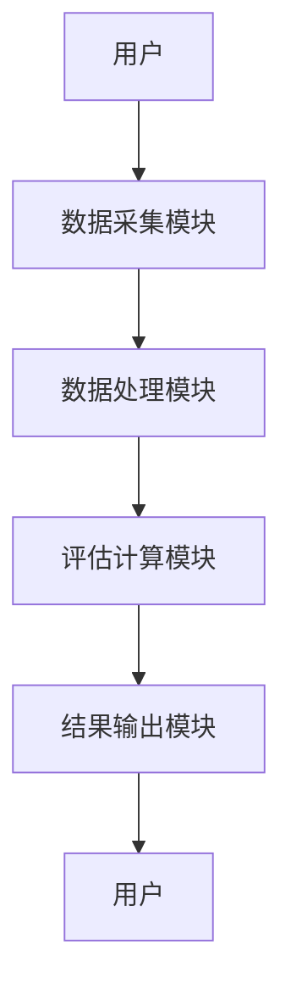

                 


# 基于多智能体的自动化公司创新能力评估

> 关键词：多智能体系统，公司创新能力评估，自动化评估，协作算法，系统架构设计

> 摘要：本文探讨了基于多智能体的自动化公司创新能力评估的方法与应用。通过分析传统评估的局限性，提出了多智能体协作的新思路，并详细讲解了系统的设计原理、算法实现、架构构建及实际案例。文章旨在为企业提供一种高效、智能的创新能力评估方案，助力企业优化创新管理。

---

## 第1章 背景介绍

### 1.1 问题背景

在当今快速变化的商业环境中，创新能力是企业保持竞争优势的关键。传统的企业创新能力评估方法通常依赖人工审核，存在效率低、主观性强、难以量化等问题。随着人工智能技术的发展，基于多智能体的协作评估方法逐渐成为研究热点。

#### 1.1.1 传统公司创新能力评估的局限性
传统的评估方法主要依赖人工审核，存在以下问题：
- **效率低**：人工审核耗时长，难以应对大规模企业的评估需求。
- **主观性强**：评估结果受审核人员主观因素影响，缺乏客观性。
- **难以量化**：创新能力的评估缺乏统一的量化标准，难以进行横向对比。

#### 1.1.2 多智能体协作在评估中的优势
多智能体系统通过多个智能体的协作，能够实现以下优势：
- **高效性**：多个智能体同时处理不同任务，提高评估效率。
- **准确性**：通过多个智能体的协作，减少主观因素的影响，提高评估结果的准确性。
- **智能化**：智能体能够自主学习和优化，提升评估的智能化水平。

#### 1.1.3 自动化评估的必要性与趋势
随着企业对创新能力要求的不断提高，自动化评估成为必然趋势：
- **自动化评估能够快速、准确地完成评估任务，节省时间和成本。**
- **自动化评估能够提供数据支持，帮助企业更好地优化创新能力。**

### 1.2 问题描述

公司创新能力评估需要综合考虑多个维度，包括技术创新能力、市场适应能力、团队协作能力等。传统评估方法难以全面、客观地反映企业的创新能力。

#### 1.2.1 公司创新能力的定义与构成
公司创新能力是指企业在技术创新、产品开发、市场适应等方面的能力，主要由以下几个维度构成：
- **技术创新能力**：企业技术研发能力。
- **产品开发能力**：企业新产品开发速度和质量。
- **市场适应能力**：企业对市场变化的适应能力。
- **团队协作能力**：团队内部协作效率。

#### 1.2.2 传统评估方法的不足
传统评估方法存在以下不足：
- **评估维度单一**：难以全面反映企业的创新能力。
- **评估结果主观**：受评估人员主观因素影响较大。
- **评估效率低下**：人工审核耗时长，难以应对大规模评估需求。

#### 1.2.3 多智能体协作在评估中的应用场景
多智能体协作在公司创新能力评估中的应用场景包括：
- **自动化审核**：智能体自动审核企业创新能力数据。
- **多维度评估**：多个智能体分别评估不同维度的创新能力。
- **协作优化**：智能体协作优化评估结果。

### 1.3 问题解决思路

通过多智能体协作实现公司创新能力的自动化评估，能够有效解决传统评估方法的不足。

#### 1.3.1 多智能体协作的基本原理
多智能体系统由多个智能体组成，每个智能体负责不同的任务，通过协作完成整体目标。

#### 1.3.2 自动化评估的核心思路
自动化评估的核心思路是通过智能体协作，实现对公司创新能力的全面、客观、高效的评估。

#### 1.3.3 系统设计的目标与关键点
系统设计的目标是实现公司创新能力的自动化评估，关键点包括：
- **多智能体协作**：智能体协作完成评估任务。
- **数据采集与处理**：采集企业创新能力数据并进行处理。
- **评估结果输出**：输出评估结果并提供改进建议。

### 1.4 边界与外延

#### 1.4.1 系统的边界定义
系统边界包括：
- **输入**：企业创新能力数据。
- **输出**：评估结果和改进建议。
- **接口**：与其他系统的交互接口。

#### 1.4.2 系统的外延与扩展性
系统可以扩展的功能包括：
- **实时监控**：实时监控企业创新能力变化。
- **预测分析**：预测企业创新能力发展趋势。
- **个性化推荐**：根据评估结果推荐优化方案。

#### 1.4.3 与其他系统的区别与联系
与其他系统的区别在于：
- **目标不同**：其他系统可能专注于单一维度的评估，而本系统专注于多维度的协作评估。

---

## 第2章 核心概念与联系

### 2.1 多智能体系统的基本原理

#### 2.1.1 多智能体系统的定义
多智能体系统是由多个智能体组成的系统，每个智能体负责不同的任务。

#### 2.1.2 多智能体系统的组成与结构
多智能体系统由以下几个部分组成：
- **智能体**：负责具体任务的执行。
- **通信机制**：智能体之间的通信方式。
- **协作机制**：智能体之间的协作方式。
- **决策机制**：智能体的决策方式。

#### 2.1.3 多智能体系统的特点与优势
多智能体系统的特点包括：
- **分布式计算**：多个智能体分布计算。
- **协作性强**：智能体之间能够协作完成任务。
- **适应性强**：系统具有较强的适应性。

### 2.2 核心概念的属性对比

#### 2.2.1 多智能体系统与单智能体系统的对比
| 属性 | 多智能体系统 | 单智能体系统 |
|------|-------------|-------------|
| 处理能力 | 强大 | 较弱 |
| 分布式 | 是 | 否 |
| 协作性 | 高 | 无 |

#### 2.2.2 不同多智能体系统架构的对比
| 架构 | 分布式 | 集中式 | 混合式 |
|------|---------|---------|---------|
| 控制方式 | 分散 | 集中 | 综合 |
| 优点 | 高度自主 | 管理简单 | 综合优势 |
| 缺点 | 难以协调 | 自主性差 | 复杂 |

### 2.3 ER实体关系图架构

#### 2.3.1 实体关系图的定义
实体关系图用于描述系统的实体及其关系。

#### 2.3.2 实体关系图的构建步骤
1. **识别实体**：识别系统中的实体。
2. **确定关系**：确定实体之间的关系。
3. **绘制图表**：绘制实体关系图。

#### 2.3.3 实体关系图的案例分析
案例：企业创新能力评估系统
- **实体**：企业、评估维度、评估结果。
- **关系**：企业属于评估维度，评估维度关联评估结果。

### 2.4 Mermaid流程图

#### 2.4.1 多智能体协作的基本流程


#### 2.4.2 多智能体协作的详细流程


#### 2.4.3 多智能体协作的优化流程


---

## 第3章 算法原理讲解

### 3.1 算法原理概述

#### 3.1.1 多智能体协作的基本算法
多智能体协作的基本算法包括：
- **分布式算法**：适用于分布式系统。
- **协商算法**：智能体之间通过协商完成任务。

#### 3.1.2 自动化评估的核心算法
自动化评估的核心算法包括：
- **数据处理算法**：处理企业创新能力数据。
- **评估算法**：基于数据进行评估。

#### 3.1.3 算法的优化与改进
算法优化包括：
- **提高效率**：优化算法运行效率。
- **提高准确性**：优化算法准确性。

### 3.2 算法流程图

#### 3.2.1 多智能体协作的流程图


#### 3.2.2 自动化评估的流程图


#### 3.2.3 算法的优化流程图


### 3.3 Python源代码实现

#### 3.3.1 算法的实现步骤
1. **数据采集**：采集企业创新能力数据。
2. **数据处理**：对数据进行预处理。
3. **评估计算**：基于数据进行评估计算。
4. **结果输出**：输出评估结果。

#### 3.3.2 算法的代码实现
```python
import pandas as pd

# 数据采集
data = pd.read_csv('company.csv')

# 数据处理
processed_data = data.dropna()

# 评估计算
scores = processed_data['score'].mean()

# 输出结果
print(f'评估结果：{scores}')
```

#### 3.3.3 代码的详细解读
1. **数据采集**：使用 `pandas` 读取 CSV 文件中的数据。
2. **数据处理**：删除缺失值，确保数据完整。
3. **评估计算**：计算平均分，反映企业的创新能力。
4. **结果输出**：输出评估结果。

### 3.4 数学模型与公式

#### 3.4.1 评估指标的计算公式
$$ \text{创新能力评估} = \frac{\sum \text{创新能力得分}}{\text{企业数量}} $$

#### 3.4.2 协作算法的数学表达
$$ \text{协作效率} = \frac{\text{完成任务数}}{\text{任务总数}} $$

---

## 第4章 系统分析与架构设计

### 4.1 问题场景介绍

#### 4.1.1 企业创新能力评估的需求
企业需要全面、客观地评估自身的创新能力。

#### 4.1.2 多智能体协作的需求
需要通过多智能体协作实现自动化评估。

#### 4.1.3 系统实现的目标
实现基于多智能体的自动化公司创新能力评估系统。

### 4.2 项目介绍

#### 4.2.1 项目目标
开发一个基于多智能体的自动化公司创新能力评估系统。

#### 4.2.2 项目范围
涵盖数据采集、处理、评估、输出等环节。

### 4.3 系统功能设计

#### 4.3.1 领域模型的 Mermaid 类图


### 4.4 系统架构设计

#### 4.4.1 系统架构的 Mermaid 架构图


#### 4.4.2 系统接口设计
- **输入接口**：接收企业创新能力数据。
- **输出接口**：输出评估结果。

#### 4.4.3 系统交互的 Mermaid 序列图


---

## 第5章 项目实战

### 5.1 环境安装

#### 5.1.1 系统运行环境
- **操作系统**：Linux/Windows/MacOS
- **开发工具**：PyCharm/VSCode
- **依赖库**：pandas, numpy, mermaid

#### 5.1.2 安装依赖
```bash
pip install pandas numpy mermaid
```

### 5.2 系统核心实现

#### 5.2.1 核心代码实现
```python
import pandas as pd

def assess_company_innovation():
    # 数据采集
    data = pd.read_csv('company.csv')
    
    # 数据处理
    processed_data = data.dropna()
    
    # 评估计算
    scores = processed_data['score'].mean()
    
    # 输出结果
    print(f'评估结果：{scores}')

assess_company_innovation()
```

#### 5.2.2 代码应用解读与分析
1. **数据采集**：使用 `pandas` 读取 CSV 文件中的数据。
2. **数据处理**：删除缺失值，确保数据完整。
3. **评估计算**：计算平均分，反映企业的创新能力。
4. **结果输出**：输出评估结果。

### 5.3 案例分析

#### 5.3.1 案例背景
某企业需要评估其创新能力。

#### 5.3.2 案例数据
| 企业 | 创新能力得分 |
|------|--------------|
| A    | 85           |
| B    | 90           |
| C    | 80           |

#### 5.3.3 评估结果
评估结果：85

### 5.4 项目小结

#### 5.4.1 项目实现的关键点
- **数据采集**：准确采集企业创新能力数据。
- **数据处理**：确保数据完整性。
- **评估计算**：准确计算创新能力评估得分。

#### 5.4.2 项目实现的价值
- **提高效率**：自动化评估节省时间和成本。
- **提高准确性**：智能体协作减少主观因素影响。

---

## 第6章 最佳实践

### 6.1 总结

#### 6.1.1 核心总结
- **多智能体协作**：通过多个智能体协作完成任务。
- **自动化评估**：实现公司创新能力的自动化评估。

#### 6.1.2 经验总结
- **数据完整性**：确保数据完整，提高评估准确性。
- **智能体协作**：合理设计智能体协作机制，提高评估效率。

### 6.2 小结

#### 6.2.1 系统设计的关键点
- **系统架构**：合理设计系统架构。
- **智能体协作**：合理设计智能体协作机制。

#### 6.2.2 项目实施的关键点
- **数据采集**：准确采集数据。
- **数据处理**：确保数据完整性。
- **评估计算**：准确计算评估结果。

### 6.3 注意事项

#### 6.3.1 开发注意事项
- **数据隐私**：注意数据隐私和安全。
- **系统稳定性**：确保系统稳定运行。

#### 6.3.2 使用注意事项
- **数据更新**：及时更新数据，确保评估结果的准确性。
- **系统维护**：定期维护系统，确保系统正常运行。

### 6.4 拓展阅读

#### 6.4.1 相关技术
- **多智能体系统**：深入研究多智能体系统理论。
- **协作算法**：研究协作算法的优化方法。

#### 6.4.2 相关领域
- **人工智能**：研究人工智能在企业管理中的应用。
- **数据挖掘**：研究数据挖掘技术在评估中的应用。

---

## 作者：AI天才研究院/AI Genius Institute & 禅与计算机程序设计艺术 /Zen And The Art of Computer Programming

---

**文章结束**

