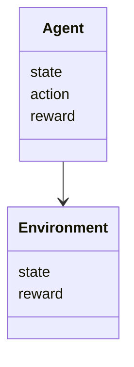
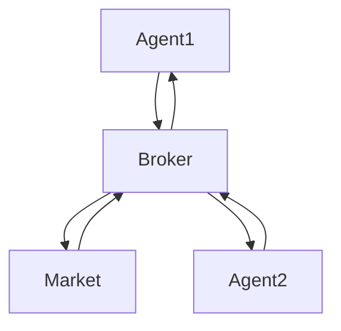
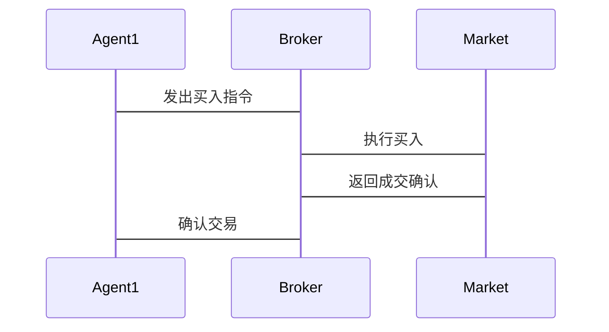

                 


# 多智能体强化学习在优化价值投资的仓位管理中的应用

## 关键词：多智能体强化学习、强化学习、价值投资、仓位管理、金融投资、人工智能

## 摘要：本文探讨了多智能体强化学习（MARS）在优化价值投资仓位管理中的应用。通过分析投资环境和决策过程，利用强化学习的策略和机制，构建多智能体模型，实现智能资产配置和动态调整，提升投资回报和风险控制。

---

## 第1章: 多智能体强化学习与价值投资的背景介绍

### 1.1 多智能体强化学习的背景
#### 1.1.1 多智能体强化学习的定义
多智能体强化学习（Multi-Agent Reinforcement Learning, MARS）是一种涉及多个智能体（Agent）的强化学习形式，每个智能体独立学习并协作以实现共同目标。

#### 1.1.2 多智能体强化学习的核心特点
- **分布式决策**：每个智能体独立决策，协同完成任务。
- **信息共享**：智能体之间可以共享信息，提高整体性能。
- **动态交互**：智能体在环境中实时互动，影响彼此的行为。

#### 1.1.3 多智能体强化学习与传统强化学习的区别
| 特性 | 单智能体强化学习 | 多智能体强化学习 |
|------|------------------|------------------|
| 决策主体 | 单一智能体       | 多个智能体       |
| 信息共享 | 无               | 有               |
| 任务协作 | 无               | 有               |

### 1.2 价值投资的基本概念
#### 1.2.1 价值投资的定义
价值投资是一种投资策略，通过分析公司基本面，寻找市场价格低于内在价值的股票。

#### 1.2.2 价值投资的核心理念
- **安全边际**：买入价格低于内在价值。
- **长期视角**：关注公司的长期盈利能力。
- **逆向思维**：在市场恐慌时寻找机会。

#### 1.2.3 价值投资在现代金融中的地位
价值投资是投资理论的重要组成部分，尤其适用于长期投资者。

### 1.3 股票仓位管理的重要性
#### 1.3.1 股票仓位管理的定义
仓位管理是根据市场变化调整投资组合中股票的比例，以优化收益和风险。

#### 1.3.2 股票仓位管理的目标
- **风险控制**：减少市场波动对投资组合的影响。
- **收益最大化**：通过合理配置资产提高收益。

#### 1.3.3 价值投资中的常见仓位管理策略
- **固定比例法**：保持各股票的固定比例。
- **动态调整法**：根据市场变化调整比例。
- **集中投资法**：重点投资少数优质股票。

### 1.4 多智能体强化学习在金融中的应用现状
#### 1.4.1 多智能体强化学习在金融中的应用领域
- **高频交易**：实时决策和执行。
- **风险控制**：评估和管理投资风险。
- **资产配置**：优化投资组合。

#### 1.4.2 多智能体强化学习在股票投资中的优势
- **分布式决策**：适应复杂市场环境。
- **协同优化**：多个智能体协作提升整体收益。
- **动态适应**：快速响应市场变化。

#### 1.4.3 当前应用中的挑战与未来发展方向
- **计算复杂度高**：需要高效算法和计算能力。
- **信息共享机制**：如何有效共享信息是关键。
- **监管合规性**：需符合金融监管要求。

---

## 第2章: 多智能体强化学习的核心概念与联系

### 2.1 多智能体系统的基本原理
#### 2.1.1 多智能体系统的定义
多智能体系统是由多个智能体组成的系统，每个智能体具有自主决策能力。

#### 2.1.2 多智能体系统的组成要素
- **智能体**：独立决策的主体。
- **环境**：智能体交互的外部世界。
- **通信协议**：智能体之间共享信息的规则。
- **协作机制**：智能体协同完成任务的方式。

#### 2.1.3 多智能体系统与单智能体系统的区别
- **决策主体**：单智能体系统只有一个决策主体，而多智能体系统有多个。
- **信息共享**：单智能体系统无信息共享，多智能体系统有。
- **任务协作**：单智能体系统无协作任务，多智能体系统有协作任务。

### 2.2 强化学习的基本原理
#### 2.2.1 强化学习的定义
强化学习是一种机器学习方法，通过智能体与环境交互，学习最优策略。

#### 2.2.2 强化学习的核心要素
- **智能体**：学习和决策的主体。
- **环境**：智能体所处的外部世界。
- **动作**：智能体可以执行的动作。
- **奖励**：环境对智能体行为的反馈。

#### 2.2.3 强化学习与监督学习的区别
| 特性 | 强化学习 | 监督学习 |
|------|---------|---------|
| 数据 | 环境反馈 | 标签数据 |
| 目标 | 最大化奖励 | 最小化误差 |

### 2.3 多智能体强化学习（MARS）的定义与特点
#### 2.3.1 MARS的定义
多智能体强化学习是多个智能体在环境中协作，通过共享信息和策略优化，实现共同目标。

#### 2.3.2 MARS的核心特点
- **分布式学习**：每个智能体独立学习。
- **信息共享**：智能体之间共享信息。
- **协作决策**：多个智能体协作完成任务。

#### 2.3.3 MARS与传统强化学习的区别
| 特性 | MARS | 单智能体强化学习 |
|------|-------|------------------|
| 智能体数量 | 多个 | 单个            |
| 信息共享 | 有 | 无               |
| 任务协作 | 有 | 无               |

### 2.4 多智能体强化学习与价值投资的联系
#### 2.4.1 MARS在价值投资中的应用
- **资产配置**：智能体根据市场信息配置资产。
- **风险控制**：智能体协同管理投资风险。
- **动态调整**：智能体实时调整投资策略。

#### 2.4.2 MARS在仓位管理中的优势
- **分布式决策**：多个智能体独立决策，降低风险。
- **信息共享**：智能体共享信息，提升决策质量。
- **动态适应**：智能体实时调整策略，适应市场变化。

---

## 第3章: 多智能体强化学习算法的原理与实现

### 3.1 多智能体强化学习算法概述
#### 3.1.1 基于Q-learning的多智能体算法
- **定义**：智能体通过学习Q值函数，选择最优动作。
- **实现步骤**：
  1. 初始化Q表。
  2. 智能体与环境交互，获取状态和奖励。
  3. 更新Q值函数。

#### 3.1.2 基于Actor-Critic的多智能体算法
- **定义**：智能体通过Actor网络选择动作，Critic网络评估策略。
- **实现步骤**：
  1. 初始化Actor和Critic网络。
  2. 智能体执行动作，获取奖励。
  3. 更新Actor和Critic网络参数。

### 3.2 多智能体强化学习的数学模型
#### 3.2.1 Q-learning算法的数学模型
$$ Q(s, a) \leftarrow Q(s, a) + \alpha [r + \gamma \max Q(s', a') - Q(s, a)] $$
其中：
- \( Q(s, a) \)：状态s下动作a的Q值。
- \( \alpha \)：学习率。
- \( \gamma \)：折扣因子。

#### 3.2.2 Actor-Critic算法的数学模型
- **Actor网络**：输出动作的概率分布。
- **Critic网络**：评估状态-动作对的Q值。
$$ Q(s, a) = \text{Critic}(s, a) $$
$$ \nabla \theta \leftarrow \nabla J(\theta) = (\text{Actor}(s) - \text{Critic}(s, \text{Actor}(s))) \times \text{Advantage} $$

### 3.3 多智能体强化学习的实现步骤
#### 3.3.1 初始化
- 初始化智能体数量N。
- 初始化智能体的参数θ₁, θ₂, ..., θ_N。

#### 3.3.2 智能体与环境交互
- 每个智能体根据当前策略选择动作。
- 执行动作，获取奖励和新状态。

#### 3.3.3 更新策略
- 使用Q-learning或Actor-Critic算法更新智能体的策略。

#### 3.3.4 信息共享
- 智能体之间共享信息，更新全局策略。

### 3.4 多智能体强化学习的实现案例
#### 3.4.1 使用Q-learning的实现
```python
import numpy as np

class Multi-Agent_Q_learning:
    def __init__(self, n_agents, state_space, action_space):
        self.n_agents = n_agents
        self.state_space = state_space
        self.action_space = action_space
        self.Q = np.zeros((state_space, action_space, n_agents))
    
    def choose_action(self, state, agent_id):
        # 选择动作
        return np.argmax(self.Q[state, :, agent_id])
    
    def update_Q(self, state, action, reward, next_state, agent_id, alpha=0.1, gamma=0.9):
        # 更新Q值
        self.Q[state, action, agent_id] += alpha * (reward + gamma * np.max(self.Q[next_state, :, agent_id]) - self.Q[state, action, agent_id])
```

#### 3.4.2 使用Actor-Critic的实现
```python
import tensorflow as tf

class Agent:
    def __init__(self, state_dim, action_dim):
        self.state_dim = state_dim
        self.action_dim = action_dim
        self.Actor = self.build_actor()
        self.Critic = self.build_critic()
    
    def build_actor(self):
        # 构建Actor网络
        pass
    
    def build_critic(self):
        # 构建Critic网络
        pass
    
    def choose_action(self, state):
        # 根据Actor网络选择动作
        pass
    
    def update(self, state, action, reward, next_state):
        # 更新Actor和Critic网络
        pass
```

---

## 第4章: 系统分析与架构设计

### 4.1 问题场景介绍
#### 4.1.1 价值投资中的问题
- **市场预测难**：股票价格受多种因素影响。
- **风险控制难**：如何在波动中保持稳定收益。
- **决策复杂**：需要考虑多个因素。

### 4.2 项目介绍
#### 4.2.1 项目目标
- 构建多智能体强化学习系统，优化价值投资的仓位管理。

#### 4.2.2 项目范围
- 数据收集与预处理。
- 系统设计与实现。
- 测试与优化。

### 4.3 系统功能设计
#### 4.3.1 领域模型


#### 4.3.2 系统架构


#### 4.3.3 系统接口设计
- **智能体接口**：接收市场信息，发送交易指令。
- **经纪商接口**：处理交易指令，返回市场数据。
- **市场接口**：根据交易指令更新市场状态。

### 4.4 系统交互设计
#### 4.4.1 交易流程


---

## 第5章: 项目实战与应用

### 5.1 环境安装
#### 5.1.1 安装Python
```bash
python --version
pip install --upgrade pip
```

#### 5.1.2 安装TensorFlow和Keras
```bash
pip install tensorflow==2.10.0 keras==2.10.0
```

#### 5.1.3 安装其他依赖
```bash
pip install numpy matplotlib
```

### 5.2 系统核心实现
#### 5.2.1 数据预处理
```python
import pandas as pd
import numpy as np

def preprocess_data(data):
    # 数据预处理代码
    pass
```

#### 5.2.2 智能体实现
```python
class Agent:
    def __init__(self, state_dim, action_dim):
        # 初始化代码
        pass
    
    def choose_action(self, state):
        # 选择动作代码
        pass
```

#### 5.2.3 环境实现
```python
class Environment:
    def __init__(self, data):
        # 初始化环境代码
        pass
    
    def step(self, action):
        # 执行动作代码
        pass
```

### 5.3 代码实现与解读
#### 5.3.1 智能体与环境交互
```python
def main():
    env = Environment(data)
    agent = Agent(state_dim, action_dim)
    for episode in range(episodes):
        state = env.reset()
        while not done:
            action = agent.choose_action(state)
            next_state, reward, done = env.step(action)
            agent.update(state, action, reward, next_state)
```

#### 5.3.2 实际案例分析
- **案例背景**：选择某只股票进行分析。
- **数据来源**：使用历史股价数据。
- **模型训练**：训练多智能体模型。
- **结果分析**：比较模型表现与传统策略。

### 5.4 项目小结
#### 5.4.1 项目成果
- 成功构建多智能体强化学习系统。
- 实现了智能资产配置和动态调整。

#### 5.4.2 经验总结
- 数据质量影响模型性能。
- 算法选择需结合实际场景。
- 模型调优是关键步骤。

---

## 第6章: 最佳实践与总结

### 6.1 最佳实践
#### 6.1.1 智能体数量的选择
- 过多智能体增加复杂度。
- 过少智能体无法充分利用信息。

#### 6.1.2 数据处理的注意事项
- 数据清洗：处理缺失值和异常值。
- 特征选择：选择相关性高的特征。
- 数据增强：增加数据多样性。

### 6.2 总结与展望
#### 6.2.1 全文总结
- 多智能体强化学习在优化价值投资仓位管理中具有潜力。
- 通过智能体协作和动态调整，可以提高投资收益和风险控制。

#### 6.2.2 未来展望
- 研究更高效的算法。
- 探索与其他技术的结合，如深度学习和自然语言处理。
- 实际应用中的进一步优化和改进。

---

## 作者：AI天才研究院 & 禅与计算机程序设计艺术

