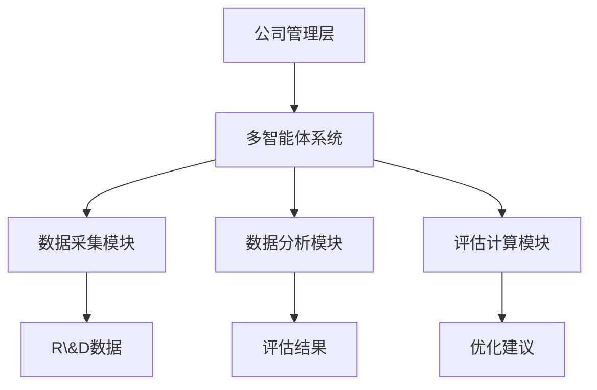
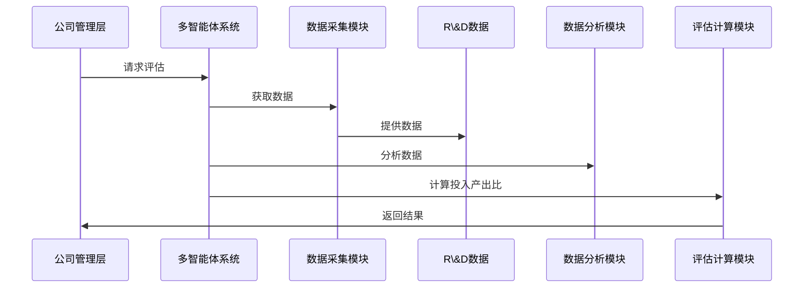

                 


# 多智能体系统在公司创新效率评估中的应用：R&D投入产出比

> 关键词：多智能体系统，R&D投入产出比，创新效率评估，系统架构设计，项目实战

> 摘要：本文探讨了多智能体系统在公司创新效率评估中的应用，特别是R&D投入产出比的评估。通过详细分析多智能体系统的原理、R&D投入产出比的理论基础，以及两者的结合应用，展示了如何利用多智能体系统优化公司创新效率评估过程。文章还通过项目实战和系统架构设计，提供了具体的实现方法和优化建议。

---

## 第1章: 多智能体系统与R&D投入产出比概述

### 1.1 多智能体系统的基本概念

#### 1.1.1 多智能体系统的定义
多智能体系统（Multi-Agent System, MAS）是由多个智能体组成的分布式系统，每个智能体能够感知环境、自主决策并与其他智能体协作完成任务。智能体之间通过通信和协作，实现复杂问题的求解。

#### 1.1.2 多智能体系统的特征
多智能体系统具有以下特征：
1. **分布式性**：智能体分布在不同的位置，独立运行。
2. **自主性**：智能体能够自主决策，无需中央控制。
3. **协作性**：智能体之间通过通信协作完成共同目标。
4. **反应性**：智能体能够根据环境变化动态调整行为。

#### 1.1.3 多智能体系统与传统单智能体系统的区别
| 特性                | 多智能体系统                      | 单智能体系统                      |
|---------------------|---------------------------------|---------------------------------|
| 结构                | 分布式、多个智能体协作           | 集中式、单个智能体控制           |
| 通信                | 智能体间需要通信与协作           | 无通信需求                     |
| 灵活性              | 系统更具灵活性，适应性强          | 系统灵活性较低                  |
| 复杂性              | 系统复杂性高，难以管理           | 系统复杂性低，易于管理          |

### 1.2 R&D投入产出比的定义与重要性

#### 1.2.1 R&D投入的定义
R&D（Research and Development）投入是指企业在研究与开发方面所花费的资源，包括资金、时间和人力资源等。

#### 1.2.2 R&D产出的定义
R&D产出是指企业在研究与开发过程中所取得的成果，包括新产品、新技术、专利等。

#### 1.2.3 R&D投入产出比的意义
R&D投入产出比是衡量企业创新效率的重要指标，反映了企业在R&D投入上的效率和效果。通过分析R&D投入产出比，企业可以优化资源配置，提高创新效率。

### 1.3 多智能体系统在R&D评估中的应用背景

#### 1.3.1 R&D评估的传统方法与局限性
传统的R&D评估方法通常基于财务数据和统计分析，存在以下局限性：
1. **数据维度单一**：仅关注财务数据，忽视了研发过程中的动态协作。
2. **评估周期长**：传统方法需要大量时间收集和分析数据。
3. **缺乏实时性**：无法实时监控R&D过程中的进展和问题。

#### 1.3.2 多智能体系统的优势
多智能体系统在R&D评估中的优势：
1. **实时监控**：可以通过智能体实时采集和分析数据。
2. **动态协作**：多个智能体可以协作分析R&D过程中的复杂问题。
3. **数据丰富性**：可以整合多种数据源，提供更全面的评估结果。

#### 1.3.3 当前研究现状与未来趋势
当前，多智能体系统在R&D评估中的研究主要集中在以下几个方面：
1. **智能体协作算法**：研究如何优化智能体间的协作，提高评估效率。
2. **动态评估模型**：开发能够实时更新的评估模型，适应R&D过程中的变化。
3. **数据挖掘技术**：利用数据挖掘技术从大量数据中提取有用信息。

未来，随着人工智能和大数据技术的进一步发展，多智能体系统在R&D评估中的应用将更加广泛和深入。

---

## 第2章: 多智能体系统的核心原理

### 2.1 多智能体系统的组成与结构

#### 2.1.1 智能体的定义与特征
智能体（Agent）是一个能够感知环境、自主决策并采取行动的实体。智能体具有以下特征：
1. **自主性**：能够自主决策，无需外部干预。
2. **反应性**：能够根据环境变化动态调整行为。
3. **协作性**：能够与其他智能体协作完成任务。

#### 2.1.2 多智能体系统的层次结构
多智能体系统的层次结构通常包括以下层次：
1. **智能体层**：由多个智能体组成，每个智能体负责特定任务。
2. **协作层**：负责智能体间的通信与协作。
3. **全局层**：对整个系统进行协调和管理。

#### 2.1.3 多智能体系统与分布式系统的关系
多智能体系统与分布式系统的关系：
1. **分布式系统**：由多个节点组成，每个节点负责特定任务。
2. **多智能体系统**：分布式系统的一种形式，每个节点是一个智能体。

### 2.2 多智能体系统的通信与协作机制

#### 2.2.1 智能体间的通信协议
智能体间的通信协议包括：
1. **消息传递机制**：智能体通过消息传递信息。
2. **通信协议设计**：设计高效的通信协议，减少通信开销。

#### 2.2.2 协作任务分配算法
协作任务分配算法：
1. **基于博弈论的分配**：利用博弈论模型分配任务。
2. **基于强化学习的分配**：利用强化学习算法优化任务分配。

#### 2.2.3 冲突解决机制
冲突解决机制：
1. **协商机制**：智能体之间通过协商解决冲突。
2. **仲裁机制**：由仲裁者解决冲突。

### 2.3 多智能体系统的决策与学习机制

#### 2.3.1 基于强化学习的决策
强化学习（Reinforcement Learning）是一种通过试错方式优化决策的算法。智能体通过与环境交互，逐步优化决策策略。

#### 2.3.2 基于博弈论的决策
博弈论（Game Theory）是一种分析冲突与合作的数学工具。智能体可以通过博弈论模型优化决策。

#### 2.3.3 集群智能与自适应优化
集群智能（Swarm Intelligence）是通过多个简单智能体的协作实现复杂任务的智能形式。多智能体系统可以通过集群智能实现自适应优化。

---

## 第3章: R&D投入产出比的理论基础

### 3.1 R&D投入产出比的经济学分析

#### 3.1.1 R&D投资的生命周期模型
R&D投资的生命周期模型包括以下几个阶段：
1. **投入阶段**：企业在R&D方面投入资源。
2. **研发阶段**：进行技术开发和产品设计。
3. **商业化阶段**：将研究成果转化为实际产品。

#### 3.1.2 R&D投入与经济增长的关系
R&D投入是经济增长的重要驱动力。通过增加R&D投入，可以提高技术水平，促进经济增长。

#### 3.1.3 R&D产出的度量方法
R&D产出的度量方法包括：
1. **专利数量**：通过专利数量衡量技术创新成果。
2. **新产品数量**：通过新产品数量衡量创新成果。

### 3.2 R&D投入产出比的数学模型

#### 3.2.1 R&D投入产出比的公式推导
R&D投入产出比（ROI）的计算公式为：
$$ ROI = \frac{R \& D \text{ 产出}}{R \& D \text{ 投入}} $$

#### 3.2.2 R&D投入与产出的关系式
R&D投入与产出的关系式可以表示为：
$$ 产出 = f(投入) $$

其中，函数 \( f \) 表示投入与产出的关系。

#### 3.2.3 R&D投入产出比的影响因素分析
R&D投入产出比的影响因素包括：
1. **技术难度**：技术难度越高，产出可能越低。
2. **市场竞争**：市场竞争激烈，产出可能受到限制。
3. **政策支持**：政策支持可以提高产出。

### 3.3 R&D投入产出比的评价指标体系

#### 3.3.1 评价指标的选择标准
评价指标的选择标准包括：
1. **相关性**：指标能够反映R&D投入产出比的核心内容。
2. **可测量性**：指标能够量化。

#### 3.3.2 常用评价指标及其计算方法
常用评价指标包括：
1. **专利数量**：专利数量 = 申请专利的数量。
2. **新产品数量**：新产品数量 = 新产品数量。

#### 3.3.3 指标权重的确定方法
指标权重的确定方法包括：
1. **层次分析法（AHP）**：通过专家评分确定指标权重。
2. **主成分分析法（PCA）**：通过主成分分析确定指标权重。

---

## 第4章: 多智能体系统在R&D投入产出比

### 4.1 多智能体系统在R&D投入产出比中的应用

#### 4.1.1 多智能体系统的应用背景
多智能体系统在R&D投入产出比中的应用背景：
1. **数据来源多样**：R&D过程涉及多个部门和环节，数据来源多样。
2. **实时性要求高**：需要实时监控R&D过程中的进展和问题。

#### 4.1.2 多智能体系统的应用优势
多智能体系统的应用优势：
1. **高效协作**：智能体可以协作分析R&D过程中的复杂问题。
2. **实时监控**：可以通过智能体实时采集和分析数据。

#### 4.1.3 应用案例分析
应用案例分析：
1. **某高科技公司R&D评估**：通过多智能体系统优化R&D投入产出比。

### 4.2 多智能体系统在R&D投入产出比中的算法实现

#### 4.2.1 算法原理
算法原理：
1. **智能体协作算法**：通过智能体协作实现R&D评估。
2. **动态评估模型**：建立动态模型实时更新评估结果。

#### 4.2.2 算法实现步骤
算法实现步骤：
1. **数据采集**：采集R&D过程中的数据。
2. **数据分析**：通过智能体分析数据。
3. **评估计算**：计算R&D投入产出比。

#### 4.2.3 算法优化
算法优化：
1. **并行计算**：通过并行计算提高效率。
2. **模型优化**：优化动态模型提高准确性。

---

## 第5章: 系统分析与架构设计方案

### 5.1 问题场景介绍

#### 5.1.1 项目背景
项目背景：
1. **公司R&D评估需求**：公司需要优化R&D投入产出比。
2. **现有评估方法的局限性**：传统方法效率低，难以实时监控。

#### 5.1.2 项目目标
项目目标：
1. **构建多智能体系统**：实现R&D投入产出比的实时评估。
2. **优化评估过程**：提高评估效率和准确性。

### 5.2 系统功能设计

#### 5.2.1 领域模型
领域模型（ER图）：

```mermaid
erDiagram
    actor R\&D团队
    actor 公司管理层
    actor 数据源
    database R\&D数据
    actor 评估结果
    R\&D团队 --> R\&D数据 : 提供
    公司管理层 --> R\&D数据 : 查询
    数据源 --> R\&D数据 : 更新
    R\&D数据 --> 评估结果 : 计算
```

#### 5.2.2 系统架构设计



#### 5.2.3 系统接口设计
系统接口设计：
1. **数据接口**：与R&D数据源对接。
2. **用户接口**：提供给公司管理层使用。

#### 5.2.4 系统交互设计



---

## 第6章: 项目实战

### 6.1 项目环境安装

#### 6.1.1 安装Python
```bash
python --version
pip install --upgrade pip
```

#### 6.1.2 安装必要的库
```bash
pip install numpy
pip install pandas
pip install scikit-learn
pip install matplotlib
pip install networkx
pip install pymermaid
```

### 6.2 系统核心实现

#### 6.2.1 数据采集模块实现
```python
import requests
import json

def fetch_data(url):
    response = requests.get(url)
    return json.loads(response.text)
```

#### 6.2.2 数据分析模块实现
```python
import numpy as np
import pandas as pd

def analyze_data(data):
    df = pd.DataFrame(data)
    return df.describe()
```

#### 6.2.3 评估计算模块实现
```python
def calculate_roi(投入, 产出):
    return 产出 / 投入
```

### 6.3 代码应用解读与分析
代码应用解读与分析：
1. **数据采集模块**：通过网络请求获取R&D数据。
2. **数据分析模块**：对数据进行统计分析。
3. **评估计算模块**：计算R&D投入产出比。

### 6.4 实际案例分析
实际案例分析：
1. **数据来源**：某公司R&D数据。
2. **数据处理**：清洗和预处理数据。
3. **评估计算**：计算投入产出比，优化建议。

### 6.5 项目小结
项目小结：
1. **实现目标**：实现了R&D投入产出比的实时评估。
2. **项目收获**：掌握了多智能体系统的实现方法。

---

## 第7章: 总结与展望

### 7.1 总结
总结：
1. **多智能体系统的优势**：在R&D评估中的高效性和实时性。
2. **R&D投入产出比的重要性**：对企业创新效率的提升。

### 7.2 未来研究方向
未来研究方向：
1. **智能体协作算法优化**：进一步优化智能体间的协作算法。
2. **动态评估模型改进**：改进动态评估模型的准确性。
3. **数据挖掘技术应用**：进一步应用数据挖掘技术提高评估效率。

---

## 作者：AI天才研究院/AI Genius Institute & 禅与计算机程序设计艺术 /Zen And The Art of Computer Programming

---

这篇文章详细介绍了多智能体系统在R&D投入产出比评估中的应用，通过理论分析、系统设计和项目实战，展示了如何利用多智能体系统优化公司创新效率评估过程。希望对相关领域的读者有所帮助。

