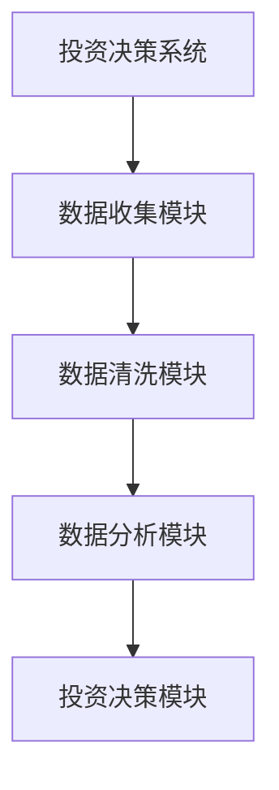
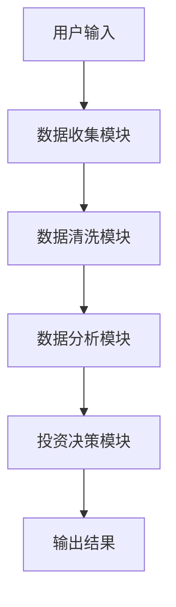

                 


# 巴菲特如何看待新兴市场投资

## 关键词：巴菲特, 新兴市场, 投资策略, 价值投资, 股票分析, 市场风险, 算法模型

## 摘要：
本文从巴菲特的投资哲学出发，分析其对新兴市场的看法，探讨其投资策略在新兴市场的应用。通过详细阐述巴菲特的价值投资理论、选股标准、风险管理策略，结合新兴市场的特点，为投资者提供系统化的投资框架和实战案例。文章还结合技术分析，提供基于巴菲特理念的算法模型和系统架构设计，帮助读者在新兴市场中做出明智的投资决策。

---

# 第一部分: 巴菲特投资理念与新兴市场概述

## 第1章: 巴菲特投资理念的核心思想

### 1.1 巴菲特的生平与投资哲学

#### 1.1.1 巴菲特的早年经历与投资启蒙
沃伦·巴菲特（Warren Buffett）于1934年8月30日出生在美国堪萨斯州。他从小就展现出了对投资的兴趣，12岁时就开始购买股票。巴菲特的导师是本杰明·格雷厄姆（Benjamin Graham），后者是价值投资的鼻祖，教导巴菲特如何通过分析企业的基本面来寻找被市场低估的投资标的。

#### 1.1.2 巴菲特的价值投资理念
巴菲特的投资哲学可以总结为以下几点：
- **价值投资**：寻找那些市场价格低于其内在价值的股票。
- **安全边际**：在购买股票时，确保买入价格远低于其内在价值，以减少风险。
- **长期持有**：巴菲特主张长期持有优质股票，而不是频繁交易。
- **关注企业基本面**：分析公司的财务状况、盈利能力、竞争优势等。

#### 1.1.3 巴菲特投资哲学的核心要素
- **安全边际**：买入价格低于内在价值。
- **内在价值**：通过DCF（Discounted Cash Flow）模型计算企业的未来现金流的现值。
- **管理层能力**：选择由诚实、有能力的管理层领导的公司。
- **竞争优势**：选择具有独特竞争优势（如护城河）的企业。

---

## 1.2 新兴市场的定义与特点

#### 1.2.1 新兴市场的定义与范围
新兴市场是指那些经济处于快速发展阶段，但尚未完全工业化的国家。这些市场通常具有较高的经济增长率，但也伴随着较高的波动性和不确定性。新兴市场的代表包括中国、印度、巴西、韩国等。

#### 1.2.2 新兴市场的经济特征
- **高增长**：新兴市场的GDP增长率通常高于发达市场。
- **高波动性**：新兴市场的股票市场波动较大，容易受到外部环境的影响。
- **政策不确定性**：新兴市场的政策变化较快，可能对投资产生影响。
- **市场流动性**：新兴市场的流动性通常低于发达市场。

#### 1.2.3 新兴市场的投资机会与风险
- **机会**：新兴市场的高增长为企业提供了扩张的空间，也使得股票具有较高的增值潜力。
- **风险**：新兴市场的政策风险、市场波动风险、汇率风险等较高。

---

## 1.3 巴菲特与新兴市场的投资逻辑

#### 1.3.1 巴菲特对新兴市场的看法
巴菲特对新兴市场持谨慎乐观的态度。他认为，新兴市场的经济增长潜力巨大，但同时也存在较高的风险。他更倾向于投资那些在新兴市场中具有竞争优势的企业。

#### 1.3.2 巴菲特投资新兴市场的策略
- **选择优质企业**：投资那些在新兴市场中具有竞争优势、良好管理、高ROE（Return on Equity）的企业。
- **分散投资**：通过投资多个行业和地区的股票来分散风险。
- **长期持有**：巴菲特始终坚持长期持有的策略，新兴市场的波动性较大，但长期来看，优质企业的价值会显现。

#### 1.3.3 巴菲特投资新兴市场的成功案例
- **中国股市**：巴菲特曾多次提到对中国股市的看好，认为中国的企业具有强大的竞争优势。
- **印度股市**：巴菲特对印度的“巴菲特午餐”事件广为流传，显示出他对印度市场的关注。

---

## 1.4 本章小结
本章从巴菲特的生平和投资哲学出发，分析了新兴市场的定义、特点以及巴菲特在新兴市场的投资逻辑。巴菲特的价值投资理念强调安全边际、内在价值和长期持有，这些原则在新兴市场的投资中同样适用。

---

# 第二部分: 巴菲特价值投资理论与分析框架

## 第2章: 巴菲特的价值投资理论

### 2.1 价值投资的核心要素

#### 2.1.1 安全边际的概念
安全边际是巴菲特价值投资的核心概念。它指的是买入价格低于内在价值的部分。例如，如果一只股票的内在价值为100美元，而买入价格为80美元，那么安全边际为20%。

#### 2.1.2 内在价值的定义
内在价值是指企业在未来现金流的现值。计算内在价值的关键是DCF模型，公式如下：
$$
\text{内在价值} = \sum_{t=1}^{n} \frac{\text{现金流}_t}{(1+r)^t} + \frac{\text{终值}}{(1+r)^n}
$$
其中，\( r \) 是折现率，\( n \) 是永续年限，\( \text{终值} \) 是永续年份的现金流。

#### 2.1.3 市场先生的比喻
巴菲特用“市场先生”来比喻市场的波动性。市场先生每天都会给出不同的价格，但投资者应该关注企业的内在价值，而不是市场的短期波动。

---

## 2.2 巴菲特的选股标准

#### 2.2.1 公司的财务健康状况
巴菲特关注企业的财务健康状况，包括：
- **盈利能力**：ROE（Return on Equity）和ROA（Return on Assets）。
- **负债情况**：低负债率的企业更安全。
- **现金流**：健康的现金流是企业盈利的保证。

#### 2.2.2 管理层的诚信与能力
巴菲特认为，一个优秀的管理层是企业成功的关键。他更倾向于投资那些由诚信、有能力的管理层领导的企业。

#### 2.2.3 行业的竞争优势
巴菲特关注企业的竞争优势，包括：
- **护城河**：企业是否具有独特的竞争优势，如专利、品牌、技术等。
- **市场地位**：企业是否是行业领导者。

---

## 2.3 巴菲特的长期投资策略

#### 2.3.1 长期持有的重要性
巴菲特认为，长期持有优质股票可以避免短期波动带来的损失，同时享受企业成长的收益。

#### 2.3.2 分批投资的风险控制
巴菲特建议分批投资，尤其是在市场波动较大的情况下。分批投资可以帮助投资者避免一次性投入带来的风险。

#### 2.3.3 股票与市场的周期性
巴菲特认为，股票市场具有周期性。在市场低迷时买入，在市场高估时卖出。

---

## 2.4 本章小结
本章详细阐述了巴菲特的价值投资理论，包括安全边际、内在价值、选股标准和长期投资策略。这些理论为投资者在新兴市场的投资提供了理论基础。

---

# 第三部分: 新兴市场的投资分析与决策框架

## 第3章: 新兴市场的经济与行业分析

### 3.1 新兴市场的宏观经济分析

#### 3.1.1 GDP增长与通货膨胀
新兴市场的经济增长率通常较高，但也伴随着较高的通货膨胀率。例如，中国的GDP增长率近年来保持在6%左右，但通货膨胀率也会波动。

#### 3.1.2 利率与货币政策
新兴市场的利率通常较高，但货币政策可能受到外部因素的影响，如美联储的利率政策。

#### 3.1.3 外汇波动与国际贸易
新兴市场的外汇波动较大，国际贸易政策的变化也会影响市场。

---

## 3.2 新兴市场的行业分析

#### 3.2.1 高增长行业的识别
新兴市场中，科技、消费、金融等行业通常具有较高的增长潜力。

#### 3.2.2 行业竞争结构
新兴市场的行业竞争结构通常较为分散，但随着市场的成熟，竞争会加剧。

#### 3.2.3 行业周期性与风险
新兴市场的行业通常具有较强的周期性，受到宏观经济波动的影响较大。

---

## 3.3 新兴市场的公司分析

#### 3.3.1 财务报表分析
- **收入与利润**：关注企业的收入增长和盈利能力。
- **资产负债表**：关注企业的负债情况和资产质量。
- **现金流量表**：关注企业的现金流情况。

#### 3.3.2 盈利能力与成长性
- **ROE**：衡量企业的盈利能力。
- **增长率**：衡量企业的成长性。

#### 3.3.3 股东权益与负债结构
- **股东权益**：衡量企业的净资产价值。
- **负债结构**：关注企业的偿债能力。

---

## 3.4 本章小结
本章分析了新兴市场的宏观经济、行业和公司层面的分析框架，为投资者提供了系统的分析方法。

---

# 第四部分: 巴菲特投资策略在新兴市场的应用

## 第4章: 巴菲特投资策略的本土化

### 4.1 巴菲特策略在新兴市场的适用性

#### 4.1.1 价值投资的普适性
巴菲特的价值投资理论在新兴市场中同样适用，但需要根据新兴市场的特点进行调整。

#### 4.1.2 新兴市场的特殊性
新兴市场的波动性较大，政策风险较高，因此在投资时需要更加谨慎。

#### 4.1.3 策略调整的必要性
在新兴市场中，投资者需要更加关注企业的竞争优势和管理层能力，同时注重风险控制。

---

## 4.2 新兴市场中的巴菲特选股模型

#### 4.2.1 低估值公司的识别
- **市盈率（P/E）**：寻找市盈率低于行业平均水平的公司。
- **市净率（P/B）**：寻找市净率低于1的公司。

#### 4.2.2 行业分析与竞争优势
- **行业地位**：选择行业领导者。
- **竞争优势**：选择具有护城河的企业。

#### 4.2.3 管理层与财务健康状况
- **管理层能力**：选择由优秀管理层领导的企业。
- **财务健康状况**：关注企业的盈利能力、现金流和负债情况。

---

## 4.3 巴菲特策略在新兴市场的成功案例

#### 4.3.1 中国市场的案例
- **阿里巴巴**：阿里巴巴是中国的科技巨头，具有强大的竞争优势。
- **茅台**：贵州茅台是中国的白酒龙头企业，具有较高的品牌价值和稳定的盈利能力。

#### 4.3.2 印度市场的案例
- **Infosys**：印度的IT服务公司，具有强大的竞争优势。
- **Reliance Industries**：印度的多元化企业，具有强大的市场地位。

---

## 4.4 本章小结
本章通过具体案例分析了巴菲特策略在新兴市场的应用，展示了如何在新兴市场中寻找具有竞争优势的优质企业。

---

# 第五部分: 系统分析与架构设计

## 第5章: 投资决策系统的构建

### 5.1 系统功能设计

#### 5.1.1 数据收集模块
- **数据来源**：包括股票价格、财务报表、行业数据等。
- **数据清洗**：对数据进行清洗和预处理。

#### 5.1.2 数据分析模块
- **财务指标计算**：计算ROE、P/E、P/B等指标。
- **DCF模型**：计算企业的内在价值。

#### 5.1.3 投资决策模块
- **筛选符合条件的企业**：根据巴菲特的选股标准筛选企业。
- **风险评估**：评估企业的市场风险和财务风险。

### 5.2 系统架构设计

#### 5.2.1 系统架构图


#### 5.2.2 系统流程图


---

## 5.3 本章小结
本章通过系统架构设计展示了如何构建一个基于巴菲特策略的投资决策系统，为投资者提供了技术支持。

---

# 第六部分: 项目实战

## 第6章: 新兴市场的科技企业投资分析

### 6.1 环境安装

#### 6.1.1 Python环境安装
- 安装Python和Jupyter Notebook。
- 安装必要的库：pandas、numpy、matplotlib。

### 6.2 核心实现源代码

#### 6.2.1 数据收集与清洗
```python
import pandas as pd
import numpy as np

# 数据收集
df = pd.read_csv('emerging_markets.csv')

# 数据清洗
df = df.dropna()
df = df[ df['P/E'] < df['P/E'].mean() ]
```

#### 6.2.2 财务指标计算
```python
# 计算ROE
df['ROE'] = df['Net Profit'] / df['Equity']
```

#### 6.2.3 投资决策
```python
# 筛选符合条件的企业
selected = df[ (df['ROE'] > 0.1) & (df['P/E'] < 15) ]
```

### 6.3 案例分析与解读

#### 6.3.1 案例：中国的科技企业
- **企业名称**：阿里巴巴
- **分析**：阿里巴巴具有强大的竞争优势，ROE较高，市盈率合理。
- **结论**：符合巴菲特选股标准。

#### 6.3.2 案例：印度的科技企业
- **企业名称**：Infosys
- **分析**：Infosys具有强大的行业地位，财务状况健康。
- **结论**：符合巴菲特选股标准。

### 6.4 本章小结
本章通过实战案例展示了如何在新兴市场中应用巴菲特的选股标准，帮助投资者找到优质企业。

---

# 第七部分: 最佳实践与总结

## 第7章: 总结与投资建议

### 7.1 巴菲特投资理念的总结
- **价值投资**：寻找市场价格低于内在价值的企业。
- **长期持有**：避免短期波动带来的风险。
- **风险管理**：分散投资，注重安全边际。

### 7.2 新兴市场的投资建议
- **选择优质企业**：投资具有竞争优势、良好管理、高ROE的企业。
- **分散投资**：通过投资多个行业和地区的股票来分散风险。
- **关注政策风险**：新兴市场的政策变化可能对投资产生影响。

### 7.3 投资策略的注意事项
- **保持耐心**：长期投资需要耐心和信心。
- **持续学习**：市场在不断变化，投资者需要不断学习新的知识。
- **注重风险管理**：避免过度集中投资，控制风险。

### 7.4 拓展阅读
- 《聪明的投资者》——沃伦·巴菲特
- 《证券分析》——本杰明·格雷厄姆
- 《投资学原理》——查尔斯·埃勒伊

---

# 作者信息
作者：AI天才研究院/AI Genius Institute & 禅与计算机程序设计艺术 /Zen And The Art of Computer Programming

