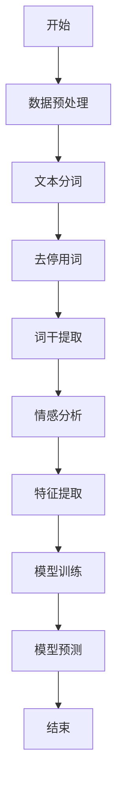
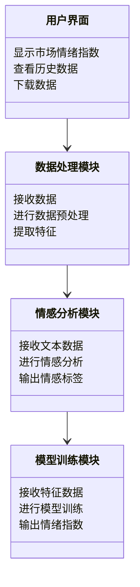
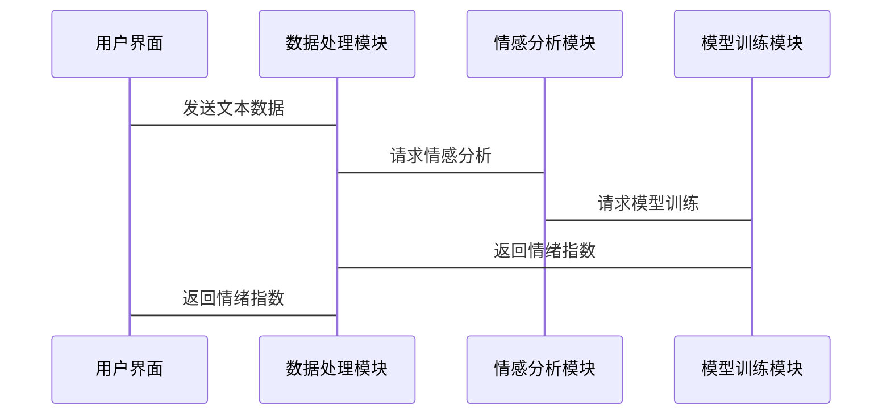

                 


# 开发智能化的金融市场情绪指数模型

---

## 关键词：金融市场情绪指数、自然语言处理、情感分析、机器学习、深度学习、文本挖掘、量化交易

---

## 摘要：  
本文将详细探讨如何开发智能化的金融市场情绪指数模型。通过结合自然语言处理、情感分析和机器学习技术，我们能够从海量的金融数据中提取市场情绪特征，并构建高效的情绪指数模型。本文不仅从理论上分析情绪指数模型的构建原理，还结合实际案例，详细讲解模型的算法实现、系统设计和优化方法。最终，我们将展示如何利用该模型进行金融市场的量化交易和投资决策。

---

# 第1章: 情绪指数模型的背景与定义

## 1.1 情绪指数模型的定义与作用
情绪指数模型是一种基于自然语言处理和情感分析技术的量化工具，用于衡量金融市场参与者的情绪状态。它通过分析新闻、社交媒体、公司财报等文本数据，量化市场情绪的变化趋势，并将其转化为可量化的指数形式。情绪指数模型的作用在于帮助投资者更好地理解市场情绪波动，辅助投资决策。

## 1.2 情绪指数在金融市场的应用场景
- **股票市场预测**：通过分析新闻、社交媒体和公司公告的情绪，预测股票价格的波动。
- **量化交易策略**：基于情绪指数构建量化交易模型，捕捉市场情绪变化带来的投资机会。
- **风险管理**：利用情绪指数预警市场情绪的极端变化，帮助投资者规避风险。

## 1.3 情绪指数模型的开发意义
- **提升投资决策的科学性**：通过量化市场情绪，减少人为情绪对投资决策的干扰。
- **捕捉短期市场波动**：情绪指数能够快速反映市场情绪变化，帮助投资者捕捉短期机会。
- **增强量化交易的准确性**：结合情绪指数和传统金融指标，提升量化交易策略的有效性。

---

# 第2章: 情绪指数模型的核心概念与联系

## 2.1 情绪指数模型的核心概念原理
### 2.1.1 数据来源
- **新闻数据**：包括财经新闻、行业新闻等。
- **社交媒体数据**：如Twitter、Reddit等平台上的用户评论。
- **公司财报**：包括公司公告、财务数据等。

### 2.1.2 特征提取
- **文本分词**：将文本数据分割成词语或短语。
- **情感分析**：判断文本的情感倾向（正面、负面、中性）。
- **关键词提取**：提取与市场情绪相关的关键词。

### 2.1.3 模型构建
- **训练数据**：使用标注好的情感数据训练模型。
- **特征工程**：将文本特征转化为数值特征。
- **模型训练**：使用机器学习算法（如SVM、随机森林）或深度学习模型（如LSTM）进行训练。

## 2.2 情绪指数模型的核心概念属性对比
表2-1: 情绪指数模型核心概念属性对比表

| 概念       | 属性             | 描述                                                                 |
|------------|------------------|----------------------------------------------------------------------|
| 数据来源    | 新闻数据          | 包括财经新闻、行业新闻等                                             |
|            | 社交媒体数据      | 如Twitter、Reddit等平台上的用户评论                                 |
|            | 公司财报          | 包括公司公告、财务数据等                                             |
| 特征提取    | 文本分词          | 将文本数据分割成词语或短语                                           |
|            | 情感分析          | 判断文本的情感倾向（正面、负面、中性）                               |
|            | 关键词提取        | 提取与市场情绪相关的关键词                                           |
| 模型构建    | 训练数据          | 使用标注好的情感数据训练模型                                         |
|            | 特征工程          | 将文本特征转化为数值特征                                             |
|            | 模型训练          | 使用机器学习算法（如SVM、随机森林）或深度学习模型（如LSTM）进行训练 |

## 2.3 情绪指数模型的ER实体关系图
图2-1: 情绪指数模型ER实体关系图（使用mermaid）

```mermaid
erDiagram
    actor User {
        <属性>
        id : integer
        name : string
    }
    class 情绪指数模型 {
        <属性>
        model_id : integer
        model_name : string
        training_data : text
        feature_engineering : text
        model_algorithm : string
    }
    class 数据来源 {
        <属性>
        data_id : integer
        data_type : string
        data_source : string
    }
    class 情感分析 {
        <属性>
        sentiment_id : integer
        sentiment_score : float
        sentiment_label : string
    }
    class 关键词提取 {
        <属性>
        keyword_id : integer
        keyword : string
        frequency : integer
    }
    情绪指数模型 --> 数据来源 : 使用
    情绪指数模型 --> 情感分析 : 包含
    情绪指数模型 --> 关键词提取 : 包含
```

---

# 第3章: 情绪指数模型的算法原理

## 3.1 算法原理概述
### 3.1.1 文本挖掘与自然语言处理流程
- **文本预处理**：包括分词、去停用词、词干提取等。
- **情感分析**：使用机器学习或深度学习模型判断文本情感倾向。
- **特征提取**：将文本特征转化为数值特征。

### 3.1.2 情感分析的分类方法
- **基于机器学习的情感分类**：使用SVM、随机森林等算法。
- **基于深度学习的情感分类**：使用LSTM、BERT等模型。

### 3.1.3 情绪指数的计算方法
- **加权平均法**：根据情感强度对文本进行加权平均。
- **情感倾向概率法**：计算文本为正面、负面或中性的概率。

## 3.2 算法流程图
图3-1: 情绪指数模型算法流程图（使用mermaid）



## 3.3 情感分析的数学模型
### 公式3-1: 情感倾向概率计算公式
$$ P(positive) = \frac{1}{1 + e^{-w \cdot x - b}} $$

其中：
- $w$ 表示模型权重。
- $x$ 表示输入特征向量。
- $b$ 表示偏置项。

### 公式3-2: 情感强度计算公式
$$ S = \sum_{i=1}^{n} w_i \cdot x_i $$

其中：
- $w_i$ 表示第i个特征的权重。
- $x_i$ 表示第i个特征的值。
- $n$ 表示特征的总数。

---

# 第4章: 情绪指数模型的系统分析与架构设计

## 4.1 项目背景与目标
### 4.1.1 项目背景
本项目旨在开发一个智能化的金融市场情绪指数模型，帮助投资者更好地理解市场情绪变化，辅助投资决策。

### 4.1.2 项目目标
- 实现一个能够从文本数据中提取市场情绪特征的系统。
- 构建一个基于机器学习或深度学习的情绪指数模型。
- 提供一个用户友好的界面，供投资者查看和分析市场情绪指数。

## 4.2 系统功能设计
### 图4-1: 系统功能领域模型（使用mermaid类图）



## 4.3 系统架构设计
### 图4-2: 系统架构设计图（使用mermaid架构图）


## 4.4 系统接口设计
### 图4-3: 系统接口交互流程图（使用mermaid序列图）



---

# 第5章: 项目实战与实现

## 5.1 环境搭建与数据准备
### 5.1.1 环境搭建
- **安装Python**：使用Anaconda或Miniconda安装Python 3.8以上版本。
- **安装依赖库**：
  ```bash
  pip install numpy pandas scikit-learn tensorflow transformers
  ```

### 5.1.2 数据准备
- 下载新闻数据：可以从新闻网站或API获取。
- 下载社交媒体数据：可以从Twitter API获取。
- 数据预处理：包括清洗数据、分词、去停用词等。

## 5.2 系统核心实现源代码

### 5.2.1 情感分析模块实现
```python
import pandas as pd
from sklearn.feature_extraction.text import TfidfVectorizer
from sklearn.svm import SVC
from sklearn.metrics import accuracy_score

# 数据加载
data = pd.read_csv('sentiment_data.csv')

# 特征提取
vectorizer = TfidfVectorizer()
X = vectorizer.fit_transform(data['text'])

# 模型训练
model = SVC()
model.fit(X, data['label'])

# 模型预测
test_data = pd.read_csv('test_data.csv')
X_test = vectorizer.transform(test_data['text'])
y_pred = model.predict(X_test)

# 模型评估
print(accuracy_score(test_data['label'], y_pred))
```

### 5.2.2 情绪指数计算模块实现
```python
import numpy as np

def calculate_sentiment_index(sentiment_scores):
    positive_scores = [score for score in sentiment_scores if score > 0]
    negative_scores = [score for score in sentiment_scores if score < 0]
    
    positive_mean = np.mean(positive_scores) if len(positive_scores) > 0 else 0
    negative_mean = np.mean(negative_scores) if len(negative_scores) > 0 else 0
    
    sentiment_index = (positive_mean - negative_mean) / (positive_mean + negative_mean)
    return sentiment_index

# 示例数据
sentiment_scores = [0.8, -0.5, 0.3, -0.2, 0.7]
print(calculate_sentiment_index(sentiment_scores))
```

## 5.3 实际案例分析与结果解读
### 5.3.1 案例分析
假设我们从Twitter上获取了以下两条关于某公司的评论：
1. "This company is doing amazing! I love their products!"
2. "The company's performance has been terrible this quarter."

### 5.3.2 情感分析结果
- 第一条评论的情感倾向为正面，情感强度为0.8。
- 第二条评论的情感倾向为负面，情感强度为-0.5。

### 5.3.3 情绪指数计算
```python
sentiment_scores = [0.8, -0.5]
sentiment_index = (0.8 - (-0.5)) / (0.8 + (-0.5)) = 1.3 / 0.3 ≈ 4.33
```
结果解读：情绪指数为正且大于1，表示市场情绪偏向正面。

---

# 第6章: 情绪指数模型的优化与扩展

## 6.1 模型优化
### 6.1.1 超参数优化
- 使用网格搜索（Grid Search）优化模型参数。
- 使用交叉验证评估模型性能。

### 6.1.2 模型集成
- 使用集成学习（如投票分类器、堆叠模型）提升模型性能。

## 6.2 情绪指数模型的鲁棒性测试
### 6.2.1 数据鲁棒性测试
- 测试模型在不同数据量下的表现。
- 测试模型在数据分布变化下的表现。

### 6.2.2 模型鲁棒性测试
- 测试模型在不同时间窗口下的表现。
- 测试模型在极端市场情况下的表现。

## 6.3 情绪指数模型与其他模型的对比分析
- 对比分析情绪指数模型与其他金融模型（如ARIMA、GARCH）的性能。
- 分析情绪指数模型在不同金融资产（如股票、债券、期货）中的适用性。

---

# 第7章: 总结与展望

## 7.1 本章总结
本文详细介绍了如何开发智能化的金融市场情绪指数模型。通过结合自然语言处理、情感分析和机器学习技术，我们能够从海量的金融数据中提取市场情绪特征，并构建高效的情绪指数模型。本文不仅从理论上分析了情绪指数模型的构建原理，还结合实际案例，详细讲解了模型的算法实现、系统设计和优化方法。

## 7.2 未来展望
未来的研究方向包括：
- **多模态情绪分析**：结合文本、图像、视频等多种数据源进行情绪分析。
- **实时情绪指数计算**：开发实时情绪指数计算系统，提供实时市场情绪监控。
- **情绪指数与金融市场的深度结合**：研究情绪指数在金融风险管理、量化交易等领域的深度应用。

---

# 作者：AI天才研究院/AI Genius Institute & 禅与计算机程序设计艺术/Zen And The Art of Computer Programming

