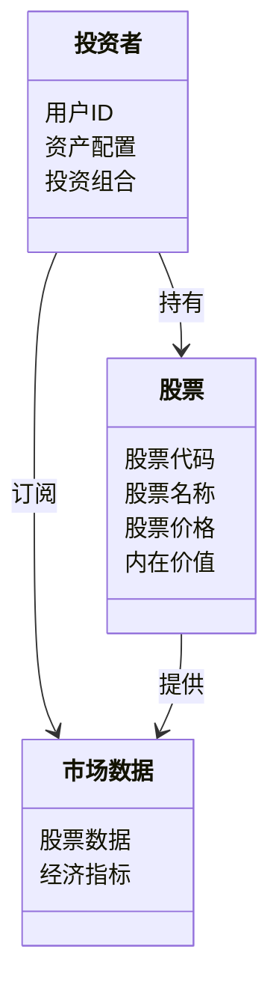
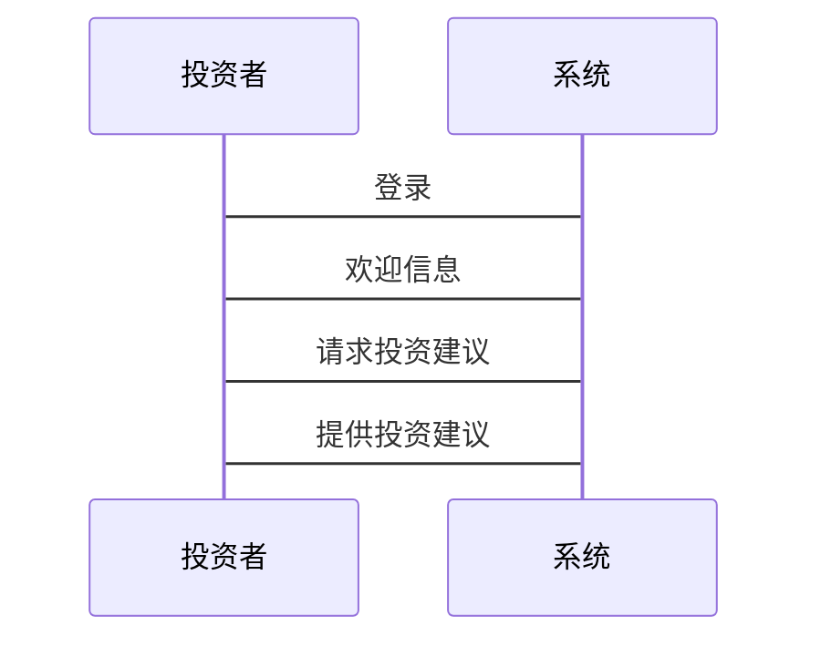

                 

<think>
好的，现在我需要根据用户的要求，撰写一篇关于《约翰·邓普顿的全球价值投资视角》的技术博客文章。我将按照用户提供的目录结构，逐步完成每一部分的内容，确保逻辑清晰、结构紧凑、语言专业且易于理解。

### 第一部分: 约翰·邓普顿的全球价值投资视角概述

#### 第1章: 约翰·邓普顿与价值投资的背景介绍

##### 1.1 约翰·邓普顿的生平与投资理念

###### 1.1.1 约翰·邓普顿的生平简介
约翰·邓普顿爵士（Sir John Templeton）是一位著名的投资家和慈善家，出生于1912年，逝世于2008年。他被誉为“全球投资之父”，是价值投资的先驱之一。邓普顿的职业生涯始于1930年代，当时他通过购买廉价的纺织业债券，成功地进行了早期的套利交易。他后来成立了邓普顿基金，成为全球范围内最早的共同基金之一。

邓普顿的投资理念强调长期投资和价值发现。他认为，投资者应该寻找那些市场价格低于其内在价值的股票，并在市场恐慌时进行投资。他的投资策略不仅限于美国市场，而是将目光投向全球市场，寻找被低估的投资机会。

###### 1.1.2 价值投资的核心理念
价值投资是一种投资策略，其核心在于寻找市场价格低于其内在价值的证券。这一策略强调对公司的基本面进行深入分析，包括财务状况、行业地位、管理团队等因素。价值投资者相信市场短期波动并不能决定股票的长期价值，真正的价值来源于公司的内在实力。

邓普顿对价值投资的贡献在于，他将这一理念扩展到了全球市场。他主张在全球范围内寻找被低估的股票，并通过分散投资来降低风险。

###### 1.1.3 邓普顿对全球投资的贡献
邓普顿是全球投资的先驱，他在20世纪70年代推出了全球股票投资组合，投资于美国、英国、日本等市场的股票。他的投资策略不仅帮助投资者实现了超额收益，还推动了全球投资的发展。邓普顿的全球视角为后来的投资者提供了宝贵的借鉴。

##### 1.2 价值投资的定义与特点

###### 1.2.1 价值投资的定义
价值投资是一种以分析证券的内在价值为基础的投资策略。投资者通过分析公司的财务状况、行业地位、管理团队等因素，确定其内在价值，并在市场价格低于内在价值时进行投资。

###### 1.2.2 价值投资的核心特点
- **长期投资**：价值投资者通常持有证券较长时间，相信市场会在长期内反映其内在价值。
- **基本面分析**：深入分析公司的财务报表、行业地位等因素，寻找被低估的投资机会。
- **安全边际**：在购买证券时，要求市场价格低于其内在价值，以降低投资风险。
- **逆向思维**：在市场恐慌时寻找投资机会，避免在市场高点投资。

###### 1.2.3 价值投资与其它投资策略的区别
与成长投资、指数投资等策略不同，价值投资更注重寻找被低估的证券。成长投资者关注公司的成长潜力，而指数投资者则通过跟踪市场指数来获取平均收益。价值投资的风险在于市场可能长期低估某些证券的价值，导致投资回报延迟。

##### 1.3 全球价值投资的背景与现状

###### 1.3.1 全球化背景下价值投资的发展
随着全球经济一体化的推进，投资者可以更容易地在全球范围内配置资产。邓普顿的全球投资策略为投资者提供了新的思路，即在全球范围内寻找被低估的投资机会。

###### 1.3.2 当前全球价值投资的现状
当前，价值投资在全球范围内依然受欢迎。许多投资者和机构采用价值投资策略，尤其是在新兴市场中寻找被低估的股票。然而，随着市场的成熟，寻找真正的低估股票变得更加困难。

###### 1.3.3 价值投资在不同市场的表现
在发达国家市场，价值投资的表现相对稳定，但在新兴市场，由于市场波动较大，价值投资的风险也更高。投资者需要结合市场特点，调整其投资策略。

---

#### 第2章: 价值投资的核心概念与理论框架

##### 2.1 价值投资的核心概念

###### 2.1.1 安全边际
安全边际是指市场价格与内在价值之间的差距。价值投资者要求购买价格低于内在价值，以确保在市场价格波动时仍能获得正收益。

###### 2.1.2 市场先生理论
市场先生是本杰明·格雷厄姆提出的概念，指市场情绪的变化会影响证券的价格。价值投资者应该忽略市场先生的情绪波动，专注于分析证券的内在价值。

###### 2.1.3 股价与内在价值的关系
股价短期可能偏离内在价值，但长期来看，市场会反映其内在价值。价值投资者通过寻找价格低于内在价值的证券，能够在长期内获得超额收益。

##### 2.2 价值投资的理论基础

###### 2.2.1 资本资产定价模型（CAPM）
CAPM模型用于确定证券的预期收益，公式如下：
$$ E(r) = R_f + \beta (E(r_m) - R_f) $$
其中，\( E(r) \) 是证券的预期收益率，\( R_f \) 是无风险利率，\( \beta \) 是证券的贝塔系数，\( E(r_m) \) 是市场预期收益率。

###### 2.2.2 时间价值与机会成本
时间价值是指资金随着时间的推移而产生的价值增加。机会成本是指投资者放弃其他投资机会而选择当前投资所放弃的潜在收益。

###### 2.2.3 投资组合管理理论
投资组合管理理论强调分散投资以降低风险。价值投资者通过构建多样化的投资组合，可以降低特定证券或行业带来的风险。

##### 2.3 邓普顿投资策略的数学模型

###### 2.3.1 内在价值计算公式
$$ V = \frac{E}{k} $$
其中，\( V \) 是内在价值，\( E \) 是预期收益，\( k \) 是折现率。

###### 2.3.2 股票估值模型
$$ P = \frac{D}{k - g} $$
其中，\( P \) 是股票价格，\( D \) 是股息，\( k \) 是折现率，\( g \) 是股息增长率。

---

#### 第3章: 全球视角下的价值投资策略

##### 3.1 全球化投资的优势与挑战

###### 3.1.1 全球化投资的优势
- **分散风险**：通过在全球范围内配置资产，投资者可以降低特定市场或行业的风险。
- **寻找低估机会**：在全球市场中，某些市场可能被低估，为投资者提供了更多的机会。
- **多元化收益**：不同市场的经济周期不同，投资者可以在不同周期中获得收益。

###### 3.1.2 全球化投资的主要挑战
- **市场波动**：不同市场的波动性不同，增加了投资的复杂性。
- **汇率风险**：外汇波动可能影响投资收益。
- **监管差异**：不同市场的监管政策不同，增加了投资的复杂性。

###### 3.1.3 如何应对全球化投资的风险
- **分散投资**：通过投资不同市场和行业的证券，降低风险。
- **汇率对冲**：使用金融工具对冲外汇风险。
- **遵守当地法规**：了解并遵守不同市场的监管政策。

##### 3.2 邓普顿的全球资产配置策略

###### 3.2.1 资产配置的基本原则
- **分散投资**：将资产分配到不同的市场和行业。
- **长期持有**：价值投资者通常长期持有资产，以实现内在价值的增长。
- **定期再平衡**：定期调整投资组合，以保持目标配置。

###### 3.2.2 不同市场环境下的资产配置策略
- **牛市**：增加股票配置，减少债券配置。
- **熊市**：增加债券配置，减少股票配置。
- **震荡市**：增加现金配置，等待更好的投资机会。

###### 3.2.3 邓普顿的全球资产配置案例分析
在20世纪70年代，邓普顿通过投资全球市场的股票，成功地实现了资产的增值。他选择了那些被低估的股票，并在市场恐慌时进行投资，取得了优异的回报。

##### 3.3 新兴市场与发达国家市场的比较

###### 3.3.1 新兴市场的投资机会
新兴市场通常具有较高的增长潜力，但市场波动较大。价值投资者可以通过寻找被低估的公司，在新兴市场中获得超额收益。

###### 3.3.2 发达市场的投资特点
发达国家市场通常较为成熟，市场波动较小。价值投资者可以通过分析公司的基本面，寻找那些被低估的股票。

###### 3.3.3 跨市场投资的风险管理
投资者需要考虑汇率风险、市场波动风险等，并通过分散投资、对冲工具等方式进行风险管理。

---

#### 第4章: 价值投资的分析方法与工具

##### 4.1 基本面分析的核心要素

###### 4.1.1 财务报表分析
- **利润表**：分析公司的收入、成本和利润。
- **资产负债表**：分析公司的资产、负债和所有者权益。
- **现金流量表**：分析公司的现金流情况。

###### 4.1.2 行业分析与竞争地位
- **行业分析**：了解行业的竞争格局、增长潜力等。
- **竞争地位**：分析公司在行业中的地位，包括市场份额、竞争优势等。

###### 4.1.3 管理团队与公司治理
- **管理团队**：分析管理团队的背景、经验和战略。
- **公司治理**：了解公司的治理结构、透明度等。

##### 4.2 技术分析与价值投资的结合

###### 4.2.1 技术分析的基本原理
技术分析通过分析证券的历史价格和交易量，预测未来的价格走势。常用的技术指标包括移动平均线、相对强弱指数（RSI）、MACD等。

###### 4.2.2 价值投资与技术分析的结合
价值投资者可以利用技术分析来确定买入和卖出的时机。例如，当股票价格低于其内在价值，并且技术指标显示超卖时，可能是买入的好时机。

###### 4.2.3 技术分析在邓普顿策略中的应用
邓普顿的投资策略中，技术分析主要用于确认买入和卖出的时机。他通过技术指标，如超卖信号，来寻找投资机会。

##### 4.3 风险管理与投资组合优化

###### 4.3.1 风险管理的基本原则
- **分散投资**：通过投资不同市场和行业，降低特定风险。
- **止损策略**：设定止损点，避免亏损过大。
- **风险评估**：定期评估投资组合的风险，进行调整。

###### 4.3.2 投资组合优化的数学模型
$$ \text{风险调整后收益} = \text{收益} - \text{风险} \times \text{风险溢价} $$

###### 4.3.3 邓普顿的风险管理策略
邓普顿通过分散投资和长期持有，降低了投资组合的风险。他强调在市场恐慌时进行投资，以获得更高的安全边际。

---

#### 第5章: 约翰·邓普顿投资策略的实际案例分析

##### 5.1 邓普顿的经典投资案例

###### 5.1.1 英国石油公司的投资案例
在20世纪70年代，邓普顿投资于英国石油公司，因为其股价被市场低估。他通过分析公司的基本面，确认其内在价值，并在股价低于内在价值时买入。

###### 5.1.2 日本市场的投资机会
在20世纪80年代，邓普顿发现日本市场的股票被低估，于是投资于日本公司。他在市场低点买入，随后市场复苏，获得了高额回报。

###### 5.1.3 其他经典投资案例分析
邓普顿还投资于其他市场和行业，如美国的纺织业和银行业。他的投资策略在全球范围内取得了成功。

##### 5.2 不同市场环境下的投资策略调整

###### 5.2.1 牛市中的投资策略
在牛市中，价值投资者应保持谨慎，避免追高。他们可以寻找那些股价接近内在价值的股票，或选择退出市场。

###### 5.2.2 熊市中的投资策略
在熊市中，价值投资者可以积极寻找被低估的股票。他们利用市场的恐慌，以更低的价格买入优质资产。

###### 5.2.3 震荡市中的投资策略
在震荡市场中，价值投资者应保持耐心，避免频繁交易。他们可以通过分散投资和长期持有，应对市场的波动。

---

### 第二部分: 系统分析与架构设计方案

#### 第6章: 系统分析与架构设计方案

##### 6.1 问题场景介绍
假设我们想要构建一个基于邓普顿全球价值投资策略的投资管理系统。该系统需要分析全球市场的股票，识别被低估的投资机会，并提供投资建议。

##### 6.2 系统功能设计

###### 6.2.1 领域模型


##### 6.3 系统架构设计

###### 6.3.1 系统架构图


##### 6.4 系统接口设计

###### 6.4.1 输入接口
- **股票数据接口**：接收全球市场的股票数据。
- **经济指标接口**：接收全球经济指标数据。

###### 6.4.2 输出接口
- **投资建议接口**：输出投资建议，包括买入、卖出信号。
- **投资组合报告接口**：输出投资组合的报告。

##### 6.5 系统交互设计

###### 6.5.1 投资者与系统交互流程



---

### 第三部分: 项目实战

#### 第7章: 项目实战

##### 7.1 环境安装

###### 7.1.1 安装Python
```bash
# 安装Python
sudo apt-get install python3
```

###### 7.1.2 安装必要的库
```bash
# 安装pandas、numpy等库
pip install pandas numpy
```

##### 7.2 系统核心实现源代码

###### 7.2.1 投资组合管理模块
```python
import pandas as pd
import numpy as np

class PortfolioManager:
    def __init__(self):
        self.portfolio = pd.DataFrame(columns=['股票代码', '持股数量', '买入价格', '当前价格'])
    
    def add_stock(self, stock_code, quantity, buy_price, current_price):
        new_stock = pd.DataFrame({
            '股票代码': [stock_code],
            '持股数量': [quantity],
            '买入价格': [buy_price],
            '当前价格': [current_price]
        })
        self.portfolio = pd.concat([self.portfolio, new_stock], ignore_index=True)
    
    def calculate_value(self):
        self.portfolio['当前价值'] = self.portfolio['持股数量'] * self.portfolio['当前价格']
        return self.portfolio
    
    def calculate_profit(self):
        self.portfolio['收益'] = (self.portfolio['当前价格'] - self.portfolio['买入价格']) * self.portfolio['持股数量']
        return self.portfolio
```

###### 7.2.2 风险管理模块
```python
class RiskManager:
    def __init__(self):
        self.risk_level = '低'
    
    def assess_risk(self, portfolio_value, market_volatility):
        if market_volatility > 0.2:
            self.risk_level = '高'
        elif market_volatility > 0.1:
            self.risk_level = '中'
        else:
            self.risk_level = '低'
        return self.risk_level
    
    def recommend_positions(self, portfolio_value, risk_level):
        if risk_level == '高':
            return '减少股票配置，增加债券配置'
        elif risk_level == '中':
            return '保持当前配置'
        else:
            return '增加股票配置'
```

##### 7.3 代码应用解读与分析

###### 7.3.1 投资组合管理模块
- **类PortfolioManager**：管理投资组合，包括添加股票、计算当前价值和收益。
- **add_stock方法**：添加新的股票到投资组合中。
- **calculate_value方法**：计算投资组合的当前价值。
- **calculate_profit方法**：计算投资组合的收益。

###### 7.3.2 风险管理模块
- **类RiskManager**：评估市场风险，提供风险管理建议。
- **assess_risk方法**：根据市场波动性评估风险等级。
- **recommend_positions方法**：根据风险等级推荐投资配置。

##### 7.4 实际案例分析和详细讲解剖析

###### 7.4.1 案例背景
假设我们有一个投资组合，包含以下股票：
- 股票A：买入价格10元，当前价格12元，持股数量100股。
- 股票B：买入价格20元，当前价格18元，持股数量50股。

市场波动性指数为0.15。

###### 7.4.2 系统实现
```python
# 初始化投资组合
pm = PortfolioManager()
pm.add_stock('A', 100, 10, 12)
pm.add_stock('B', 50, 20, 18)

# 计算当前价值和收益
pm.calculate_value()
print(pm.portfolio)
pm.calculate_profit()
print(pm.portfolio)

# 风险评估
rm = RiskManager()
market_volatility = 0.15
risk_level = rm.assess_risk(pm.portfolio['当前价值'].sum(), market_volatility)
print(f"当前风险等级：{risk_level}")

# 风险管理建议
risk_recommendation = rm.recommend_positions(pm.portfolio['当前价值'].sum(), risk_level)
print(f"风险管理建议：{risk_recommendation}")
```

###### 7.4.3 分析结果
- **投资组合价值**：股票A的价值为1200元，股票B的价值为900元，总价值为2100元。
- **收益**：股票A收益200元，股票B收益-100元，总收益为100元。
- **风险等级**：市场波动性为0.15，属于中等风险。
- **风险管理建议**：保持当前配置。

---

#### 第8章: 最佳实践、小结、注意事项、拓展阅读

##### 8.1 最佳实践
- **持续学习**：投资市场变化迅速，投资者需要不断学习新的知识和策略。
- **风险管理**：无论市场如何变化，风险管理都是投资的核心。
- **长期投资**：价值投资需要耐心，长期持有才能实现内在价值的增长。

##### 8.2 小结
约翰·邓普顿的全球价值投资视角为投资者提供了宝贵的借鉴。通过分析全球市场的股票，寻找被低估的投资机会，投资者可以在长期内实现超额收益。同时，投资者需要注重风险管理，避免市场波动带来的风险。

##### 8.3 注意事项
- **市场风险**：全球市场波动较大，投资者需要谨慎选择投资标的。
- **流动性风险**：在新兴市场中，流动性可能较低，影响投资组合的流动性。
- **监管风险**：不同市场的监管政策不同，投资者需要遵守当地法规。

##### 8.4 拓展阅读
- **书籍**：《邓普顿的全球投资策略》
- **文章**：《价值投资在全球市场的应用》
- **在线资源**：投资论坛、博客和播客，提供更多关于价值投资的见解。

---

### 作者信息

作者：AI天才研究院/AI Genius Institute & 禅与计算机程序设计艺术 /Zen And The Art of Computer Programming

---

希望这篇博客文章能为您提供有价值的信息和启发，帮助您更好地理解和应用约翰·邓普顿的全球价值投资视角。如果需要进一步探讨或补充，请随时联系我。

