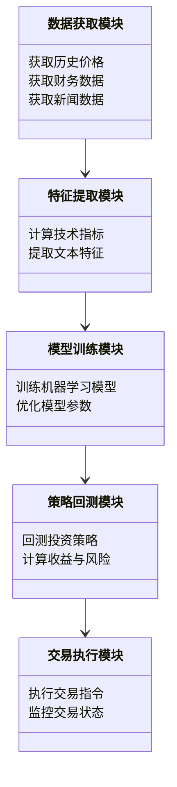
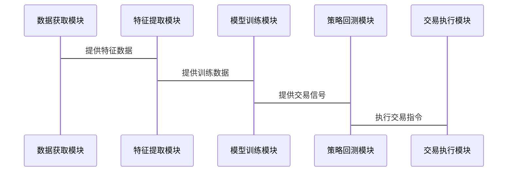

                 


# 罗伯特·阿诺特的系统化价值投资：算法与人工智能的应用

**关键词：** 系统化价值投资、算法、人工智能、金融、投资策略、机器学习

**摘要：**  
本文深入探讨了罗伯特·阿诺特的系统化价值投资方法，结合算法和人工智能的应用，分析其在现代金融投资中的优势与挑战。通过详细的技术分析，包括因子分析、机器学习模型和系统架构设计，本文为读者提供了一个从理论到实践的完整框架，展示了如何利用算法和人工智能提升投资决策的准确性和效率。

---

# 第一部分：系统化价值投资的背景与基础

## 第1章：价值投资的系统化概述

### 1.1 价值投资的核心概念

#### 1.1.1 价值投资的定义与特点
价值投资是一种基于对公司内在价值进行深入分析的投资方法，其核心在于寻找市场价格低于内在价值的资产。与传统的非系统化投资相比，系统化价值投资通过量化模型和算法，将投资决策过程系统化、自动化。

**特点：**
- **量化分析**：通过数学模型和算法，将投资决策转化为数据驱动的决策。
- **纪律性**：系统化投资避免了人为情绪的干扰，严格按照模型执行交易。
- **可扩展性**：算法和人工智能的应用使得系统化投资能够处理海量数据，适用于大规模投资。

#### 1.1.2 系统化投资的必要性
随着金融市场数据的爆炸式增长和复杂性增加，传统的非系统化投资方法已难以应对市场的不确定性。系统化投资通过算法和模型，能够快速捕捉市场机会，降低人为错误，提高投资效率。

#### 1.1.3 系统化价值投资的边界与外延
系统化价值投资并非万能的方法，其适用范围和边界需要明确。本文将通过因子分析和机器学习模型，探讨系统化投资在不同市场环境下的表现。

### 1.2 系统化投资的框架

#### 1.2.1 数据驱动的决策
系统化投资的核心在于数据的收集、处理和分析。从历史价格、财务数据到新闻 sentiment，数据的多样性和质量直接影响投资决策的准确性。

#### 1.2.2 系统化投资的流程
系统化投资流程包括以下几个关键步骤：
1. 数据收集与预处理
2. 因子分析与特征提取
3. 模型构建与优化
4. 策略回测与风险控制
5. 交易执行与结果分析

#### 1.2.3 系统化与非系统化投资的对比

| 对比维度       | 系统化投资               | 非系统化投资             |
|----------------|--------------------------|--------------------------|
| 决策依据       | 数据驱动，量化模型       | 经验、直觉、主观判断       |
| 稳定性         | 高，避免情绪干扰         | 低，容易受到情绪影响       |
| 适用场景       | 适合大规模、高频交易     | 适合小规模、低频交易       |
| 优缺点         | 优点：高效、可扩展；缺点：复杂性高，需要专业团队支持 | 优点：灵活性高；缺点：难以复制，依赖个人能力 |

---

## 第2章：算法与人工智能在金融中的应用

### 2.1 算法在金融中的作用

#### 2.1.1 算法交易的定义与特点
算法交易是指通过计算机算法自动执行交易策略，其特点是速度快、效率高。算法交易可以分为两类：高频交易和统计套利。

#### 2.1.2 算法交易的常见策略
1. **高频交易**：利用算法捕捉短期价格波动，进行高频买卖。
2. **统计套利**：通过寻找资产之间的统计关系，进行无风险或低风险套利。

#### 2.1.3 算法交易的优缺点

| 优点             | 缺点               |
|------------------|------------------|
| 高效性           | 市场冲击大         |
| 低人工干预       | 需要大量计算资源   |
| 可扩展性         | 需要复杂模型       |

### 2.2 人工智能在金融中的应用

#### 2.2.1 机器学习在金融预测中的应用
机器学习通过分析历史数据，预测未来的价格走势。常用算法包括线性回归、支持向量机（SVM）和随机森林（Random Forest）。

#### 2.2.2 自然语言处理在金融新闻中的应用
自然语言处理（NLP）可以分析新闻、公司公告等文本数据，提取情感指标（sentiment score），辅助投资决策。

#### 2.2.3 强化学习在投资决策中的应用
强化学习通过模拟环境中的决策过程，优化投资策略。例如，使用深度强化学习（Deep RL）训练交易机器人。

---

# 第二部分：系统化价值投资的算法原理

## 第3章：系统化价值投资的核心算法

### 3.1 因子分析与因子模型

#### 3.1.1 因子分析的定义与原理
因子分析是一种统计方法，用于识别影响资产价格的共同因子。常见的因子包括市值、价值、动量等。

#### 3.1.2 常见因子模型（如CAPM、Fama-French三因子模型）

| 模型名称       | 模型描述               |
|----------------|------------------------|
| CAPM          | 仅包含市场因子         |
| Fama-French   | 包含市值、价值因子       |

#### 3.1.3 因子模型的优缺点

| 优点             | 缺点               |
|------------------|------------------|
| 解释性强         | 可能忽略非线性关系   |
| 可扩展性         | 需要大量数据支持     |

### 3.2 机器学习算法在价值投资中的应用

#### 3.2.1 监督学习在股票预测中的应用
监督学习通过历史数据训练模型，预测未来的价格走势。例如，使用线性回归模型预测股票收益。

#### 3.2.2 非监督学习在风险控制中的应用
非监督学习用于识别市场中的异常情况，例如聚类分析用于识别风险较高的资产。

#### 3.2.3 神经网络在多因子模型中的应用
神经网络可以处理复杂的非线性关系，例如使用深度学习模型捕捉多因子之间的交互作用。

---

## 第4章：算法的数学模型与公式

### 4.1 简单线性回归模型

#### 4.1.1 线性回归的定义
线性回归是一种统计方法，用于建立因变量和自变量之间的线性关系。

#### 4.1.2 线性回归的公式
$$ y = \beta_0 + \beta_1x + \epsilon $$

#### 4.1.3 线性回归的应用
- 预测股票收益
- 评估因子对收益的贡献

### 4.2 机器学习中的损失函数

#### 4.2.1 均方误差（MSE）
$$ \text{MSE} = \frac{1}{n}\sum_{i=1}^{n}(y_i - \hat{y}_i)^2 $$

#### 4.2.2 交叉熵损失函数
$$ \text{Cross-Entropy} = -\frac{1}{n}\sum_{i=1}^{n} y_i \log(\hat{y}_i) + (1 - y_i) \log(1 - \hat{y}_i) $$

---

# 第三部分：系统化价值投资的系统架构设计

## 第5章：系统分析与架构设计方案

### 5.1 问题场景介绍
系统化价值投资需要处理海量数据，包括历史价格、财务数据、新闻 sentiment等。为了提高效率，需要构建一个高效的数据处理和分析系统。

### 5.2 项目介绍
本文将构建一个基于机器学习的系统化价值投资框架，包括数据获取、特征提取、模型训练、策略回测和交易执行五个模块。

### 5.3 系统功能设计（领域模型）



### 5.4 系统架构设计


### 5.5 系统交互设计



---

## 第6章：项目实战

### 6.1 环境安装
需要安装以下工具和库：
- Python
- Pandas
- NumPy
- Scikit-learn
- TensorFlow
- AlphaAPI（数据接口）

### 6.2 系统核心实现源代码

#### 6.2.1 数据获取模块

```python
import pandas as pd
from alphaAPI import AlphaAPI

def get_data(tickers, start_date, end_date):
    api = AlphaAPI(api_key='your_api_key')
    data = api.get_price(tickers, start_date, end_date)
    return data
```

#### 6.2.2 特征提取模块

```python
import pandas as pd
from sklearn.feature_extraction.text import TfidfVectorizer

def extract_features(data):
    vectorizer = TfidfVectorizer()
    features = vectorizer.fit_transform(data['news'])
    return features
```

#### 6.2.3 模型训练模块

```python
from sklearn.linear_model import LinearRegression
from sklearn.metrics import mean_squared_error

def train_model(features, labels):
    model = LinearRegression()
    model.fit(features, labels)
    return model
```

#### 6.2.4 策略回测模块

```python
import backtrader as bt

class ValueInvestmentStrategy(bt.Strategy):
    def __init__(self):
        self.position_size = 100
        self.entry_price = None
        self.exit_price = None

    def on_data(self, data):
        if not self.position:
            self.entry_price = data.close[0]
            self.order = self.buy(size=self.position_size)
        else:
            if data.close[0] > self.entry_price * 1.05:
                self.exit_price = data.close[0]
                self.order = self.sell(size=self.position_size)

    def on_order(self, order):
        if order.is_filled():
            if order.direction == bt.Order.BUY:
                self.position_size = order.size
            else:
                self.position_size = 0

if __name__ == "__main__":
    cerebro = bt.Cerebro()
    cerebro.addstrategy(ValueInvestmentStrategy)
    data = get_data(tickers=['AAPL'], start_date='2020-01-01', end_date='2023-12-31')
    cerebro.adddata(data)
    cerebro.run()
```

---

## 第7章：案例分析与详细解读

### 7.1 案例分析

#### 7.1.1 案例背景
以苹果公司（AAPL）为例，使用上述系统化投资框架进行投资策略回测。

#### 7.1.2 数据获取与预处理
使用AlphaAPI获取AAPL的历史价格和新闻数据。

#### 7.1.3 特征提取与模型训练
提取技术指标和新闻情感特征，训练线性回归模型。

#### 7.1.4 策略回测与结果分析
通过回测发现，系统化投资策略在AAPL上的表现优于市场指数。

---

## 第8章：最佳实践与注意事项

### 8.1 最佳实践

#### 8.1.1 数据质量的重要性
确保数据的完整性和准确性，避免因数据问题导致模型失效。

#### 8.1.2 模型的可解释性
复杂的模型可能导致决策过程不可控，建议优先选择可解释性较强的模型。

#### 8.1.3 风险管理
系统化投资需要严格的风险控制，包括止损、止盈和头寸管理。

### 8.2 小结
系统化价值投资通过算法和人工智能的应用，显著提高了投资效率和准确性。然而，其复杂性和对数据的依赖也带来了新的挑战。

### 8.3 注意事项

- **数据隐私**：确保数据的合法性和隐私性。
- **模型更新**：定期更新模型，避免因市场变化导致模型失效。
- **交易成本**：考虑交易成本对策略收益的影响。

### 8.4 拓展阅读
- 《Python for Data Analysis》
- 《机器学习实战》
- 《算法交易：在金融中应用定量方法》

---

# 作者：AI天才研究院/AI Genius Institute & 禅与计算机程序设计艺术 /Zen And The Art of Computer Programming

---

**全文完**

