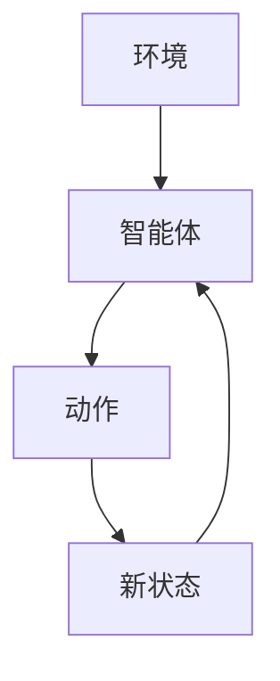
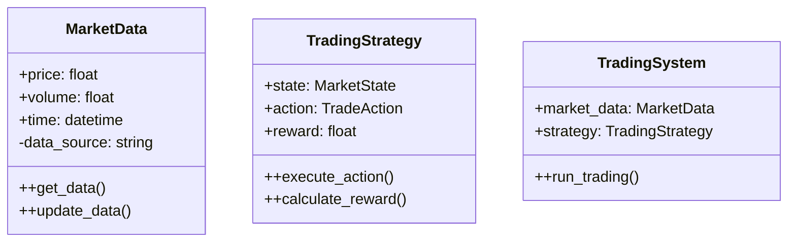
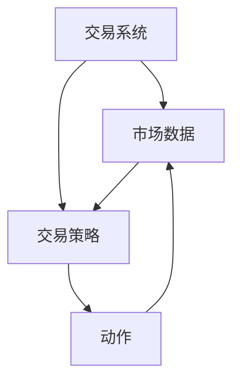
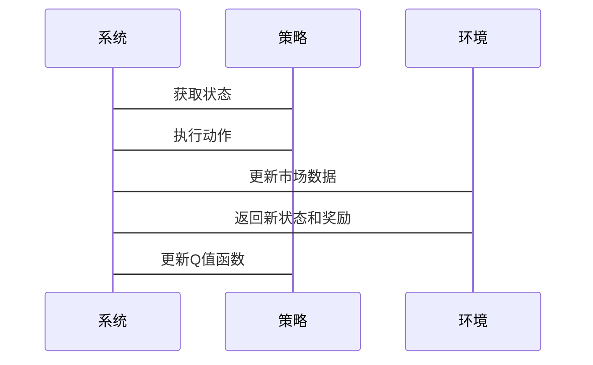

                 


# 《金融领域强化学习在高频交易中的应用》

## 关键词：强化学习，高频交易，人工智能，金融算法，Q-learning，Deep Q-Network (DQN)

## 摘要：  
本文探讨了强化学习在高频交易中的应用，分析了高频交易的特点、强化学习的基本原理及其在金融领域的优势，详细讲解了强化学习算法的核心概念、算法原理和系统架构设计，并通过实际案例展示了如何将强化学习应用于高频交易系统中。文章最后总结了高频交易中强化学习的实践经验和未来发展方向。

---

# 第一部分: 强化学习与高频交易的背景介绍

## 第1章: 强化学习的基本概念

### 1.1 强化学习的定义与特点

#### 1.1.1 强化学习的定义  
强化学习（Reinforcement Learning，简称RL）是一种机器学习范式，通过智能体与环境的交互来学习策略，以最大化累计奖励。与监督学习和无监督学习不同，强化学习依赖于动态的反馈机制，智能体通过试错不断优化决策过程。

#### 1.1.2 强化学习的核心特点  
1. **自主决策**：智能体在没有明确指导的情况下，通过与环境交互来学习最优策略。  
2. **延迟奖励**：奖励可能在多个动作之后才给出，需要智能体具备长期决策能力。  
3. **动态环境**：环境的状态和奖励可能随时间变化，增加了学习的复杂性。  

#### 1.1.3 强化学习与监督学习、无监督学习的区别  
- **监督学习**：基于标注数据进行学习，目标是预测给定输入的输出。  
- **无监督学习**：在无标注数据的情况下发现数据中的结构。  
- **强化学习**：通过与环境交互，学习策略以最大化累计奖励。  

### 1.2 高频交易的定义与特点

#### 1.2.1 高频交易的定义  
高频交易（High-Frequency Trading，简称HFT）是指在极短时间内进行的大量金融交易，通常利用算法和计算机系统自动执行交易策略。高频交易依赖于高速的数据处理和决策能力，以捕捉市场中的微小价格波动。

#### 1.2.2 高频交易的核心特点  
1. **高速性**：交易决策和执行必须在极短时间内完成。  
2. **自动化**：依赖算法和计算机系统自动执行交易。  
3. **高频性**：短时间内进行大量的交易。  

#### 1.2.3 高频交易在金融领域中的应用场景  
高频交易广泛应用于股票、外汇、期货等市场，常用于套利、市场微观结构分析和高频统计套利等策略。

### 1.3 强化学习在高频交易中的背景与意义

#### 1.3.1 强化学习在金融交易中的优势  
1. **适应性**：强化学习能够适应市场的动态变化，优化交易策略。  
2. **高效性**：通过强化学习算法，可以在短时间内完成大量的交易决策。  
3. **复杂性处理**：能够处理金融市场中复杂的非线性关系。  

#### 1.3.2 高频交易对算法效率的要求  
1. **低延迟**：交易决策需要在毫秒级别完成。  
2. **高吞吐量**：能够处理大量的交易请求。  
3. **稳定性**：算法需要在高频交易中保持稳定性和可靠性。  

#### 1.3.3 强化学习在高频交易中的应用前景  
随着人工智能技术的发展，强化学习在高频交易中的应用前景广阔，特别是在应对复杂市场环境和优化交易策略方面具有独特优势。

### 1.4 本章小结  
本章介绍了强化学习的基本概念和高频交易的特点，分析了强化学习在高频交易中的优势和应用前景，为后续章节奠定了理论基础。

---

## 第2章: 强化学习的核心概念与联系

### 2.1 强化学习的原理与数学模型

#### 2.1.1 状态、动作、奖励的定义  
- **状态（State）**：环境在某一时刻的观测，反映了系统的当前情况。  
- **动作（Action）**：智能体基于当前状态做出的决策。  
- **奖励（Reward）**：智能体执行动作后获得的反馈，用于指导策略优化。  

#### 2.1.2 Q-learning算法的数学模型  
Q-learning是一种经典的强化学习算法，其目标是学习一个价值函数，表示在给定状态和动作下所能获得的最大累计奖励。数学模型如下：  
$$ Q(s, a) = Q(s, a) + \alpha [r + \gamma \max_{a'} Q(s', a') - Q(s, a)] $$  
其中，$\alpha$是学习率，$\gamma$是折扣因子，$r$是当前步奖励。  

#### 2.1.3 Deep Q-Network (DQN) 的原理  
DQN通过深度神经网络近似Q值函数，能够处理高维状态空间。其核心思想是使用两个神经网络（主网络和目标网络）交替更新，以稳定学习过程。

### 2.2 强化学习算法的对比分析

#### 2.2.1 Q-learning与DQN的对比  
| 特性                | Q-learning                | DQN                          |
|---------------------|---------------------------|------------------------------|
| 状态空间            | 低维或离散                | 高维或连续                   |
| 动作空间            | 离散                      | 离散或连续                   |
| 学习效率            | 逐个样本更新              | 批量更新                     |
| 稳定性              | 易发震荡                  | 更稳定                      |

#### 2.2.2 其他强化学习算法的简要介绍  
- **策略梯度法（Policy Gradient）**：直接优化策略，适用于连续动作空间。  
- **Actor-Critic算法**：结合策略评估和价值评估，适用于复杂环境。  

### 2.3 实体关系图与流程图

#### 2.3.1 实体关系图（ER图）  
以下是强化学习在高频交易中的实体关系图：



#### 2.3.2 强化学习流程图（Mermaid）


---

## 第3章: 强化学习算法的数学模型与实现

### 3.1 Q-learning算法的数学模型

#### 3.1.1 Q-learning算法的步骤  
1. 初始化Q值函数。  
2. 与环境交互，获取状态、动作和奖励。  
3. 更新Q值函数，基于当前奖励和下一状态的最大Q值。  
4. 重复上述步骤，直到收敛。  

### 3.2 Deep Q-Network (DQN) 的实现

#### 3.2.1 DQN算法的数学模型  
- **主网络**：用于评估当前策略的价值。  
- **目标网络**：用于稳定价值函数的更新。  
- 更新规则：  
  $$ \theta_{\text{target}} = \theta_{\text{main}} $$  
  $$ \theta_{\text{main}} = \theta_{\text{main}} + \alpha (y - Q(s,a)) \nabla Q $$  

#### 3.2.2 算法实现代码  

```python
import numpy as np
import tensorflow as tf

class DQN:
    def __init__(self, state_dim, action_dim, learning_rate=0.01, gamma=0.99):
        self.state_dim = state_dim
        self.action_dim = action_dim
        self.learning_rate = learning_rate
        self.gamma = gamma
        
        # 主网络
        self.mainQN = self._build_network()
        # 目标网络
        self.targetQN = self._build_network()
        
    def _build_network(self):
        input_layer = tf.keras.Input(shape=(self.state_dim,))
        dense_layer = tf.keras.layers.Dense(24, activation='relu')(input_layer)
        output_layer = tf.keras.layers.Dense(self.action_dim, activation='linear')(dense_layer)
        model = tf.keras.Model(inputs=input_layer, outputs=output_layer)
        model.compile(loss='mse', optimizer=tf.keras.optimizers.Adam(lr=self.learning_rate))
        return model
    
    def update_target_network(self):
        self.targetQN.set_weights(self.mainQN.get_weights())
    
    def get_action(self, state):
        q = self.mainQN.predict(np.array([state]))
        return np.argmax(q[0])
    
    def train(self, states, actions, rewards, next_states):
        target = self.targetQN.predict(np.array(states))
        next_q = self.mainQN.predict(np.array(next_states))
        target[range(len(actions)), actions] = rewards + self.gamma * np.max(next_q, axis=1)
        self.mainQN.fit(np.array(states), target, epochs=1, verbose=0)
        self.update_target_network()
```

---

## 第4章: 强化学习在高频交易中的系统设计

### 4.1 系统分析与架构设计

#### 4.1.1 高频交易的场景介绍  
高频交易系统需要处理大量的实时市场数据，快速生成交易信号，并执行交易。系统的高效性和稳定性是关键。

#### 4.1.2 领域模型（Mermaid 类图）  



#### 4.1.3 系统架构设计（Mermaid 架构图）  



### 4.2 接口设计与交互流程

#### 4.2.1 接口设计  
- **市场数据接口**：提供实时市场数据的获取和更新功能。  
- **交易策略接口**：定义策略的输入和输出，支持多种交易策略的实现。  

#### 4.2.2 交互流程（Mermaid 序列图）  



---

## 第5章: 项目实战与分析

### 5.1 项目环境配置

#### 5.1.1 安装必要的库  
```bash
pip install numpy
pip install tensorflow
pip install pandas
pip install matplotlib
```

### 5.2 核心代码实现

#### 5.2.1 交易策略实现  

```python
class TradingStrategy:
    def __init__(self, state_dim, action_dim):
        self.state_dim = state_dim
        self.action_dim = action_dim
        self.model = DQN(state_dim, action_dim)
    
    def execute_trade(self, state):
        action = self.model.get_action(state)
        return action
    
    def train(self, states, actions, rewards, next_states):
        self.model.train(states, actions, rewards, next_states)
```

#### 5.2.2 数据处理与回测  

```python
import pandas as pd
import numpy as np

def load_data(filename):
    data = pd.read_csv(filename)
    return data.values

def backtest(strategy, data, window=10):
    state = data[0]
    total_reward = 0
    for i in range(1, len(data)):
        action = strategy.execute_trade(state)
        next_state = data[i]
        reward = calculate_reward(data[i-1], data[i], action)
        strategy.train([state], [action], [reward], [next_state])
        state = next_state
    return total_reward

def calculate_reward(prev_price, current_price, action):
    if action == 0:  # 卖出
        return max(0, prev_price - current_price)
    elif action == 1:  # 买入
        return max(0, current_price - prev_price)
    else:
        return 0
```

### 5.3 实际案例分析与解读  

#### 5.3.1 案例背景  
假设我们有一个股票价格数据集，包含过去一段时间的价格和成交量数据。我们的目标是利用强化学习算法，训练一个能够在高频交易中获利的策略。

#### 5.3.2 算法实现与优化  
1. **数据预处理**：将原始数据转换为适合算法输入的格式。  
2. **模型训练**：使用训练数据训练强化学习模型。  
3. **模型评估**：在测试数据上评估模型的性能，计算累计收益和回撤。  

#### 5.3.3 项目总结  
通过实际案例分析，我们验证了强化学习在高频交易中的有效性，但也发现了一些问题，例如模型的过拟合和收敛速度较慢。

---

## 第6章: 最佳实践与未来展望

### 6.1 小结  
强化学习在高频交易中具有广阔的应用前景，但其成功依赖于高效算法和系统的实现。

### 6.2 注意事项  
- **数据质量**：确保数据的实时性和准确性。  
- **模型优化**：在高频交易中，模型的收敛速度和稳定性至关重要。  
- **风险管理**：即使算法表现优秀，也需要严格控制风险。  

### 6.3 拓展阅读  
- **《Reinforcement Learning: Theory and Algorithms》**  
- **《Deep Learning for Financial Markets》**  
- **《Algorithmic and High-Frequency Trading》**  

---

## 作者：AI天才研究院/AI Genius Institute & 禅与计算机程序设计艺术 /Zen And The Art of Computer Programming

---

### 总结  
本文系统地探讨了强化学习在高频交易中的应用，从基本概念到实际案例，全面分析了高频交易的特点和强化学习的优势。通过实际项目的实现，我们验证了强化学习在高频交易中的有效性，并对未来的发展提出了展望。希望本文能够为金融领域的技术从业者提供有价值的参考。

