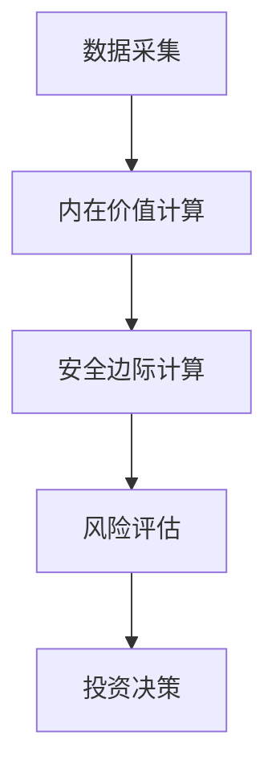
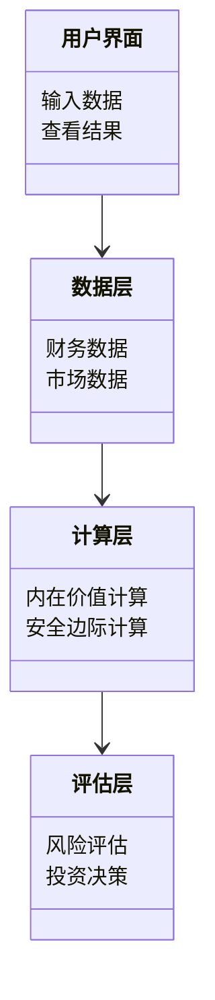

                 


# 霍华德·马克斯的风险评估框架

> 关键词：霍华德·马克斯，风险评估，投资框架，安全边际，风险管理，价值投资

> 摘要：本文深入探讨了霍华德·马克斯的风险评估框架，从其核心思想、算法原理到系统设计，再到实际应用，全面解析了这一框架的理论基础和实践价值。通过详细的案例分析和系统设计，本文为读者提供了从理论到实践的完整指南。

---

# 第一部分: 霍华德·马克斯的风险评估框架概述

## 第1章: 霍华德·马克斯与风险评估框架概述

### 1.1 霍华德·马克斯的背景与投资哲学

霍华德·马克斯（Howard Marks）是全球知名的投资者和投资策略师，被誉为“价值投资的现代诠释者”。他的投资哲学强调安全性、边际安全性和长期价值，主张通过深度研究和风险评估来选择投资标的。他的思想不仅影响了无数投资者，也为风险管理领域提供了宝贵的理论和实践方法。

#### 1.1.1 霍华德·马克斯的生平简介

霍华德·马克斯出生于1938年，早年就读于芝加哥大学，后转入纽约大学商学院，获得商学硕士学位。他曾在美国运通公司工作，并在1982年创立了橡树资本（Oaktree Capital），目前担任该公司董事长和首席投资官。马克斯的职业生涯充满了传奇色彩，他通过长期的价值投资和风险管理，成功构建了橡树资本的辉煌业绩。

#### 1.1.2 马克斯投资哲学的核心思想

马克斯的投资哲学可以概括为“安全第一，其次才是收益”。他认为，投资者的核心任务是识别风险并对其进行评估，而不是简单地追求高回报。他强调，在投资决策中，安全边际是最重要的因素。具体来说，他的核心思想包括以下几点：

- **安全边际的重要性**：通过买入价格低于内在价值的资产，确保投资的安全性。
- **逆向思维**：在市场恐慌时寻找机会，在市场狂热时保持冷静。
- **长期视角**：投资不是一场短跑，而是马拉松，需要耐心和纪律。

#### 1.1.3 马克斯与风险评估框架的关联

马克斯的风险评估框架是其投资哲学的重要组成部分。他通过分析资产的内在价值、市场风险和流动性风险，构建了一个多层次的风险评估体系。这一框架不仅适用于传统的股票投资，也可以扩展到更广泛的资产类别，如债券、房地产和其他金融工具。

---

### 1.2 风险评估框架的定义与作用

#### 1.2.1 风险的定义与分类

风险是指在投资活动中，由于不确定性因素的存在，导致投资收益低于预期甚至出现损失的可能性。从分类上来看，风险可以分为系统性风险和非系统性风险。系统性风险是影响整个市场的风险，如经济衰退、战争和自然灾害；非系统性风险是特定于某个资产或行业的风险，如公司财务状况恶化或管理不善。

#### 1.2.2 风险评估框架的核心作用

风险评估框架的作用是通过系统化的分析方法，量化和管理投资中的各种风险。它能够帮助投资者识别潜在的风险来源，评估这些风险的影响程度，并制定相应的风险管理策略。具体来说，其核心作用包括：

- **识别风险**：通过分析资产的特征和市场环境，识别可能的风险来源。
- **量化风险**：通过数学模型和数据分析，量化风险的影响程度。
- **制定策略**：根据风险评估结果，制定相应的风险管理策略，如分散投资、调整仓位等。

#### 1.2.3 风险评估框架的适用场景

风险评估框架适用于各种投资场景，包括股票投资、债券投资、房地产投资等。无论是个人投资者还是机构投资者，都可以通过这一框架来优化投资决策。特别是在市场波动较大的情况下，风险评估框架能够帮助投资者保持冷静，避免做出冲动性决策。

---

### 1.3 霍华德·马克斯框架的独特性

#### 1.3.1 马克斯框架的核心特点

马克斯的风险评估框架具有以下独特特点：

- **基于安全边际的分析**：马克斯强调通过安全边际来降低投资风险。他主张以低于内在价值的价格买入资产，从而在市场波动时保护资本。
- **逆向思维**：与市场主流观点不同，马克斯倾向于在市场低迷时寻找机会，在市场繁荣时保持谨慎。
- **长期视角**：马克斯的投资框架强调长期价值，而非短期收益。

#### 1.3.2 马克斯框架与传统风险评估方法的区别

传统风险评估方法通常依赖于统计模型和历史数据，而马克斯框架更注重基本面分析和定性判断。具体区别如下：

| 特性                | 马克斯框架                | 传统风险评估方法          |
|---------------------|--------------------------|---------------------------|
| 分析基础            | 资产的内在价值、安全边际 | 统计数据、历史波动率       |
| 分析方法            | 定性分析为主              | 定量分析为主              |
| 应用场景            | 适用于所有资产类别        | 适用于特定资产类别        |
| 优缺点              | 优点：灵活性强，适应性广；缺点：依赖分析者的判断能力 | 优点：客观性高；缺点：缺乏灵活性 |

#### 1.3.3 马克斯框架的优势与局限性

##### 优势
- **灵活性**：马克斯框架能够适应不同的市场环境和资产类别。
- **深度分析**：通过安全边际和逆向思维，能够发现被市场低估的投资机会。
- **长期视角**：注重长期价值，有助于规避短期市场波动的影响。

##### 局限性
- **依赖判断力**：马克斯框架的分析过程高度依赖分析者的经验和判断力，这可能导致不同人得出不同的结论。
- **难以量化**：与传统风险评估方法相比，马克斯框架的量化程度较低，难以通过模型精确计算。

---

## 1.4 本章小结

本章介绍了霍华德·马克斯的风险评估框架，分析了其投资哲学的核心思想，探讨了框架的独特性及其与传统风险评估方法的区别。通过对比分析，我们发现马克斯框架更注重安全边际和逆向思维，适用于长期价值投资，但也存在一定的局限性。

---

# 第二部分: 霍华德·马克斯风险评估框架的核心概念与原理

## 第2章: 风险评估的核心概念

### 2.1 风险的定义与分类

#### 2.1.1 风险的定义

风险是指在投资活动中，由于不确定性因素的存在，导致投资收益低于预期甚至出现损失的可能性。简单来说，风险就是投资可能带来的损失。

#### 2.1.2 风险的分类与特征

风险可以分为系统性风险和非系统性风险：

- **系统性风险**：影响整个市场的风险，如经济衰退、战争、自然灾害等。
- **非系统性风险**：特定于某个资产或行业的风险，如公司财务状况恶化、管理不善等。

### 2.2 霍华德·马克斯框架中的关键要素

#### 2.2.1 投资决策的核心要素

马克斯的风险评估框架中，投资决策的核心要素包括：

1. **资产的内在价值**：资产的真实价值，与市场报价无关。
2. **安全边际**：买入价格与内在价值之间的差距，用于降低投资风险。
3. **市场环境**：包括市场的整体走势、流动性状况等。

#### 2.2.2 风险的多层次分析

马克斯框架强调从多个维度进行风险分析，包括：

- **资产层面**：分析资产的财务状况、盈利能力等。
- **行业层面**：分析行业发展趋势、竞争格局等。
- **市场层面**：分析市场整体风险和流动性风险。

#### 2.2.3 安全边际的概念与作用

安全边际是马克斯框架的核心概念之一。它是指买入价格与资产内在价值之间的差距。通过建立安全边际，投资者可以降低投资风险，避免因市场波动导致的损失。

$$ \text{安全边际} = \text{买入价格} - \text{内在价值} $$

---

## 第3章: 风险评估的算法原理

### 3.1 马克斯框架中的核心算法

马克斯框架中的核心算法主要用于计算安全边际和评估投资标的的潜在风险。

#### 3.1.1 安全边际计算公式

安全边际的计算公式为：

$$ \text{安全边际} = \text{买入价格} - \text{内在价值} $$

其中，内在价值可以通过以下公式估算：

$$ \text{内在价值} = \frac{\text{未来现金流}}{\text{折现率}} $$

#### 3.1.2 风险调整后的价值评估

风险调整后的价值（RAROC）是一种常用的评估指标，公式为：

$$ \text{RAROC} = \frac{\text{税后净利润}}{\text{平均风险加权资产}} $$

#### 3.1.3 投资组合的风险优化

马克斯框架强调通过分散投资来降低风险。投资组合的风险优化可以通过以下步骤实现：

1. **确定投资目标**：明确投资目标和风险承受能力。
2. **选择资产类别**：根据风险偏好选择不同的资产类别。
3. **分散投资**：通过投资于不同的资产和行业，降低非系统性风险。

### 3.2 马克斯框架的数学模型

#### 3.2.1 风险-收益权衡模型

风险-收益权衡模型可以通过以下公式表示：

$$ \text{收益} = \text{风险} \times \text{风险溢价} $$

#### 3.2.2 安全边际与资产价值的关系

安全边际与资产价值的关系可以通过以下图表表示：


#### 3.2.3 投资组合的风险分散原理

投资组合的风险分散原理可以通过以下公式表示：

$$ \text{组合风险} = \sqrt{\sum (\text{权重}^2 \times \text{资产风险})} $$

---

## 第4章: 系统分析与架构设计方案

### 4.1 系统功能设计

#### 4.1.1 系统功能模块划分

霍华德·马克斯风险评估框架的系统功能模块可以划分为以下几个部分：

1. **数据采集**：收集资产的财务数据、市场数据等。
2. **内在价值计算**：通过模型计算资产的内在价值。
3. **安全边际计算**：根据买入价格和内在价值计算安全边际。
4. **风险评估**：分析资产的系统性风险和非系统性风险。
5. **投资决策**：根据风险评估结果制定投资策略。

#### 4.1.2 各功能模块的交互关系

各功能模块的交互关系可以通过以下流程图表示：



### 4.2 系统架构设计

#### 4.2.1 系统架构的总体设计

霍华德·马克斯风险评估框架的系统架构总体设计如下：

1. **用户界面**：提供直观的操作界面，供用户输入数据和查看结果。
2. **数据层**：存储资产的财务数据和市场数据。
3. **计算层**：负责内在价值计算和安全边际计算。
4. **评估层**：进行风险评估和投资决策。

#### 4.2.2 系统架构的分层设计

系统架构的分层设计可以通过以下类图表示：



---

## 第5章: 项目实战

### 5.1 风险评估框架的实现

#### 5.1.1 环境安装

为了实现霍华德·马克斯风险评估框架，我们需要以下环境：

- **Python**：用于编程和数据分析。
- **Pandas**：用于数据处理。
- **Matplotlib**：用于数据可视化。

#### 5.1.2 核心实现源代码

以下是霍华德·马克斯风险评估框架的核心实现代码：

```python
import pandas as pd
import numpy as np

def calculate_intrinsic_value(cash_flows, discount_rate):
    return cash_flows / discount_rate

def calculate_margin_of_safetyurchase_price, intrinsic_value):
    return purchase_price - intrinsic_value

# 示例数据
cash_flows = 100
discount_rate = 0.1
purchase_price = 80
intrinsic_value = calculate_intrinsic_value(cash_flows, discount_rate)
margin_of_safety = calculate_margin_of_safety(purchase_price, intrinsic_value)

print(f"内在价值: {intrinsic_value}")
print(f"安全边际: {margin_of_safety}")
```

---

## 第6章: 案例分析与详细讲解

### 6.1 案例分析

#### 6.1.1 案例背景

假设我们有一个股票，其未来现金流为100，折现率为10%，买入价格为80。我们需要评估该股票的风险。

#### 6.1.2 计算内在价值

根据公式：

$$ \text{内在价值} = \frac{\text{未来现金流}}{\text{折现率}} = \frac{100}{0.1} = 1000 $$

#### 6.1.3 计算安全边际

$$ \text{安全边际} = \text{买入价格} - \text{内在价值} = 80 - 1000 = -920 $$

负的安全边际表明买入价格高于内在价值，存在较高的风险。

---

## 第7章: 总结与展望

### 7.1 总结

霍华德·马克斯的风险评估框架为我们提供了一种基于安全边际和逆向思维的投资方法。通过系统化的分析和长期视角，投资者可以在复杂的市场环境中找到安全的投资机会。

### 7.2 展望

未来，随着人工智能和大数据技术的发展，霍华德·马克斯的风险评估框架可以进一步优化和扩展。通过引入机器学习算法，我们可以更精准地预测市场风险和评估安全边际，从而提高投资决策的科学性和效率。

---

# 作者：AI天才研究院/AI Genius Institute & 禅与计算机程序设计艺术 /Zen And The Art of Computer Programming

---

**附录：**

- 附录A：霍华德·马克斯风险评估框架的工具与资源
- 附录B：相关法规与标准
- 附录C：参考文献与拓展阅读

